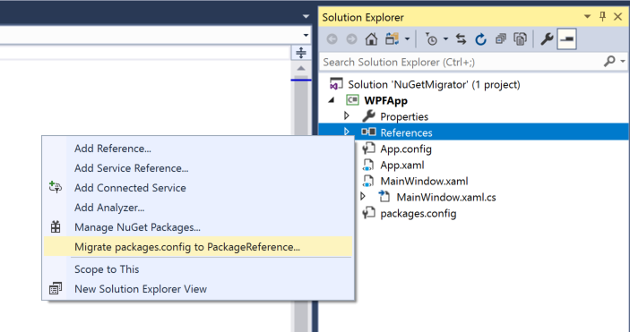
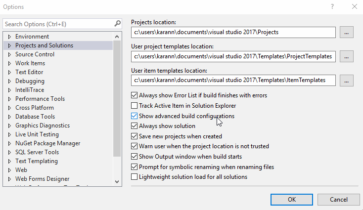

Last year, we introduced the option to [make PackageReference the default package management format](https://blog.nuget.org/20170316/NuGet-now-fully-integrated-into-MSBuild.html#what-about-other-project-types-that-are-not-net-core) for managing NuGet dependencies when installing the first NuGet package for a newly created projects. With Visual Studio Version 15.7 Preview 3, we have introduced the capability to migrate existing C++, JavaScript, and ASP.NET (.NET Framework) projects that use the `packages.config` format to use PackageReference instead. We're working on adding support for other project types.

Benefits of using PackageReference include:

* Ability to manage all project dependencies from one place (the project file).
* An uncluttered view of top-level dependencies : the project file shows only those NuGet packages you directly installed in the project.
* Faster package install/update times.
* Better cache management with a global-packages folder instead of a solution-local packages folder.
* Fine control over dependencies and content flow such as conditionally referencing a NuGet package per target framework, configuration, platform, or other pivots.
* New features as we continue to [invest in PackageReference](https://github.com/NuGet/Home/issues/6763).

## Migrate your projects to PackageReference today!

To try out the new migration experience, [download Visual Studio 2017 Preview](https://www.visualstudio.com/vs/preview/), open a `packages.config` based project, right-click the **References** node in **Solution Explorer**, and select the **Migrate packages.config to PackageReference....** command.

[*Not all project types currently support migration.*](#limitations)

The migrator analyzes the project's existing references, calculates the dependency graph, and categorizes them into top-level and transitive dependencies. 

By using the **Top-level** option, you can change any package that's categorized as a transitive dependency to be treated instead as a top-level dependency.

The migrator also displays wanrings for any potential [package incompatibilities](https://docs.microsoft.com/en-us/nuget/reference/migrate-packages-config-to-package-reference#package-compatibility-issues).

### Backup and roll back

Before the process begins, the migrator creates a backup of the project file and `packages.config` to `<solution_root>\MigrationBackup\<unique_guid>\<project_name>\`. The backup allows you to [roll back to `packages.config`](https://docs.microsoft.com/en-us/nuget/reference/migrate-packages-config-to-package-reference#how-to-roll-back-to-packagesconfig) if necessary.

### Set PackageReference as the default

In the NuGet options in Visual Studio (opened using the **Tools > NuGet Package Manager > Package Manager Settings** menu command), change the **Default package management format**" to PackageReference. When you then install a NuGet package into a project for the first time, NuGet uses the PackageReference format. Newly created projects that come with existing NuGet references using `packages.config` (such as WPF) must be migrated to PackageReference after project creation.

### Limitations

Although we're working to bring the PackageReference goodness to all project types and to make all packages compatible with PackageReference, migration is presently limited to C++, JavaScript, and ASP.NET (.NET Framework) projects.

Also, some packages are [not fully compatible with PackageReference](https://docs.microsoft.com/en-us/nuget/reference/migrate-packages-config-to-package-reference#package-compatibility-issues).

### Enhancements in the pipeline

We are actively working to [enhance PackageReference](https://github.com/NuGet/Home/issues/6763) with features such as locking the transitive dependencies, ability to consolidate package versions across projects in a solution, and more.

## We want to hear your feedback!

We want NuGet to meet the evolving needs of our community. For feedback specific to the migration experience, use [NuGet/Home#5877](https://github.com/NuGet/Home/issues/5877). For anything else, hit us up at [feedback@NuGet.org](mailto:feedback@nuget.org), and as always, if you run into any issues or have an idea, [open an issue on GitHub](https://github.com/Nuget/Home/issues).
