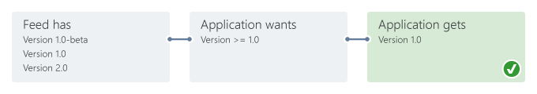
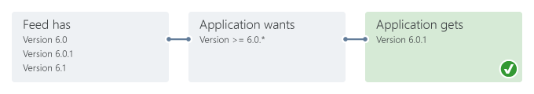
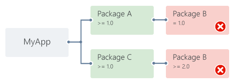

---
# required metadata

title: NuGet Package Dependency Resolution | Microsoft Docs
author: kraigb
ms.author: kraigb
manager: ghogen
ms.date: 8/14/2017
ms.topic: article
ms.prod: nuget
#ms.service:
ms.technology: null
ms.assetid: 1d530a72-3486-4a0d-b6fb-017524616f91

# optional metadata

description: Details on the process through which a NuGet package's dependencies are resolved and installed in both NuGet 2.x and NuGet 3.x+.
keywords: NuGet package dependencies, NuGet versioning, dependency versions, version graph, version resolution, transitive restore
#ROBOTS:
#audience:
#ms.devlang:
ms.reviewer:
- karann
- unnir
#ms.suite:
#ms.tgt_pltfrm:
#ms.custom:

---

# How NuGet resolves package dependencies

Any time a package is installed or reinstalled, which includes being installed as part of a [restore](../consume-packages/package-restore.md) process, NuGet also installs any additional packages on which that first package depends.

Those immediate dependencies might then also have dependencies on their own, which can continue to an arbitrary depth. This produces what's called a *dependency graph* that describes the relationships between packages are all levels.

When multiple packages have the same dependency, then the same package ID can appear in the graph multiple times, potentially with different version constraints. However, only one version of a given package can be used in a project, so NuGet must choose which version is be used. The exact process depends on the package reference format being used.

In this topic:
- [Dependency resolution with PackageReference and project.json](#dependency-resolution-with-packagereference-and-projectjson)
- [Dependency resolution with packages.config](#dependency-resolution-with-packagesconfig)
- [Excluding references](#excluding-references), which is necessary when there's a conflict between a dependency specified in one project and an assembly that's produced by another.
- [Dependency updates during package install](#dependency-updates-during-package-install)
- [Resolving incompatible package errors](#resolving-incompatible-package-errors)

## Dependency resolution with PackageReference and project.json

When installing packages into projects using the PackageReference or `project.json` formats, NuGet adds references to a flat package graph in the appropriate file and resolves conflicts ahead of time. This process is referred to as *transitive restore*. Reinstalling or restoring packages is then a process of downloading the packages listed in the graph, resulting in faster and more predictable builds. You can also take advantage of wildcard (floating) versions, such as *2.8.**, avoiding expensive and error prone calls to `nuget update` on the client machines and build servers.

When the NuGet restore process runs prior to a build, it resolves dependencies first in memory, then writes the resulting graph to a file called `project.assets.json` in the `obj` folder of a project using PackageReference, or in a file named `project.lock.json` alongside `project.json`. MSBuild then reads this file and translates it into a set of folders where potential references can be found, and then adds them to the project tree in memory.

The lock file is temporary should not be added to source control. It's listed by default in both `.gitignore` and `.tfignore`. See [Packages and source control](Packages-and-Source-Control.md).

### Dependency resolution rules

Transitive restore applies four main rules to resolve dependencies: lowest applicable version, floating versions, nearest-wins, and cousin dependencies.

<a name="lowest-applicable-version"></a>

#### Lowest applicable version

The lowest applicable version rule restores the lowest possible version of a package as defined by its dependencies. It also applies to dependencies on the application or the class library unless declared as [floating](#floating-versions).

In the following figure, for example, *1.0-beta* is considered lower than *1.0* so NuGet chooses the *1.0* version:



In the next figure, version *2.1* is not available on the feed but because the version constraint is *>= 2.1* NuGet picks the next lowest version it can find, in this case *2.2*:


When an application specifies an exact version number, such as *1.2*, that is not available on the feed, NuGet fails with an error when attempting to install or restore the package:


<a name="floating-versions"></a>

#### Floating (wildcard) versions

A floating or wildcard dependency version is specified with the \* wildcard, as with *6.0.**. This version specification says "use the latest 6.0.x version"; *4.** means "use the latest 4.x version." Using a wildcard allows a dependency package to continue evolving without requiring a change to the consuming application (or package).

When using a wildcard, NuGet resolves the highest version of a package that matches the version pattern, for example *6.0.** gets the highest version of a package that starts with *6.0*:



> [!Note]
> For information on the behavior of wildcards and pre-release versions, see [Package versioning](../reference/package-versioning.md#version-ranges-and-wildcards).


<a name="nearest-wins"></a>

#### Nearest wins

When the package graph for an application contains different versions of the same package, NuGet chooses the package that's closest to the application in the graph and ignores all others. This behavior allows an application to override any particular package version in the dependency graph.

In the example below, the application depends directly on Package B with a version constraint of *>=2.0*. The application also depends on Package A which in turn also depends on Package B, but with a *>=1.0* constraint. Because the dependency on Package B *2.0* is nearer to the application in the graph, that version is used:


>[!Warning]
> The Nearest Wins rule can result in a downgrade of the package version, thus potentially breaking other dependencies in the graph. Hence this rule is applied with a warning to alert the user.

This rule also results in greater efficiency with a large dependency graph (such as those with the BCL packages) because once a given dependency is ignored, NuGet also ignores all remaining dependencies on that branch of the graph. In the diagram below, for example, because Package C 2.0 is used, NuGet ignores any branches in the graph that refer to an older version of Package C:


<a name="cousin-dependencies"></a>

#### Cousin dependencies

When different package versions are referred to at the same distance in the graph from the application, NuGet uses the lowest version that satisfies all version requirements (as with the [lowest applicable version](#lowest-applicable-version) and [floating versions](#floating-versions) rules). In the image below, for example, version *2.0* of Package B satisfies the other *>=1.0* constraint, and is thus used:


In some cases, it is not possible to meet all version requirements. As shown below, if Package A requires exactly Package B *1.0* and Package C requires Package B *>=2.0*, then NuGet cannot resolve the dependencies and gives an error.



In these situations, the top-level consumer (the application or package) should add its own direct dependency on Package B so that the [Nearest Wins](#nearest-wins) rule applies.

## Dependency resolution with packages.config

With `packages.config`, a project's dependencies are written to `packages.config` as a flat list. Any dependencies of those packages are also written in the same list. When packages are installed, NuGet might also modify the `.csproj` file, `app.config`, `web.config`, and other individual files.

With `packages.config`, NuGet attempts to resolve dependency conflicts during the installation of each individual package. That is, if Package A is being installed and depends on Package B, and Package B is already listed in `packages.config` as a dependency of something else, NuGet compares the versions of Package B being requested and attempts to find a version that satisfies all version constraints. Specifically, NuGet selects the lower *major.minor* version that satisfies dependencies.

By default, NuGet 2.7 and earlier resolves the highest *patch* version (using the *major.minor.patch.build* convention). [NuGet 2.8 and higher](../release-notes/nuget-2.8.md#patch-resolution-for-dependencies) changes this behavior to look for the lowest patch version by default. You can control this setting through the `DependencyVersion` attribute in `Nuget.Config` and the `-DependencyVersion` switch on the command line.  

The `packages.config` process for resolving dependencies gets complicated for larger dependency graphs. Each new package installation requires a traversal of the whole graph and raises the chance for version conflicts. When a conflict occurs, installation is stopped, leaving the project in an indeterminate state, especially with potential modifications to the project file itself. This is not an issue when using other package reference formats.


## Excluding references

There are scenarios in which assemblies with the same name might be referenced more than once in a project, producing design-time and build-time errors. Consider a project that contains a custom version of `C.dll`, and references Package C that also contains `C.dll`. At the same time, the project also depends on Package B which also depends on Package C and `C.dll`. As a result, NuGet can't determine which `C.dll` to use, but you can't just remove the project's dependency on Package C because Package B also depends on it.

To resolve this, you must directly reference the `C.dll` you want (or use another package that references the right one), and then add a dependency on Package C that excludes all its assets. This is done as follows depending on the package reference format in use:

- [PackageReference](../consume-packages/package-references-in-project-files.md): add `Exclude="All"` in the dependency:

    ```xml
    <PackageReference Include="PackageC" Version="1.0.0" Exclude="All" />
    ```

- `packages.config`: remove the reference to PackageC from the `.csproj` file so that it references only the version of `C.dll` that you want.
    
- `project.json`: add `"exclude" : "all"` in the dependency for PackageC:

    ```json
    {
        "dependencies": {
            "PackageC": {
            "version": "1.0.0",
            "exclude": "all"
            }
        }
    }
    ```

## Dependency updates during package install 

With NuGet 2.4.x and earlier, when a package is installed whose dependency already exists in the project, the dependency is updated to the latest version that satisfies the version constraints, even if the existing version also satisfies those constraints. 

For example, consider package A that depends on package B and specifies 1.0 for the version number. The source repository contains both versions 1.0, 1.1, and 1.2 of package B. If A is installed in a project that already contains B version 1.0, then B is updated to version 1.2. 

With NuGet 2.5 and later, if a dependency version is already satisfied, the dependency isn't updated during other package installations. 

In the same example above, installing package A into a project with NuGet 2.5 and later leaves package B 1.0 in the project, as it already satisfies the version constraint. However, if package A had requests version 1.1 or higher of B, then B 1.2 would be installed. 

## Resolving incompatible package errors

During a package restore operation, you may see the error "One or more packages are not compatible..." or that a package "is not compatible" with the project's target framework.

This error occurs when one or more of the packages referenced in your project do not indicate that they support the project's target framework; that is, the package does not contain a suitable DLL in its `lib` folder for a target framework that is compatible with the project. (See [Target frameworks](../Schema/Target-Frameworks.md) for a list.) 

For example, if a project targets `netstandard1.6` and you attempt to install a package that contains DLLs in only the `lib\net20` and `\lib\net45` folders, then you'll see messages like the following for the package and possibly its dependents:

```output
Restoring packages for myproject.csproj...
Package ContosoUtilities 2.1.2.3 is not compatible with netstandard1.6 (.NETStandard,Version=v1.6). Package ContosoUtilities 2.1.2.3 supports:
  - net20 (.NETFramework,Version=v2.0)
  - net45 (.NETFramework,Version=v4.5)
Package ContosoCore 0.86.0 is not compatible with netstandard1.6 (.NETStandard,Version=v1.6). Package ContosoCore 0.86.0 supports:
  - 11 (11,Version=v0.0)
  - net20 (.NETFramework,Version=v2.0)
  - sl3 (Silverlight,Version=v3.0)
  - sl4 (Silverlight,Version=v4.0)
One or more packages are incompatible with .NETStandard,Version=v1.6.
Package restore failed. Rolling back package changes for 'MyProject'.
```

To resolve incompatibilities, do one of the following:

- Retarget your project to a framework that is supported by the packages you want to use.
- Contact the author of the packages and work with them to add support for your chosen framework. Each package listing page on [nuget.org](https://www.nuget.org/) has a **Contact Owners** link for this purpose.
- **Not recommended**: as a temporary solution while you work with the package author, projects targeting `netcore`, `netstandard`, and `netcoreapp` can denote other frameworks as being compatible, thereby allowing packages targeting those other frameworks to be used. See [project.json imports](../Schema/project-json.md#imports) and [MSBuild restore target PackageTargetFallback](../Schema/msbuild-targets.md#packagetargetfallback). This can cause unexpected behaviors, so again, it's best to resolve package incompatibilities by working with the package author on an update.
