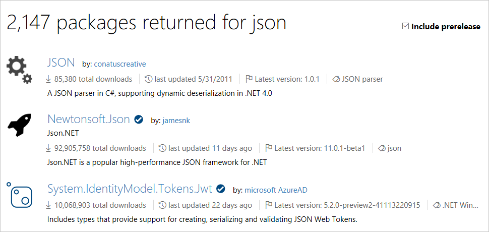
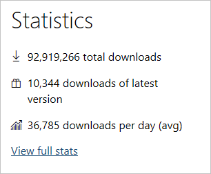

---
# required metadata

title: Finding and choosing NuGet Packages | Microsoft Docs
author: kraigb
ms.author: kraigb
manager: ghogen
ms.date: 8/25/2017
ms.topic: article
ms.prod: nuget
#ms.service:
ms.technology: null
ms.assetid: 8886f899-797b-4704-9d16-820b55b71186

# optional metadata

description: An overview of how to find and choose the best NuGet packages for a project including details on the NuGet search syntax.
keywords: NuGet package consumption, NuGet package discovery, best NuGet packages, deciding on packages, consuming packages, evaluating package, NuGet search syntax
#ROBOTS:
#audience:
#ms.devlang:
ms.reviewer:
- karann
- unnir
#ms.suite:
#ms.tgt_pltfrm:
#ms.custom:

---

# Finding and evaluating NuGet packages for your project

When starting any .NET project, or whenever you identify a functional need for your app or service, you can save yourself lots of time and trouble by using existing NuGet packages that fulfill that need. These packages can come from the public collection on [nuget.org](http://www.nuget.org/packages/), or a private source that's provided by your organization or another third party.

On this page:

- [Finding packages](#finding-packages)
- [Evaluating packages](#evaluating-packages)
- [Search syntax](#search-syntax)

## Finding packages

When you visit nuget.org or open the Package Manager UI in Visual Studio, you'll see a list of packages sorted by total downloads. This immediately shows you the most widely-used packages across the millions of .NET projects. There's a good chance, then, that at least some of the packages listed on the first few pages will be useful in your projects.

For specific needs, searching by tags (within Visual Studio's Package Manager or on a portal like nuget.org) is the most common means of discovering a suitable package. For example, searching on "json" lists all NuGet packages that are tagged with that keyword and thus have some relationship to the JSON data format.

You can also search using the package ID, if you know it. See [Search Syntax](#search-syntax) below.

At this time, search results are sorted only by relevance, so you generally want to look through at least the first few pages of results for packages that suit your needs, or refine your search terms to be more specific.

### Does the package support my project's target framework?

NuGet installs a package into a project only if that package's supported frameworks include the project's target framework. (See [Supporting multiple target frameworks](../create-packages/supporting-multiple-target-frameworks.md) for how this is done when creating a package.) If the package is not compatible, NuGet issues an error.

Some packages list their supported frameworks directly in the nuget.org gallery, but because such data is not required, many packages do not include that list. Therefore the primary way to check whether a target framework is supported is to attempt to install the package into a project. Using `Install-Package` in the NuGet Package Manager Console is the best method for this, as it shows you the most information if the package is incompatible, including its list of supported frameworks.

At present there is no means to search nuget.org for packages that support a specific target framework, but the feature is under consideration; see [NuGet Issue 2936](https://github.com/NuGet/NuGetGallery/issues/2936).

## Pre-release packages

By default, NuGet does not include pre-release versions when working with packages, but you can change this behavior as follows:

- **Package Manager UI in Visual Studio**: In the **Manage NuGet Packages** UI, check the **Include prerelease** box:

    

    Setting or clearing this box refreshes the Package Manager UI and the list of available versions you can install.

- **Package Manager Console**: Use the `-IncludePrerelease` switch with the `Find-Package`, `Get-Package`, `Install-Package`, `Sync-Package`, and `Update-Package` commands. Refer to the [PowerShell Reference](../tools/powershell-reference.md).

- **NuGet CLI**: Use the `-prerelease` switch with the `install`, `update`, `delete`, and `mirror` commands. Refer to the [NuGet CLI reference](../tools/nuget-exe-cli-reference.md)

### Native C++ packages

NuGet 2.5+ supports native C++ packages can that can be used in C++ projects in Visual Studio. This enables the **Manage NuGet Packages** context-menu command for projects, introduces a `native` target framework, and provides MSBuild integration.

To find native packages on [nuget.org](https://www.nuget.org/packages), search using `tag:native`. Such packages typically provide `.targets` and `.props` files, which NuGet imports automatically when the package is added to a project.

For information on creating native packages, see [Native packages](../create-packages/native-packages.md).

## Evaluating packages

The best way to evaluate the usefulness of a package is, of course, to download it and try it out. After all, every highly popular package got started with only a few developers using it, and you might be one of the early adopters!

At the same time, using a NuGet package means taking a dependency on it, so you'll want to make sure it's robust and reliable. Because installing and directly testing a package is very time-consuming, you can also learn a lot about a package's quality by using the information on a package's listing page:

- *Downloads statistics*: a the package page you'll see total downloads, downloads of the most recent version, and average downloads per day. Larger numbers indicate that many other developers have taken a dependency on the package, which means that it has proven itself.

    

- *Version history*: on the package page, look at the date of the most recent update, and scroll down to see the version history. A well-maintained package has recent updates and a rich version history. Neglected packages have few updates and often haven't been updated in some time.

    

- *Recent installs*: on the package page, select **View full stats** on the right side. This shows you the package installs over the last six weeks. A package that other developers are actively using is typically a better choice than one that's not.
- *Support*: on the package page, select **Project Site** (if available) to see what support options are available. A project with a dedicated site is generally better supported.
- *Developer history*: on the package page, select the listed **Owners** to see what other packages they've published. Those with multiple packages are more likely to continue supporting their work in the future.
- *Open source contributions*: many packages are maintained in open-source repositories, making it possible for developers depending on them to directly contribute bug fixes and feature improvements. The contribution history of any given package is also a good indicator of how many developers are actively involved.
- *Interview the owners*: new developers can certainly be equally committed to producing great packages for you to use, and it's good to give them a chance to bring something new to the NuGet ecosystem. With this in mind, reach out directly to the package developers through the **Contact Owners** option on the listing page. Chances are, they'll be happy to work with you to serve your needs!

> [!Note]
> Always be mindful of a package's license terms, which you can see by selecting **License** on a package's listing page on nuget.org.

> [!Note]
> Every package that's uploaded to nuget.org is scanned for viruses, and nuget.org periodically re-scans all packages.

## Search Syntax

NuGet package search works the same on nuget.org, from the NuGet CLI, and within the NuGet Package Manager extension in Visual Studio. In general, search is applied to keywords as well as package descriptions.

- **Keywords**: Search looks for relevant packages that contain all the provided keywords. Example:

        modern UI javascript

- **Phrases**: Entering terms within quotation marks looks for exact case-insensitive matches to those terms. Example:

        "modern UI" package

- **Filtering**: You can apply a search term to a specific property by using the syntax `<property>:<term>` where `<property>` (case-insensitive) can be `id`, `packageid`, `version`, `title`, `tags`, `author`, `description`, `summary`, and `owner`. Terms can be contained in quotes if needed, and you can search for multiple properties at the same time. Also, searches on the `id` property are substring matches, whereas `packageid` uses an exact match. Examples:

        id:NuGet.Core                //Match any part of the id property
        Id:"Nuget.Core"
        ID:jQuery
        title:jquery                 //Searches title as shown on the package listing
        PackageId:jquery             //Match the package id exactly
        id:jquery id:ui              //Search for multiple terms in the id
        id:jquery tags:validation    //Search multiple properties
        id:"jquery.ui"               //Phrase search
        invalid:jquery ui            //Unsupported properties are ignored, so this
                                     //is the same as searching on jquery ui
