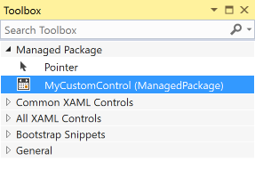
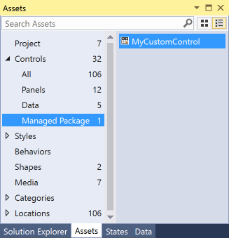
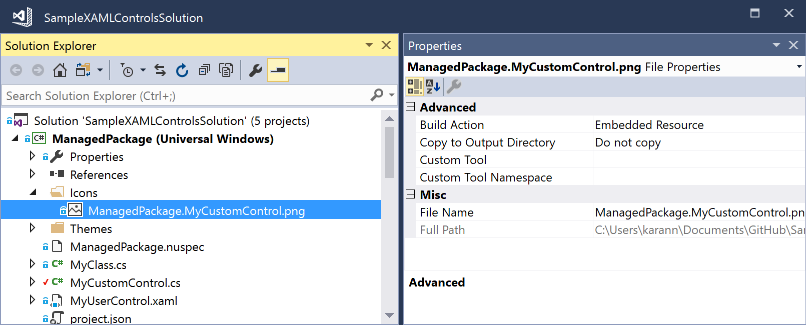

---
# required metadata

title: How to packages UWP controls with NuGet | Microsoft Docs
author: kraigb
ms.author: kraigb
manager: ghogen
ms.date: 3/21/2017
ms.topic: article
ms.prod: nuget
#ms.service:
ms.technology: nuget
ms.assetid: 1f9de20a-f394-4cf2-8e40-ba0f4239cd5e

# optional metadata

description: How to create NuGet packages that contain UWP controls, including the necessary metadata and supporting files for the Visual Studio and Blend designers.
keywords: NuGet UWP controls, Visual Studio XAML designer, Blend designer, custom controls
#ROBOTS:
#audience:
#ms.devlang:
ms.reviewer:
- karann
- unnir
#ms.suite:
#ms.tgt_pltfrm:
#ms.custom:

---

# Creating UWP Controls as NuGet Packages

With Visual Studio 2017, you can take advantage of added capabilities for UWP controls that you deliver in NuGet packages. This guide walks you through these capabilities using the [ExtensionSDKasNuGetPackage sample](https://github.com/NuGet/Samples/tree/master/ExtensionSDKasNuGetPackage). 

## Pre-requisites:

1.	Visual Studio 2017
1.	Understanding of how to [Create UWP Packages](create-uwp-packages.md)

## Add toolbox/assets pane support for XAML controls

To have a XAML control appear in the XAML designer’s toolbox in Visual Studio, create a `VisualStudioToolsManifest.xml` file in the root of the `tools` folder of your package project. This file is not required if you don’t need the control to appear in the designer.

```
\build
\lib
\tools
	\VisualStudioToolsManifest.xml
```    

The structure of the file is as follows:

```xml
<FileList>
  <File Reference = "your_package_file">
    <ToolboxItems VSCategory="vs_category" BlendCategory="blend_category">
      <Item Type="type_full_name" />
    </ToolboxItems>
  </File>
  <File Reference = "your_package_file_2">
    <ToolboxItems VSCategory="vs_category" BlendCategory="blend_category">
      <Item Type="type_full_name_2" />
    </ToolboxItems>
  </File>
</FileList>
```

where:

- *your_package_file*: the name of your control DLL, such as `ManagedPackage.winmd`.
- *vs_category*: The label for the group in which the control should appear in the Visual Studio designer’s toolbox. A category is necessary for the control to appear in the toolbox.
- *blend_category*: The label for the group in which the control should appear in the Blend designer’s Assets pane. A category is necessary for the control to appear in the assets.
- *type_full_name*: The fully-qualified identifier for the control, including the namespace, such as `ManagedPackage.MyCustomControl`

In the following example, the control implemented in `ManagedPackage.winmd` will appear in Visual Studio and Blend in a group named “Managed Package”, and “MyCustomControl” will appear in that group.

```xml
<FileList>
  <File Reference = "ManagedPackage.winmd">
    <ToolboxItems VSCategory="Managed Package" BlendCategory="Managed Package">
      <Item Type="ManagedPackage.MyCustomControl" />
    </ToolboxItems>
  </File>
</FileList>
```





> [!Note]
> You must explicitly specify every control that you would like to see in the toolbox/assets pane. Ensure you specify them in the format `Namespace.ControlName`.

## Add custom icons to your controls

To display a custom icon in the toolbox/assets pane, add an image to the library project with the name “Namespace.ControlName.extension” and set the build action to “Embedded Resource”.

In the example above, the project contains an image file named “ManagedPackage.MyCustomControl.png”.



## Support specific Windows platform versions

UWP packages have a TargetPlatformVersion (TPV) and TargetPlatformMinVersion (TPMinV) that define the upper and lower bounds of the OS version where the app can be installed. TPV further specifies the version of the SDK against which the app is built. Be mindful of these properties when authoring a UWP package: using APIs outside the bounds of the platform versions defined in the app will cause either the build to fail or the app to fail at runtime.

## PackageReference-based UWP projects 
For example, let’s say you’ve set the TPMinV for you controls package to Windows 10 Anniversary Edition (10.0; Build 14393), so you want to ensure that the package is consumed only by UWP projects that match that lower bound. To enforce the appropriate TPMinV check, package your control contents with the following folder names:

```
\lib\uap10.0.14393.0\*
\ref\uap10.0.14393.0\*
```

Note that `ref` is given here for completeness. It’s required only if you have a reference assembly that’s used to compile the app and there’s a different implementation assembly in `lib` that’s copied into the application output.

To specify multiple versions of the assembly targeting specific versions of the SDK, creating separate folders for each version of the OS:

```
\lib\uap10.0.14393.0\*
\lib\uap10.0.10586.0\*
\ref\uap10.0.14393.0\*
\ref\uap10.0.10586.0\*
```

The correct version of the assembly is then selected based on the consuming project's TPV. If the consuming project's TPV is higher than all available assemblies, the highest version of the assembly is selected.

> [!Note]
> The TPV `\lib\uap10.0` and `\lib\uap`  will continue to work, but there’s no TPMinV check and the package can be consumed by a UWP project irrespective of its TPMinV.
> This feature currently works only for PackageReference-based UWP projects. To continue to support project.json-based UWP projects, include your controls under the `\lib\uap10.0` folder as well.

## Build-time TPMinV check for project.json/packages.config based UWP projects

The install-time TPMinV check is not supported for UWP projects using project.json or packages.config. Instead, you can author a build target that performs this check at project build time. 

For example, let’s say you’ve set the TPMinV for you controls package to Windows 10 Anniversary Edition (10.0; Build 14393), so you want to ensure that the package is consumed only by UWP projects that match that lower bound. To allow your package to be consumed by project.json-based UWP projects, you must package your controls with the following folder names:

```
\lib\uap10.0\*
\ref\uap10.0\*
```

To enforce the appropriate TPMinV check, create an [MSBuild targets file](https://docs.microsoft.com/en-us/visualstudio/msbuild/msbuild-targets) and package it under the build folder:

```
\build
	\uap10.0
		MyManagedPackage.targets
\lib
\tools
```

Here is an example of what the targets file should look like:

```xml
<?xml version="1.0" encoding="utf-8"?>
<Project xmlns="http://schemas.microsoft.com/developer/msbuild/2003">

<Target Name="TPMinVCheck" BeforeTargets="Build;ReBuild" Condition="'$(TargetPlatformMinVersion)' != ''">
     <PropertyGroup>
    <RequiredTPMinV>10.0.14393</RequiredTPMinV>
    <ActualTPMinV>$(TargetPlatformMinVersion)</ActualTPMinV>
    <PackageId>ManagedPackage</PackageId>
  </PropertyGroup>
    <Error 
        Condition=" '$([System.Version]::Parse($(ActualTPMinV)).CompareTo($([System.Version]::Parse($(RequiredTPMinV)))))' == '-1' " 
        Text = "The $(PackageId) nuget package cannot be used in the $(MSBuildProjectName) project since the project's TargetPlatformMinVersion - $(ActualTPMinV) does not match the Minimum Version - $(RequiredTPMinV) supported by the package" />
  </Target>
</Project>
```

## Add Design-Time support

To configure where the control properties show up in the property inspector, add custom adorners, etc., To add this support, place your `design.dll` file inside the `lib\<platform>\Design` folder as appropriate to the target platform:

```
\build
\lib
	\uap10.0.14393.0
		\Design
			\MyControl.design.dll
		\ManagedPackage
			\Themes		
				Generic.xaml
\tools
```

> [!Note]
> By default, control properties will show up under the Miscellaneous category in the property inspector.

To ensure [Edit Template](https://docs.microsoft.com/en-us/windows/uwp/controls-and-patterns/xaml-styles#use-tools-to-work-with-styles-easily) works, you must include the `Generic.xaml` and any resource dictionaries that it merges in the `<AssemblyName>\Themes` directory.

## Use strings and resources

You can embed string resources (`.resw`) in your package that can be used by your control or the consuming UWP project, set the **Build Action** property of the `.resw` file to **PRIResource**.

For an example, refer to [MyCustomControl.cs](https://github.com/NuGet/Samples/blob/master/ExtensionSDKasNuGetPackage/ManagedPackage/MyCustomControl.cs) in the ExtensionSDKasNuGetPackage sample.

## Package content such as images

To package content such as images that can be used by your control or the consuming UWP project. add those files `lib\uap10.0.14393.0` folder as follows:

```
\build
\lib
	\uap10.0.14393.0
		\Design
		\ManagedPackage
\contosoSampleImage.jpg
\tools
```

You may also author an[MSBuild targets file](https://docs.microsoft.com/en-us/visualstudio/msbuild/msbuild-targets) to ensure the asset is copied to the consuming project’s output directory:

```xml
<?xml version="1.0" encoding="utf-8"?>
<Project xmlns="http://schemas.microsoft.com/developer/msbuild/2003">

    <ItemGroup Condition="'$(TargetPlatformIdentifier)' == 'UAP'">
   <Content Include="$(MSBuildThisFileDirectory)..\..\lib\uap10.0.14393.0\contosoSampleImage.jpg">
       <CopyToOutputDirectory>Always</CopyToOutputDirectory>
   </Content>
    </ItemGroup>
</Project>
```

## See also

- [Create UWP Packages](create-uwp-packages.md)
- [ExtensionSDKasNuGetPackage sample](https://github.com/NuGet/Samples/tree/master/ExtensionSDKasNuGetPackage)
