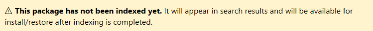

# Create and publish a package

It's a simple process to create a NuGet package from a .NET Class Library and publish it to nuget.org. This article walks you through the process using the NuGet command-line interface (CLI) and Visual Studio.

## Pre-requisites

1. Install any edition of Visual Studio 2017 from [visualstudio.com](https://www.visualstudio.com/).

1. Install the NuGet CLI tool, `nuget.exe`, by downloading the latest version of `nuget.exe` from [nuget.org/downloads](https://nuget.org/downloads), and saving the `.exe` to a location in your PATH. Note that the download *is* the tool itself, not an installer.

1. Create a suitable .NET Class Library project for the code you want to package. If you don't already have a project, you can create a simple one as follows:
    1. In Visual Studio, choose **File > New > Project**, expand the **Visual C# > Windows** node, select the "Class Library" template, name the project AppLogger, and click **OK**.
    1. Right-click on the resulting project file and select **Build** to make sure the project was created properly. The DLL is found within the Debug folder (or Release if you build that configuration instead).

    Within a real NuGet package, of course, you implement many useful features upon which others can build applications. For this walkthrough, however, you won't write any additional code because a class library from the template is sufficient to create a package.

## Create the .nuspec package manifest file

Every NuGet package needs a manifest&mdash;a `.nuspec` file&mdash;to describe its contents and its dependencies. The `nuget spec` command creates this file for you, which you then customize. In this example you create the `.nuspec` from a project file; you can also create the manifest through other means as described on [Create a Package](../create-packages/creating-a-package.md).

1. Open a command prompt and navigate to the folder containing your project file (`.csproj`).

1. Run the NuGet CLI `spec` command to generate the manifest, which is named after your project, such as `AppLogger.nuspec`:

    ```cli
    nuget spec
    ```

1. Open the file in a text editor. The manifest looks something like the code below, where tokens in the form `<token>` (such as `$id$`) are be replaced during the packaging process with values from the project's Properties/AssemblyInfo.cs file. For more details on tokens, see [Creating a .nuspec file](../create-packages/creating-a-package.md#creating-the-nuspec-file).

    ```xml
    <?xml version="1.0"?>
    <package>
        <metadata>
        <id>$id$</id>
        <version>$version$</version>
        <title>$title$</title>
        <authors>$author$</authors>
        <owners>$author$</owners>
        <licenseUrl>http://LICENSE_URL_HERE_OR_DELETE_THIS_LINE</licenseUrl>
        <projectUrl>http://PROJECT_URL_HERE_OR_DELETE_THIS_LINE</projectUrl>
        <iconUrl>http://ICON_URL_HERE_OR_DELETE_THIS_LINE</iconUrl>
        <requireLicenseAcceptance>false</requireLicenseAcceptance>
        <description>$description$</description>
        <releaseNotes>Summary of changes made in this release of the package.</releaseNotes>
        <copyright>Copyright 2016</copyright>
        <tags>Tag1 Tag2</tags>
        </metadata>
    </package>
    ```

1. Select a package ID that is unique across nuget.org. We recommend using the naming conventions described in [Creating a package](../create-packages/creating-a-package.md#choosing-a-unique-package-identifier-and-setting-the-version-number). Be sure to update the author and description tags or you get an error in the next step. Here's an updated `.nuspec` file as an example:

    ```xml
    <?xml version="1.0"?>
    <package>
        <metadata>
        <id>MyCompanyName.MyProductName.MyPackageName</id>
        <version>$version$</version>
        <title>$title$</title>
        <authors>kraigb</authors>
        <owners>kraigb</owners>
        <requireLicenseAcceptance>false</requireLicenseAcceptance>
        <description>Awesome application logging utility</description>
        <releaseNotes>First release</releaseNotes>
        <copyright>Copyright 2016</copyright>
        <tags>application app logger logging logs</tags>
        </metadata>
    </package>
    ```

> [!Note]
> For packages built for public consumption, pay special attention to the `<tags>` element, as these tags help others find your package and understand what it does.

## Run the pack command

To build a NuGet package (a `.nupkg` file) from a project, run the `pack` command:

```cli
nuget pack AppLogger.csproj
```

This command creates `AppLogger.1.0.0.0.nupkg` using the package name and version number from the `.nuspec` file. The command issues warnings if you haven't updated various fields in the `.nuspec` file from their default values.

## Publish the package

Once you have a `.nupkg` file, you publish it to nuget.org using the `push` command. (Alternately, you can use the [nuget.org publishing workflow](../create-packages/publish-a-package.md#publish-to-nugetorg).

> [!Warning]
> The packages you publish to nuget.org are publicly visible to other developers. To host packages privately, see [Hosting packages](../hosting-packages/overview.md).

1. Create a free account on [nuget.org](https://www.nuget.org/users/account/LogOn?returnUrl=%2F), or log in if you already have one. Creating a new account sends a confirmation email. You must confirm the account before you can upload a package.

1. Once logged in, select your user name (on the upper right), then select **API Keys**.

1. Select **Create**, provide a name for your key, select **Select Scopes > Push** under **API Key**, enter * for **Glob pattern**, then select **Create**.

1. Once the key is created, select **Copy** to retrieve the access key you need in the CLI:

    

    > [!Warning]
    > Save your key in a secure location and keep it secret. If your key is accidentally revealed, you can regenerate it at any time. You can also remove the API key if you no longer want to push packages via the CLI.

1. At a command prompt, run the following command, specifying your package name and replacing the key with the value copied in step 4:

    ```cli
    nuget push AppLogger.1.0.0.0.nupkg 47be3377-c434-4c29-8576-af7f6993a54b -Source https://api.nuget.org/v3/index.json
    ```

1. nuget.exe displays the results of the publishing process:

    ```output
    Pushing AppLogger.1.0.0.0.nupkg to 'https://www.nuget.org/api/v2/package'...
        PUT https://www.nuget.org/api/v2/package/
        Created https://www.nuget.org/api/v2/package/ 6829ms
    Your package was pushed. 
    ```

1. From your profile on nuget.org, Select **Manage Packages** to see the one you just published. You also receive a confirmation email. Note that it might take a while for your package to be indexed and appear in search results where others can find it. During that time your package page shows the message below:

    

> [!Note]
> **Virus scanning**: All packages uploaded to nuget.org are scanned for viruses and rejected if any viruses are found. All packages listed on nuget.org are also scanned periodically.

And that's it! You've just published your first NuGet package to [nuget.org](https://www.nuget.org/), that other developers can use in their own projects.

## Related topics

- [Create a Package](../create-packages/creating-a-package.md)
- [Publish a Package](../create-packages/publish-a-package.md)
- [Support multiple target frameworks](../create-packages/supporting-multiple-target-frameworks.md)
- [Package versioning](../reference/package-versioning.md)
- [Creating localized packages](../create-packages/creating-localized-packages.md)
