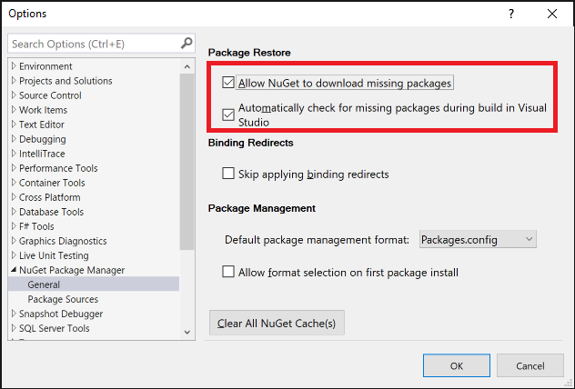

---
# required metadata

title: NuGet Quick Guide ro Package Restore | Microsoft Docs
author: kraigb
ms.author: kraigb
manager: ghogen
ms.date: 10/3/2017
ms.topic: article
ms.prod: nuget
ms.technology: null
ms.assetid: b70326a0-5bfc-4b7c-881d-7a7d5ebeeed5

# optional metadata

description: A brief description of how to restore NuGet packages in a project.
keywords: NuGet package restore, restoring packages
ms.reviewer:
- karann
- unnir

---

# Quick guide to package restore

When you build a project in Visual Studio, it also runs NuGet restore as part of the project build. This is the deafult behavior. If you disable Package Restore from Tools/Options, you may encounter situations where the build fails because the project might be referencing packages that may be missing on your machine.

For example, a project in Visual Studio may show the following error:

```
This project references NuGet package(s) that are missing on this computer.
Use NuGet Package Restore to download them. The missing file is {name}.
```

```
One or more NuGet packages need to be restored but couldn't be because consent has not been granted. To give consent, open the Visual Studio Options dialog, click on the NuGet Package Manager node and check 'Allow NuGet to download missing packages during build.' You can also give consent by setting the environment variable 'EnableNuGetPackageRestore' to 'true'.
Missing packages: {name}	
```

The solution is to enable NuGet package restore in Tools/Options. Ensure, both the boxes under `Package Restore` are checked i.e. `Allow NuGet to download missing packages`, and allow NuGet to `Automatically check for missing packages during build in Visual Studio`. 



For additional details, see [Package restore](../Consume-Packages/Package-Restore#enabling-and-disabling-package-restore).
