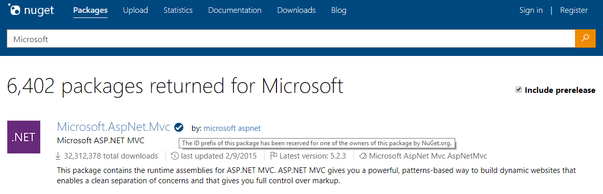
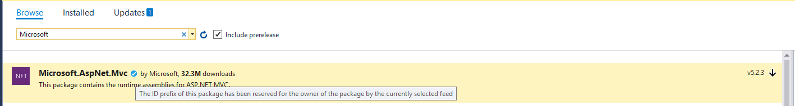

---
# required metadata

title: ID Prefix Reservation Reference | Microsoft Docs
author: dajaco
ms.author: dajaco
manager: unnir
ms.date: 10/9/2017
ms.topic: reference
ms.prod: nuget
#ms.service:
ms.technology: null
#ms.assetid: 

# optional metadata

description: Package ID Prefix Reservation feature description and author guide.
keywords: NuGet package ID, prefix, reservation
#ROBOTS:
#audience:
#ms.devlang:
ms.reviewer:
- anangaur
- karann
- unnir
#ms.suite:
#ms.tgt_pltfrm:
#ms.custom:

---

# Package ID Prefix Reservation
[NuGet.org](https://www.nuget.org/) and Visual Studio 2017 version 15.4 or later now show a visual indicator for packages that are submitted by owners with a reserved package ID prefix, as long as the package matches the reserved ID prefix naming pattern. The below reference explains what the ID prefix reservation entails, and how an owner can apply for an ID prefix.

## ID Prefix Reservation Details 
When a package ID prefix is reserved, several things happen on the [NuGet.org](https://www.nuget.org/) gallery, as well as in Visual Studio. In addition, there are advanced scenarios that are supported by ID prefix reservations, such as setting a prefix as 'public', delegating prefix subsets to multiple owners.

The below section describes the feature in detail, as well as the more advanced functionality.

### ID Prefix Reservation on NuGet.org
When a prefix is reserved on [NuGet.org](https://www.nuget.org/), several things happen. 
1. A prefix reservation is associated with an owner or set of owners on [NuGet.org](https://www.nuget.org/). 
2. Whenever a package is submitted to [NuGet.org](https://www.nuget.org/) with an ID that matches the reserved ID prefix, the package is rejected unless it originates from the owner(s) that reserved the ID prefix.
3. Any package that matches the reserved ID prefix and originates from the owner(s) that reserved the ID prefix will have a visual indicator in Visual Studio 2017 version 15.4 or later, and on [NuGet.org](https://www.nuget.org/) indicating that the package is under a reserved ID prefix. This is true for both new package submissions as well as existing packages under the owner(s). **Note:** The indicator in Visual Studio will only appear if a single feed is selected as the package source. 
4. All previously existing packages that match the reserved ID prefix, but are *not* owned by the owner of the reserved prefix will remain unchanged (they will not be unlisted, but they will also not have the visual indicator).

These changes are based on the following conditions and impose several additional restrictions:
* Only one owner of a package needs to have the reserved prefix for the visual indicator to appear (for packages with multiple-owners).
* If there is more than one owner of a package where one or more owners has the reserved prefix and one or more owners does not have the reserved prefix, then only the owner(s) with the reserved prefix can remove other owner(s) with a reserved prefix. The owners who do not have the prefix reserved cannot remove owners with the prefix reserved. They can still remove other owners that also do not have the prefix reserved.
  * Once a package has the visual indicator, it should *always* have the visual indicator (guarunteeing that at least one owner with the reserved prefix will always remain an owner)

### Advanced Prefix Reservation Scenarios
There are several more advanced prefix reservation scenarios described below, including subprefix delegation, and marking prefixes as public. Below are the more advanced prefix reservations that can be made. 

* During prefix reservation, the owner can request delegation of prefix subsets (or the prefix) to other owners. For example, if '[Microsoft](https://www.nuget.org/profiles/microsoft)' owns 'Microsoft.\*', but '[aspnet](https://www.nuget.org/profiles/aspnet)' wants to reserve 'Microsoft.AspNet.\*', '[Microsoft](https://www.nuget.org/profiles/microsoft)' can choose to delegate 'Microsoft.AspNet.\*' to the [aspnet](https://www.nuget.org/profiles/aspnet) account.
*  During prefix reservation, the owner can choose to make a prefix public. This will still give them the visual indicator showing that the package originates from a reserved prefix, but it will **not** block future package submissions on the prefix for any owner. This is useful for open source projects with many contributors - the top or core contributors can have the prefix reserved, but it can still be open to all contributors. 

### Prefix Resveration Visual Indicator
When a package comes from a reserved prefix, you will see the below visual indicators on the [NuGet.org](https://www.nuget.org/) gallery and in Visual Studio 2017 version 15.4 or later:

**NuGet.org Gallery**


**Visual Studio**


## ID Prefix Reservation Application Process
To apply for a prefix reservation, follow the below steps. 
1. Review the acceptance [criteria for prefix ID reservation](#id-prefix-reservation-criteria).
2. Determine the namespaces you want to reserve, in addition to any [advanced prefix reservation scenarios](#advanced-prefix-reservation-scenarios) you may require.
3. Send a mail to [account@nuget.org](mailto:account@nuget.org) with the owner display name on [NuGet.org](https://www.nuget.org/), as well as any reserved prefixes you are requesting. If you are delegating prefix subsets to multiple owners, make sure you mention all owner display names and prefix subsets.

After the application is submitted, you will be notified of acceptance or rejection (with the criteria that caused rejection). We may need to ask additional identifying questions to confirm owner identity. 

### ID Prefix Reservation Criteria
When reviewing any application for ID prefix reservation, the [NuGet.org](https://www.nuget.org/) team will evalaute the application against the below criteria. Not all criteria needs to be met for a prefix to be reserved, but the application may be denied if there is not substantial evidence of the criteria being met (with an explanation given):
1. Does the package ID prefix properly and clearly identify the package owner?
2. Are a significant number of the packages that have already been submitted by the owner under the package ID prefix?
3. Is the package ID prefix something common that should not belong to any individual owner or organization?
4. Would *not* reserving the package ID prefix cause ambiguity and confusion for the community?
5. Are the identifying properties of the packages that match the package ID prefix clear and consistent (especially the package author)?

## 3rd Party Feed Provider Scenarios
If a 3rd party feed provider is interested in implementing their own service to provide prefix reservations, you can do so by modifying the search service in the NuGet v2 or v3 feed providers. The addition in the feed search service is to add the *verified* property, with examples for both the v2 and v3 feeds below. 

### v3 Search Service Example
```json
"data": 
[
    {
        "@id": "https://api.nuget.org/v3/registration2/mysql.data.entity/index.json",
        "@type": "Package",
        "registration": "https://api.nuget.org/v3/registration2/mysql.data.entity/index.json",
        "id": "MySql.Data.Entity",
        "version": "6.9.9",
        "description": "Entity Framework 6.0 supported",
        "summary": "",
        "title": "MySql.Data.Entity",
        "iconUrl": "http://www.mysql.com/common/logos/logo-mysql-170x115.png",
        "licenseUrl": "http://www.gnu.org/licenses/old-licenses/gpl-2.0.html",
        "projectUrl": "http://dev.mysql.com/downloads/",
        "tags": [],
        "authors": [],
        "totalDownloads": 434685,
        "verified": true,
        "versions": []
    },
]
```

### v2 Search Service Example
```json
"data": 
[
    {
        "PackageRegistration": {
            "Id": "MySql.Data.Entity",
            "DownloadCount": 434685,
            "Verified": true,
            "Owners": []
        },
        "Version": "6.9.9",
        "NormalizedVersion": "6.9.9",
        "Title": "MySql.Data.Entity",
        "Description": "Entity Framework 6.0 supported",
        "Summary": "",
        "Authors": "Oracle",
        "Copyright": "Copyright 2016",
        "Tags": "MySql MySql.Data.Entity Connector/NET EntityFramework",
        "ReleaseNotes": "Review Readme.txt for details.",
        "ProjectUrl": "http://dev.mysql.com/downloads/",
        "IconUrl": "http://www.mysql.com/common/logos/logo-mysql-170x115.png",
        "IsLatestStable": true,
        "IsLatest": false,
        "Listed": true,
        "Created": "2016-06-28T02:38:23.9630000Z",
        "Published": "2016-06-28T02:38:23.9630000Z",
        "LastUpdated": "2016-06-28T02:38:23.9630000Z",
        "LastEdited": "2016-07-01T23:34:08.9330000Z",
        "DownloadCount": 140487,
        "FlattenedDependencies": "MySql.Data:[6.9.9, ):|EntityFramework:[6.0.0, ):",
        "Dependencies": [],
        "SupportedFrameworks": [],
        "Hash": "U2WX/TzaLGYk5tN4zYOVLBpRgYIx7iJmjJamPcy4eDlaYrBBEymc9WI4R6hKSFdnSfhEOAPtUlsFn8l1ZB67Dg==",
        "HashAlgorithm": "SHA512",
        "PackageFileSize": 134989,
        "LicenseUrl": "http://www.gnu.org/licenses/old-licenses/gpl-2.0.html",
        "RequiresLicenseAcceptance": false
    }
]
```