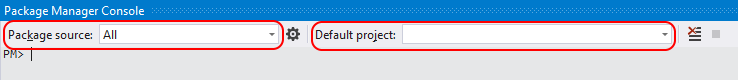
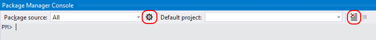
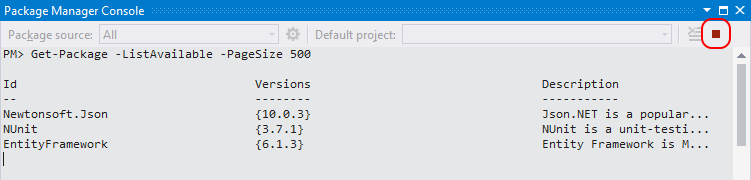

---
# required metadata

title: NuGet Package Manager Console Guide | Microsoft Docs
author: kraigb
hms.author: kraigb
manager: ghogen
ms.date: 7/17/2017
ms.topic: article
ms.prod: nuget
#ms.service:
ms.technology: null
ms.assetid: 2b92b119-6861-406c-82af-9d739af230e4

# optional metadata

description: Instructions for using the NuGet Package Manager Console in Visual Studio for working with packages.
keywords: NuGet package manager console, NuGet powershell, managing NuGet packages
#ROBOTS:
#audience:
#ms.devlang:
ms.reviewer:
- karann
- unnir
#ms.suite:
#ms.tgt_pltfrm:
#ms.custom:

---

# Package Manager Console

The NuGet Package Manager Console, which is build into Visual Studio version 2012 and later, lets you use [NuGet PowerShell commands](../tools/powershell-reference.md) to find, install, uninstall, and update NuGet packages. Using the console is necessary in cases where the Package Manager UI does not provide a way to perform an operation. 

All operations that are available in the console can also be done with the [NuGet CLI](../tools/nuget-exe-cli-reference.md). However, console commands operate within the context of Visual Studio and often accomplish more than their equivalent CLI commands. For example, installing a package through the console adds a reference to the project whereas the CLI command does not. For this reason, developers working in Visual Studio typically prefer using the console to the CLI.

In this topic:

- [Availability of the console](#availability-of-the-console)
- [Opening the console](#opening-the-console)
- [Finding a package](#finding-a-package)
- [Installing a package](#installing-a-package)
- [Uninstalling a package](#uninstalling-a-package)
- [Updating a package](#updating-a-package)
- [Extending the Package Manager Console](#extending-the-package-manager-console)
- [Setting up a NuGet PowerShell profile](#setting-up-a-nuget-powershell-profile)

## Availability of the console

In Visual Studio 2017, NuGet and the NuGet Package Manager are automatically installed when you select any .NET-related workloads; you can also install it individually by checking the **Individual components > Code tools > NuGet package manager** option in the Visual Studio 2017 installer.

Also, if you're missing the NuGet Package Manager in Visual Studio 2015 and earlier, check **Tools > Extensions and Updates...** and search for the NuGet Package Manager extension. If you're unable to use the extensions installer in Visual Studio, you can download the extension directly from [https://dist.nuget.org/index.html](https://dist.nuget.org/index.html).

The Package Manager Console it is not presently available with Visual Studio for Mac. The equivalent commands, however, are available through the [NuGet CLI](nuget-exe-CLI-reference.md). Visual Studio for Mac does have a UI managing NuGet packages. See [Including a NuGet package in your project](https://docs.microsoft.com/visualstudio/mac/nuget-walkthrough).

## Opening the console and console controls

Open the console in Visual Studio using the **Tools > NuGet Package Manager > Package Manager Console** command. The console is a Visual Studio window that can be arranged and positioned however you like (see [Customize window layouts in Visual Studio](https://docs.microsoft.com/visualstudio/ide/customizing-window-layouts-in-visual-studio)).

By default, console commands operate against a specific package source and project as set in the control at the top of the window:



Selecting a different package source and/or project changes those defaults for subsequent commands. To overrride these settings without changing the defaults, most commands support `-Source` and `-ProjectName` options.

To manage package sources, select the gear icon. This is a shortcut to the **Tools > Options > NuGet Package Manager > Package Sources** dialog box as described on the [Package Manager UI](Package-Manager-UI.md#package-sources) page. Also, the control to the right of the project selector clears the console's contents:



Finally, the rightmost button interrupts a long-running command. For example, running `Get-Package -ListAvailable -PageSize 500` lists the top 500 packages on the default source (such as nuget.org), which could take several minutes to run.




## Finding a package

To see the packages available from the selected source, use the [`Get-Package -ListAvailable`](../tools/ps-ref-get-package.md) command. For nuget.org, the list contains thousands of packages, so it's helpful to use the `-Filter` switch along with `-PageSize` to limit the results. In NuGet 3+, you can instead use the [`Find-Package`](../tools/ps-ref-find-package.md) command that is better suited to this operation.

Examples:

```ps
# Show specific packages (all versions of NuGet)
Get-Package -ListAvailable -Filter elmah
Get-Package -ListAvailable -Filter Logging

# List all versions of packages matching the filter "jquery"
Get-Package -ListAvailable -Filter jquery -AllVersions

# List the top 100 packages
Get-Package -ListAvailable -PageSize 100


# Find-Package in NuGet 3+ is more efficient than Get-Package
Find-Package elmah
Find-Package Logging

# List packages with the keyword EntityFramework and version 6.1.1
Find-Package EntityFramework -version 6.1.1

# List all versions of the package with the ID of "jquery"
Find-Package jquery -AllVersions -ExactMatch
```

## Installing a package

Once you know the identifier of the package you want to install, use the [`Install-Package`](../tools/ps-ref-install-package.md) command. This command adds the package to the default project as specified in the console's project selector. To install the package into a different project, use the `-ProjectName` switch:

```ps
# Add the Elmah package to the default project
Install-Package Elmah

# Add the Elmah package to a project named UtilitiesLib that is not the default
Install-Package Elmah -ProjectName UtilitiesLib
```

Installing a package performs the following actions:

- Displays applicable license terms in the console window with implied agreement. If you do not agree to the terms, you should uninstall the package immediately.
- Adds a reference to the project in whatever reference format is in use. References subsequently appear in Solution Explorer and the applicable reference format file. Note, however, that with PackageReference, you need to save the project to see the changes in the project file directly.
- Caches the package in the project depending on the reference format in use:
    - `packages.config`: creates a `packages` folder and copies package files into a subfolder within it.
    - `project.json`: package is cached within `project.lock.json`
    - PackageReference:  package is cached within  or `project.assets.json`
- Updates `app.config` and/or `web.config` if the package uses [source and config file transformations](../create-packages/source-and-config-file-transformations.md).
- Installs any dependencies if not already present in the project. This might update package versions in the process, as described in [Dependency Resolution](../consume-packages/dependency-resolution.md).
- Displays the package's readme file, if available, in a Visual Studio window.

> [!Tip]
> One of the primary advantages of installing packages with the `Install-Package` command in the console is that adds a reference to the project just as of you used the Package Manager UI. In contrast, the `nuget install` CLI command only downloads the package and does not automatically add a reference.

## Uninstalling a package

If you do not already know the name of the package you want to remove, use the [`Get-Package`](../tools/ps-ref-get-package.md) command with no arguments to see all of the packages currently installed in the default project.

To uninstall a package, use [`Uninstall-Package`](../tools/ps-ref-uninstall-package.md) with the package ID, such as `Uninstall-Package jQuery`.

Uninstalling a package performs the following actions:

- Removes references to the package from the project (and whatever reference format is in use). References no longer appear in Solution Explorer. (You might need to rebuild the project to see it removed from the **Bin** folder.)
- Removes the package from the project cache (`packages` folder, `project.lock.json`, or `project.assets.json`)
- Reverses any changes made to `app.config` or `web.config` when the package was installed.
- Removes previously-installed dependencies if no remaining packages use those dependencies.

> [!Tip]
> Like `Install-Package`, the `Uninstall-Package` command has the benefit of managing references in the project, unlike the `nuget uninstall` CLI command.

## Updating a package

The [`Get-Package -updates`](../tools/ps-ref-get-package.md) command checks if there are newer versions available for any installed packages.

To update a package, use [`Update-Package`](../tools/ps-ref-update-package.md) with the package ID, such as `Update-Package jQuery`. 

To update all packages in the project, use `Update-Package -ProjectName <project_name>`; to update all packages in the solution, use `Update-Package` with no arguments.

## Extending the Package Manager Console

Some packages install new commands for the console. For example, `MvcScaffolding` creates commands like `Scaffold` shown below, which generates ASP.NET MVC controllers and views:


## Setting up a NuGet PowerShell Profile

A PowerShell profile lets you make commonly-used commands available wherever you use PowerShell. NuGet supports a NuGet-specific profile typically found at the following location:

```
%UserProfile%\Documents\WindowsPowerShell\NuGet_profile.ps1
```

To find the profile, type `$profile` in the console:

```ps    
$profile
C:\Users\<user>\Documents\WindowsPowerShell\NuGet_profile.ps1
```

For more details, refer to [Windows PowerShell Profiles](https://technet.microsoft.com/library/bb613488.aspx).
