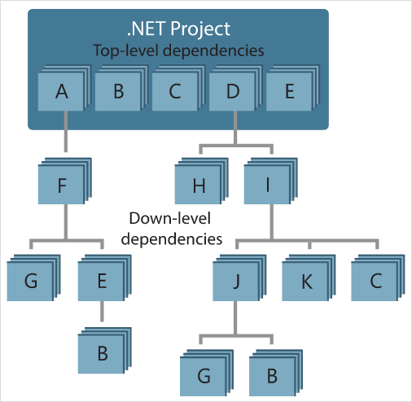

---
# required metadata

title: What is NuGet and what does it do? | Microsoft Docs
author: kraigb
ms.author: kraigb
manager: ghogen
ms.date: 7/27/2017
ms.topic: hero-article
ms.prod: nuget
#ms.service:
ms.technology: null
ms.assetid: c3faf278-4cbf-4733-96f6-9ee9f7203af9

# optional metadata

description: A comprehensive introduction to what NuGet is and does
keywords: NuGet package manager, consumption, package creation, package hosting
#ROBOTS:
#audience:
#ms.devlang:
ms.reviewer:
- karann
- unnir
#ms.suite:
#ms.tgt_pltfrm:
#ms.custom:

---

# An introduction to NuGet

An essential tool for any modern development platform is a mechanism through which developers can create, share, and consume useful libraries and packages. For .NET, that mechanism is **NuGet**, which defines how packages for .NET are created, hosted, and consumed, and provides the tools for each of those roles.

## The flow of packages between creators, hosts, and consumers

In its role as host, NuGet itself maintains the central repository of over 60,000 unique, publicly-available packages at [nuget.org](https://www.nuget.org). These packages are employed by millions of .NET developers every day. NuGet also enables you to host packages privately in the cloud, on a private network, or even on just your local file system. By doing so, those packages are available to only those developers within a particular organization or customer group. The options are explained on [Hosting your own NuGet feeds](Hosting-Packages/Overview.md).

Whatever its nature, a host serves as a point of connection between package *creators* and package *consumers*. Creators build useful NuGet packages and publish them to a host. Consumers then search for useful and compatible packages on accessible hosts, downloading and including those packages in their projects. Once installed in a project, the packages' APIs are available to the rest of the project code.

A "compatible" package in this case means that it contains assemblies built for at least one target .NET framework that's compatible with the consuming project's target framework. To make a package widely compatible, it's creator compiles separate assemblies for various target frameworks and includes all of them in the same package. When a consumer installs that package, NuGet extracts only those assemblies that are needed by the project. This minimizes the package's footprint in the final application and/or assemblies produced by that project.

## NuGet tools

In addition to hosting support, NuGet also provides a variety of tools used by both creators and consumers:

| Tool | Platforms | Applicable Scenarios | Description |
| --- | --- | --- | --- |
| [nuget.exe CLI](Tools/nuget-exe-CLI-Reference.md) | All | Creation, Consumption | Provides all NuGet capabilities, with some commands applying specifically to package creators, some applying only to consumers, and others applying to both. For example, package creators use the `nuget pack` command to create a package from various assemblies and related files, package consumers use `nuget install` to include packages in a project, and everyone uses `nuget config` to set NuGet configuration variables.  |
| [Package Manager UI](Tools/Package-Manager-UI.md) | Visual Studio on Windows | Consumption | Provides an easy-to-use UI for installing and managing packages in .NET projects. | 
| [Manage NuGet UI](https://docs.microsoft.com/visualstudio/mac/nuget-walkthrough) | Visual Studio for Mac | Consumption | Provide an easy-to-use UI for installing and managing packages in .NET projects. |
| [Package Manager Console](Tools/Package-Manager-Console.md) | Visual Studio on Windows | Consumption | Provides [PowerShell commands](Tools/Powershell-Reference.md) for installing and managing packages in .NET projects. | 
| [dotnet CLI](Tools/dotnet-Commands.md) | All | Creation, Consumption | Provides certain NuGet CLI capabilities directly within the .NET Core toolchain. |
| [MSBuild](Schema/msbuild-targets.md) | Windows | Creation, Consumption | Provides the ability to create packages and restore packages used in a project directly through the MSBuild toolchain. |

As you can see, the tools with which you work with NuGet depend greatly on whether you're creating (and publishing) packages or consuming them, and the platform you're working on. More specific details can be found in the [Package creation workflow](Create-Packages/Overview-and-Workflow.md) and [Package consumption workflow](Consume-Packages/Overview-and-Workflow.md) topics, along with other topics in those sections. 

Package creators are typically also consumers, as they build on top of functionality that exists in other NuGet packages. And those packages, of course, may in turn depend on still others.

## Managing dependencies

The ability to easily build on the work of others is one of the things that makes a package management system so powerful. Accordingly, much of what NuGet does is managing that dependency tree or "graph" on behalf of your project. Simply said, you need only concern yourself with those packages that you're directly using in a project. If any of those packages themselves consume other packages (which can consume packages), NuGet takes care of all those down-level dependencies.

The following image shows a project that depends on five packages, which in turn depend on a number of others.  

Notice that some packages appear multiple times in the dependency graph. For example, there are four different consumers of package B, and each consumer might also specify a different version for that package (not shown). Because this is a common occurrence, NuGet fortunately does all the hard work to determine exactly which version of package B satisfies all its consumers. NuGet then does the same for all other packages, no matter how deep the dependency graph becomes.

For more details on how NuGet performs this service, see [Dependency resolution](Consume-Packages/Dependency-Resolution.md).

## Tracking references and restoring packages

Because projects can easily move between developer computers, source control repositories, build servers, and so forth, it's highly impractical to keep binary assemblies from NuGet packages directly bound to a project. Not only would this make each copy of the project unnecessarily bloated (and thereby waste space in source control repositories), it would also make it very difficult to update package binaries to newer versions as this would have to be done across all copies of the project. 

Instead, NuGet simply maintains a reference list of the packages upon which a project depends (including both top-level and down-level dependencies), and provides the means to restore all referenced packages upon request as described on [Package restore](Consume-Packages/Package-Restore.md). That is, whenever you install a package from some host into a project, NuGet records the package identifier and version number in this reference list. (Uninstalling a package, of course, removes it from the list.) 

With only the reference list, NuGet can then reinstall&mdash;that is, restore&mdash;all of those packages from public and/or private hosts at any later time. (For this reason, nuget.org does not allow permanent deletion of published packages, although they can be hidden; see [Deleting packages](Policies/deleting-packages.md).) When committing a project to source control, or sharing it is some other way, you need only include the reference list and need not include any package binaries (see [Packages and source control](Consume-Packages/Packages-and-Source-Control.md).

The computer that receives a project, such as a build server obtaining a copy of the project as part of an automated deployment system, simply asks NuGet to restore dependencies whenever they're needed. Build systems like Visual Studio Team Services provide "NuGet restore" steps for this exact purpose. Similarly, when developers obtain a copy of a project (as when cloning a repository) then open the project in Visual Studio and run a build, Visual Studio automatically restores the necessary NuGet packages. Developers can also tell NuGet to restore packages at any time using the the `nuget restore` CLI command or the `Install-Package` cmdlet in the Package Manager Console.

Clearly, then, NuGet's primarily role where developers are concerned is maintaining that reference list on behalf of your project and providing the means to efficiently restore (and update) those referenced packages.

How this exactly happens has evolved over the different versions of NuGet, resulting in several *package management formats*, as they're called:

- [`packages.config`](Schema/packages-config.md): *(NuGet 1.0+)* An XML file that maintains a flat list of all dependencies in the project, including the dependencies of other installed packages. 
- [`project.json`](Schema/project-json.md): *(NuGet 3.0+)* A JSON file that maintains a list of the project's dependencies with an overall package graph in an associated file, `project.lock.json`. This structure provides improved performance over `packages.config` as described on [Dependency Resolution](Consume-Packages/Dependency-Resolution.md), including transitive restore, but has itself been generally superceded by PackageReference below.
- [Package references in project files](Consume-Packages/Package-References-in-Project-Files.md) (also known as "PackageReference") | *(NuGet 4.0+)* Maintains a list of a project's top-level dependencies directly within the project file, so no separate file is needed. An associated file, `project.assets.json`, is dynamically generated like `project.lock.json` to manage the overall dependency graph.

Which package management format is employed in any given project depends on the project type, and the available version of NuGet and Visual Studio. To check what format is being used, simply look for `packages.config` or `project.json` in the project root after installing your first package. If you don't see either file, look in the project file directly for a &lt;PackageReference&gt;element.

In Visual Studio 2017, for example, most project types use `packages.config` except for UWP C# and .NET Core projects in Visual Studio 2017 use PackageReference. 

## What else does NuGet do?

To summarize what we've covered so far, NuGet provides (in its hosting role) the central nuget.org repository and supports private hosting. NuGet provides the tools developers need for creating, publishing, and consuming packages. And most importantly, NuGet maintains a reference list of packages used in a project and the ability to restore and update those packages from that list.

To make these processes work efficiently, NuGet does some behind-the-scenes optimizations. Most notably, NuGet manages both computer-wide and project-specific package caches to shortcut installation and reinstallation. Where the computer-wide cache is concerned, any package that you download and install in a project is stored in the cache, such that installing the same package in another project doesn't have to download it again. This is clearly very helpful when you're frequently restoring a larger number of packages, as on a build server. For more details on the mechanism and how to work with it, see [Managing the NuGet cache](Consume-Packages/Managing-the-Nuget-Cache.md).

Within an individual project, NuGet does a lot of work to manage the overall dependency graph. (When using `project.json` or &lt;PackageReference&gt;, NuGet keeps that information in a secondary file called `project.lock.json` and `project.assets.json`, respectively.) This again includes resolving multiple references to different versions of the same package.

That is, it's quite common that a project takes a dependency on one or more packages that themselves have the same dependencies. For example, some of the most useful utility packages on nuget.org are employed by many other packages. In the entire dependency graph, ten, you could easily have ten different references to different versions of the same package. However, you don't want to bring multiple versions of that package into the application itself, so NuGet sorts out which single version that everyone can use. (See [Dependency Resolution](Consume-Packages/Dependency-Resolution.md) for more on this topic.)

Beyond that, NuGet maintains all the specifications related to how packages are structured (including [localization](Create-Packages/Creating-Localized-Packages.md) and [debug symbols](Create-Packages/Symbol-Packages.md) and how they are referenced (including [version ranges](create-packages/dependency-versions.md) and [pre-release versions](create-packages/Prerelease-Packages.md). NuGet also and provides APIs for credential providers (for accessing private hosts) and for developers who write Visual Studio extensions and project templates.

Take a moment to browse the table of contents for this documentation, and you'll see all of these capabilities represented there, along with release notes dating back to NuGet's beginnings.

## Comments, contributions, and issues

Finally, we very much welcome comments and contributions to this documentation&mdash;just select the **Comments** and **Edit** commands on any page, or visit the [docs repository](https://github.com/NuGet/docs.microsoft.com-nuget/) and [docs issue list](https://github.com/NuGet/docs.microsoft.com-nuget/issues) on GitHub.

We also welcome contributions to NuGet itself through its [various GitHub repositories](https://github.com/NuGet/Home); NuGet issues can be found on [https://github.com/NuGet/home/issues](https://github.com/NuGet/home/issues).

Enjoy your NuGet experience!