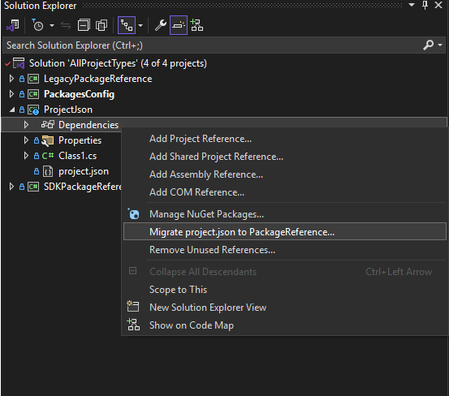

# project.json reference

> [!Important]
> This content is deprecated. Projects should use the PackageReference formats.
> Learn how to [migrate your project.json project to PackageReference](#migrate-projectjson-to-packagereference).
> Visual Studio 2026 automatically migrates project.json at solution load time.
> [.NET 10 SDK & NuGet.exe 7.0](../release-notes/NuGet-7.0.md) do not support project.json projects.

*NuGet 3.x*

The `project.json` file maintains a list of packages used in a project, known as a package management format. It supersedes `packages.config` but is in turn superseded by [PackageReference](../consume-packages/package-references-in-project-files.md) with NuGet 4.0+.

The [`project.lock.json`](#projectlockjson) file (described below) is also used in projects employing `project.json`.

`project.json` has the following basic structure, where each of the four top-level objects can have any number of child objects:

```json
{
    "dependencies": {
        "PackageID" : "{version_constraint}"
    },
    "frameworks" : {
        "TxM" : {}
    },
    "runtimes" : {
        "RID": {}
    },
    "supports" : {
        "CompatibilityProfile" : {}
    }
}
```

## Migrate project.json to PackageReference

The migration between project.json and PackageReference is straightforward.

### Automatic migration in Visual Studio 2026

Visual Studio 2026 and later automatically migrates project.json projects to PackageReference when you open a solution containing project.json projects.
The migration happens at solution load time:

1. Open a solution containing project.json projects in Visual Studio 2026 or later.
1. Visual Studio automatically detects project.json files and migrates them to PackageReference format.
1. To check migration status, open the [Output Window](/visualstudio/ide/output-window) and select Show output from "Package Manager".
You should see messages like "Migrating project.json project..." followed by "Migration Succeeded" for each project.
Any errors will appear in the Error List.
1. A backup of the original project file and project.json file is created in a `Backup` folder in the root of the project directory.
1. The migration converts all package dependencies to PackageReference format in the project file.


### Manual migration in Visual Studio 2022

For Visual Studio 2022 and earlier, you can use the built-in migrator:

1. Load the project.json project in Visual Studio.
1. Go to the solution explorer of the project.json project and find the dependencies node.
1. Right-click and select `Migrate project.json to PackageReference...`



### Alternative migration methods

Alternatively, you may use the [dotnet migrate](/dotnet/core/tools/dotnet-migrate) command-line tool, or do the migration manually by taking all of the content from the project.json file and replacing it with the equivalent [PackageReference syntax](../consume-packages/Package-References-in-Project-Files.md).

## Dependencies

Lists the NuGet package dependencies of your project in the following form:

```json
"PackageID" : "version_constraint"
```

For example:

```json
"dependencies": {
    "Microsoft.NETCore": "5.0.0",
    "System.Runtime.Serialization.Primitives": "4.0.10"
}
```

The `dependencies` section is where the NuGet Package Manager dialog adds package dependencies to your project.

The Package id corresponds to the id of the package on nuget.org , the same as the id used in the package manager console: `Install-Package Microsoft.NETCore`.

When restoring packages, the version constraint of `"5.0.0"` implies `>= 5.0.0`. That is, if 5.0.0 is not available on the server but 5.0.1 is, NuGet installs  5.0.1 and warns you about the upgrade. NuGet otherwise picks the lowest possible version on the server matching the constraint.

See [Dependency resolution](../concepts/dependency-resolution.md) for more details on resolution rules.

### Managing dependency assets

Which assets from dependencies flow into the top-level project is controlled by specifying a comma-delimited set of tags in the `include` and `exclude` properties of the dependency reference. The tags are listed the table below:

| Include/Exclude tag | Affected folders of the target |
| --- | --- |
| contentFiles | Content  |
| runtime | Runtime, Resources, and FrameworkAssemblies  |
| compile | lib |
| build | build (MSBuild props and targets) |
| native | native |
| none | No folders |
| all | All folders |

Tags specified with `exclude` take precedence over those specified with `include`. For example, `include="runtime, compile" exclude="compile"` is the same as `include="runtime"`.

For example, to include the `build` and `native` folders of a dependency, use the following:

```json
{
  "dependencies": {
    "packageA": {
      "version": "1.0.0",
      "include": "build, native"
    }
  }
}
```

To exclude the `content` and `build` folders of a dependency, use the following:

```json
{
  "dependencies": {
    "packageA": {
      "version": "1.0.0",
      "exclude": "contentFiles, build"
    }
  }
}
```

## Frameworks

Lists the frameworks that the project runs on, such as `net45`, `netcoreapp`, `netstandard`.

```json
"frameworks": {
    "netcore50": {}
    }
 ```

Only a single entry is allowed in the `frameworks` section. (An exception is `project.json` files for ASP.NET projects that are build with deprecated DNX tool chain, which allows for multiple targets.)

## Runtimes

Lists the operating systems and architectures that your app runs on, such as `win10-arm`, `win8-x64`, `win8-x86`.

```json
"runtimes": {
    "win10-arm": { },
    "win10-arm-aot": { },
    "win10-x86": { },
    "win10-x86-aot": { },
    "win10-x64": { },
    "win10-x64-aot": { }
}
```

A package containing a PCL that can run on any runtime doesn't need to specify a runtime. This must also be true of any dependencies, otherwise you must specify runtimes.


## Supports

Defines a set of checks for package dependencies. You can define where you expect the PCL or app to run. The definitions are not restrictive, as your code may be able to run elsewhere. But specifying these checks makes NuGet check that all dependencies are satisfied on the listed TxMs. Examples of the values for this are: `net46.app`, `uwp.10.0.app`, etc.

This section should be populated automatically when you select an entry in the Portable Class Library targets dialog.

```json
"supports": {
    "net46.app": {},
    "uwp.10.0.app": {}
}
```

## Imports

Imports are designed to allow packages that use the `dotnet` TxM to operate with packages that don't declare a dotnet TxM. If your project is using the `dotnet` TxM then all the packages you depend on must also have a `dotnet` TxM, unless you add the following to your `project.json` to allow non `dotnet` platforms to be compatible with `dotnet`:

```json
"frameworks": {
    "dotnet": { "imports" : "portable-net45+win81" }
}
```

If you are using the `dotnet` TxM then the PCL project system adds the appropriate `imports` statement based on the supported targets.

## Differences from portable apps and web projects

The `project.json` file used by NuGet is a subset of that found in ASP.NET Core projects. In ASP.NET Core `project.json` is used for project metadata, compilation information, and dependencies. When used in other project systems, those three things are split into separate files and `project.json` contains less information. Notable differences include:

- There can only be one framework in the `frameworks` section.

- The file cannot contain dependencies, compilation options, etc. that you see in DNX `project.json` files. Given that there can only be a single framework it doesn't make sense to enter framework-specific dependencies.

- Compilation is handled by MSBuild so compilation options, preprocessor defines, etc. are all part of the MSBuild project file and not `project.json`.

In NuGet 3+, developers are not expected to manually edit the `project.json`, as the Package Manager UI in Visual Studio manipulates the content. That said, you can certainly edit the file, but you must build the project to start a package restore or invoke restore in another way. See [Package restore](../consume-packages/package-restore.md).


## project.lock.json

The `project.lock.json` file is generated in the process of restoring the NuGet packages in projects that use `project.json`. It holds a snapshot of all the information that is generated as NuGet walks the graph of packages and includes the version, contents, and dependencies of all the packages in your project. The build system uses this to choose packages from a global location that are relevant when building the project instead of depending on a local packages folder in the project itself. This results in faster build performance because it's necessary to read only `project.lock.json` instead of many separate `.nuspec` files.

`project.lock.json` is automatically generated on package restore, so it can be omitted from source control by adding it to `.gitignore` and `.tfignore` files (see [Packages and source control](../consume-packages/packages-and-source-control.md). However, if you include it in source control, the change history shows changes in dependencies resolved over time.
