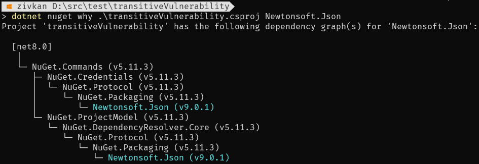
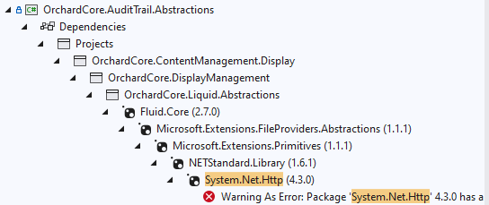
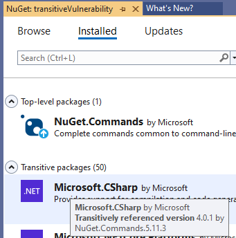

# Auditing package dependencies for security vulnerabilities

## About security audits

A security audit for package managers like NuGet is a process that involves analyzing the security of the packages that are included in a software project.
This involves identifying vulnerabilities, evaluating risks, and making recommendations for improving security.
The audit can include a review of the packages themselves, as well as any dependencies and their associated risks.
The goal of the audit is to identify and mitigate any security vulnerabilities that could be exploited by attackers, such as code injection or cross-site scripting attacks.

### Feature availability

| NuGet | .NET SDK | Visual Studio | Feature |
|-------|----------|---------------|---------|
| [5.9](../release-notes/NuGet-5.9.md) | .NET 5 SDK (5.0.200) | N/A | [`dotnet package list --vulnerable`](#dotnet-list-package---vulnerable) |
| [6.8](../release-notes/NuGet-6.8.md) | .NET 8 SDK (8.0.100) | Visual Studio 2022 17.8 | [NuGetAudit](#running-a-security-audit-with-restore) for PackageReference |
| [6.10](../release-notes/NuGet-6.10.md) | N/A | Visual Studio 2022 17.10 | [NuGetAudit](#running-a-security-audit-with-restore) for packages.config|
| [6.11](../release-notes/NuGet-6.11.md) | .NET 8 SDK (8.0.400) | Visual Studio 2022 17.11 | [NuGetAuditSuppress](#excluding-advisories) for PackageReference |
| [6.12](../release-notes/NuGet-6.12.md) | .NET 9 SDK (9.0.100) | Visual Studio 2022 17.12 | [Audit sources](#audit-sources). [NuGetAuditSuppress](#excluding-advisories) for packages.config. |
| [7.0](../release-notes/NuGet-7.0.md) | .NET 10 SDK (10.0.100) | Visual Studio 2026 | [NuGetAuditMode default changes for .NET 10](#configuring-nuget-audit). [`dotnet package update --vulnerable`](#security-vulnerabilities-found-with-updates) |

## Running a security audit with `restore`

The `restore` command automatically runs when you do a common package operation such as loading a project for the first time, adding a new package, updating a package version, or removing a package from your project in your favorite IDE.
Your dependencies are checked against a list of known vulnerabilities provided by your [audit sources](#audit-sources).

1. On the command line, navigate to your project or solution directory.
1. Run `restore` using your preferred tooling (i.e. dotnet, MSBuild, NuGet.exe, VisualStudio etc).
1. Review the warnings and address the known security vulnerabilities.

### Configuring NuGet Audit

Audit can be configured via MSBuild properties in a `.csproj` or MSBuild file being evaluated as part of your project.
We recommend that audit is configured at a repository level.

| MSBuild Property | Default | Possible values | Notes |
|------------------|---------|-----------------|-------|
| NuGetAuditMode | See 1 below | `direct` and `all` | If you'd like to audit top-level dependencies only, you can set the value to `direct`. NuGetAuditMode is not applicable for packages.config projects.  |
| NuGetAuditLevel | low | `low`, `moderate`, `high`, and `critical` | The minimum severity level to report. If you'd like to see `moderate`, `high`, and `critical` advisories (exclude `low`), set the value to `moderate` |
| NuGetAudit | true | `true` and `false` | If you wish to not receive security audit reports, you can opt-out of the experience entirely by setting the value to `false` |

1. `NuGetAuditMode` defaults to `all` when a project targets `net10.0` or higher.
   Otherwise `NuGetAuditMode` defaults to `direct`.
   When a project multi-targets, if any one target framework selects `all`, then audit will use this value for all target frameworks.

#### Audit Sources

Restore downloads a server's [`VulnerabilityInfo` resource](../api/vulnerability-info.md) to check against the list of packages each project is using.
The list of sources are defined by [the `auditSources` element in NuGet.Config](../reference/nuget-config-file.md#auditsources), and [warning NU1905](#warning-codes) is raised if any of the audit sources do not provide any vulnerability info.
If `auditSources` is not defined or is cleared without adding any sources, then `packageSources` will be used and warning NU1905 is suppressed.

Since a common mitigation for package substitution attacks is [to use a single package source that upstreams from nuget.org, so that NuGet is not configured to use nuget.org as a package source](Security-Best-Practices.md#nuget-feeds), audit sources can be used to use nuget.org (or any other source that provides vulnerability information) without also using it as a package source.

The data source for nuget.org's vulnerability database is [GitHub Advisory Database](https://github.com/advisories?query=type%3Areviewed+ecosystem%3Anuget).
Note that the [V2 protocol is deprecated](../nuget-org/overview-nuget-org.md#api-endpoint-for-nugetorg), so if your nuget.config is still using the V2 endpoint, you must migrate to the V3 endpoint.

```xml
<configuration>
    <auditSources>
        <clear />
        <add key="nuget.org" value="https://api.nuget.org/v3/index.json" />
    </auditSources>
</configuration>
```

**Note**: The table below lists features that support Audit Sources.

| Introduced In                                                                                | Feature Supporting Audit Sources                                   |
| -------------------------------------------------------------------------------------------- | ------------------------------------------------------------------ |
| [NuGet 6.12, .NET 9.0.100 SDK, and Visual Studio 2022 17.12](../release-notes/NuGet-6.12.md) | Restore                                                            |
| [NuGet 6.14, .NET 9.0.300 SDK](../release-notes/NuGet-6.14.md)                               | `dotnet package list --vulnerable`                                 |
| Not yet supported                                                                            | NuGet AuditSources support in the Visual Studio Package Manager UI |

#### Excluding advisories

You can choose to exclude specific advisories from the audit report by adding a new `NuGetAuditSuppress` MSBuild item for each advisory.
Define a `NuGetAuditSuppress` item with the `Include=` metadata set to the advisory URL you wish to suppress.

```xml
<ItemGroup>
    <NuGetAuditSuppress Include="https://github.com/advisories/XXXX" />
</ItemGroup>
```

Similar to the other NuGet audit configuration properties, `NuGetAuditSuppress` items can be defined at the project or repository level.

`NuGetAuditSuppress` is available for PackageReference projects starting from [NuGet 6.11, Visual Studio 17.11, and the .NET 8.0.400 SDK](../release-notes/NuGet-6.11.md).
It is available for packages.config from [Visual Studio 17.12 and NuGet 6.12](../release-notes/NuGet-6.12.md).

### Warning codes

| Warning Code | Reason |
|--------------|----------|
| [NU1900](../reference/errors-and-warnings/NU1900.md) | Error communicating with package source, while getting vulnerability information. |
| [NU1901](../reference/errors-and-warnings/NU1901-NU1904.md) | Package with low severity detected |
| [NU1902](../reference/errors-and-warnings/NU1901-NU1904.md) | Package with moderate severity detected |
| [NU1903](../reference/errors-and-warnings/NU1901-NU1904.md) | Package with high severity detected |
| [NU1904](../reference/errors-and-warnings/NU1901-NU1904.md) | Package with critical severity detected |
| [NU1905](../reference/errors-and-warnings/NU1905.md) | An audit source does not provide a vulnerability database |

You can customize your build to treat these warnings as errors to [treat warnings as errors, or treat warnings not as errors](/dotnet/csharp/language-reference/compiler-options/errors-warnings#warningsaserrors-and-warningsnotaserrors).
For example, if you're already using `<TreatWarningsAsErrors>` to treat all (C#, NuGet, MSBuild, etc) warnings as errors, you can use `<WarningsNotAsErrors>$(WarningsNotAsErrors);NU1901;NU1902;NU1903;NU1904</WarningsNotAsErrors>` to prevent vulnerabilities discovered in the future from breaking your build.
Alternatively, if you want to keep low and moderate vulnerabilities as warnings, but treat high and critical vulnerabilities as errors, and you're not using `TreatWarningsAsErrors`, you can use `<WarningsAsErrors>$(WarningsAsErrors);NU1903;NU1904</WarningsAsErrors>`.

> [!NOTE]
> MSBuild properties for message severity such as `NoWarn` and `TreatWarningsAsErrors` are not supported for packages.config projects.

## Running NuGet Audit in CI

### Separating Errors from Warnings with a Dedicated Auditing Pipeline

You can use MSBuild's conditional statements to configure a dedicated CI pipeline for running audits, without audit warnings being treated as errors in other pipelines or on local builds.
Depending on your CI system and team processes, you can have failed runs of the audit pipeline email the team, or you may have a dashboard where you can show a badge of the most recent run of the pipeline.

Like many things in programming, there are multiple ways to achieve the outcome.
One option is to treat NuGet Audit warnings as errors only in an audit pipeline.

```xml
<PropertyGroup>
  <NuGetAuditCodes>NU1900;NU1901;NU1902;NU1903;NU1904;NU1905</NuGetAuditCodes>
  <WarningsAsErrors Condition=" '$(AuditPipeline)' == 'true' ">$(WarningsAsErrors);$(NuGetAuditCodes)</WarningsAsErrors>
  <WarningsNotAsErrors Condition=" '$(AuditPipeline)' != 'true' ">$(WarningsNotAsErrors);$(NuGetAuditCodes)</WarningsNotAsErrors>
</PropertyGroup>
```

Then in your pipeline, you run restore specifying the property used by the condition.
For example, using GitHub Actions syntax:

```yml
- name: Restore with NuGet Auditing
  run: dotnet restore -p:AuditPipeline=true
```

The property name `AuditPipeline` is only an example, and you can customize it as you wish, as long as the name is the same in both the MSBuild condition and the command line.
MSBuild also uses environment variables when reading a property that has not yet been defined, so an environment variable is an alternative to the command line parameter.

By using conditions to selectively cause NuGet Audit warnings to fail a restore, you can have a dedicated pipeline to check packages for known vulnerabilities, while preventing new security advisories from blocking your bug fixes at inconvenient times.
Keeping NuGet Audit warnings enabled for local builds allows developers to get a non-blocking notification about new security advisories and can encourage upgrading package versions to fix the vulnerabilities more quickly than waiting for someone to check the audit pipeline status.

### Ensure restore audited projects

NuGet in MSBuild 17.13 and .NET 9.0.200 added output properties `RestoreProjectCount`, `RestoreSkippedCount` and `RestoreProjectsAuditedCount` on the restore task.
This can be used to enforce that audit ran during a restore.
Note that these output properties are not available with [static graph restore](../reference/msbuild-targets.md#restoring-with-msbuild-static-graph-evaluation).

Since MSBuild is a scripting language, this can be achieved a number of different ways, but also has the same restrictions as MSBuild has.
One example is to create a file *Directory.Solution.targets* in the same directory as your solution file, whose contents has a target similar to the following.
Note that *Directory.Build.props* is commonly used, but is imported by projects.
However, NuGet's restore target and task runs at the solution level, so needs to be in MSBuild's solution extensibility file, not the project/build file.

```xml
<Project>
    <Target Name="AssertRestoreTaskOutputProperties"
            AfterTargets="Restore"
            Condition="'$(CI)' == 'true'">
        <Error
            Condition="'$(RestoreProjectsAuditedCount)' != '$(RestoreProjectCount)'"
            Text=""Restore did not audit every project in the solution. Expected: $(RestoreProjectCount) Found: $(RestoreProjectsAuditedCount)"" />
    </Target>
</Project>
```

Depending on your use-case, you may wish to use condition `'$(RestoreProjectCount)' != '$([MSBuild::Add($(RestoreProjectsAuditedCount), $(RestoreSkippedCount))'` on the error message, to account for projects that restore skipped because they were already up to date.
Similarly, think about if you want this error to happen everywhere, or only in CI pipelines, and what environment variables are defined in your CI environment, and factor this into the target's condition.
Again, since MSBuild is a scripting language, you can use any of its capabilities to customize your repo however you want.
Viewing [MSBuild's metaproj](/visualstudio/msbuild/how-to-build-specific-targets-in-solutions-by-using-msbuild-exe#troubleshooting) and [binlogs](/visualstudio/msbuild/msbuild-command-line-reference#switches-for-loggers) are useful to develop and troubleshoot solution level targets.

## `dotnet list package --vulnerable`

Once a project is successfully restored, [`dotnet list package`](/dotnet/core/tools/dotnet-list-package) has a `--vulnerable` argument to filter the packages based on which packages have known vulnerabilities.
Note that `--include-transitive` is not default, so should be included.

## Actions when packages with known vulnerabilities are reported

Getting a warning about packages with known vulnerabilities is only part of the process.
Once discovered, action needs to be taken to remove the potential vulnerability from your solution.

The easiest case is when a package you reference directly has the known vulnerability. 
In this situation, update the package version to one that fixes the vulnerability. 

Package vulnerabilities may be reported in both direct and transitive package references.
The action you take to resolve may be different because of that.

### Security vulnerabilities found with updates

If security vulnerabilities are found and updates are available for the package, you can either:

- Edit the `.csproj` or other package version location (`Directory.Packages.props`) with a newer version containing a security fix.
- Use the NuGet package manager user interface in Visual Studio to update the individual package.
- Run the `dotnet package update --vulnerable` command to update all vulnerable packages in a project to the first version without known vulnerabilities.
- Run the `dotnet package update` or `dotnet package add` commands with the respective package ID to update to the latest version. Use [`dotnet package add` when using .NET 9 or earlier](/dotnet/core/whats-new/dotnet-10/sdk#more-consistent-command-order).

#### Transitive Packages

Often a vulnerability will be in a transitive dependency.
Our recommendation is to prefer updates to packages "closest" to your direct references.
Though, there's nothing wrong with just upgrading the package with known vulnerability either.

For example, say your project references package A.
Package A has a dependency on package B, which in turn has a dependency on package C.
In this example, we'll consider that package C version 1.0.0 has a known vulnerability, fixed in version 2.0.0.
Our recommendation is to first try upgrading package A.
If that doesn't resolve the audit warning, then try upgrading package B.
If that doesn't resolve the audit warning, then upgrade C directly.
To aid with this, you'll [need to find the transitive package path](#finding-the-transitive-package-path).

In summary, if a known vulnerability exists in a top-level package's transitive dependencies, you have these options:

- Check if the top-level package contains an update that does not have a transitive vulnerability and update that instead.
- Update the closest package to your direct references that does not reference a vulnerability.
- Add the fixed package version as a direct package reference. **Note:** Be sure to remove this reference when a new package version update becomes available and be sure to maintain the defined attributes for the expected behavior.
- Use [Central Package Management with the transitive pinning functionality](../consume-packages/Central-Package-Management.md#transitive-pinning).
  Note that if you pack your project into your own package to share with others, [CPM with transitive pinning will cause packages to become dependencies](../consume-packages/Central-Package-Management.md#transitive-pinning-and-pack), even if your project doesn't directly call APIs on that package.
- [Suppress the advisory](#excluding-advisories) until it can be addressed.
- File an issue in the top-level package's tracker to request an update.

##### Finding the transitive package path

There are several ways to find the package path.
Which method you prefer depends on what tools you normally use during your development.

###### dotnet nuget why

On the command line, you can use the [`dotnet nuget why` command](/dotnet/core/tools/dotnet-nuget-why) to understand why transitive packages are being included in your project's package graph.



###### Visual Studio Solution Explorer

SDK style projects also provide the full package graph under the project's Dependency node.
It's also searchable!
Expand search options and enable “search external files”.


Search the package name, and it will show you all instances under each project's Dependencies node.



###### Visual Studio NuGet Package Manager UI

When you look at the Installed tab in Visual Studio's package manager UI, when the project uses PackageReference for package management, it will show both direct and transitive packages.
Currently, this only happens when you manage packages for a project, not for the solution.

If you mouse hover over a package in the package list, the tooltip will include the name of one direct package that has caused that transitive package to be included in the project.



### Use Copilot to update packages
NuGet has released a Model Context Protocol (MCP) server that has the ability to update packages in your project to versions that resolve known vulnerabilities.
See [Fixing package vulnerabilities](NuGet-MCP-Server.md#fixing-package-vulnerabilities) for more information.

### Security vulnerabilities found with no updates

In the case that a known vulnerability exists in a package without a security fix, you can do the following.

- Check for any mitigating factors outlined in the advisory report.
- Use a suggested package if the package is marked deprecated or is abandoned.
- If the package is open source, consider contributing a fix.
- Open an issue in the package's issue tracker.

#### Check for mitigating factors

Review the security advisor for any mitigating factors that may allow you to continue using the package with the vulnerability.
The vulnerability may only exist when the code is used on a specific framework, operating system, or a special function is called.

#### Use a suggested package

In the case that a security advisory is reported for the package you're using and the package is marked deprecated or seems abandoned, consider using any suggested alternate package the package author has declared or a package comprising of similar functionality that is maintained.

#### Contribute a fix

If a fix does not exist for the security advisory, you may want to suggest changes that addresses the vulnerability in a pull request on package's open source repository or contact the author through the `Contact owners` section on the NuGet.org package detail page.

#### Open an issue

If you do not want to fix the vulnerability or are unable to update or replace the package, open an issue in the package's issue tracker or preferred contact method.
On NuGet.org, you can navigate to the package details page and click `Report package` which will guide you to get in contact with the author.

### No security vulnerabilities found

If no security vulnerabilities are found, this means that packages with known vulnerabilities were not found in your package graph at the present moment of time you checked.
Since the advisory database can be updated at any time, we recommend regularly checking your `dotnet restore` output and ensuring the same in your continuous integration process.

## Summary

Security auditing features are crucial for maintaining the security and integrity of software projects.
These features provide you with an additional layer of protection against security vulnerabilities and ensures that you can use open source packages with confidence.
