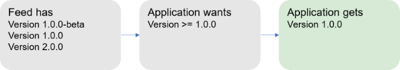
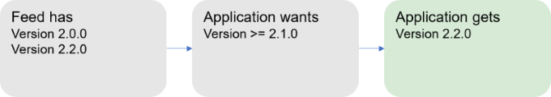
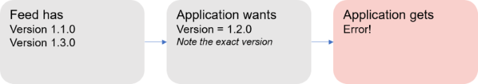
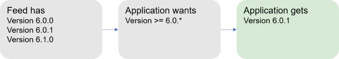
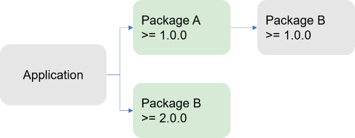
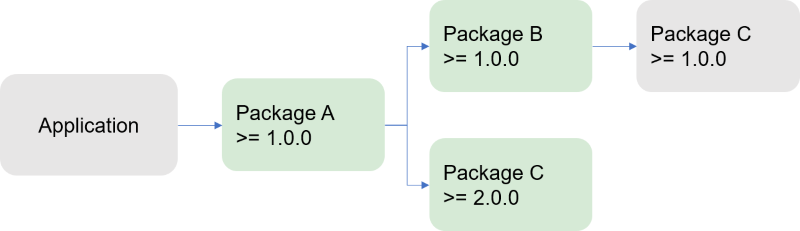
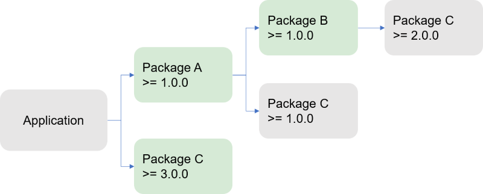
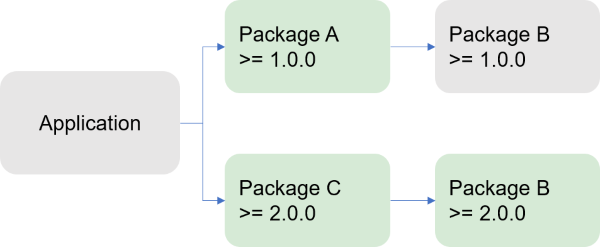
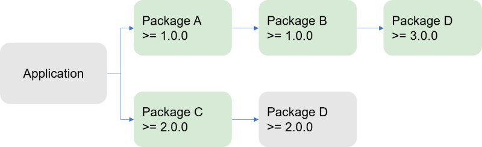
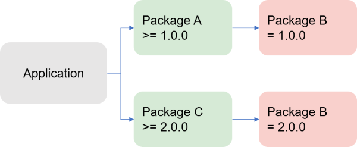

# How NuGet resolves package dependencies

Any time a package is installed or reinstalled, which includes being installed as part of a [restore](../consume-packages/package-restore.md) process, NuGet also installs any additional packages on which that first package depends.

Those immediate dependencies might then also have dependencies on their own, which can continue to an arbitrary depth. This produces what's called a *dependency graph* that describes the relationships between packages at all levels.

When multiple packages have the same dependency, then the same package ID can appear in the graph multiple times, potentially with different version constraints. However, only one version of a given package can be used in a project, so NuGet must choose which version is used. The exact process depends on the package management format being used.

## Dependency resolution with PackageReference

When installing packages into projects using the PackageReference format, NuGet adds references to a flat package graph in the appropriate file and resolves conflicts ahead of time. This process is referred to as *transitive restore*. Reinstalling or restoring packages is then a process of downloading the packages listed in the graph, resulting in faster and more predictable builds.

You can also take advantage of floating versions, such as 2.8.\*,  to avoid modifying the project to use the latest version of a package. When using floating versions, we recommend enabling the [lock file functionality](../consume-packages/package-references-in-project-files.md#locking-dependencies) to ensure repeatability.

When the NuGet restore process runs prior to a build, it resolves dependencies first in memory, then writes the resulting graph to a file called `project.assets.json`.

The assets file is located at `MSBuildProjectExtensionsPath`, which defaults to the project's 'obj' folder.
MSBuild then reads this file and translates it into a set of folders where potential references can be found, and then adds them to the project tree in memory.

The `project.assets.json` file is temporary and should not be added to source control. It's listed by default in both `.gitignore` and `.tfignore`. See [Packages and source control](../consume-packages/packages-and-source-control.md).

### Dependency resolution rules

Transitive restore applies four main rules to resolve dependencies: [lowest applicable version](#lowest-applicable-version), [floating versions](#floating-versions), [direct-dependency-wins](#direct-dependency-wins), and [cousin dependencies](#cousin-dependencies).

#### Lowest applicable version

The lowest applicable version rule restores the lowest possible version of a package as defined by its dependencies. It also applies to dependencies on the application or the class library unless declared as [floating](#floating-versions).

In the following figure, for example, 1.0-beta is considered lower than 1.0 so NuGet chooses the 1.0 version:



In the next figure, version 2.1 is not available on the feed but because the version constraint is >= 2.1 NuGet picks the next lowest version it can find, in this case 2.2:



When an application specifies an exact version number, such as 1.2, that is not available on the feed, NuGet fails with an error when attempting to install or restore the package:



#### Floating versions

A floating dependency version is specified with the \* character. For example, `6.0.*`. This version specification says "use the latest 6.0.x version"; `4.*` means "use the latest 4.x version." Using a floating version reduces changes to the project file, while keeping up to date with the latest version of a dependency.
Floating versions can only be specified at the project level.

When using a floating version, NuGet resolves the highest version of a package that matches the version pattern, for example `6.0.*` gets the highest version of a package that starts with 6.0:



> [!Note]
> For information on the behavior of floating versions and pre-release versions, see [Package versioning](package-versioning.md#version-ranges).

#### Direct dependency wins

When the package graph for an application contains different versions of a package in the same subgraph, and one of those versions is a direct dependency in that subgraph, that version would be chosen for that subgraph and the rest will be ignored.
This behavior allows an application to override any particular package version in the dependency graph.

In the example below, the application depends directly on Package B with a version constraint of >=2.0.0. The application also depends on Package A which in turn also depends on Package B, but with a >=1.0.0 constraint. Because the dependency on Package B 2.0.0 is direct dependency to the application in the graph, that version is used:



>[!Warning]
> The Direct dependency wins rule can result in a downgrade of the package version, thus potentially breaking other dependencies in the graph. When a package is downgraded, NuGet adds a [warning to alert the user](..\reference\errors-and-warnings\NU1605.md).

This rule also results in greater efficiency with a large dependency graph.
When a closer dependency in the same subgraph has a higher version than a further one, then NuGet ignores that dependency, and NuGet also ignores all remaining dependencies on that branch of the graph.

In the diagram below, for example, because Package C 2.0.0 is used, NuGet ignores any branches in that subgraph that refer to an earlier version of Package C:



Through this rule, NuGet tries to honor the intent of the package author.
In the diagram below, the author of Package A has explicitly downgraded to Package C 1.0.0 from Package C 2.0.0.


The application owner can choose to upgrade Package C to a version higher than 2.0.0, thus no further downgrading the version for Package C. In this case, no warning is raised.



#### Cousin dependencies

When different package versions are referred in different subgraphs in the graph from the application, NuGet uses the lowest version that satisfies all version requirements (as with the [lowest applicable version](#lowest-applicable-version) and [floating versions](#floating-versions) rules). In the image below, for example, version 2.0.0 of Package B satisfies the other >=1.0.0 constraint, and is thus used:



Note that the packages do not need to be on the same distance for the cousin dependencies rule to apply. In the diagram below, Package D 2.0.0 is chosen in the Package C subgraph and Package D 3.0.0 is chosen in the subgraph of Package A. In the Application subgraph, there is no direct dependency to Package D, so the the [lowest applicable version](#lowest-applicable-version) rule is applied and version 3.0.0 is chosen.



In some cases, it's not possible to meet all version requirements. As shown below, if Package A requires exactly Package B 1.0.0 and Package C requires Package B >=2.0.0, then NuGet cannot resolve the dependencies and gives an error.



In these situations, the top-level consumer (the application or package) should add its own direct dependency on Package B so that the [Direct dependency wins](#direct-dependency-wins) rule applies.

## Dependency resolution with packages.config

With `packages.config`, a project's dependencies are written to `packages.config` as a flat list. Any dependencies of those packages are also written in the same list. When packages are installed, NuGet might also modify the `.csproj` file, `app.config`, `web.config`, and other individual files.

With `packages.config`, NuGet attempts to resolve dependency conflicts during the installation of each individual package. That is, if Package A is being installed and depends on Package B, and Package B is already listed in `packages.config` as a dependency of something else, NuGet compares the versions of Package B being requested and attempts to find a version that satisfies all version constraints. Specifically, NuGet selects the lower *major.minor* version that satisfies dependencies.

By default, NuGet 2.8 looks for the lowest patch version (see [NuGet 2.8 release notes](../release-notes/nuget-2.8.md#patch-resolution-for-dependencies)). You can control this setting through the `DependencyVersion` attribute in `NuGet.Config` and the `-DependencyVersion` switch on the command line.  

The `packages.config` process for resolving dependencies gets complicated for larger dependency graphs. Each new package installation requires a traversal of the whole graph and raises the chance for version conflicts. When a conflict occurs, installation is stopped, leaving the project in an indeterminate state, especially with potential modifications to the project file itself. This is not an issue when using other package management formats.

## Managing dependency assets

When using the PackageReference format, you can control which assets from dependencies flow into the top-level project. For details, see [PackageReference](../consume-packages/package-references-in-project-files.md#controlling-dependency-assets).

When the top-level project is itself a package, you also have control over this flow by using the `include` and `exclude` attributes with dependencies listed in the `.nuspec` file. See [.nuspec Reference - Dependencies](../reference/nuspec.md#dependencies).

## Excluding references

There are scenarios in which assemblies with the same name might be referenced more than once in a project, producing design-time and build-time errors. Consider a project that contains a custom version of `C.dll`, and references Package C that also contains `C.dll`. At the same time, the project also depends on Package B which also depends on Package C and `C.dll`. As a result, NuGet can't determine which `C.dll` to use, but you can't just remove the project's dependency on Package C because Package B also depends on it.

To resolve this, you must directly reference the `C.dll` you want (or use another package that references the right one), and then add a dependency on Package C that excludes all its assets. This is done as follows depending on the package management format in use:

- [PackageReference](../consume-packages/package-references-in-project-files.md): add `ExcludeAssets="All"` in the dependency:

    ```xml
    <PackageReference Include="PackageC" Version="1.0.0" ExcludeAssets="All" />
    ```

- `packages.config`: remove the reference to PackageC from the `.csproj` file so that it references only the version of `C.dll` that you want.
    
## Dependency updates during package install 

If a dependency version is already satisfied, the dependency isn't updated during other package installations. For example, consider package A that depends on package B and specifies 1.0 for the version number. The source repository contains versions 1.0, 1.1, and 1.2 of package B. If A is installed in a project that already contains B version 1.0, then B 1.0 remains in use because it satisfies the version constraint. However, if package A had requests version 1.1 or higher of B, then B 1.2 would be installed. 

## Resolving incompatible package errors

During a package restore operation, you may see the error "One or more packages are not compatible..." or that a package "is not compatible" with the project's target framework.

This error occurs when one or more of the packages referenced in your project do not indicate that they support the project's target framework; that is, the package does not contain a suitable DLL in its `lib` folder for a target framework that is compatible with the project. (See [Target frameworks](../reference/target-frameworks.md) for a list.) 

For example, if a project targets `netstandard1.6` and you attempt to install a package that contains DLLs in only the `lib\net20` and `\lib\net45` folders, then you see messages like the following for the package and possibly its dependents:

```output
Restoring packages for myproject.csproj...
Package ContosoUtilities 2.1.2.3 is not compatible with netstandard1.6 (.NETStandard,Version=v1.6). Package ContosoUtilities 2.1.2.3 supports:
  - net20 (.NETFramework,Version=v2.0)
  - net45 (.NETFramework,Version=v4.5)
Package ContosoCore 0.86.0 is not compatible with netstandard1.6 (.NETStandard,Version=v1.6). Package ContosoCore 0.86.0 supports:
  - 11 (11,Version=v0.0)
  - net20 (.NETFramework,Version=v2.0)
  - sl3 (Silverlight,Version=v3.0)
  - sl4 (Silverlight,Version=v4.0)
One or more packages are incompatible with .NETStandard,Version=v1.6.
Package restore failed. Rolling back package changes for 'MyProject'.
```

To resolve incompatibilities, do one of the following:

- Retarget your project to a framework that is supported by the packages you want to use.
- Contact the author of the packages and work with them to add support for your chosen framework. Each package listing page on [nuget.org](https://www.nuget.org/) has a **Contact Owners** link for this purpose.
