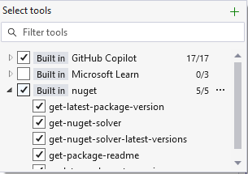
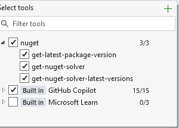
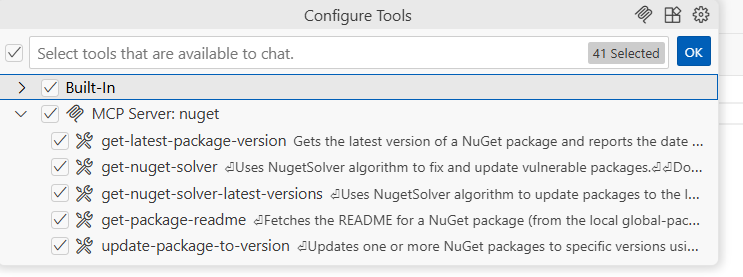
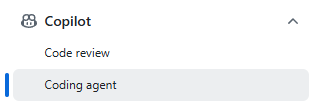

# Using the NuGet Model Context Protocol (MCP) Server

## Requirements

To run the MCP server, you must have **[.NET 10 SDK or later](https://dotnet.microsoft.com/en-us/download/dotnet/10.0)** installed.
This version of .NET adds a command, `dnx`, which is used to download, install, and run the MCP server from [nuget.org](https://nuget.org).

To verify your .NET version, run the following command in your terminal:
```bash
dotnet --info
```

## Getting started in Visual Studio 2026

In Visual Studio 2026, the NuGet MCP server is built-in but must be enabled once in order to use its functionality.

To enable the NuGet MCP server, follow these steps:
1. Open Visual Studio 2026.
1. Open the GitHub Copilot Chat window and make sure you are signed in.
1. Click the tools icon in the bottom toolbar to bring up the Tools menu.
1. Find the MCP server named "nuget" and check the box to enable it.



## Getting started in Visual Studio 2022

> [!NOTE]
> You must have Visual Studio 2022 17.14 or later in order to configure an MCP server.

In Visual Studio 2022, you must manually add the NuGet MCP server to your configuration.
There are several configuration files that Visual Studio 2022 uses to define MCP servers.
See [Use MCP Servers](/visualstudio/ide/mcp-servers) for more information on which file to configure.

Once you have identified the correct configuration file, add the following JSON snippet to your `mcp.json`:
```json
{
  "servers": {
    "nuget": {
      "type": "stdio",
      "command": "dnx",
      "args": [ "NuGet.Mcp.Server", "--source", "https://api.nuget.org/v3/index.json", "--yes" ]
    }
  }
}
```

This will configure Visual Studio 2022 to use the latest version of the NuGet MCP server from nuget.org.
To verify that the MCP server is working correctly, open the GitHub Copilot Chat window and make sure you are signed in.
Then click the Tools icon in the bottom toolbar to bring up the Tools menu.
You should see the MCP server named "nuget" in the list of available servers.



## Getting started in VS Code

To configure the NuGet MCP server in VS Code click the appropriate button below and it will be set up.

[](
https://vscode.dev/redirect/mcp/install?name=NuGet&config=%7B%22name%22%3A%22NuGet.Mcp.Server%22%2C%22command%22%3A%22dnx%22%2C%22args%22%3A%5B%22NuGet.Mcp.Server%22%2C%22--source%22%2C%20%22https%3A%2F%2Fapi.nuget.org%2Fv3%2Findex.json%22%2C%22--yes%22%5D%7D) [](https://vscode.dev/redirect/mcp/install?name=NuGet&config=%7B%22name%22%3A%22NuGet.Mcp.Server%22%2C%22command%22%3A%22dnx%22%2C%22args%22%3A%5B%22NuGet.Mcp.Server%22%2C%22--source%22%2C%22https%3A%2F%2Fapi.nuget.org%2Fv3%2Findex.json%22%2C%22--yes%22%5D%7D&quality=insiders)

> 

To verify that the MCP server is working correctly, open the GitHub Copilot Chat window and make sure you are signed in.
Then click the Tools icon in the bottom toolbar to bring up the Tools menu.
You should see the MCP server named "nuget" in the list of available servers.

## Getting started in GitHub Copilot Agent

You can also configure the MCP Server to work with GitHub Copilot as a Coding Agent in your repositories.
Ensure that you configured your repository to use [GitHub Copilot Coding Agents](https://github.com/settings/copilot/coding_agent).

Browse to your repository and click the Settings tab.
Expand the Copilot section and click on Coding Agents.



Scroll down to the **Model Context Protocol (MCP)** section and add the following JSON snippet to your `mcpServers` configuration:

```json
{ 
  "mcpServers": {
    "NuGet": {
      "type": "local",
      "command": "dnx",
      "args": ["NuGet.Mcp.Server", "--yes"],
      "tools": ["*"],
      "env": {}
    }
  } 
}
```

This will make all of NuGet's MCP server tools available. If you want specific tools, you can list them in the `"tools"` parameter array.

Finally, click the **Save MCP configuration** button to save your changes.

Now that the NuGet MCP is configured, you will also need to create a GitHub Actions workflow to install .NET 10 Preview 6 or higher so that the `dnx` command is available to run the MCP server.
You can do this by creating the following workflow file in your repository at

`.github/workflows/copilot-setup-steps.yml`

The contents of this workflow file should be as follows:

```yml
name: "Copilot Setup Steps"

# Automatically run the setup steps when they are changed to allow for easy validation, and
# allow manual testing through the repository's "Actions" tab
on:
  workflow_dispatch:
  push:
    paths:
      - .github/workflows/copilot-setup-steps.yml
  pull_request:
    paths:
      - .github/workflows/copilot-setup-steps.yml

jobs:
  # The job MUST be called `copilot-setup-steps` or it will not be picked up by Copilot.
  copilot-setup-steps:
    runs-on: ubuntu-latest

    # Set the permissions to the lowest permissions possible needed for your steps.
    # Copilot will be given its own token for its operations.
    permissions:
      # If you want to clone the repository as part of your setup steps, for example to install dependencies, you'll need the `contents: read` permission. If you don't clone the repository in your setup steps, Copilot will do this for you automatically after the steps complete.
      contents: read

    # You can define any steps you want, and they will run before the agent starts.
    # If you do not check out your code, Copilot will do this for you.
    steps:
      - name: Install .NET 10.x
        uses: actions/setup-dotnet@v5
        with:
          dotnet-version: |
            10.x
          dotnet-quality: preview

      - name: dotnet --info
        run: dotnet --info
```

This will ensure that the `dnx` command is available to run the NuGet MCP server when GitHub Copilot runs as a coding agent in your repository.

## Fixing package vulnerabilities

The NuGet MCP server can help you identify and fix package vulnerabilities in your project.
To use the MCP server to fix vulnerabilities, enter the following prompt in the GitHub Copilot Chat window:

> Fix my package vulnerabilities

The MCP server will analyze your project's dependencies and suggest updates to packages that have known vulnerabilities.

## Updating all packages

The NuGet MCP server can also update your packages to the latest compatible versions.
To use the MCP server to update all packages, enter the following prompt in the GitHub Copilot Chat window:

> Update all my packages to the latest compatible versions

The MCP server will analyze your project's target framework(s) and suggest updates to the latest version of packages that are compatible with your project.

## Update a package to a specific version

The NuGet MCP server can update a specific package to a version you specify.
To do so, enter the following prompt in the GitHub Copilot Chat window:

> Update the package [PackageName] to version [VersionNumber]

## Support

If you experience an issue with the NuGet MCP server or have any other feedback, please open an issue on the [NuGet GitHub repository](https://github.com/NuGet/Home/issues/new?template=MCPSERVER.yml).
Please provide the requested information in the issue template so that we can better understand and address your issue or suggestion.