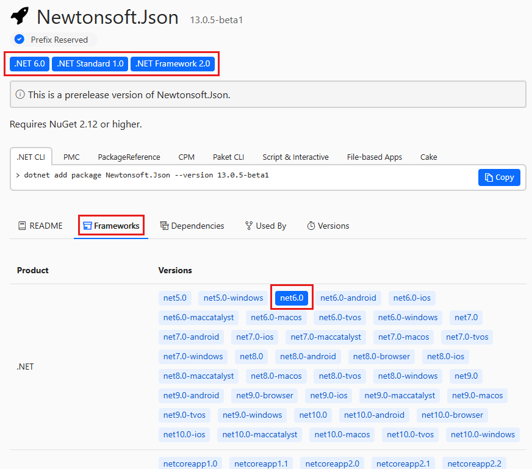

# Find and evaluate NuGet packages for your project

When you start a .NET project, or identify a functional need for your app or service, you can often install existing NuGet packages to save the time and trouble of [creating your own packages](overview-and-workflow.md). Existing packages can come from the [nuget.org](https://www.nuget.org/packages) public collection, or from private sources that your organization or another party provide.

## Find packages

You can find and install packages directly from [https://nuget.org/packages](https://www.nuget.org/packages), or from the [Visual Studio Package Manager UI](install-use-packages-visual-studio.md) or [Package Manager Console](install-use-packages-powershell.md) with nuget.org as a source. All packages from nuget.org are routinely scanned for viruses.

At [nuget.org/packages](https://www.nuget.org/packages), you see a list of NuGet packages with the most popular packages across all .NET projects first. Some of these packages might be useful for your projects.

To search for a package, enter the package name or search terms in the Search box at the top of the page. You can use [advanced search syntax](#search-syntax) to filter your search.

### Search syntax

Search queries at nuget.org, from the NuGet CLI, and from within Visual Studio all use the same syntax. Other package sources, like Azure Artifacts or GitHub Package Repository, might use different syntax or might not support advanced filtering.

- You can apply a search term to a specific property by using the syntax `<property>:<term>`, where `<property>` can be `id`, `packageid`, `version`, `title`, `tags`, `author`, `description`, `summary`, or `owner`.

- Search applies to keywords and package descriptions, and is case-insensitive. For example, the following strings all search the `id` property for strings that contain `nuget.core`:

  `id:NuGet.Core`
  `ID:nuget.core`
  `Id:NUGET.CORE`

- Searches on the `id` property match substrings, while `packageid` and `owner` use exact, case-insensitive matches. For example:

  `PackageId:jquery` searches for the exact package ID `jquery`.
  `Id:jquery` searches for all package IDs that contain the string `jquery`.

- You can search for multiple values or properties at the same time. For example:

  `id:jquery id:ui` searches for multiple terms in the `id` property.
  `id:jquery tags:validation` searches multiple properties.

- Search ignores unsupported properties, so `invalid:jquery ui` is the same as searching for `ui`.

### Advanced search at nuget.org

At nuget.org, you can select the **Filter** button at upper-right to expand advanced search sorting and filtering options.

Use the **Package type** filter to show packages of a specific type:

- **All types** is the default and shows all packages regardless of type.
- **Dependency** filters to regular NuGet packages that you can install into your project.
- **.NET tool** filters to [.NET tools](/dotnet/core/tools/global-tools) packages that contain console applications.
- **Template** filters to [.NET templates](/dotnet/core/install/templates) that you can use to create new projects with the [dotnet new](/dotnet/core/tools/dotnet-new) command.

Use the **Sort by** option to sort the search results by several criteria:

- **Relevance** is the default, and sorts results according to an internal scoring algorithm.
- **Downloads** sorts the search results by the total number of downloads, in descending order.
- **Recently updated** sorts the search results by the latest package version creation date, in descending chronological order.

In the **Options** section, deselect the **Include prerelease** checkbox to list only stable, released package versions. By default, NuGet lists all versions of packages, including prereleases.

To apply options, select **Apply**. To get back to the defaults, select **Reset**.

### Determine supported frameworks

NuGet installs a package into a project only if the package's supported .NET frameworks include the project's target frameworks. If the package isn't compatible, NuGet issues an error.

There are several ways to determine supported frameworks for packages:

- On the package's page at nuget.org, supported frameworks show below the package ID, or on the **Frameworks** tab. Not all packages show supported frameworks.

  

- Download the package from nuget.org by selecting **Download package** under **About**. Change the downloaded file extension from *.nupkg* to *.zip*, open the *.zip* folder, and examine its *lib* folder. There are subfolders for each supported framework, each named with a target framework moniker (TFM). For more information, see [Target Frameworks](../reference/target-frameworks.md). If there aren't any subfolders under *lib* and there's only a single DLL, try to install the package to discover its compatibility.

- Try to install the package into a project by using [Install-Package](../reference/ps-reference/ps-ref-install-package.md) in the Visual Studio Package Manager Console. If the package is incompatible, the output shows its supported frameworks.

### Prerelease packages

Many package authors provide preview and beta releases as they continue to improve and seek feedback on latest revisions. By default, nuget.org shows prerelease packages in its package list and search results.

To list and search only stable releases:

  - At nuget.org, deselect the **Include prerelease** checkbox in the advanced search panel.
  - In the Visual Studio NuGet Package Manager UI, deselect the **Include prerelease** checkbox next to the Search box.

The Visual Studio Package Manager Console, NuGet CLI, and dotnet CLI tools don't include prerelease versions by default. To include prerelease versions:

- In the Package Manager Console, use the `-IncludePrerelease` switch with the `Find-Package`, `Get-Package`, `Install-Package`, `Sync-Package`, and `Update-Package` commands. For more information, see the [PowerShell Reference](../reference/powershell-reference.md).

- For the NuGet CLI, use the `-prerelease` switch with the `install`, `update`, `delete`, and `mirror` commands. For more information, see the [NuGet CLI reference](../reference/nuget-exe-cli-reference.md).

- For the dotnet CLI, specify a prerelease version with the `-v` argument. For more information, see the [dotnet add package reference](/dotnet/core/tools/dotnet-add-package).

### Native C++ packages

Visual Studio C++ projects can use native C++ NuGet packages. Installing these packages enables the **Manage NuGet Packages** context-menu command, introduces a `native` target framework, and provides MSBuild integration.

To find native packages on [nuget.org](https://www.nuget.org/packages), search by using `tag:native`. Such packages typically provide *.targets* and *.props* files, which NuGet imports automatically when adding the packages.

## Evaluate packages

The best way to evaluate a package's usefulness is to try it out. You take a dependency on a package when you use it, so you must make sure it's robust and reliable. However, installing a package and directly testing it is time-consuming. You can learn a lot about a package's quality by using the information on the package's page at nuget.org.

- The **Prefix Reserved** checkmark next to the package ID on the packages listing and the package page means the package owners have applied for and been granted a [reserved package ID prefix](../nuget-org/id-prefix-reservation.md). To meet the [ID prefix reservation criteria](../nuget-org/id-prefix-reservation.md#id-prefix-reservation-criteria), package owners must clearly identify themselves and their packages.

- **Downloads** in the package page's right column shows **Total**, **Current version**, and **Per day average** downloads. Large numbers indicate that the package has proven itself among many developers.

  
  
  Select **Full stats** next to **Downloads** to see a page that shows package downloads for the past six weeks by version number. Packages that more developers are actively using are typically better choices.

- The **Used By** tab on the package page shows the top five most popular nuget.org packages and GitHub repositories that depend on this package. Packages and repos that depend on this package are called *dependents*. Dependent packages and repos can be seen as endorsing this package, because they chose to trust and depend on it.

  
  
  The *latest stable version* of a dependent package must depend on any version of this package. This definition ensures that listed dependent packages are an up-to-date reflection of package authors' decisions to trust and depend on the package. The list doesn't show prerelease dependents, because they're not considered wholehearted endorsements yet. The following examples show which packages list as dependents:

  | Dependent package version | Dependent package listed as a dependent? |
  |-|-|
  | v1.0.0 v1.1.0 (latest stable) depends on this package v1.2.0-preview | TRUE, latest stable version depends on this package |
  | v1.0.0 depends on this package v1.1.0 (latest stable) v1.2.0-preview | FALSE, latest stable version doesn't depend on this package |
  | v1.0.0 depends on this package v1.1.0 (latest stable) v1.2.0-preview depends on this package | FALSE, latest stable version doesn't depend on this package |

  The number of stars for a GitHub repository indicates its popularity with GitHub users. For more information about the GitHub star and repository ranking system, see [About stars](https://help.github.com/github/getting-started-with-github/saving-repositories-with-stars#about-stars).

  > [!Note]
  > The **Used By** section is automatically generated periodically, without human review, and solely for informational purposes.

- The **Versions** tab on the package page shows the **Versions**, **Downloads**, **Last Updated** dates, and serious vulnerabilities of package versions. The version you install shouldn't have any high-severity vulnerabilities. A well-maintained package has recent updates and a long version history. Neglected packages have few and long-ago updates.

  

The right column of the package page has other informative links:

  

- Select **Project website**, if available, to see what support options the author provides. A project with a dedicated site is generally well supported.

- Select any of the package owners under **Owners** to see other packages they've published. Owners with multiple packages are more likely to continue supporting their work. Select **Contact owners** next to **Owners** to reach out directly to the package developers.

- Select **Source repository** to go to the Git source code repository for the package. Many packages are maintained in open-source repositories, so users can directly contribute bug fixes and feature improvements. The package's contribution history is also a good indicator of how many developers are actively involved.

- Select **<license type> license** to see the package's MIT or other license. If a package doesn't specify license terms, contact the package owner.

### Retrieve license information

Some NuGet clients and NuGet feeds might not be able to surface licensing information. To maintain backward compatibility in such cases, the license URL points to this document about how to retrieve the license information.

If selecting the license URL for a package brings you to this page, it implies the package contains a license file and:

- You're connected to a feed that doesn't know how to interpret and surface the license information to the client, or
- You're using a client that doesn't know how to interpret and read the license information the feed provides, or
- A combination of both of these scenarios.

To read the information in the license file inside the package:

1. Manually download the package, and unzip its contents to a folder.
1. Open the *.nuspec* file at the root of the folder.
1. Examine the `<license>` tag, such as `<license type="file">license\license.txt</license>`. The example tag states that the license file is named *license.txt* and is inside a subfolder called *license*.
1. Navigate to the specified location and open the specified file.

For information about the MSBuild equivalent to setting the license in the *.nuspec*, see [Packing a license expression or a license file](../reference/msbuild-targets.md#packing-a-license-expression-or-a-license-file).

## Next steps

- [Install and manage packages in Visual Studio using the NuGet Package Manager](install-use-packages-visual-studio.md)
- [Install and manage packages with the Package Manager Console in Visual Studio](install-use-packages-powershell.md)
- [Install and manage packages with the dotnet CLI](install-use-packages-dotnet-cli.md)
