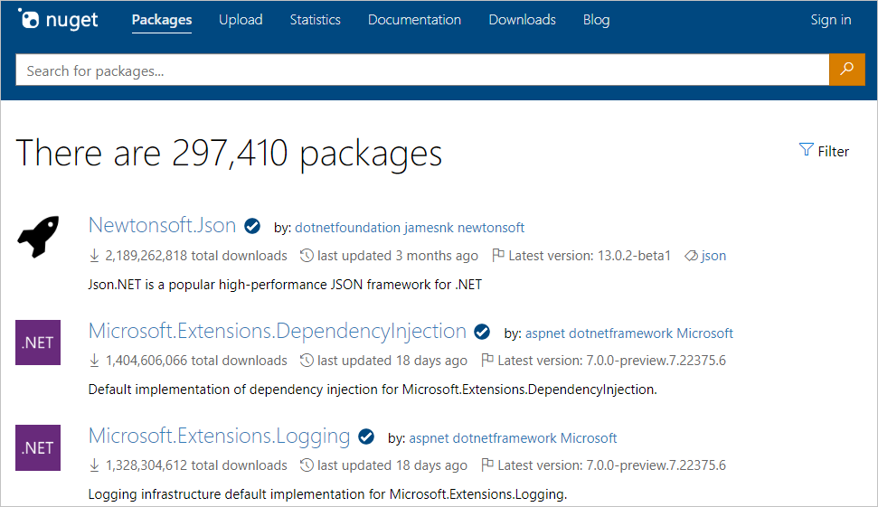
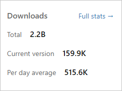

# Finding and evaluating NuGet packages for your project

When starting any .NET project, or whenever you identify a functional need for your app or service, you can save yourself lots of time and trouble by using existing NuGet packages that fulfill that need. These packages can come from the public collection on [nuget.org](https://www.nuget.org/packages/), or a private source that's provided by your organization or another third party.

## Finding packages

When you visit nuget.org or open the Package Manager UI in Visual Studio, you see a list of packages sorted by relevancy. This shows you the most widely used packages across all .NET projects. There's a good chance that some of these packages may be useful for your own projects!



On nuget.org, notice the **Filter** button on the upper right of the page. When clicked, the Advanced Search panel expands to present sorting and filtering options.


You can use the **Package type** filter to show packages of a specific type:
- **`All types`**: This is the default behavior. It shows all packages regardless of their type.
- **`Dependency`**: Regular NuGet packages that can be installed into your project.
- **`.NET tool`**: This filters to [.NET tools](/dotnet/core/tools/global-tools), a NuGet package that contains a console application.
- **`Template`**: This filters to [.NET templates](/dotnet/core/install/templates), which can be used to create new projects using the [`dotnet new`](/dotnet/core/tools/dotnet-new) command.

You can use the **Sort by** option to sort the search results:
- **`Relevance`**: This is the default behavior. It sorts results according to an internal scoring algorithm.
- **`Downloads`**: Sorts the search results by the total number of downloads, in descending order.
- **`Recently updated`**: Sorts the search results by their latest version's creation date, in descending chronological order.

In the **Options** section, we can find the **`Include prerelease`** checkbox.
When checked, nuget.org shows all versions of packages including pre-releases. To show only stable versions, clear the option.

To apply the search filters, click on the **`Apply`** button. You can always get back to the default behavior by clicking on the **`Reset`** button.

You can also use the [search syntax](#search-syntax) to filter on tags, owners, and package IDs.

### Does the package support my project's target framework?

NuGet installs a package into a project only if that package's supported frameworks include the project's target framework. If the package is not compatible, NuGet issues an error.

Some packages list their supported frameworks directly in the nuget.org gallery, but because such data is not required, many packages do not include that list. At present there is no means to search nuget.org for packages that support a specific target framework (the feature is under consideration, see [NuGet Issue 2936](https://github.com/NuGet/NuGetGallery/issues/2936)).

Fortunately, you can determine supported frameworks through two other means:

1. Attempt to install a package into a project using the [`Install-Package`](../reference/ps-reference/ps-ref-install-package.md) command in the NuGet Package Manager Console. If the package is incompatible, this command shows you the package's supported frameworks.

1. Download the package from its page on nuget.org using the **Manual download** link under **Info**. Change the extension from `.nupkg` to `.zip`, and open the file to examine the content of its `lib` folder. There you see subfolders for each of the supported frameworks, where each subfolder is named with a target framework moniker (TFM; see [Target Frameworks](../reference/target-frameworks.md)). If you see no subfolders under `lib` and only a single DLL, then you must attempt to install the package in your project to discover its compatibility.

## Pre-release packages

Many package authors make preview and beta releases available as they continue to make improvements and seek feedback on their latest revisions.

By default, nuget.org shows pre-release packages in search results. To search only stable releases, clear the **Include prerelease** option in the Advanced Search panel that is accessible from the **Filter** button on the upper right of the page


In Visual Studio, and when using the NuGet and dotnet CLI tools, NuGet does not include pre-release versions by default. To change this behavior, do the following steps:

- **Package Manager UI in Visual Studio**: In the **Manage NuGet Packages** UI, set the **Include prerelease** box. Setting or clearing this box refreshes the Package Manager UI and the list of available versions you can install.

    

- **Package Manager Console**: Use the `-IncludePrerelease` switch with the `Find-Package`, `Get-Package`, `Install-Package`, `Sync-Package`, and `Update-Package` commands. Refer to the [PowerShell Reference](../reference/powershell-reference.md).

- **nuget.exe CLI**: Use the `-prerelease` switch with the `install`, `update`, `delete`, and `mirror` commands. Refer to the [NuGet CLI reference](../reference/nuget-exe-cli-reference.md)

- **dotnet.exe CLI**: Specify the exact pre-release version using the `-v` argument. Refer to the [dotnet add package reference](/dotnet/core/tools/dotnet-add-package).

<a name="native-cpp-packages"></a>

### Native C++ packages

NuGet supports native C++ packages can that can be used in C++ projects in Visual Studio. This enables the **Manage NuGet Packages** context-menu command for projects, introduces a `native` target framework, and provides MSBuild integration.

To find native packages on [nuget.org](https://www.nuget.org/packages), search using `tag:native`. Such packages typically provide `.targets` and `.props` files, which NuGet imports automatically when the package is added to a project.

## Evaluating packages

The best way to evaluate the usefulness of a package is to download it and try it out in your code (all packages on nuget.org are routinely scanned for viruses, by the way). After all, every highly popular package got started with only a few developers using it, and you might be one of the early adopters!

At the same time, using a NuGet package means taking a dependency on it, so you want to make sure it's robust and reliable. Because installing and directly testing a package is time-consuming, you can also learn a lot about a package's quality by using the information on a package's listing page:

- **Downloads statistics**: on the package page on nuget.org, the **Statistics** section shows total downloads, downloads of the most recent version, and average downloads per day. Larger numbers indicate that many other developers have taken a dependency on the package, which means that it has proven itself.

    

- **Used By**: on the package page, the **Used By** section lists the top 5 most popular NuGet.org packages and popular GitHub repositories that depend on this package. Packages and repos that depend on this package can be called "dependents" of this package. Dependent packages and repos can be seen as "endorsements" of this package, as package authors have chosen to trust and depend on it.
  - A dependent package must depend on *any version* of this package in its *latest stable listed version*. This definition ensures that displayed dependent packages are an up-to-date reflection of package author's decision to trust and depend on this package. Prerelease dependents are not listed as they are not considered whole-hearted endoresements yet. See the following table for examples:

    | Package A versions | Package A is a listed as a dependent of Package B? |
    |-|-|
    | v1.0.0<br>v1.1.0 (latest stable) --> Package B<br>v1.2.0-preview | TRUE, latest stable version depends on Package B |
    | v1.0.0 --> Package B<br>v1.1.0 (latest stable)<br>v1.2.0-preview | FALSE, latest stable version does not depend on Package B |
    | v1.0.0 --> Package B<br>v1.1.0 (latest stable)<br>v1.2.0-preview --> Package B | FALSE, latest stable version does not depend on Package B |

  - A GitHub repository's number of stars generally indicates how popular that repository is with GitHub users (more stars usually means more popular). Please visit [GitHub's Getting Started page](https://help.github.com/en/github/getting-started-with-github/saving-repositories-with-stars#about-stars) for more information on GitHub's star and repository ranking system.

    

    > [!Note]
    > A package's Used By section is generated automatically, periodically, without human review of individual repositories, and solely for informational purposes in order to show you NuGet.org packages and popular GitHub repositories that depend on the package.

- **Version History**: on the package page, look under **Info** for the date of the most recent update and examine the **Version History**. A well-maintained package has recent updates and a rich version history. Neglected packages have few updates and often haven't been updated in some time.

    

- **Recent installs**: on the package page under **Statistics**, select **View full stats**. The full stats page shows the package installs over the last six weeks by version number. A package that other developers are actively using is typically a better choice than one that's not.

- **Support**: on the package page under **Info**, select **Project Site** (if available) to see what support options the author provides. A project with a dedicated site is generally better supported.

- **Developer history**: on the package page under **Owners**, select an owner to see what other packages they've published. Those with multiple packages are more likely to continue supporting their work in the future.

- **Open source contributions**: many packages are maintained in open-source repositories, making it possible for developers depending on them to directly contribute bug fixes and feature improvements. The contribution history of any given package is also a good indicator of how many developers are actively involved.

- **Interview the owners**: new developers can certainly be equally committed to producing great packages for you to use, and it's good to give them a chance to bring something new to the NuGet ecosystem. With this in mind, reach out directly to the package developers through the **Contact Owners** option under **Info** on the listing page. Chances are, they'll be happy to work with you to serve your needs!

- **Reserved Package ID Prefixes**: many package owners have applied for and have been granted a [reserved package ID prefix](../nuget-org/id-prefix-reservation.md). When you see the visual checkmark next to a package ID on [nuget.org](https://www.nuget.org/), or in Visual Studio, that means that the package owner has met our [criteria](../nuget-org/id-prefix-reservation.md#id-prefix-reservation-criteria) for ID prefix reservation. This means the package owner is being clear on identifying themselves and their package.

> [!Note]
> Always be mindful of a package's license terms, which you can see by selecting **License Info** on a package's listing page on nuget.org. If a package does not specify license terms, contact the package owner directly using the **Contact owners** link on the package page. Microsoft does not license any intellectual property to you from third party package providers and is not responsible for information provided by third parties.

## License URL deprecation
As we transition from [licenseUrl](../reference/nuspec.md#licenseurl) to [license](../reference/nuspec.md#license), some NuGet clients and NuGet feeds may not yet have the ability to surface licensing information in some cases. To maintain backward compatibility, the license URL points to this document which talks about how to retrieve the license information in such cases.

If clicking on the license URL for a package brought you to this page, it implies the package contains a license file and
* You are connected to a feed that does not yet know how to interpret and surface the new license information to the client
**OR**
* You are using a client that does not yet know how to interpret and read the new license information that is potentially provided by the feed
**OR**
* A combination of both

Here is how you could read the information contained in the license file inside the package:
1. Download the NuGet package, and unzip its contents to a folder.
1. Open the `.nuspec` file which would be at the root of that folder.
1. It should have a tag like `<license type="file">license\license.txt</license>`. This implies the license file is named `license.txt` and it is inside a folder called `license` which would also be at the root of that folder.
1. Navigate to the `license` folder and open the `license.txt` file.

For the MSBuild equivalent to setting the license in the `.nuspec`, take a look at [Packing a license expression or a license file](../reference/msbuild-targets.md#packing-a-license-expression-or-a-license-file).

## Search Syntax

Search queries on nuget.org, from the NuGet CLI, and within the NuGet Package Manager extension in
Visual Studio, all use the same syntax. In general, search is applied to keywords as well as package descriptions.

- **Advanced Filtering**: You can apply a search term to a specific property by using the syntax `<property>:<term>` where
  `<property>` (case-insensitive) can be `id`, `packageid`, `version`, `title`, `tags`, `author`, `description`,
  `summary`, and `owner`. You can search for multiple properties at the same time. Searches on the `id` property are
  substring matches, whereas `packageid` and `owner` uses an exact, case-insensitive match. Examples:

```
PackageId:jquery             # Match the package ID in an exact, case-insensitive manner

owner:microsoft              # Match the owner in an exact, case-insensitive manner

id:NuGet.Core                # Match any part of the ID property
Id:"Nuget.Core"
ID:jQuery
id:jquery id:ui              # Search for multiple terms in the ID
id:jquery tags:validation    # Search multiple properties

invalid:jquery ui            # Unsupported properties are ignored, so this
                             # is the same as searching on ui
```

> [!Note]
> This advanced filtering syntax is supported by nuget.org. Other package sources, like Azure Artifacts or GitHub Package Repository, may use different syntax or may not support advanced filtering.
