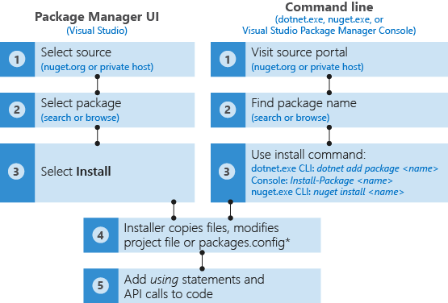
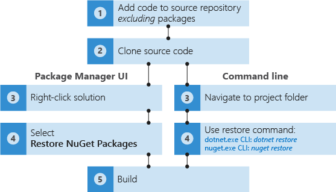

# Package consumption workflow

Between nuget.org and private package galleries that your organization might establish, you can find tens of thousands of highly useful packages to use in your apps and services. But regardless of the source, consuming a package follows the same general workflow.

\* _Visual Studio and `dotnet.exe` only. The `nuget install` command does not modify project files or `packages.config`, so entries must be added manually._

For further details, see [Finding and Choosing Packages](../consume-packages/finding-and-choosing-packages.md) and [Different ways to install a NuGet package](ways-to-install-a-package.md).

NuGet remembers the identity and version number of each installed package, recording it in either [`packages.config`](../reference/packages-config.md) or the project file (using [PackageReference](../consume-packages/package-references-in-project-files.md)), depending on project type and your version of NuGet. With NuGet 4.0+, PackageReference is preferred, although this is configurable in Visual Studio through the [Package Manager UI options](../tools/package-manager-ui.md). In any case, you can look in the appropriate file at any time to see the full list of dependencies for your project.

> [!Tip]
> It's prudent to always check the license for each package you intend to use in your software. On nuget.org, you find a **License Info** link on the right side of each package's description page. If a package does not specify license terms, contact the package owner directly using the **Contact owners** link on the package page. Microsoft does not license any intellectual property to you from third party package providers and is not responsible for information provided by third parties.

When installing packages, NuGet typically checks if the package is already available from its cache. You can manually clear this cache from the command line, as described on [Managing the global packages and cache folders](../consume-packages/managing-the-global-packages-and-cache-folders.md).

NuGet also makes sure that the target frameworks supported by the package are compatible with your project. If the package does not contain compatible assemblies, NuGet displays an error. See [Resolving incompatible package errors](dependency-resolution.md#resolving-incompatible-package-errors).

When adding project code to a source repository, you typically don't include NuGet packages. Those who later clone the repository or otherwise acquire the project, including build agents on systems like Visual Studio Team Services, must restore the necessary packages prior to running a build:

[Package Restore](../consume-packages/package-restore.md) uses the information in the project file or `packages.config` to reinstall all dependencies. Note that there are differences in the process involved, as described in [Dependency Resolution](../consume-packages/dependency-resolution.md).

Occasionally it's necessary to reinstall packages that are already included in a project, which may also reinstall dependencies. This is easy to do using the `nuget reinstall` command or the NuGet Package Manager Console. For details, see [Reinstalling and Updating Packages](../consume-packages/reinstalling-and-updating-packages.md).

Finally, NuGet's behavior is driven by `Nuget.Config` files. Multiple files can be used to centralize certain settings at different levels, as explained in [Configuring NuGet Behavior](../consume-packages/configuring-nuget-behavior.md).

Enjoy your productive coding with NuGet packages!
