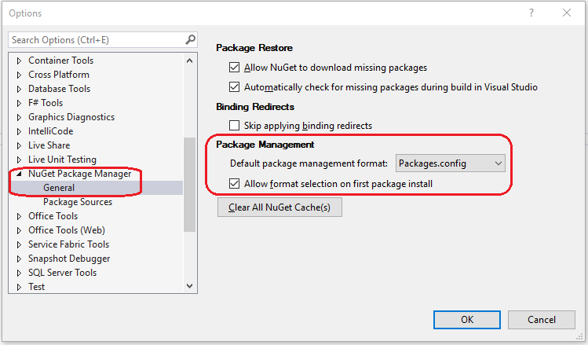

# Restore packages using Package Restore

To promote a cleaner development environment and to reduce repository size, NuGet **Package Restore** installs all of a project's dependencies listed in either the project file or `packages.config`. The .NET Core 2.0+ `dotnet build` and `dotnet run` commands do an automatic package restore. Visual Studio can restore packages automatically when it builds a project, and you can restore packages at any time through Visual Studio, `nuget restore`, `dotnet restore`, and xbuild on Mono.

Package Restore makes sure that all a project's dependencies are available, without having to store them in source control. To configure your source control repository to exclude the package binaries, see [Packages and source control](../consume-packages/packages-and-source-control.md). 

## Package Restore overview

Package Restore first installs the direct dependencies of a project as needed, then installs any dependencies of those packages throughout the entire dependency graph.

If a package isn't already installed, NuGet first attempts to retrieve it from the [cache](../consume-packages/managing-the-global-packages-and-cache-folders.md). If the package isn't in the cache, NuGet tries to download the package from all enabled sources in the list at **Tools** > **Options** > **NuGet Package Manager** > **Package Sources** in Visual Studio. During restore, NuGet ignores the order of package sources, and uses the package from whichever source is first to respond to requests. For more information about how NuGet behaves, see [Common NuGet configurations](Configuring-NuGet-Behavior.md). 

> [!Note]
> NuGet doesn't indicate a failure to restore a package until all the sources have been checked. At that time, NuGet reports a failure for only the last source in the list. The error implies that the package wasn't present on *any* of the other sources, even though errors aren't shown for each of those sources individually.

## Restore packages

Package Restore tries to install all package dependencies to the correct state matching the package references in your project file (*.csproj*) or your *packages.config* file. (In Visual Studio, the references appear in Solution Explorer under the **Dependencies \ NuGet** or the **References** node.)

1. If the package references in your project file are correct, use your preferred tool to restore packages.

   - [Visual Studio](#restore-using-visual-studio) ([automatic restore](#restore-packages-automatically-using-visual-studio) or [manual restore](#restore-packages-manually-using-visual-studio))
   - [dotnet CLI](#restore-using-the-dotnet-cli)
   - [nuget.exe CLI](#restore-using-the-nugetexe-cli)
   - [MSBuild](#restore-using-msbuild)
   - [Azure Pipelines](#restore-using-azure-pipelines)
   - [Azure DevOps Server](#restore-using-azure-devops-server)

   If the package references in your project file (*.csproj*) or your *packages.config* file are incorrect (they do not match your desired state following Package Restore), then you need to either install or update packages instead.

   For projects using PackageReference, after a successful restore, the package should be present in the *global-packages* folder and the `obj/project.assets.json` file is recreated. For projects using `packages.config`, the package should appear in the project's `packages` folder. The project should now build successfully. 

2. After running Package Restore, if you still experience missing packages or package-related errors (such as error icons in Solution Explorer in Visual Studio), you may need to follow instructions described in [Troubleshooting Package Restore errors](package-restore-troubleshooting.md) or, alternatively, [reinstall and update packages](../consume-packages/reinstalling-and-updating-packages.md).

   In Visual Studio, the Package Manager Console provides several flexible options for reinstalling packages. See [Using Package-Update](reinstalling-and-updating-packages.md#using-update-package).

## Restore using Visual Studio

In Visual Studio on Windows, either:

- Restore packages automatically, or

- Restore packages manually

### Restore packages automatically using Visual Studio

Package Restore happens automatically when you create a project from a template or build a project, subject to the options in [Enable and disable package restore](#enable-and-disable-package-restore-in-visual-studio). In NuGet 4.0+, restore also happens automatically when you make changes to a SDK-style project (typically a .NET Core or .NET Standard project).

1. Enable automatic package restore by choosing **Tools** > **Options** > **NuGet Package Manager**, and then selecting **Automatically check for missing packages during build in Visual Studio** under **Package Restore**.

   For non-SDK-style projects, you first need to select **Allow NuGet to download missing packages** to enable the automatic restore option.

1. Build the project.

   If one or more individual packages still aren't installed properly, **Solution Explorer** shows an error icon. Right-click and select **Manage NuGet Packages**, and use **Package Manager** to uninstall and reinstall the affected packages. For more information, see [Reinstall and update packages](../consume-packages/reinstalling-and-updating-packages.md)

   If you see the error "This project references NuGet package(s) that are missing on this computer," or "One or more NuGet packages need to be restored but couldn't be because consent has not been granted," [enable automatic restore](#enable-and-disable-package-restore-in-visual-studio). For older projects, also see [Migrate to automatic package restore](#migrate-to-automatic-package-restore-visual-studio). Also see [Package Restore troubleshooting](Package-restore-troubleshooting.md).

### Restore packages manually using Visual Studio

1. Enable package restore by choosing **Tools** > **Options** > **NuGet Package Manager**. Under **Package Restore** options, select **Allow NuGet to download missing packages**.

1. In **Solution Explorer**, right click the solution and select **Restore NuGet Packages**.

   If one or more individual packages still aren't installed properly, **Solution Explorer** shows an error icon. Right-click and select **Manage NuGet Packages**, and then use **Package Manager** to uninstall and reinstall the affected packages. For more information, see [Reinstall and update packages](../consume-packages/reinstalling-and-updating-packages.md)

   If you see the error "This project references NuGet package(s) that are missing on this computer," or "One or more NuGet packages need to be restored but couldn't be because consent has not been granted," [enable automatic restore](#enable-and-disable-package-restore-in-visual-studio). For older projects, also see [Migrate to automatic package restore](#migrate-to-automatic-package-restore-visual-studio). Also see [Package Restore troubleshooting](Package-restore-troubleshooting.md).

### Enable and disable package restore in Visual Studio

In Visual Studio, you control Package Restore primarily through **Tools** > **Options** > **NuGet Package Manager**:


- **Allow NuGet to download missing packages** controls all forms of package restore by changing the `packageRestore/enabled` setting in the [packageRestore section](../reference/nuget-config-file.md#packagerestore-section) of the `NuGet.Config` file, at `%AppData%\NuGet\` on Windows, or `~/.nuget/NuGet/` on Mac/Linux. This setting also enables the **Restore NuGet Packages** command on the solution's context menu in Visual Studio, .

    ```xml
    <configuration>
        <packageRestore>
            <!-- The 'enabled' key is True when the "Allow NuGet to download missing packages" checkbox is set.
                 Clearing the box sets this to False, disabling command-line, automatic, and MSBuild-integrated restore. -->
            <add key="enabled" value="True" />
        </packageRestore>
    </configuration>
    ```
    
  > [!Note]
  > To globally override the `packageRestore/enabled` setting, set the environment variable **EnableNuGetPackageRestore** with a value of True or False before launching Visual Studio or starting a build.

- **Automatically check for missing packages during build in Visual Studio** controls automatic restore by changing the `packageRestore/automatic` setting in the [packageRestore section](../reference/nuget-config-file.md#packagerestore-section) of the `NuGet.Config` file. When this option is set to True, running a build from Visual Studio automatically restores any missing packages. This setting doesn't affect builds run from the MSBuild command line.

    ```xml
    ...
    <configuration>
        <packageRestore>
            <!-- The 'automatic' key is set to True when the "Automatically check for missing packages during
                 build in Visual Studio" checkbox is set. Clearing the box sets this to False and disables
                 automatic restore. -->
            <add key="automatic" value="True" />
        </packageRestore>
    </configuration>
    ```

To enable or disable Package Restore for all users on a computer, a developer or company can add the configuration settings to the global `nuget.config` file. The global `nuget.config` is in Windows at `%ProgramData%\NuGet\Config`, sometimes under a specific `\{IDE}\{Version}\{SKU}\` Visual Studio folder, or in Mac/Linux at `~/.local/share`. Individual users can then selectively enable restore as needed on a project level. For more details on how NuGet prioritizes multiple config files, see [Common NuGet configurations](../consume-packages/configuring-nuget-behavior.md#how-settings-are-applied).

> [!Important]
> If you edit the `packageRestore` settings directly in `nuget.config`, restart Visual Studio, so that the **Options** dialog box shows the current values.

### Choose default package management format



NuGet has two formats in which a project may use packages: [`PackageReference`](package-references-in-project-files.md) and [`packages.config`](../reference/packages-config.md). The default format can be selected from the drop-down under the **Package Management** heading. An option to be prompted when the first package is installed in a project is also available.

> [!Note]
> If a project does not support both package management formats, the package management format used will be the one that's compatible with the project, and therefore may not be the default set in the options. Additionally, NuGet will not prompt for selection on first package installation, even if the option is selected in the options window.
>
> If Package Manager Console is used to install the first package in a project, NuGet will not prompt for format selection, even if the option is selected in the options window.

## Restore using the dotnet CLI

[!INCLUDE [restore-dotnet-cli](includes/restore-dotnet-cli.md)]

> [!IMPORTANT]
> To add a missing package reference to the project file, use [dotnet add package](/dotnet/core/tools/dotnet-add-package?tabs=netcore2x), which also runs the `restore` command.

## Restore using the nuget.exe CLI

[!INCLUDE [restore-nuget-exe-cli](includes/restore-nuget-exe-cli.md)]

> [!IMPORTANT]
> The `restore` command does not modify a project file or *packages.config*. To add a dependency, either add a package through the Package Manager UI or Console in Visual Studio, or modify *packages.config* and then run either `install` or `restore`.

## Restore using MSBuild

Use the [msbuild -t:restore](../reference/msbuild-targets.md#restore-target) command to restore packages listed in the project file (see [PackageReference](package-references-in-project-files.md)) and starting with MSBuild 16.5+, `packages.config` projects.

 This command is available only in NuGet 4.x+ and MSBuild 15.1+, which are included with Visual Studio 2017 and higher versions.
 Starting with MSBuild 16.5+, this command can also restore `packages.config` based projects when run with `-p:RestorePackagesConfig=true`.

1. Open a Developer command prompt (In the **Search** box, type **Developer command prompt**).

   You typically want to start the Developer Command Prompt for Visual Studio from the **Start** menu, as it will be configured with all the necessary paths for MSBuild.

2. Switch to the folder containing the project file and type the following command.

   ```cmd
   # Uses the project file in the current folder by default
   msbuild -t:restore
   ```

3. Type the following command to rebuild the project.

   ```cmd
   msbuild
   ```

   Make sure that the MSBuild output indicates that the build completed successfully.
   
> [!Note]
> msbuild has a `-restore` switch which will run `Restore`, reload the project, and then build. See [Restoring and building with one MSBuild command](../reference/msbuild-targets.md#restoring-and-building-with-one-msbuild-command).

```cmd
# Will restore the project, then build, since build is the default target.
msbuild -restore
```

## Restore using Azure Pipelines

When you create a build definition in Azure Pipelines, include the NuGet [restore](/azure/devops/pipelines/tasks/package/nuget#restore-nuget-packages) or .NET Core [restore](/azure/devops/pipelines/tasks/build/dotnet-core-cli?view=azure-devops) task in the definition before any build tasks. Some build templates include the restore task by default.

## Restore using Azure DevOps Server

Azure DevOps Server and TFS 2013 and later automatically restore packages during build, if you're using a TFS 2013 or later Team Build template. For earlier TFS versions, you can include a build step to run a command-line restore option, or optionally migrate the build template to a later version. For more information, see [Set up package restore with Team Foundation Build](../consume-packages/team-foundation-build.md).

## Constrain package versions with restore

When NuGet restores packages through any method, it honors any constraints you specified in `packages.config` or the project file:

- In `packages.config`, you can specify a version range in the `allowedVersion` property of the dependency. See [Constrain upgrade versions](../consume-packages/reinstalling-and-updating-packages.md#constraining-upgrade-versions) for more information. For example:

    ```xml
    <package id="Newtonsoft.json" version="6.0.4" allowedVersions="[6,7)" />
    ```

- In a project file, you can use PackageReference to specify a dependency's range directly. For example:

    ```xml
    <PackageReference Include="Newtonsoft.json" Version="[6, 7)" />
    ```

In all cases, use the notation described in [Package versioning](../concepts/package-versioning.md).

## Force restore from package sources

By default, NuGet restore operations use packages from the *global-packages* and *http-cache* folders, which are described in [Manage the global packages and cache folders](managing-the-global-packages-and-cache-folders.md).

To avoid using the *global-packages* folder, do one of the following:

- Clear the folder using `nuget locals global-packages -clear` or `dotnet nuget locals global-packages --clear`.
- Temporarily change the location of the *global-packages* folder before the restore operation, using one of the following methods:
  - Set the NUGET_PACKAGES environment variable to a different folder.
  - Create a `NuGet.Config` file that sets `globalPackagesFolder` (if using PackageReference) or `repositoryPath` (if using `packages.config`) to a different folder. For more information, see [configuration settings](../reference/nuget-config-file.md#config-section).
  - MSBuild only: Specify a different folder with the `RestorePackagesPath` property.

To avoid using the cache for HTTP sources, do one of the following:

- Use the `-NoCache` option with `nuget restore`, or the `--no-cache` option with `dotnet restore`. These options don't affect restore operations through the Visual Studio Package Manager or console.
- Clear the cache using `nuget locals http-cache -clear` or `dotnet nuget locals http-cache --clear`.
- Temporarily set the NUGET_HTTP_CACHE_PATH environment variable to a different folder.

## Migrate to automatic package restore (Visual Studio)

For NuGet 2.6 and earlier, an MSBuild-integrated package restore was previously supported but that is no longer true. (It was typically enabled by right-clicking a solution in Visual Studio and selecting **Enable NuGet Package Restore**). If your project uses the deprecated MSBuild-integrated package restore, please migrate to automatic package restore.

Projects that use MSBuild-Integrated package restore typically contain a *.nuget* folder with three files: *NuGet.config*, *nuget.exe*, and *NuGet.targets*. The presence of a *NuGet.targets* file determines whether NuGet will continue to use the MSBuild-integrated approach, so this file must be removed during the migration.

To migrate to automatic package restore:

1. Close Visual Studio.
2. Delete *.nuget/nuget.exe* and *.nuget/NuGet.targets*.
3. For each project file, remove the `<RestorePackages>` element and remove any reference to *NuGet.targets*.

To test the automatic package restore:

1. Remove the *packages* folder from the solution.
2. Open the solution in Visual Studio and start a build.

   Automatic package restore should download and install each dependency package, without adding them to source control.

## Troubleshooting

See [Troubleshoot package restore](Package-restore-troubleshooting.md).
