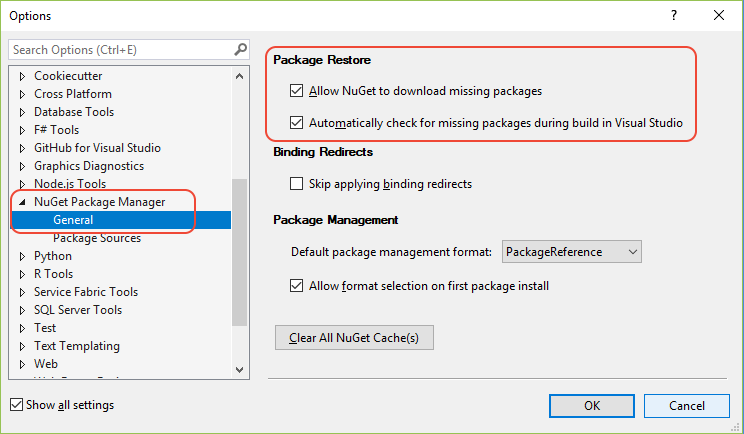

# Restore packages with NuGet Package Restore

NuGet Package Restore restores all of a project's dependencies that are listed in either the project file or *packages.config*. You can restore packages at any time with `nuget restore`, `dotnet restore`, or through Visual Studio. The `dotnet build` and `dotnet run` commands do automatic package restores, and you can configure Visual Studio to restore packages automatically when it builds a project.

To promote a cleaner development environment and to reduce repository size, Package Restore makes sure that all a project's dependencies are available without having to store them in source control. To configure your source control repository to exclude package binaries, see [Packages and source control](../consume-packages/packages-and-source-control.md).

## Restore packages

Package Restore tries to install all package dependencies to the correct state that matches the `<PackageReference>`s in your project file, such as *.csproj*, or the list in your *packages.config* file. In Visual Studio, you can see the references in **Solution Explorer** under **Dependencies** > **Packages**.

If the package references in your project file or your *packages.config* file are incorrect and don't match your desired state following Package Restore, install or update the correct packages instead of running restore.

If the package references in your project file or *packages.config* file are correct, use your preferred tool to restore packages:

- [Visual Studio](#restore-using-visual-studio) ([automatic restore](#restore-packages-automatically-using-visual-studio) or [manual restore](#restore-packages-manually-using-visual-studio))
- [dotnet CLI](#restore-using-the-dotnet-cli)
- [nuget.exe CLI](#restore-using-the-nugetexe-cli)
- [MSBuild](#restore-using-msbuild)
- [Azure Pipelines](#restore-using-azure-pipelines)
- [Azure DevOps Server](#restore-using-azure-devops-server)

After a successful restore:

- For projects that use `<PackageReference>`, the package is present in the *global-packages* folder, and the `obj/project.assets.json` file is recreated.
- For projects that use *packages.config*, the package appears in the project's `packages` folder.
- The project should now build successfully.

If you have missing packages or package-related errors after you run Package Restore, such as error icons in Solution Explorer, follow the instructions in [Troubleshooting Package Restore errors](package-restore-troubleshooting.md), or [reinstall or update](../consume-packages/reinstalling-and-updating-packages.md) the packages. In Visual Studio, the Package Manager Console provides several options for reinstalling packages. For more information, see [Use Package-Update](reinstalling-and-updating-packages.md#using-update-package).

## Package Restore behavior

Package Restore first installs the direct dependencies of a project as needed, then installs any dependencies of those packages throughout the entire dependency graph.

If a package isn't already installed, NuGet first attempts to retrieve it from the [NuGet cache](../consume-packages/managing-the-global-packages-and-cache-folders.md). If the package isn't in the cache, NuGet tries to download the package from all enabled configured sources, at **Tools** > **Options** > **NuGet Package Manager** > **Package Sources** in Visual Studio. During restore, NuGet ignores the order of package sources, and uses the package from the first source that responds to requests. For more information about NuGet behavior, see [Common NuGet configurations](Configuring-NuGet-Behavior.md).

NuGet doesn't indicate a restore failure until it checks all sources. NuGet then reports a failure for only the last source in the list. The error implies that the package wasn't present on any of the sources, even though it doesn't report the other failures individually.

<a name="restore-using-visual-studio"></a>
<a name="restore-using-msbuild"></a>
<a name="choose-default-package-management-format"></a>
<a name="restore-packages-automatically-using-visual-studio"></a>
<a name="restore-packages-manually-using-visual-studio"></a>
<a name="restore-using-the-dotnet-cli"></a>
<a name="restore-using-the-nugetexe-cli"></a>
<a name="restore-using-azure-pipelines"></a>
<a name="migrate-to-automatic-package-restore-visual-studio"></a>
<a name="restore-using-visual-studio"></a>
## Restore packages in Visual Studio

In Visual Studio on Windows, you can restore packages automatically or manually. First, configure Package Restore through **Tools** > **Options** > **NuGet Package Manager**.

### Configure Visual Studio Package Restore options



At **Tools** > **Options** > **NuGet Package Manager** > **General**:

- Select **Allow NuGet to download missing packages** to enable package restore and the **Restore NuGet Packages** command. This selection sets the `packageRestore/enabled` setting to `True` in the [packageRestore section](../reference/nuget-config-file.md#packagerestore-section) of the global *NuGet.Config* file, at *%AppData%\\Roaming\\NuGet* on Windows, or *~/.nuget/NuGet/* on Mac or Linux.

  ```xml
  <configuration>
      <packageRestore>
          <add key="enabled" value="True" />
      </packageRestore>
  </configuration>
  ```
  
  > [!Note]
  > To globally override the `packageRestore/enabled` setting, you can set the environment variable **EnableNuGetPackageRestore** to True or False before you open Visual Studio or start a build.

  To enable or disable Package Restore for all users on a computer, you can add the configuration settings to the global *NuGet.Config* file in Windows at *%ProgramData%\NuGet\Config*, sometimes under a specific *\<IDE>\\\<Version>\\\<SKU>* Visual Studio folder, or in Mac/Linux at *~/.local/share*. Individual users can then selectively enable restore as needed on a project level. For more details on how NuGet prioritizes multiple config files, see [Common NuGet configurations](../consume-packages/configuring-nuget-behavior.md#how-settings-are-applied).
  
  > [!Important]
  > If you edit the `packageRestore` settings in *NuGet.Config* directly, restart Visual Studio so that the **Options** show the current values.


- Select **Automatically check for missing packages during build in Visual Studio** to automatically restore any missing packages when you run a build from Visual Studio. This setting doesn't affect builds run from the MSBuild command line. This selection sets the `packageRestore/automatic` setting to `True` in the `packageRestore` section of the *NuGet.Config* file.

  ```xml
  <configuration>
      <packageRestore>
          <add key="automatic" value="True" />
      </packageRestore>
  </configuration>
  ```
  
  For non-SDK-style projects, you must select **Allow NuGet to download missing packages** as well as **Automatically check for missing packages during build in Visual Studio** in **Options** to enable automatic restore.

- Choose the default package management format. NuGet has two package management formats, [PackageReference](Package-References-in-Project-Files.md) and [packages.config](../reference/packages-config.md). Select the format from the dropdown list under **Package Management**. You can also select whether to allow format selection on first package install.

  > [!Note]
  > If a project doesn't support both package management formats, NuGet uses the package management format that's compatible with the project, which might not be the default set in the options. NuGet then won't prompt for selection on first install, even if that option is selected.
  >
  > If you use Package Manager Console to install the first package in a project, NuGet doesn't prompt for format selection, even if that option is selected in **Options**.

### Restore packages manually or automatically

If you enabled package restore in **Options**, right click the solution in **Solution Explorer** and select **Restore NuGet Packages** to restore packages manually.

If you enabled automatic restore, Package Restore happens automatically when you create a project from a template or build a project. In NuGet 4.0+, restore also happens automatically when you make changes to a SDK-style project.

If one or more packages don't install properly when you manually restore or run a build, **Solution Explorer** shows an error icon. Right-click the project, select **Manage NuGet Packages**, and use the **NuGet Package Manager** to uninstall and reinstall the affected packages. For more information, see [Reinstall and update packages](../consume-packages/reinstalling-and-updating-packages.md).

If you see the error **This project references NuGet package(s) that are missing on this computer**, or **One or more NuGet packages need to be restored but couldn't be because consent has not been granted**, make sure you enabled automatic restore. For older projects, see [Migrate to automatic package restore](#migrate-to-automatic-package-restore-visual-studio). Also see [Troubleshooting package restore errors](Package-restore-troubleshooting.md).

## Restore by using the dotnet CLI

???temp text from PR 2852.

The [dotnet restore](/dotnet/core/tools/dotnet-restore) command restores packages that the project file lists with `<PackageReference>`. For more information, see [PackageReference in project files](package-references-in-project-files.md).

.NET Core 2.0 and later `dotnet build` and `dotnet run` commands restore packages automatically. As of NuGet 4.0, `dotnet restore` runs the same code as `nuget restore`.

To restore a package with `dotnet restore`:

1. Open a command line and switch to the directory that contains your project file.
1. Run `dotnet restore`.

<!--[!INCLUDE [restore-dotnet-cli](includes/restore-dotnet-cli.md)]-->

> [!IMPORTANT]
> To add a missing package reference to the project file, use [dotnet add package](/dotnet/core/tools/dotnet-add-package), which also runs the `restore` command.

## Restore by using the NuGet CLI

???temp text from PR 2852.

The NuGet CLI [restore](../reference/cli-reference/cli-ref-restore.md) command downloads and installs any packages that are missing from project package directories. The command works on projects that use either `PackageReference` or *packages.config* for package references.

Like `install`, the `restore` command only adds packages to disk, but doesn't modify the project file or *packages.config*. To add project dependencies, use the Visual Studio Package Manager UI or Console, then run `install` or `restore`.

To restore packages, run the following command:

```cli
nuget restore <projectPath>
```

The `restore` command uses a solution file or a *package.config* file in the specified project path.

For example, to restore all packages for *MySolution.sln* in the current directory, run:

```cli
nuget restore MySolution.sln
```

<!--[!INCLUDE [restore-nuget-exe-cli](includes/restore-nuget-exe-cli.md)]-->

> [!NOTE]
> For non-SDK-style projects that use `PackageReference`, use `msbuild -t:restore` to restore packages instead.

## Restore by using MSBuild

You can use the [msbuild -t:restore](../reference/msbuild-targets.md#restore-target) command to restore packages in NuGet 4.x+ and MSBuild 15.1+, which are included with Visual Studio 2017 and higher.

The command restores packages in projects that use [PackageReference](package-references-in-project-files.md) for package references. Starting with MSBuild 16.5+, this command also supports *packages.config* package references, when used with `-p:RestorePackagesConfig=true`.

To use MSBuild restore:

1. Open a Developer Command Prompt by searching for *developer command prompt* and starting the prompt from the **Start** menu. The Developer Command Prompt for Visual Studio from the **Start** menu is configured with all the necessary paths for MSBuild.

1. Switch to the folder containing the project or *packages.config* file, and enter `msbuild -t:restore`.

1. After the restore completes, enter `msbuild` to rebuild the project. Make sure the MSBuild output indicates that the build completed successfully.

> [!Note]
> You can use `msbuild -restore` to run `restore`, reload the project, and build, since build is the default target. For more information, see [Restore and build with one MSBuild command](../reference/msbuild-targets.md#restoring-and-building-with-one-msbuild-command).

## Restore with Azure Pipelines or Azure DevOps Server

When you create a build definition in Azure Pipelines, you can include the [NuGet CLI restore](/azure/devops/pipelines/tasks/package/nuget#restore-nuget-packages) or [dotnet CLI restore](/azure/devops/pipelines/tasks/build/dotnet-core-cli) task in the definition before any build tasks. Some build templates include the restore task by default.

Azure DevOps Server and TFS 2013 and later automatically restore packages during build, if you use a TFS 2013 or later Team Build template. You can also include a build step to run a command-line restore option, or optionally migrate the build template to a later version. For more information, see [Set up package restore with Team Foundation Build](../consume-packages/team-foundation-build.md).

## Constrain package versions

NuGet restore through any method honors any constraints you specify in *packages.config* or the project file.

- In *packages.config*, you can specify an `allowedVersions` range in the dependency. For more information, see [Constrain upgrade versions](../consume-packages/reinstalling-and-updating-packages.md#constraining-upgrade-versions). For example:

  ```xml
  <package id="Newtonsoft.json" version="6.0.4" allowedVersions="[6,7)" />
  ```

- In a project file, you can specify the version range in the `Version` property of the dependency. For example:

  ```xml
  <PackageReference Include="Newtonsoft.json" Version="[6, 7)" />
  ```

In both cases, use the notation described in [Package versioning](../concepts/package-versioning.md).

## Force restore from original package sources

By default, NuGet restore operations use packages from the *global-packages* and *http-cache* folders, as described in [Manage the global packages and cache folders](managing-the-global-packages-and-cache-folders.md).

To avoid using the packages in the *global-packages* folder, do one of the following:

- Clear the folder by using `nuget locals global-packages -clear` or `dotnet nuget locals global-packages --clear`.

- Temporarily change the location of the *global-packages* folder before the restore by using one of the following methods:

  - Set the **NUGET_PACKAGES** environment variable to a different folder.
  - Create a *NuGet.Config* file that sets `globalPackagesFolder` for `PackageReference`, or `repositoryPath` for *packages.config*, to a different folder. For more information, see [configuration settings](../reference/nuget-config-file.md#config-section).
  - For MSBuild only, specify a different folder with the `RestorePackagesPath` property.

To avoid using the cache for HTTP sources, do one of the following:

- Temporarily set the **NUGET_HTTP_CACHE_PATH** environment variable to a different folder.

- Clear the cache by using `nuget locals http-cache -clear` or `dotnet nuget locals http-cache --clear`.

- For `nuget restore`, use the `-NoCache` option, or for `dotnet restore`, use the `--no-cache` option. These options don't affect restore operations through the Visual Studio Package Manager or Console.

## Migrate to automatic package restore

Earlier versions of NuGet supported an MSBuild-integrated package restore. Projects that use the deprecated MSBuild-integrated package restore should migrate to automatic package restore.

These projects typically contain a *.nuget* folder with three files: *NuGet.config*, *nuget.exe*, and *NuGet.targets*. The *NuGet.targets* file causes NuGet to use the MSBuild-integrated approach, so it must be removed.

To migrate to automatic package restore:

1. Enable automatic package restore.
1. Close Visual Studio.
1. Delete *.nuget/nuget.exe* and *.nuget/NuGet.targets*.
1. For each project file, remove the `<RestorePackages>` element, and remove any references to *NuGet.targets*.

To test automatic package restore:

1. Remove the *packages* folder from the solution.
1. Open the solution in Visual Studio and start a build. Automatic package restore should download and install each dependency package, without adding it to source control.

## Next steps

See [Troubleshoot package restore](Package-restore-troubleshooting.md).
