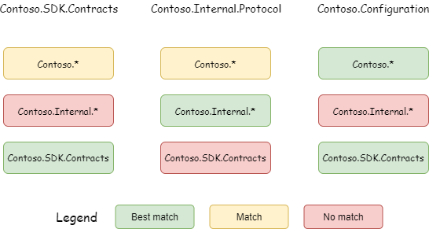

# Package Source Mapping

Package Source Mapping is a tool that can be used to improve your supply chain security, especially if you use a mix of public and private package sources.

By default, NuGet will search all configured package sources when it needs to download a package.
When a package exists on multiple sources, it may not be deterministic which source the package will be downloaded from.
With Package Source Mapping, you can filter, per package, which source(s) NuGet will search.

We also have suggestions for other [best practices](..\concepts\Security-Best-Practices.md) to help you fortify your supply chain against attacks.

Package Source Mapping was added in [NuGet 6.0](..\release-notes\NuGet-6.0.md).
Starting with Visual Studio 17.5, you can add and remove Package Source Mappings with the Visual Studio Options Dialog.
For detailed information on all Visual Studio NuGet options, see [NuGet Options in Visual Studio](nuget-visual-studio-options.md).

### Visual Studio support

| Visual Studio | Package Source Mapping | Support in Tools -> Options | Support in Package Manager UI |
|-----|---------------------|---------------------|---------------------|
| 17.0 - 17.4 | ✅ Available | ❌ Not available | ❌ Not available |
| 17.5 | ✅ Available | ✅ Available | ❌ Not available |
| 17.7 Preview 3| ✅ Available | ✅ Available | ✅ Status displayed |

The feature is available across all NuGet integrated tooling.

* [Visual Studio 2022 and later](https://visualstudio.microsoft.com/downloads/)
* [.NET SDK 6.0.100 and later](https://dotnet.microsoft.com/download/dotnet/6.0)
* [nuget.exe 6.0.0 and later](https://www.nuget.org/downloads)

Older tooling will ignore the Package Source Mapping configuration. To use this feature, ensure all your build environments use compatible tooling versions.

Package Source Mappings will apply to all project types – including .NET Framework – as long as compatible tooling is used.

## Video walkthrough

For a video-based overview of the Package Source Mapping feature, consider watching the [Secure your NuGet packages with Package Source Mapping](https://www.youtube.com/watch?v=G6P38Dn69Ro) video on YouTube.

## Enabling Package Source Mapping

To opt into this feature, you must have a `nuget.config` file. Having a single `nuget.config` at the root of your repository is considered a best practice. See [nuget.config documentation](../reference/nuget-config-file.md) to learn more.

### Enable by using Visual Studio Options Dialog

1. Open your solution in Visual Studio.
2. Navigate to the `Package Source Mappings` Options Dialog.

_From the Package Manager UI_

* Select a package from the list to show it in the Details Pane.
* Press the `Configure` button to open the Package Source Mappings options page.


_From the Visual Studio Options Dialog_

* Go to the `Tools` menu in the main Visual Studio toolbar, and choose `NuGet Package Manager` -> `Package Manager Settings`.
* Navigate to the `Package Source Mappings` page.

For details about managing NuGet package source mappings, see [NuGet Options in Visual Studio](nuget-visual-studio-options.md#package-source-mapping).

The NuGet Package Manager window will refresh and reflect the new status of the selected package's source mappings.


### Enable by manually editing `nuget.config`

* Declare your desired package sources in your `nuget.config` file.
* Following your source declarations, add a `<packageSourceMapping>` element that specifies the desired mappings for each source.
* Declare exactly one `packageSource` element for each source in use.
  * Add as many patterns as you find necessary.

```xml
<?xml version="1.0" encoding="utf-8"?>
<configuration>
  <!-- Define the package sources, nuget.org and contoso.com. -->
  <!-- `clear` ensures no additional sources are inherited from another config file. -->
  <packageSources>
    <clear />
    <!-- `key` can be any identifier for your source. -->
    <add key="nuget.org" value="https://api.nuget.org/v3/index.json" />
    <add key="contoso.com" value="https://contoso.com/packages/" />
  </packageSources>
  
  <!-- Define mappings by adding package patterns beneath the target source. -->
  <!-- Contoso.* packages and NuGet.Common will be restored from contoso.com,
       everything else from nuget.org. -->
  <packageSourceMapping>
    <!-- key value for <packageSource> should match key values from <packageSources> element -->
    <packageSource key="nuget.org">
      <package pattern="*" />
    </packageSource>
    <packageSource key="contoso.com">
      <package pattern="Contoso.*" />
      <package pattern="NuGet.Common" />
    </packageSource>
  </packageSourceMapping>
</configuration>
```

Package Source Mapping settings are applied following [nuget.config precedence rules](configuring-nuget-behavior.md#how-settings-are-applied) when multiple `nuget.config` files at various levels (machine-level, user-level, repo-level) are present.

## Package Source Mapping rules

For maximum flexibility and control, NuGet requires that all packages match a package pattern through a well defined precedence.

### Package Pattern requirements

All requested packages must map to one or more sources by matching a defined package pattern. In other words, once you have defined a `packageSourceMapping` element you must explicitly define which sources _every_ package - _including transitive packages_ - will be restored from.

* Both top-level _and transitive_ packages must match defined patterns. There is no requirement that a top level package and its dependencies come from the same source.  
* The same ID pattern can be defined on multiple sources, allowing matching package IDs to be restored from any of the feeds that define the pattern. However, this isn't recommended due to the impact on restore predictability (a given package could come from multiple sources). This may be a valid configuration if you trust all respective sources.

### Package Pattern Syntax

| Pattern | Example syntax | Description |
|---------|---------|-------------|
| Package prefix pattern | `*`, `NuGet.*` | Must end with a `*`, where `*` matches 0 or more characters. `*` is the shortest allowed prefix pattern and matches all packages ids. |
| Package ID pattern | `NuGet.Common`, `Contoso.Contracts` | Exact package ID. |

### Package Pattern precedence

When multiple unique patterns match a package ID, the most specific one will be preferred. Package ID patterns always have the highest precedence while the generic `*` always has the lowest precedence. For package prefix patterns, the longest has precedence.



### Setting default sources

The `*` pattern can be used to make a declare a de-facto default source - meaning any package that doesn't match other specified patterns will be restored from that source without throwing an error.
This configuration is advantageous if you primarily use packages from say, `nuget.org`, and only have a few internal packages, or use standard prefixes for all internal packages like `Contoso.*`.

If your team doesn't use standard prefixes for internal package IDs or vets `nuget.org` packages prior to installation, then making a private source the default will suit your needs better.

> [!Note]
> When the requested package already exists in the global packages folder, no source look-up will happen and the mappings will be ignored. Consider declaring a [global packages folder for your repo](../reference/nuget-config-file.md#config-section) to gain the full security benefits of this feature. Work to improve the experience with the default global packages folder is planned for a next iteration.
To learn more about how package installation works, see [the conceptual document.](../concepts/package-installation-process.md)

### Get started

There are 2 ways you can fully onboard your repository, [manually](#manual-onboarding) or using the [NuGet.PackageSourceMapper tool](#automated-onboarding-using-tool).

#### Manual onboarding

For manual onboarding you may take the following steps:

1. Declare a new [global packages folder for your repo](../reference/nuget-config-file.md#config-section).
1. Run [`dotnet package list --include-transitive`](/dotnet/core/tools/dotnet-list-package#synopsis) to view all top-level and transitive packages in your solution.
    * For .NET framework projects using [`packages.config`](../reference/packages-config.md), the `packages.config` file will have a flat list of all direct and transitive packages.
1. Define mappings such that every package ID in your solution - _including transitive packages_ - matches a pattern for the target source.
1. Run [dotnet nuget locals global-packages -c](/dotnet/core/tools/dotnet-nuget-locals) to clear global-packages directory.
1. Run restore to validate that you have configured your mappings correctly. If your mappings don't fully cover every package ID in your solution, the error messages will help you identify the issue.
1. When restore succeeds, you are done! Optionally consider:
    * Simplifying the configuration to fewer declarations by using broader package ID prefixes or [setting a default source](#setting-default-sources) where possible.
    * Verifying the source each package was restored from by checking the [metadata files in the global packages folder or reviewing the restore logs](https://devblogs.microsoft.com/nuget/performance-and-polish-with-nuget-5-9/).

#### Automated onboarding using tool

Many repositories have a large number of packages and doing the work manually can be time consuming. The [NuGet.PackageSourceMapper tool](https://www.nuget.org/packages/NuGet.PackageSourceMapper) can automatically generate a NuGet.config for you, based on your project's known packages and sources.

The package source mapper tool requires you to have completed a successful package restore in which it will read each respective `.nupkg.metadata` file generated as part of your build to best understand how you map your respective packages and sources. Tool not only covers top dependencies it also considers all the transitive dependencies when generating mapping.

Tool has several option how to generate mapping pattern depending on your need, please check [blog post](https://devblogs.microsoft.com/nuget/quickly-map-your-nuget-packages-to-sources) and tool's [readme instruction](https://www.nuget.org/packages/NuGet.PackageSourceMapper#readme-body-tab) for more details.

For an idea of how your source mappings may look like, refer to our [samples repo](https://github.com/NuGet/Samples/tree/main/PackageSourceMappingExample).

> [!Note]
>
> * There are no nuget.exe or dotnet.exe commands for managing the package source mapping configuration, see [NuGet/Home#10735](https://github.com/NuGet/Home/issues/10735).
> * There are no means of mapping packages at package installation time, see [NuGet/Home#10730](https://github.com/NuGet/Home/issues/10730).
> * There is a limitation when using the `DotNetCoreCLI@2` Azure Pipelines task which can be worked around by using `feed-` prefixes in your source mapping configuration. It is recommended however to use `NuGetAuthenticate` for your authentication needs and call the dotnet cli directly from a script task. See [microsoft/azure-pipelines-tasks#15542](https://github.com/microsoft/azure-pipelines-tasks/issues/15542).
