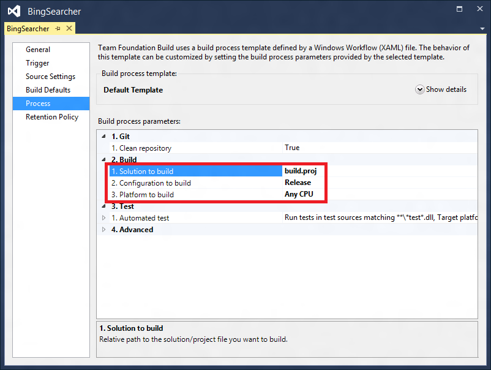
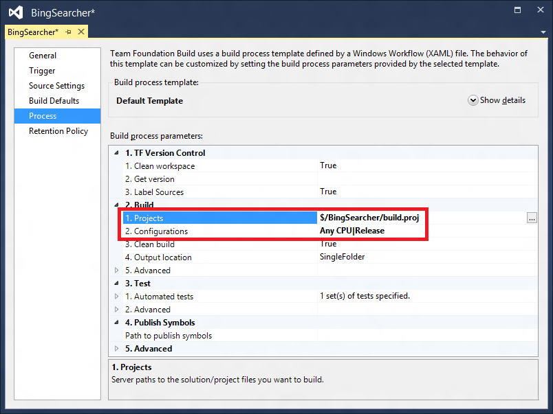

# Setting up package restore with Team Foundation Build

This article provides a detailed walkthrough on how to restore packages as part of the [Team Services Build](/vsts/build-release/index) both, for both Git and Team Services Version Control.

Although this walkthrough is specific for the scenario of using Visual Studio Team Services, the concepts also apply to other version control and build systems.

Applies To:

- Custom MSBuild projects running on any version of TFS
- Team Foundation Server 2012 or earlier
- Custom Team Foundation Build Process Templates migrated to TFS 2013 or later
- Build Process Templates With Nuget Restore functionality removed

If you're using Visual Studio Team Services or Team Foundation Server 2013 with its build process templates, automatic package restore happens as part of the build process.

## The general approach

An advantage of using NuGet is that you can use it to avoid checking in binaries to your version control system.

This is especially interesting if you are using a [distributed version control](https://en.wikipedia.org/wiki/Distributed_revision_control) system like git because developers need to clone the entire repository, including the full history, before they can start working locally. Checking in binaries can cause significant repository bloat as binary files are typically stored without delta compression.

NuGet has supported [restoring packages](../consume-packages/package-restore.md) as part of the build for a long time now. The previous implementation had a chicken-and-egg problem for packages that want to extend the build process because NuGet restored packages while building the project. However, MSBuild doesn't allow extending the build during the build; one could argue that this an issue in MSBuild but I would argue that this is an inherent problem. Depending on which aspect you need to extend it might be too late to register by the time your package is restored.

The cure to this problem is making sure that packages are restored as the first step in the build process:

```cli
nuget restore path\to\solution.sln
```

When your build process restores packages before building the code, you don't need to check-in `.targets` files

> [!Note]
> Packages must be authored to allow loading in Visual Studio. Otherwise, you may still want to check in `.targets` files so that other developers can simply open the solution without having to restore packages first.

The following demo project shows how to set up the build in such a way that the `packages` folders and `.targets` files don't need to be checked-in. It also shows how to set up an automated build on the Team Foundation Service for this sample project.

## Repository structure

Our demo project is a simple command line tool that uses the command line argument to query Bing. It targets the .NET Framework 4 and uses many of the [BCL packages](https://www.nuget.org/profiles/dotnetframework/) ([Microsoft.Net.Http](https://www.nuget.org/packages/Microsoft.Net.Http), [Microsoft.Bcl](https://www.nuget.org/packages/Microsoft.Bcl), [Microsoft.Bcl.Async](https://www.nuget.org/packages/Microsoft.Bcl.Async), and [Microsoft.Bcl.Build](https://www.nuget.org/packages/Microsoft.Bcl.Build)).

The structure of the repository looks as follows:

```
<Project>
    │   .gitignore
    │   .tfignore
    │   build.proj
    │
    ├───src
    │   │   BingSearcher.sln
    │   │
    │   └───BingSearcher
    │       │   App.config
    │       │   BingSearcher.csproj
    │       │   packages.config
    │       │   Program.cs
    │       │
    │       └───Properties
    │               AssemblyInfo.cs
    │
    └───tools
        └───NuGet
                nuget.exe
```

You can see that we haven't checked-in the `packages` folder nor any `.targets` files.

We have, however, checked-in the `nuget.exe` as it's needed during the build. Following widely used conventions we've checked it in under a shared `tools` folder.

The source code is under the `src` folder. Although our demo only uses a single solution, you can easily imagine that this folder contains more than one solution.

### Ignore files

> [!Note]
> There is currently a `[known bug in the NuGet client](https://nuget.codeplex.com/workitem/4072)` that causes the client to still add the `packages` folder to version control. A workaround is to disable the source control integration. In order to do that, you need a `Nuget.Config ` file in the  `.nuget` folder that is parallel to your solution. If this folder doesn't exist yet, you need to create it. In [`Nuget.Config`](../consume-packages/configuring-nuget-behavior.md), add the following content:

```xml
<configuration>
    <solution>
        <add key="disableSourceControlIntegration" value="true" />
    </solution>
</configuration>
```

To communicate to version control that we don’t intent to check-in the **packages** folders, we've also added ignore files for both git (`.gitignore`) as well as TF version control (`.tfignore`). These files describe patterns of files you don't want to check-in.

The `.gitignore` file looks as follows:

```
syntax: glob
*.user
*.suo
bin
obj
packages
*.nupkg
project.lock.json
project.assets.json
```

The `.gitignore` file is [quite powerful](https://www.kernel.org/pub/software/scm/git/docs/gitignore.html). For example, if you want to generally not check-in the contents of the `packages` folder but want to go with previous guidance of checking in the `.targets` files you could have the following rule instead:

```
packages
!packages/**/*.targets
```

This will exclude all `packages` folders but will re-include all contained `.targets` files. By the way, you can find a template for `.gitignore` files that is specifically tailored for the needs of Visual Studio developers [here](https://github.com/github/gitignore/blob/master/VisualStudio.gitignore).

TF version control supports a very similar mechanism via the [.tfignore](/vsts/tfvc/add-files-server#customize-which-files-are-ignored-by-version-control) file. The syntax is virtually the same:

```
*.user
*.suo
bin
obj
packages
*.nupkg
project.lock.json
project.assets.json
```

## build.proj

For our demo, we keep the build process fairly simple. We'll create an MSBuild project that builds all solutions while making sure that packages are restored before building the solutions.

This project will have the three conventional targets `Clean`, `Build` and `Rebuild` as well as a new target `RestorePackages`.

- The `Build` and `Rebuild` targets both depend on `RestorePackages`. This makes sure that you can both run `Build` and `Rebuild` and rely on packages being restored.
- `Clean`, `Build` and `Rebuild` invoke the corresponding MSBuild target on all solution files.
- The `RestorePackages` target invokes `nuget.exe` for each solution file. This is accomplished by using [MSBuild's batching functionality](/visualstudio/msbuild/msbuild-batching).

The result looks as follows:

```xml
<?xml version="1.0" encoding="utf-8"?>
<Project ToolsVersion="4.0"
            DefaultTargets="Build"
            xmlns="http://schemas.microsoft.com/developer/msbuild/2003">

    <PropertyGroup>
    <OutDir Condition=" '$(OutDir)'=='' ">$(MSBuildThisFileDirectory)bin\</OutDir>
    <Configuration Condition=" '$(Configuration)'=='' ">Release</Configuration>
    <SourceHome Condition=" '$(SourceHome)'=='' ">$(MSBuildThisFileDirectory)src\</SourceHome>
    <ToolsHome Condition=" '$(ToolsHome)'=='' ">$(MSBuildThisFileDirectory)tools\</ToolsHome>
    </PropertyGroup>

    <ItemGroup>
    <Solution Include="$(SourceHome)*.sln">
        <AdditionalProperties>OutDir=$(OutDir);Configuration=$(Configuration)</AdditionalProperties>
    </Solution>
    </ItemGroup>

    <Target Name="RestorePackages">
    <Exec Command="&quot;$(ToolsHome)NuGet\nuget.exe&quot; restore &quot;%(Solution.Identity)&quot;" />
    </Target>

    <Target Name="Clean">
    <MSBuild Targets="Clean"
                Projects="@(Solution)" />
    </Target>

    <Target Name="Build" DependsOnTargets="RestorePackages">
    <MSBuild Targets="Build"
                Projects="@(Solution)" />
    </Target>

    <Target Name="Rebuild" DependsOnTargets="RestorePackages">
    <MSBuild Targets="Rebuild"
                Projects="@(Solution)" />
    </Target>
</Project>
```

## Configuring Team Build

Team Build offers various process templates. For this demonstration, we're using the Team Foundation Service. On-premises installations of TFS will be very similar though.

Git and TF Version Control have different Team Build templates, so the following steps will vary depending on which version control system you are using. In both cases, all you need is selecting the build.proj as the project you want to build.

First, let's look at the process template for git. In the git based template the build is selected via the property `Solution to build`:



Please note that this property is a location in your repository. Since our `build.proj` is in the root, we simply used `build.proj`. If you place the build file under a folder called `tools`, the value would be `tools\build.proj`.

In the TF version control template the project is selected via the property `Projects`:



In contrast to the git based template the TF version control supports pickers (the button on the right hand side with the three dots). So in order to avoid any typing errors we suggest you use them to select the project.
