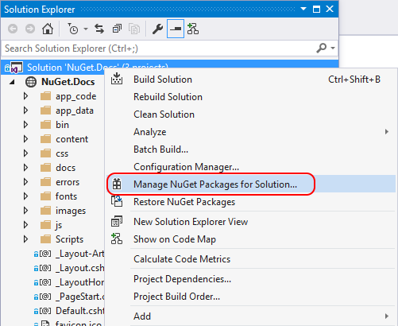

# Install and use packages using the dotnet CLI

The dotnet CLI allows you to easily install, uninstall, and update NuGet packages in projects and solutions.

Use the dotnet CLI to

## Prerequisites

- The [.NET Core SDK](https://www.microsoft.com/net/download/), which provides the `dotnet` command-line tool. In Visual Studio 2017, the dotnet CLI is automatically installed with any .NET Core related workloads.

- [Find a package](finding-and-choosing-packages.md) that you would like to install.

## Install a package

1. Use the [dotnet add package](/dotnet/core/tools/dotnet-add-package?tabs=netcore2x) command to install a Nuget package:

    ```cli
    dotnet add package <PACKAGE_NAME>
    ```

    For example, to install the `Newtonsoft.json` package, use the following command

    ```cli
    dotnet add package Newtonsoft.Json
    ```

2. After the command completes, look at the solution or project file to make sure the package was installed.

   For example, in Visual Studio, you can open the `.csproj` file to see the added reference:

    ```xml
   <ItemGroup>
    <PackageReference Include="Newtonsoft.Json" Version="12.0.1" />
   </ItemGroup>
    ```

## Install a specific version of a package

If the version is not specified, NuGet installs the latest version of the package. You can also use the [dotnet add package](/dotnet/core/tools/dotnet-add-package?tabs=netcore2x) command to install a specific version of a Nuget package:

```cli
dotnet add package <PACKAGE_NAME> -v <VERSION>
```

For example, to add version 12.0.1 of the `Newtonsoft.json` package, use this command:

```cli
dotnet add package Newtonsoft.Json -v 12.0.1
```

## Remove a package

Use the [dotnet remove package](/dotnet/core/tools/dotnet-remove-package?tabs=netcore2x) command to remove a Nuget package:

```cli
dotnet remove package <PACKAGE_NAME>
```

For example, to remove the `Newtonsoft.json` package, use the following command

```cli
dotnet remove package Newtonsoft.Json
```

## Update a package

NuGet installs the latest version of the package when you use the `dotnet add package` command without specifying the version. Otherwise, you must specify the version that you want.

## Restore packages

Use the [dotnet restore](/dotnet/core/tools/dotnet-restore?tabs=netcore2x) command, which restores packages listed in the project file (see [PackageReference](../consume-packages/package-references-in-project-files.md)). With .NET Core 2.0 and later, restore is done automatically with `dotnet build` and `dotnet run`.

To restore a package using `dotnet restore`:

```cli
dotnet restore 
```


1. In **Solution Explorer**, right-click either **References** or the desired project, and select **Manage NuGet Packages...**. (In web site projects, right-click the **Bin** folder.)
1. Select the **Updates** tab to see packages that have available updates from the selected package sources. Select **Include prerelease** to include prerelease packages in the update list.
1. Select the package to update, select the desired version from the drop-down on the right, and select **Update**.

    

1. <a name="implicit_reference"></a>For some packages, the **Update** button is disabled and a message appears saying that it's "Implicitly referenced by an SDK" (or "AutoReferenced"). This message indicates that the package is part of a larger framework or SDK and should not be updated independently. (Such packages are internally marked with `<IsImplicitlyDefined>True</IsImplicitlyDefined>`.) For example, `Microsoft.NETCore.App` is part of the .NET Core SDK, and the package version is not the same as the version of the runtime framework used by the application. You need to [update your .NET Core installation](https://aka.ms/dotnet-download) to get new versions of the ASP.NET Core and .NET Core runtime. [See this document for more details on .NET Core metapackages and versioning](/dotnet/core/packages). This applies to the following commonly used packages:
    * Microsoft.AspNetCore.All
    * Microsoft.AspNetCore.App
    * Microsoft.NETCore.App
    * NETStandard.Library

    

1. To update multiple packages to their newest versions, select  them in the list and select the **Update** button above the list.
1. You can also update an individual package from the **Installed** tab. In this case, the details for the package include a version selector (subject to the **Include prerelease** option) and an **Update** button.

## Manage packages for the solution

Managing packages for a solution is a convenient means to work with multiple projects simultaneously.

1. Select the **Tools > NuGet Package Manager > Manage NuGet Packages for Solution...** menu command, or right-click the solution and select **Manage NuGet Packages...**:

    

1. When managing packages for the solution, the UI lets you select the projects that are affected by the operations:

    

### Consolidate tab

Developers typically consider it bad practice to use different versions of the same NuGet package across different projects in the same solution. When you choose to manage packages for a solution, the Package Manager UI provides a **Consolidate** tab on which you can easily see where packages with distinct version numbers are used by different projects in the solution:


In this example, the ClassLibrary1 project is using EntityFramework 6.2.0, whereas ConsoleApp1 is using EntityFramework 6.1.0. To consolidate package versions, do the following:

- Select the projects to update in the project list.
- Select the version to use in all those projects in the **Version** control, such as EntityFramework 6.2.0.
- Select the **Install** button.

The Package Manager installs the selected package version into all selected projects, after which the package no longer appears on the **Consolidate** tab.

### Show preview window

When selected, a modal window displays which the dependencies of a chosen package before the package is installed:


<!-- This is here because the link in the UI needs this anchor. See https://github.com/NuGet/NuGet.Client/blob/dev/src/NuGet.Clients/PackageManagement.UI/Xamls/OptionsControl.xaml -->
<a name="install-options"></a>
