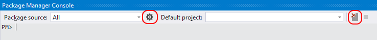
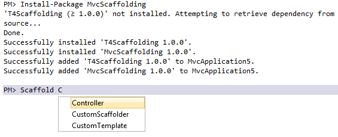

# Install and manage packages with the Package Manager Console in Visual Studio (PowerShell)

The NuGet Package Manager Console lets you use [NuGet PowerShell commands](../reference/powershell-reference.md) to find, install, uninstall, and update NuGet packages. Using the console is necessary in cases where the Package Manager UI does not provide a way to perform an operation. To use `nuget.exe` CLI commands in the console, see [Using the nuget.exe CLI in the console](#use-the-nugetexe-cli-in-the-console).

The console is built into Visual Studio on Windows. It is not included with Visual Studio for Mac or Visual Studio Code.

## Find and install a package

For example, finding and installing a package is done with three easy steps:

1. Open the project/solution in Visual Studio, and open the console using the **Tools > NuGet Package Manager > Package Manager Console** command.

1. Find the package you want to install. If you already know this, skip to step 3.

    ```ps
    # Find packages containing the keyword "elmah"
    Find-Package elmah
    ```

1. Run the install command:

    ```ps
    # Install the Elmah package to the project named MyProject.
    Install-Package Elmah -ProjectName MyProject
    ```

> [!Important]
> All operations that are available in the console can also be done with the [NuGet CLI](../reference/nuget-exe-cli-reference.md). However, console commands operate within the context of Visual Studio and a saved project/solution and often accomplish more than their equivalent CLI commands. For example, installing a package through the console adds a reference to the project whereas the CLI command does not. For this reason, developers working in Visual Studio typically prefer using the console to the CLI.

> [!Tip]
> Many console operations depend on having a solution opened in Visual Studio with a known path name. If you have an unsaved solution, or no solution, you can see the error, "Solution is not opened or not saved. Please ensure you have an open and saved solution." This indicates that the console cannot determine the solution folder. Saving an unsaved solution, or creating and saving a solution if you don't have one open, should correct the error.

## Opening the console and console controls

1. Open the console in Visual Studio using the **Tools > NuGet Package Manager > Package Manager Console** command. The console is a Visual Studio window that can be arranged and positioned however you like (see [Customize window layouts in Visual Studio](/visualstudio/ide/customizing-window-layouts-in-visual-studio)).

1. By default, console commands operate against a specific package source and project as set in the control at the top of the window:

    

1. Selecting a different package source and/or project changes those defaults for subsequent commands. To overrride these settings without changing the defaults, most commands support `-Source` and `-ProjectName` options.

1. To manage package sources, select the gear icon. This is a shortcut to the **Tools > Options > NuGet Package Manager > Package Sources** dialog box as described on the [Package Manager UI](install-use-packages-visual-studio.md#package-sources) page. Also, the control to the right of the project selector clears the console's contents:

    

1. The rightmost button interrupts a long-running command. For example, running `Get-Package -ListAvailable -PageSize 500` lists the top 500 packages on the default source (such as nuget.org), which could take several minutes to run.

    

## Install a package

```ps
# Add the Elmah package to the default project as specified in the console's project selector
Install-Package Elmah

# Add the Elmah package to a project named UtilitiesLib that is not the default
Install-Package Elmah -ProjectName UtilitiesLib
```

See [Install-Package](../reference/ps-reference/ps-ref-install-package.md).

Installing a package in the console performs the same steps as described on [What happens when a package is installed](../concepts/package-installation-process.md), with the following additions:

- The Console displays applicable license terms in its window with implied agreement. If you do not agree to the terms, you should uninstall the package immediately.
- Also a reference to the package is added to the project file and appears in **Solution Explorer** under the **References** node, you need to save the project to see the changes in the project file directly.

## Uninstall a package

```ps
# Uninstalls the Elmah package from the default project
Uninstall-Package Elmah

# Uninstalls the Elmah package and all its unused dependencies
Uninstall-Package Elmah -RemoveDependencies 

# Uninstalls the Elmah package even if another package depends on it
Uninstall-Package Elmah -Force
```

See [Uninstall-Package](../reference/ps-reference/ps-ref-uninstall-package.md). Use [Get-Package](../reference/ps-reference/ps-ref-get-package.md) to see all packages currently installed in the default project if you need to find an identifier.

Uninstalling a package performs the following actions:

- Removes references to the package from the project (and whatever management format is in use). References no longer appear in **Solution Explorer**. (You might need to rebuild the project to see it removed from the **Bin** folder.)
- Reverses any changes made to `app.config` or `web.config` when the package was installed.
- Removes previously-installed dependencies if no remaining packages use those dependencies.

## Update a package

```ps
# Checks if there are newer versions available for any installed packages
Get-Package -updates

# Updates a specific package using its identifier, in this case jQuery
Update-Package jQuery

# Update all packages in the project named MyProject (as it appears in Solution Explorer)
Update-Package -ProjectName MyProject

# Update all packages in the solution
Update-Package
```

See [Get-Package](../reference/ps-reference/ps-ref-get-package.md) and [Update-Package](../reference/ps-reference/ps-ref-update-package.md)

## Find a package

```ps
# Find packages containing keywords
Find-Package elmah
Find-Package logging

# List packages whose ID begins with Elmah
Find-Package Elmah -StartWith

# By default, Get-Package returns a list of 20 packages; use -First to show more
Find-Package logging -First 100

# List all versions of the package with the ID of "jquery"
Find-Package jquery -AllVersions -ExactMatch
```

See [Find-Package](../reference/ps-reference/ps-ref-find-package.md). In Visual Studio 2013 and earlier, use [Get-Package](../reference/ps-reference/ps-ref-get-package.md) instead.

## Availability of the console

Starting in Visual Studio 2017, NuGet and the NuGet Package Manager are automatically installed when you select any .NET-related workloads; you can also install it individually by checking the **Individual components > Code tools > NuGet package manager** option in the Visual Studio installer.

Also, if you're missing the NuGet Package Manager in Visual Studio 2015 and earlier, check **Tools > Extensions and Updates...** and search for the NuGet Package Manager extension. If you're unable to use the extensions installer in Visual Studio, you can download the extension directly from [https://dist.nuget.org/index.html](https://dist.nuget.org/index.html).

The Package Manager Console is not presently available with Visual Studio for Mac. The equivalent commands, however, are available through the [NuGet CLI](../reference/nuget-exe-CLI-reference.md). Visual Studio for Mac does have a UI for managing NuGet packages. See [Including a NuGet package in your project](/visualstudio/mac/nuget-walkthrough).

The Package Manager Console is not included with Visual Studio Code.

## Extend the Package Manager Console

Some packages install new commands for the console. For example, `MvcScaffolding` creates commands like `Scaffold` shown below, which generates ASP.NET MVC controllers and views:



## Set up a NuGet PowerShell profile

A PowerShell profile lets you make commonly-used commands available wherever you use PowerShell. NuGet supports a NuGet-specific profile typically found at the following location:

    %UserProfile%\Documents\WindowsPowerShell\NuGet_profile.ps1

To find the profile, type `$profile` in the console:

```ps
$profile
C:\Users\<user>\Documents\WindowsPowerShell\NuGet_profile.ps1
```

For more details, refer to [Windows PowerShell Profiles](https://technet.microsoft.com/library/bb613488.aspx).

## Use the nuget.exe CLI in the console

To make the [`nuget.exe` CLI](../reference/nuget-exe-cli-reference.md) available in the Package Manager Console, install the [NuGet.CommandLine](http://www.nuget.org/packages/NuGet.CommandLine/) package from the console:

```ps
# Other versions are available, see http://www.nuget.org/packages/NuGet.CommandLine/
Install-Package NuGet.CommandLine -Version 4.4.1
```
