# Install and manage packages in Visual Studio using the NuGet Package Manager

The NuGet Package Manager UI in Visual Studio on Windows allows you to easily install, uninstall, and update NuGet packages in projects and solutions. For the experience in Visual Studio for Mac, see [Including a NuGet package in your project](/visualstudio/mac/nuget-walkthrough?toc=/nuget/toc.json). The Package Manager UI is not included with Visual Studio Code.

> [!NOTE]
> If you're missing the NuGet Package Manager in Visual Studio 2015, check **Tools > Extensions and Updates...** and search for the *NuGet Package Manager* extension. If you're unable to use the extensions installer in Visual Studio, download the extension directly from [https://dist.nuget.org/index.html](https://dist.nuget.org/index.html).
>
> Starting in Visual Studio 2017, NuGet and the NuGet Package Manager are automatically installed with any .NET-related workloads. Install it individually by selecting the **Individual components > Code tools > NuGet package manager** option in the Visual Studio installer.

## Find and install a package

1. In **Solution Explorer**, right-click either **References**  or a project and select **Manage NuGet Packages...**.

    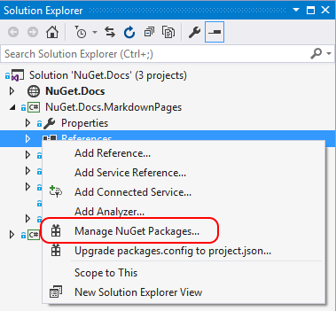

1. The **Browse** tab displays packages by popularity from the currently selected source (see [package sources](#package-sources)). Search for a specific package using the search box on the upper left. Select a package from the list to display its information, which also enables the **Install** button along with a version-selection drop-down.

    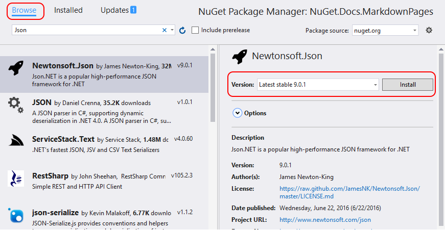

1. Select the desired version from the drop-down and select **Install**. Visual Studio installs the package and its dependencies into the project. You may be asked to accept license terms. When installation is complete, the added packages appear on the **Installed** tab. Packages are also listed in the **References** node of Solution Explorer, indicating that you can refer to them in the project with `using` statements.

    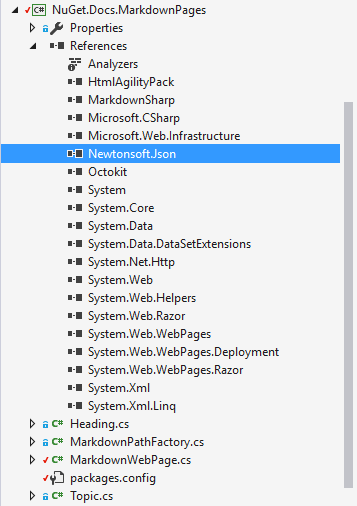

> [!Tip]
> To include prerelease versions in the search, and to make prerelease versions available in the version drop-down, select the **Include prerelease** option.

## Uninstall a package

1. In **Solution Explorer**, right-click either **References** or the desired project, and select **Manage NuGet Packages...**.
1. Select the **Installed** tab.
1. Select the package to uninstall (using search to filter the list if necessary) and select **Uninstall**.

    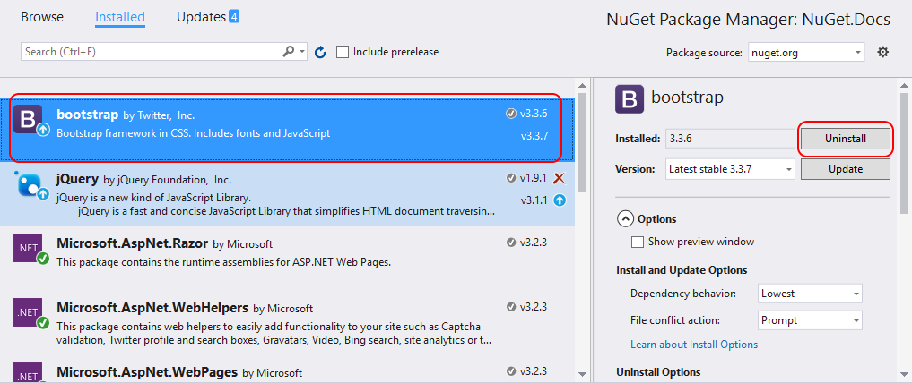

1. Note that the **Include prerelease** and **Package source** controls have no effect when uninstalling packages.

## Update a package

1. In **Solution Explorer**, right-click either **References** or the desired project, and select **Manage NuGet Packages...**. (In web site projects, right-click the **Bin** folder.)
1. Select the **Updates** tab to see packages that have available updates from the selected package sources. Select **Include prerelease** to include prerelease packages in the update list.
1. Select the package to update, select the desired version from the drop-down on the right, and select **Update**.

    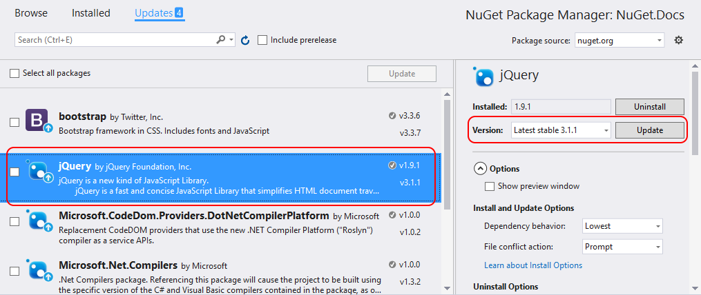

1. For some packages, the **Update** button is disabled and a message appears saying that it's "Implicitly referenced by an SDK" (or "AutoReferenced"). This message indicates that the package is part of a larger framework or SDK and should not be updated independently. (Such packages are internally marked with `<IsImplicitlyDefined>True</IsImplicitlyDefined>`.) For example, `Microsoft.NETCore.App` is part of the .NET Core SDK, and the package version is not the same as the version of the runtime framework used by the application. You need to [update your .NET Core installation](https://aka.ms/dotnet-download) to get new versions of the ASP.NET Core and .NET Core runtime. [See this document for more details on .NET Core metapackages and versioning](/dotnet/core/packages). This applies to the following commonly used packages:
    * Microsoft.AspNetCore.All
    * Microsoft.AspNetCore.App
    * Microsoft.NETCore.App
    * NETStandard.Library

    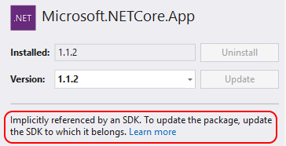

1. To update multiple packages to their newest versions, select  them in the list and select the **Update** button above the list.
1. You can also update an individual package from the **Installed** tab. In this case, the details for the package include a version selector (subject to the **Include prerelease** option) and an **Update** button.

## Manage packages for the solution

Managing packages for a solution is a convenient means to work with multiple projects simultaneously.

1. Select the **Tools > NuGet Package Manager > Manage NuGet Packages for Solution...** menu command, or right-click the solution and select **Manage NuGet Packages...**:

    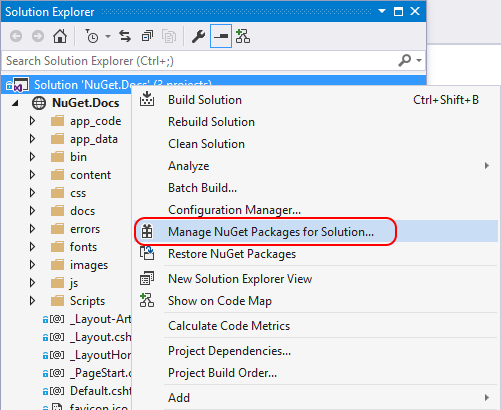

1. When managing packages for the solution, the UI lets you select the projects that are affected by the operations:

    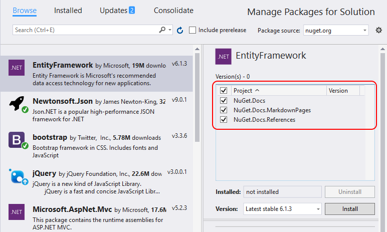

### Consolidate tab

Developers typically consider it bad practice to use different versions of the same NuGet package across different projects in the same solution. When you choose to manage packages for a solution, the Package Manager UI provides a **Consolidate** tab on which you can easily see where packages with distinct version numbers are used by different projects in the solution:

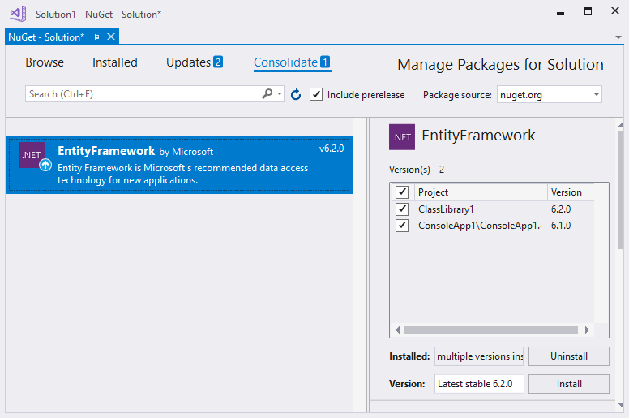

In this example, the ClassLibrary1 project is using EntityFramework 6.2.0, whereas ConsoleApp1 is using EntityFramework 6.1.0. To consolidate package versions, do the following:

- Select the projects to update in the project list.
- Select the version to use in all those projects in the **Version** control, such as EntityFramework 6.2.0.
- Select the **Install** button.

The Package Manager installs the selected package version into all selected projects, after which the package no longer appears on the **Consolidate** tab.

## Package sources

To change the source from which Visual Studio obtains packages, select one from the source selector:

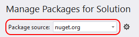

To manage package sources:

1. Select the **Settings** icon in the Package Manager UI outlined below or use the **Tools > Options** command and scroll to **NuGet Package Manager**:

    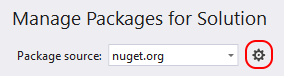

1. Select the **Package Sources** node:

    

1. To add a source, select **+**, edit the name, enter the URL or path in the **Source** control, and select  **Update**. The source now appears in the selector drop-down.
1. To change a package source, select it, make edits in the **Name** and **Source** boxes, and select **Update**.
1. To disable a package source, clear the box to the left of the name in the list.
1. To remove a package source, select it and then select the **X** button.
1. Using the up and down arrow buttons does not change the priority order of the package sources. Visual Studio ignores the order of package sources, using the package from whichever source is first to respond to requests. For more information, see [Package restore](../consume-packages/package-restore.md).

> [!Tip]
> If a package source reappears after deleting it, it may be listed in a computer-level or user-level `NuGet.Config` files. See [Common NuGet configurations](../consume-packages/configuring-nuget-behavior.md) for the location of these files, then remove the source by editing the files manually or using the [nuget sources command](../reference/nuget-exe-CLI-reference.md).

## Package manager Options control

When a package is selected, the Package Manager UI displays a small, expandable **Options** control below the version selector (shown here both collapsed and expanded). Note that for some project types, only the **Show preview window** option is provided.

The following sections explain these options.

### Show preview window

When selected, a modal window displays which the dependencies of a chosen package before the package is installed:

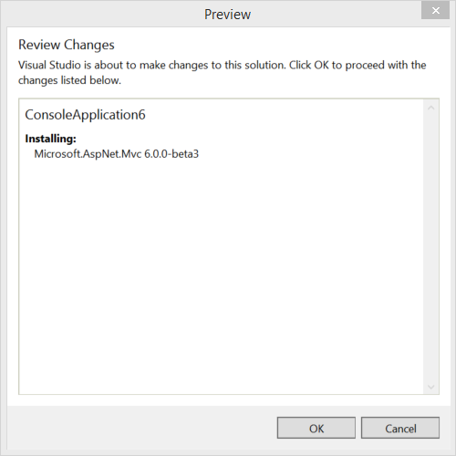

<!-- This is here because the link in the UI needs this anchor. See https://github.com/NuGet/NuGet.Client/blob/dev/src/NuGet.Clients/PackageManagement.UI/Xamls/OptionsControl.xaml -->

### Install and Update Options

(Not available for all project types.)

**Dependency behavior** configures how NuGet decides which versions of dependent packages to install:

- *Ignore dependencies* skips installing any dependencies, which typically breaks the package being installed.
- *Lowest* [Default] installs the dependency with the minimal version number that meets the requirements of the primary chosen package.
- *Highest Patch* installs the version with the same major and minor version numbers, but the highest patch number. For example, if version 1.2.2 is specified then the highest version that starts with 1.2 will be installed
- *Highest Minor* installs the version with the same major version number but the highest minor number and patch number. If version 1.2.2 is specified, then the highest version that starts with 1 will be installed
- *Highest* installs the highest available version of the package.

**File conflict action** specifies how NuGet should handle packages that already exist in the project or local machine:

- *Prompt* instructs NuGet to ask whether to keep or overwrite existing packages.
- *Ignore All* instructs NuGet to skip overwriting any existing packages.
- *Overwrite All* instructs NuGet to overwrite any existing packages.

<!-- This is here because the link in the UI needs this anchor. See https://github.com/NuGet/NuGet.Client/blob/dev/src/NuGet.Clients/PackageManagement.UI/Xamls/OptionsControl.xaml -->

### Uninstall Options

(Not available for all project types.)

**Remove dependencies**: when selected, removes any dependent packages if they're not referenced elsewhere in the project.

**Force uninstall even if there are dependencies on it**: when selected, uninstalls a package even if it's still being referenced in the project. This is typically used in combination with **Remove dependencies** to remove a package and whatever dependencies it installed. Using this option may, however, lead to broken references in the project. In such cases, you may need to [reinstall those other packages](../consume-packages/reinstalling-and-updating-packages.md).
