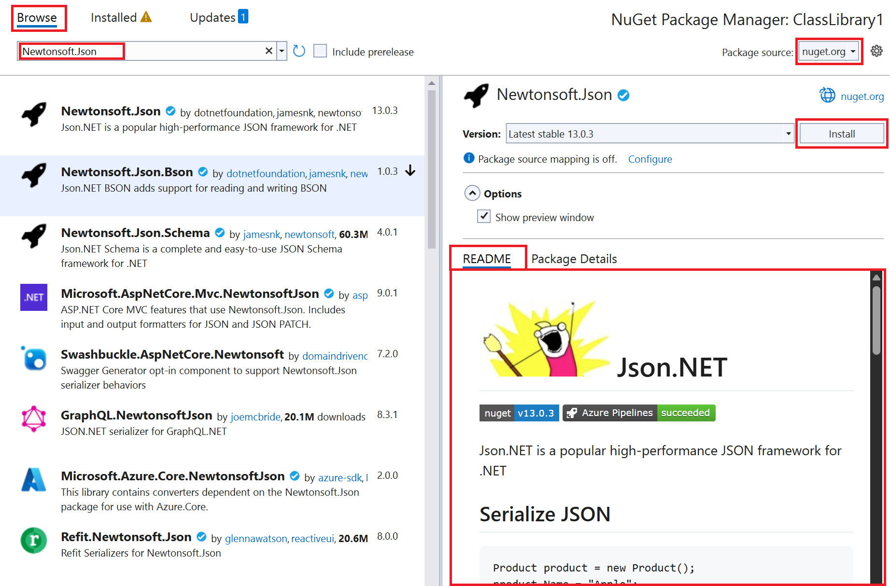
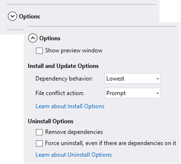

# Install and manage packages in Visual Studio using the NuGet Package Manager

The NuGet Package Manager UI in Microsoft Visual Studio for Windows allows you to easily install, uninstall, and update NuGet packages in projects and solutions.

The article is for Windows users only. If you're using Visual Studio for Mac, see [Including a NuGet package in your project](/visualstudio/mac/nuget-walkthrough?toc=/nuget/toc.json).

## Prerequisites

- Install Visual Studio 2022 for Windows with any .NET-related workload.

  You can install the 2022 Community edition for free from [visualstudio.microsoft.com](https://visualstudio.microsoft.com/), or use the Professional or Enterprise edition.

  Visual Studio 2017 and higher automatically includes NuGet Package Manager  when a .NET-related workload is installed. To install it individually in Visual Studio Installer, select the **Individual components** tab, and then select **NuGet package manager** under **Code tools** .

  For Visual Studio 2015, if you're missing the NuGet Package Manager, check **Tools** > **Extensions and Updates** and search for the *NuGet Package Manager* extension. If you're unable to use the extensions installer in Visual Studio, download the extension directly from [https://dist.nuget.org/index.html](https://dist.nuget.org/index.html).

- [Register for a free account on nuget.org](../nuget-org/individual-accounts.md#add-a-new-individual-account) if you don't have one already. You must register and confirm the account before you can upload a NuGet package.

## Find and install a package

To find and install a NuGet package with Visual Studio, follow these steps:

1. Load a project in **Solution Explorer**, and then select **Project** > **Manage NuGet Packages**.

   The **NuGet Package Manager** window opens.

1. Select the **Browse** tab to display packages by popularity from the currently selected source (see [Package sources](#package-sources)).

    - To search for a specific package, use the search box on the upper left.
    - Abbreviated information may be shown beside each package ID to help identify the correct package, and varies based on the selected package source(s).
  Examples include package download count, author, or owner profile hyperlinks.

    > [!Note]
    > In Visual Studio 17.11 and higher, package owners are shown as profile hyperlinks when supported by the selected package source.
    > Package ownership is defined by the package source. For example, see [Manage package owners on nuget.org](../nuget-org/publish-a-package.md#manage-package-owners-on-nugetorg).
    >
    > In Visual Studio 17.10 and earlier, the package _author_ metadata is shown, which appears as plain-text.
    > For more information, see [Authors package metadata](../create-packages/package-authoring-best-practices.md#authors).

    - Select a package to see detailed package information.
    The details pane on the right appears and enables you to select a version to install.
    
    You can see package metadata, information about the owner(s), author(s), license, etc., in the Package Details tab and the package README file (if it is provided by the package author) in the README tab.
    

1. In the right pane, select a **Version** from the dropdown list. If you want to include prerelease versions in the **Version** list, select **Include prerelease**.

1. To install the NuGet package, select **Install**. You might be asked to accept license terms or prompted to verify the installation.

   Visual Studio installs the package and its dependencies in the project. When installation is complete, the added packages appear on the **Installed** tab. You can also find packages in the **Dependencies** > **Packages** node of your project in **Solution Explorer**. After you install a package, you can refer to it in the project with a `using` statement.

1. (Optional) NuGet has two formats in which a project can use packages: [PackageReference](package-references-in-project-files.md) and [packages.config](../reference/packages-config.md). To set the default format, select **Tools** > **Options**, expand **NuGet Package Manager**, select **General**, and then choose the **Default package management format**. For more information, see [Choose default package management format](package-restore.md#choose-default-package-management-format).

## Uninstall a package

To uninstall a NuGet package, follow these steps:

1. Load a project in **Solution Explorer**, select **Project** > **Manage NuGet Packages**, and then select the **Installed** tab.

1. Select the package to uninstall in the left pane (use the **Search** box to find it, if necessary), and then select **Uninstall** from the right pane.

    

## Update a package

To update a NuGet package, follow these steps:

1. Load a project in **Solution Explorer**, and then select **Project** > **Manage NuGet Packages**. For website projects, select the **Bin** folder first.

1. Select the **Updates** tab to see packages that have available updates from the selected **Package source**. Select **Include prerelease** to include prerelease packages in the update list.

1. Select the package to update. On the right pane, select the desired **Version** from the dropdown list, and then select **Update**.

    

1. For some packages, the **Update** button is disabled and the following message appears: *Implicitly referenced by an SDK. To update the package, update the SDK to which it belongs.* This message indicates that the package is part of a larger framework or SDK and can't be updated independently. Such packages are internally marked with `<IsImplicitlyDefined>True</IsImplicitlyDefined>`. For example, `Microsoft.NETCore.App` is part of the .NET Core SDK, and the package version is different than the version of the runtime framework used by the application. To download a new version of the .NET Core, [update your .NET Core installation](https://aka.ms/dotnet-download). For more information, see [.NET Core metapackages and versioning](/dotnet/core/packages). This scenario applies to the following commonly used packages:
   - Microsoft.AspNetCore.All
   - Microsoft.AspNetCore.App
   - Microsoft.NETCore.App
   - NETStandard.Library

    

1. To update multiple packages to their latest versions, choose them in the NuGet package list, and then select **Update**.

1. You can also update an individual package from the **Installed** tab. For this case, you can also select a **Version** and the **Include prerelease** option.

## Manage packages for the solution

Managing packages for a solution is a convenient means to work with multiple projects simultaneously:

1. Select a solution in **Solution Manager**, and then select **Tools** > **NuGet Package Manager** > **Manage NuGet Packages for Solution**.

1. In the **Manage NuGet Packages for Solution** window, select the projects that are affected by the operations.

    

### Consolidate tab

Developers typically consider it bad practice to use different versions of the same NuGet package across different projects in the same solution. Visual Studio allows you to use a common version for your NuGet packages. To do so, use the **Consolidate** tab of the **NuGet Package Manager** window to discover where packages with distinct version numbers are used by different projects in the solution.

In this example, the ClassLibrary1 project is using EntityFramework 6.2.0, whereas ConsoleApp1 is using EntityFramework 6.1.0. To consolidate package versions, follow these steps:

1. From the **Consolidate** tab, select the projects to update in the project list.

1. Select the version to use for all these projects in the **Version** list.

1. Select **Install**.

   The NuGet Package Manager installs the selected package version into all the selected projects, after which the package no longer appears on the **Consolidate** tab.

## Package sources

Visual Studio ignores the order of package sources, and uses the package from whichever source is the first to respond to a request. For more information, see [Restore packages](package-restore.md). For information about how to load a package from a specific source, see [Package source mapping](package-source-mapping.md).

To manage NuGet package sources, follow these steps:

1. To change the source from which Visual Studio loads package metadata, select a source from the **Package source** selector.

   

1. To manage your package sources, select the **Settings** icon or select **Tools** > **Options**.

    

1. In the **Options** window, expand the **NuGet Package Manager** node and select **Package Sources**.

    

1. To add a source, select **+**, edit the **Name**, enter the URL or path in **Source**, and then select  **Update**.

   The source now appears in the **Package source** dropdown list.

1. To change a package source, select it, make edits in the **Name** and **Source** boxes, and select **Update**.

1. To disable a package source, clear the box to the left of the name in the list.

1. To remove a package source, select it, and then select the **X** button.

   If a package source reappears after you delete it, it might be listed in a computer-level or user-level *NuGet.config* file. For the location of these files, see [Common NuGet configurations](../consume-packages/configuring-nuget-behavior.md). Remove the package source in the files by editing them manually or using the [nuget sources command](../reference/nuget-exe-CLI-reference.md).

## NuGet Package Manager Options control

When you select a package, the NuGet Package Manager displays an expandable **Options** control below the **Version** selector. For most project types, only the **Show preview window** option is provided.

The following sections explain the available options.

<!-- This is here because the link in the UI needs this anchor. See https://github.com/NuGet/NuGet.Client/blob/dev/src/NuGet.Clients/PackageManagement.UI/Xamls/OptionsControl.xaml -->

### Install and update options

These options are available only for certain project types:

- **Dependency behavior**: This option configures how NuGet decides which versions of dependent packages to install. It has the following settings:

  - **Ignore dependencies** skips the installation of dependencies, which typically breaks the package being installed.
  - **Lowest** [Default] installs the dependency with the minimal version number that meets the requirements of the primary chosen package.
  - **Highest Patch** installs the version with the same major and minor version numbers, but the highest patch number. For example, if version 1.2.2 is specified then the highest version that starts with 1.2 will be installed
  - **Highest Minor** installs the version with the same major version number but the highest minor number and patch number. If version 1.2.2 is specified, then the highest version that starts with 1 will be installed
  - **Highest** installs the highest available version of the package.

- **File conflict action**: This option specifies how NuGet should handle packages that already exist in the project or local machine. It has the following settings:

  - **Prompt** instructs NuGet to ask whether to keep or overwrite existing packages.
  - **Ignore All** instructs NuGet to skip overwriting any existing packages.
  - **Overwrite All** instructs NuGet to overwrite any existing packages.

<!-- This is here because the link in the UI needs this anchor. See https://github.com/NuGet/NuGet.Client/blob/dev/src/NuGet.Clients/PackageManagement.UI/Xamls/OptionsControl.xaml -->

### Uninstall options

These options are available only for certain project types:

- **Remove dependencies**: When selected, removes any dependent packages if they're not referenced elsewhere in the project.

- **Force uninstall even if there are dependencies on it**: When selected, uninstalls a package even if it's still being referenced in the project. This option is typically used in combination with **Remove dependencies** to remove a package and whatever dependencies it installed. Using this option may, however, lead to broken references in the project. In such a case, you might need to [reinstall those other packages](../consume-packages/reinstalling-and-updating-packages.md).

## Related video

- Find NuGet videos on [Channel 9](/shows/nuget-101/) and [YouTube](https://www.youtube.com/playlist?list=PLdo4fOcmZ0oVLvfkFk8O9h6v2Dcdh2bh_).

## See also

For more information about NuGet, see the following articles:

- [What is NuGet?](../what-is-nuget.md)
- [Package consumption workflow](overview-and-workflow.md)
- [Find and choose packages](finding-and-choosing-packages.md)
- [Package references in project files](package-references-in-project-files.md)
- [Install and use a package using the .NET CLI](../quickstart/install-and-use-a-package-using-the-dotnet-cli.md).
