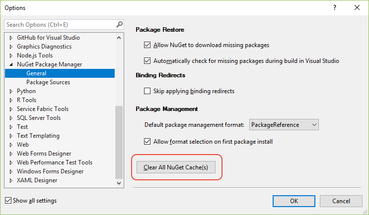

# Managing the global packages, cache, and temp folders

Whenever you install, update, or restore a package, NuGet manages packages and package information in several folders outside of your project structure:

| Name | Description and Location (per user)|
| --- | --- |
| global-packages | The *global-packages* folder is where NuGet installs any downloaded package. Each package is fully expanded into a subfolder that matches the package identifier and version number. Projects using the [PackageReference](package-references-in-project-files.md) format always use packages directly from this folder. When using the [packages.config](../reference/packages-config.md), packages are installed to the *global-packages* folder, then copied into the project's `packages` folder.<br/><ul><li>Windows: `%userprofile%\.nuget\packages`</li><li>Mac/Linux: `~/.nuget/packages`</li><li>Override using the NUGET_PACKAGES environment variable, the `globalPackagesFolder` or `repositoryPath` [configuration settings](../reference/nuget-config-file.md#config-section) (when using PackageReference and `packages.config`, respectively), or the `RestorePackagesPath` MSBuild property (MSBuild only). The environment variable takes precedence over the configuration setting.</li></ul> |
| http-cache | The Visual Studio Package Manager (NuGet 3.x+) and the `dotnet` tool store copies of downloaded packages in this cache (saved as `.dat` files), organized into subfolders for each package source. Packages are not expanded, and the cache has an expiration time of 30 minutes.<br/><ul><li>Windows: `%localappdata%\NuGet\v3-cache`</li><li>Mac/Linux: `~/.local/share/NuGet/v3-cache`</li><li>Override using the NUGET_HTTP_CACHE_PATH environment variable.</li></ul> |
| temp | A folder where NuGet stores temporary files during its various operations.<br/><li>Windows: `%temp%\NuGetScratch`</li><li>Mac/Linux: `/tmp/NuGetScratch`</li></ul> |
| plugins-cache **4.8+** | A folder where NuGet stores the results from the operation claims request.<br/><ul><li>Windows: `%localappdata%\NuGet\plugins-cache`</li><li>Mac/Linux: `~/.local/share/NuGet/plugins-cache`</li><li>Override using the NUGET_PLUGINS_CACHE_PATH environment variable.</li></ul> |

> [!Note]
> NuGet 3.5 and earlier uses *packages-cache* instead of the *http-cache*, which is located in `%localappdata%\NuGet\Cache`.

By using the cache and *global-packages* folders, NuGet generally avoids downloading packages that already exist on the computer, improving the performance of install, update, and restore operations. When using PackageReference, the *global-packages* folder also avoids keeping downloaded packages inside project folders, where they might be inadvertently added to source control, and reduces NuGet's overall impact on computer storage.

When asked to retrieve a package, NuGet first looks in the *global-packages* folder. If the exact version of package is not there, then NuGet checks all non-HTTP package sources. If the package is still not found, NuGet looks for the package in the *http-cache* unless you specify `--no-cache` with `dotnet.exe` commands or `-NoCache` with `nuget.exe` commands. If the package is not in the cache, or the cache isn't used, NuGet then retrieves the package over HTTP .

For more information, see [What happens when a package is installed?](../concepts/package-installation-process.md).

## Viewing folder locations

You can view locations using the [nuget locals command](../reference/cli-reference/cli-ref-locals.md):

```cli
# Display locals for all folders: global-packages, http cache, temp and plugins cache
nuget locals all -list
```

Typical output (Windows; "user1" is the current username):

```output
http-cache: C:\Users\user1\AppData\Local\NuGet\v3-cache
global-packages: C:\Users\user1\.nuget\packages\
temp: C:\Users\user1\AppData\Local\Temp\NuGetScratch
plugins-cache: C:\Users\user1\AppData\Local\NuGet\plugins-cache
```

(`package-cache` is used in NuGet 2.x and appears with NuGet 3.5 and earlier.)

You can also view folder locations using the [dotnet nuget locals command](/dotnet/core/tools/dotnet-nuget-locals):

```dotnetcli
dotnet nuget locals all --list
```

Typical output (Mac/Linux; "user1" is the current username):

```output
info : http-cache: /home/user1/.local/share/NuGet/v3-cache
info : global-packages: /home/user1/.nuget/packages/
info : temp: /tmp/NuGetScratch
info : plugins-cache: /home/user1/.local/share/NuGet/plugins-cache
```

To display the location of a single folder, use `http-cache`, `global-packages`, `temp`, or `plugins-cache` instead of `all`.

## Clearing local folders

If you encounter package installation problems or otherwise want to ensure that you're installing packages from a remote gallery, use the `locals --clear` option (dotnet.exe) or `locals -clear` (nuget.exe), specifying the folder to clear, or `all` to clear all folders:

```cli
# Clear the 3.x+ cache (use either command)
dotnet nuget locals http-cache --clear
nuget locals http-cache -clear

# Clear the 2.x cache (NuGet CLI 3.5 and earlier only)
nuget locals packages-cache -clear

# Clear the global packages folder (use either command)
dotnet nuget locals global-packages --clear
nuget locals global-packages -clear

# Clear the temporary cache (use either command)
dotnet nuget locals temp --clear
nuget locals temp -clear

# Clear the plugins cache (use either command)
dotnet nuget locals plugins-cache --clear
nuget locals plugins-cache -clear

# Clear all caches (use either command)
dotnet nuget locals all --clear
nuget locals all -clear
```

Any packages used by projects that are currently open in Visual Studio are not cleared from the *global-packages* folder.

Starting in Visual Studio 2017, use the **Tools > NuGet Package Manager > Package Manager Settings** menu command, then select **Clear All NuGet Cache(s)**. Managing the cache isn't presently available through the Package Manager Console. In Visual Studio 2015, use the CLI commands instead.



## Troubleshooting errors

The following errors can occur when using `nuget locals` or `dotnet nuget locals`:

- *Error: The process cannot access the file \<package\> because it is being used by another process* or *Clearing local resources failed: Unable to delete one or more files*

    One or more files in the folder are in use by another process; for example, a Visual Studio project is open that refers to packages in the *global-packages* folder. Close those processes and try again.

- *Error: Access to the path \<path\> is denied* or *The directory is not empty*

    You don't have permission to delete files in the cache. Change the folder permissions, if possible, and try again. Otherwise, contact your system administrator.

- *Error: The specified path, file name, or both are too long. The fully qualified file name must be less than 260 characters, and the directory name must be less than 248 characters.*

    Shorten the folder names and try again.
