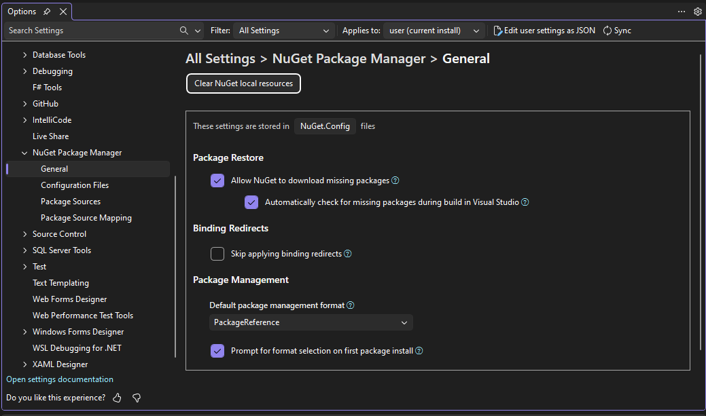
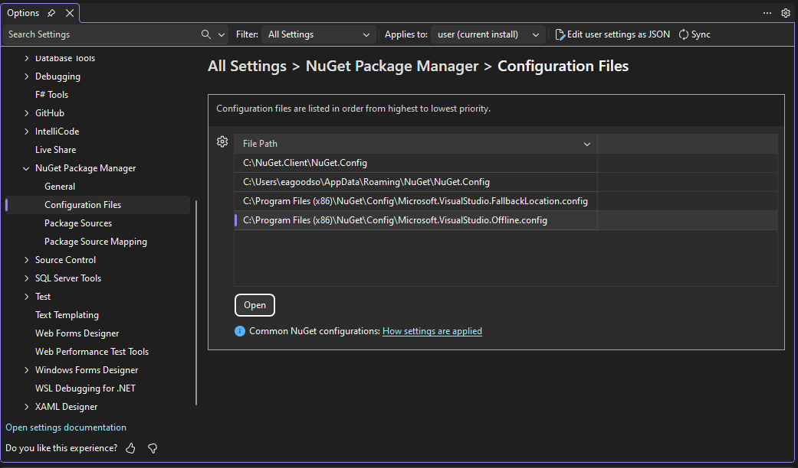
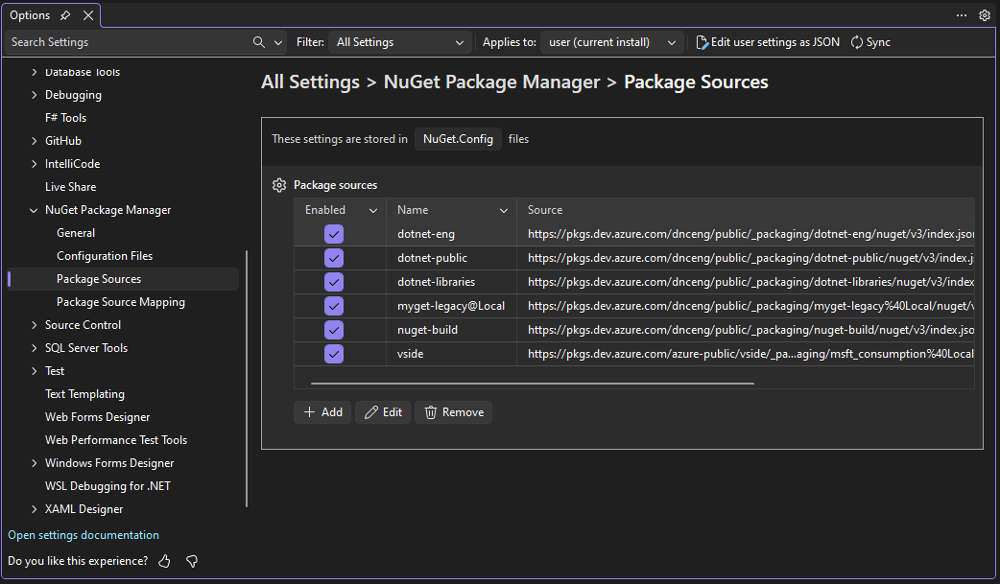
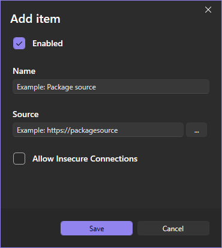
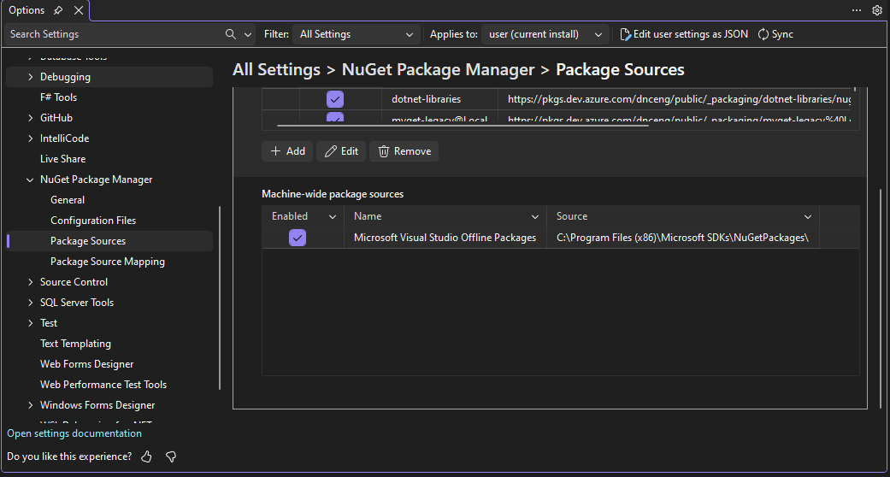
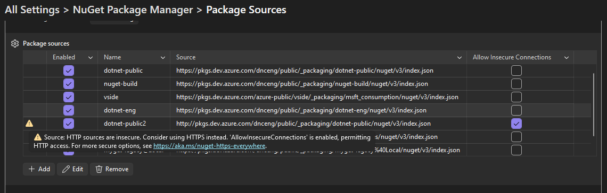
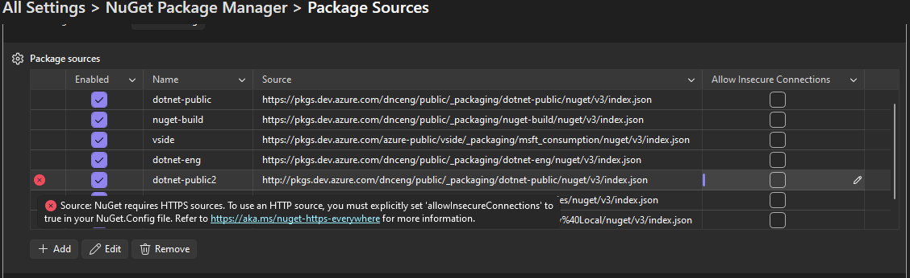

# NuGet Package Manager Options in Visual Studio

Visual Studio provides several options pages for configuring NuGet Package Manager behavior.
Configuration settings for NuGet are stored in your [NuGet.Config file(s)](../reference/nuget-config-file.md).

## Accessing NuGet Options

There are multiple ways to access NuGet Package Manager options:

1. **From the main menu**: Go to **Tools > Options**, then expand **NuGet Package Manager** in the left pane.
1. **From the NuGet menu** found under the **Tools > NuGet Package Manager > Package Manager Settings** menu command.
1. **Quick search**: Press **Ctrl+Q** and search for "NuGet" or a NuGet-related setting name to quickly jump to its Options page.
1. **From Package Manager UI**: Press the settings (gear) icon in the Package Manager UI toolbar.
1. **From Package Manager Console**: Click the settings (gear) icon in the Package Manager Console toolbar.

## General

The General options page contains settings that control NuGet's package management behavior.



### Package Management

- **Default package management format**: Choose between the NuGet formats [PackageReference](package-references-in-project-files.md) (recommended for most projects) and [packages.config](../reference/packages-config.md) (legacy format for older projects).
For more information, see [Choose default package management format](package-restore.md#choose-default-package-management-format).

  - **PackageReference**: Stores package references directly in project files. This is the modern format that supports better dependency resolution and is required for SDK-style projects
  - **packages.config**: Legacy XML file format that stores package information separately from the project file

- **Prompt for format selection on first package install**: When enabled, Visual Studio will ask you to choose between PackageReference and packages.config the first time you install a package in a project that doesn't already have packages.

### Package Restore

Settings for automatic package restore during build operations:

- **Allow NuGet to download missing packages**: When enabled, NuGet automatically downloads packages during build
- **Automatically check for missing packages during build in Visual Studio**: Checks for missing packages and restores them before build

See [Package Restore](Package-Restore.md) for more information on package restore behavior.

### Package Updates

- **Skip applying binding redirects**: When enabled, NuGet will not automatically add or update binding redirects in app.config or web.config files during package installation or updates

### Clear NuGet Local Resources

The **Clear NuGet Local Resources** command button allows you to clear NuGet's local caches, including:

- **http-cache**: Downloaded package metadata and packages
- **global-packages**: Installed packages folder
- **temp**: Temporary files
- **plugins-cache**: Plugin operation results

For more information on NuGet caches and folders, see [Managing the global packages, cache, and temp folders](managing-the-global-packages-and-cache-folders.md).

## Configuration Files

The Configuration Files options page displays the NuGet.Config files that apply to your current solution and allows you to open them directly in Visual Studio for editing.

To edit a file, select a File Path and press the "Open" button.
The file will open in a new tab in Visual Studio where it may be edited directly.



Configuration files are listed in order from highest to lowest priority.
NuGet uses a hierarchical configuration system where settings from multiple config files are merged.
For more information, see [Common NuGet configurations](configuring-nuget-behavior.md).

## Package Sources

The Package Sources options page allows you to manage the sources from which NuGet downloads packages.



### Managing Package Sources

Lists all configured package sources according to your NuGet.Config files.

- **Name**: Display name for the source
- **Source**: URL or file path for the package source
- **Enabled checkbox**: Enable or disable a source without removing it.
- **Allow Insecure Connections**: Enable or disable allowing insecure HTTP connections

To modify, use the **Add, Edit, and Remove buttons** below the table.
Checkboxes may be toggled directly in the table.
Press "Save" on the Add/Edit dialog and the changes will be updated in the relevant NuGet.Config file.



### Machine-wide Package Sources

"Machine-wide package sources" are listed below which are package sources defined at the machine level.
These are usually configured by Visual Studio workloads and cannot be modified other than Enabling or Disabling the package source by toggling the checkbox in the Enabled column.



### Allow Insecure Connections

For security reasons, NuGet enforces the use of HTTPS sources by default.
If you need to use an HTTP source, you must explicitly allow it.
When an HTTP source is used, the first column of the Package Sources table will show an icon with information about a warning or an error with the package source in that row.

⚠️ When an HTTP package source is used and Allow Insecure Connections is enabled, a warning is shown in the leftmost status column:

> HTTP sources are insecure. Consider using HTTPS instead. 'AllowInsecureConnections' is enabled, permitting HTTP access.



❌ When an HTTP source is used and Allow Insecure Connections is disabled, an error is shown in the leftmost status column and NuGet restore will fail:

> NuGet requires HTTPS sources. To use an HTTP source, you must explicitly set 'allowInsecureConnections' to true in your NuGet.Config file.



For more information on configuring HTTP source permissions, see <https://aka.ms/nuget-https-everywhere>.

## Package Source Mapping

Package Source Mapping allows you to control which package sources are used for specific packages, improving supply chain security.

> [!NOTE]
> Package Source Mapping was introduced in NuGet 6.0 and Visual Studio 2022 version 17.5 added UI support in the Options dialog. In Visual Studio 17.14+, this is available in Unified Settings.

**[PLACEHOLDER FOR SCREENSHOT: Package Source Mapping page showing existing mappings]**
*Suggested screenshot: Show the Package Source Mapping page in Unified Settings with several package patterns mapped to different sources. Include examples like "Microsoft.*" mapped to nuget.org and "Contoso.*" mapped to a private feed.*

### Why Use Package Source Mapping?

By default, NuGet searches all configured package sources when restoring packages. Package Source Mapping allows you to:

- **Filter package sources**: Specify which source(s) to use for each package or package pattern
- **Improve security**: Prevent packages from being downloaded from untrusted sources
- **Improve restore performance**: Reduce the number of sources NuGet needs to query
- **Ensure deterministic restores**: Eliminate ambiguity when a package exists on multiple sources

### Configuring Package Source Mapping in Visual Studio

1. Navigate to **Tools > Options > NuGet Package Manager > Package Source Mapping**
2. Click **Add** to create a new mapping
3. Enter a **Package pattern** (e.g., `Microsoft.*` or `Contoso.Contracts`)
4. Select one or more **package sources** for this pattern
5. Click **Save** to add the mapping
6. Click **OK** to apply changes

**[PLACEHOLDER FOR SCREENSHOT: Add Package Source Mapping dialog]**
*Suggested screenshot: Show the "Add Package Source Mapping" dialog with a package pattern entered and source(s) selected.*

### Package Pattern Syntax

- **Package ID pattern**: Exact match (e.g., `Newtonsoft.Json`)
- **Package prefix pattern**: Wildcard pattern (e.g., `Microsoft.*` matches all packages starting with "Microsoft.")
- **Wildcard pattern**: `*` matches all packages (used to set a default source)

### Pattern Precedence

When multiple patterns match a package:

1. Exact package ID has highest precedence
2. Longer prefix patterns have precedence over shorter ones
3. `*` (wildcard) has lowest precedence

### Example Configuration

```xml
<packageSourceMapping>
  <packageSource key="nuget.org">
    <package pattern="*" />
  </packageSource>
  <packageSource key="contoso">
    <package pattern="Contoso.*" />
    <package pattern="Contoso.Special.Package" />
  </packageSource>
</packageSourceMapping>
```

This configuration maps all `Contoso.*` packages to the "contoso" source, while all other packages come from "nuget.org".

For more information and advanced scenarios, see [Package Source Mapping](Package-Source-Mapping.md).

## Screenshot Guidelines for Contributors

When creating screenshots for Visual Studio documentation:

1. **Resolution**: Use a display resolution of 1920x1080 or higher
2. **Scaling**: Set Windows display scaling to 100% for consistent appearance
3. **Theme**: Use the Visual Studio Light theme (or Blue theme) for better visibility in documentation
4. **Zoom level**: Use default zoom level (100%) in Visual Studio
5. **Annotations**:
   - Use red rounded rectangles to highlight important UI elements
   - Add arrows to guide the reader's attention when showing workflows
   - Keep annotations minimal and purposeful
6. **File format**: Save screenshots as PNG for best quality
7. **Consistency**: Match the style and appearance of other Visual Studio documentation screenshots

For more details on screenshot best practices, see the [README.md](../../README.md#screenshots-and-images) in this repository.

## See Also

- [NuGet.Config reference](../reference/nuget-config-file.md)
- [Package Restore](Package-Restore.md)
- [Package Source Mapping](Package-Source-Mapping.md)
- [Managing the global packages, cache, and temp folders](managing-the-global-packages-and-cache-folders.md)
