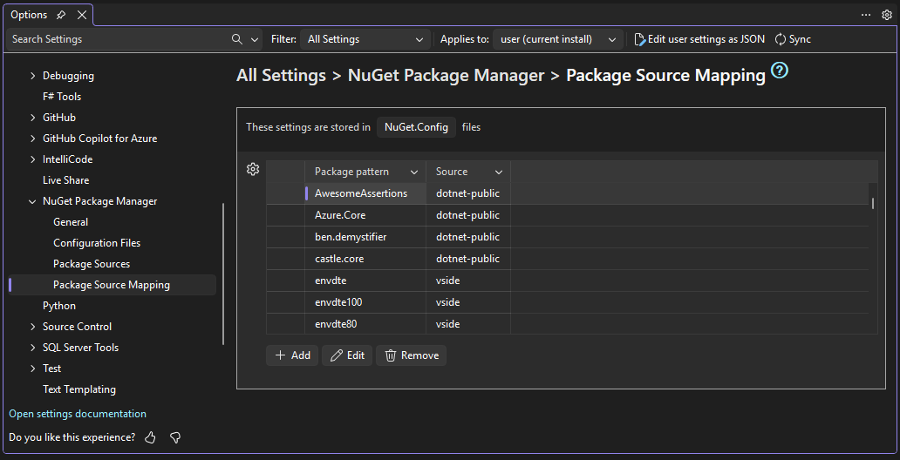

# NuGet Package Manager Options in Visual Studio

Visual Studio provides several options pages for configuring NuGet Package Manager behavior.
Configuration settings for NuGet are stored in your [NuGet.Config file(s)](../reference/nuget-config-file.md).

## Accessing NuGet Options

There are multiple ways to access NuGet Package Manager options:

1. **From the main menu**: Go to **Tools > Options**, then expand **NuGet Package Manager** in the left pane.
1. **From the NuGet menu** found under the **Tools > NuGet Package Manager > Package Manager Settings** menu command.
1. **Quick search**: Use [Visual Studio search](/visualstudio/ide/visual-studio-search) to search for "NuGet" or a NuGet-related setting name to quickly jump to its Options page.
1. **From Package Manager UI**: Press the settings (gear) icon in the Package Manager UI toolbar.
1. **From Package Manager Console**: Click the settings (gear) icon in the Package Manager Console toolbar.

## General

The General options page contains settings that control NuGet's package management behavior.

### Package Restore

Settings for automatic package restore during build operations:

- **Allow NuGet to download missing packages**: Select to enable package restore and the Restore NuGet Packages command.
- **Automatically check for missing packages during build in Visual Studio**: Select to automatically restore any missing packages when you run a build from Visual Studio.

See [Package Restore](Package-Restore.md) for more information on package restore behavior.

### Binding Redirects

- **Skip applying binding redirects**: When enabled, NuGet will not automatically add or update binding redirects in app.config or web.config files during package installation or updates

### Package Management

- **Default package management format**: Choose between the NuGet formats [PackageReference](package-references-in-project-files.md) (recommended for most projects) and [packages.config](../reference/packages-config.md) (legacy format for older projects).
  For more information, see [Choose default package management format](package-restore.md#choose-default-package-management-format).

  - **PackageReference**: Stores package references directly in project files. This is the modern format that supports better dependency resolution and is required for SDK-style projects
  - **packages.config**: Legacy XML file format that stores package information separately from the project file

- **Prompt for format selection on first package install**: When enabled, Visual Studio will ask you to choose between PackageReference and packages.config the first time you install a package in a project that doesn't already have packages.

### Clear NuGet Local Resources

The **Clear NuGet Local Resources** command button allows you to clear NuGet's local caches, including:

- **http-cache**: Downloaded package metadata and packages
- **global-packages**: Installed packages folder
- **temp**: Temporary files
- **plugins-cache**: Plugin operation results

For more information on NuGet caches and folders, see [Managing the global packages, cache, and temp folders](managing-the-global-packages-and-cache-folders.md).

## Configuration Files

The Configuration Files options page displays the NuGet.Config files that apply to your current solution and allows you to open them directly in Visual Studio for editing.

To edit a file, select a File Path and press the "Open" button.
The file will open in a new tab in Visual Studio where it may be edited directly.

Configuration files are listed in order from highest to lowest priority.
NuGet uses a hierarchical configuration system where settings from multiple config files are merged.
For more information, see [Common NuGet configurations](configuring-nuget-behavior.md).

## Package Sources

The Package Sources options page allows you to manage the sources from which NuGet downloads packages.

### Managing Package Sources

Lists all configured package sources according to your NuGet.Config files.

- **Name**: Display name for the source
- **Source**: URL or file path for the package source
- **Enabled checkbox**: Enable or disable a source without removing it.
- **Allow Insecure Connections**: Enable or disable allowing insecure HTTP connections

To modify, use the **Add, Edit, and Remove buttons** below the table.
Checkboxes may be toggled directly in the table.
Press "Save" on the Add/Edit dialog and the changes will be updated in the relevant NuGet.Config file.

### Machine-wide Package Sources

Package sources defined at the machine level appear in a dedicated section below.
These are generally provisioned by Visual Studio workloads and can only be enabled or disabled using the checkbox in the Enabled column.

### Allow Insecure Connections

For security reasons, NuGet enforces the use of HTTPS sources by default.
If you need to use an HTTP source, you must explicitly allow it.
When an HTTP source is used, the first column of the Package Sources table will show an icon with information about a warning or an error with the package source in that row.

⚠️ When an HTTP package source is used and Allow Insecure Connections is enabled, a warning is shown in the leftmost status column:

> HTTP sources are insecure. Consider using HTTPS instead. 'AllowInsecureConnections' is enabled, permitting HTTP access.

❌ When an HTTP source is used and Allow Insecure Connections is disabled, an error is shown in the leftmost status column and NuGet restore will fail:

> NuGet requires HTTPS sources. To use an HTTP source, you must explicitly set 'allowInsecureConnections' to true in your NuGet.Config file.

For more information on configuring HTTP source permissions, see <https://aka.ms/nuget-https-everywhere>.

## Package Source Mapping

Package Source Mapping allows you to control which package sources are used for specific packages, improving supply chain security.

To modify, use the **Add, Edit, and Remove buttons** below the table.

### Managing Package Source Mappings

Lists all configured package source mappings according to your NuGet.Config files.

- **Package pattern**: Package pattern that is currently mapped (e.g., `Microsoft.*` or `Contoso.Contracts`)
- **Source**: One or more package sources mapped to the package pattern.
  Package sources must be enabled to be shown.

To modify, use the **Add, Edit, and Remove buttons** below the table.
Press "Save" on the Add/Edit dialog and the changes will be updated in the relevant NuGet.Config file.

For more information, see [Package Source Mapping](Package-Source-Mapping.md).

### Invalid Source Mappings

If a package source listed in your existing source mapping isn't enabled in your NuGet.Config file(s), an error will appear in the leftmost column.

Make sure all Source values in your mappings refer to package sources that are both available and enabled. Otherwise, the mapping may not work as expected.

