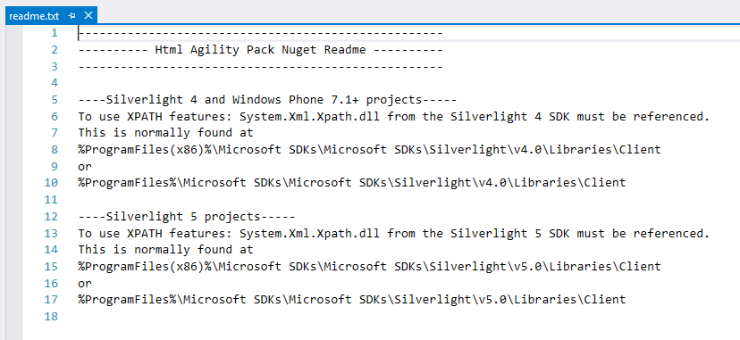

# Create a package using the nuget.exe CLI

No matter what your package does or what code it contains, you use one of the CLI tools, either `nuget.exe` or `dotnet.exe`, to package that functionality into a component that can be shared with and used by any number of other developers. To install NuGet CLI tools, see [Install NuGet client tools](../install-nuget-client-tools.md). Note that Visual Studio does not automatically include a CLI tool.

- For non-SDK-style projects, typically .NET Framework projects, follow the steps described in this article to create a package. For step-by-step instructions using Visual Studio and the `nuget.exe` CLI, see [Create and publish a .NET Framework package](../quickstart/create-and-publish-a-package-using-visual-studio-net-framework.md).

- For .NET Core and .NET Standard projects that use the [SDK-style format](../resources/check-project-format.md), and any other SDK-style projects, see [Create a NuGet package using the dotnet CLI](creating-a-package-dotnet-cli.md).

- For projects migrated from `packages.config` to [PackageReference](../consume-packages/package-references-in-project-files.md), use [msbuild -t:pack](../consume-packages/migrate-packages-config-to-package-reference.md#create-a-package-after-migration).

Technically speaking, a NuGet package is just a ZIP file that's been renamed with the `.nupkg` extension and whose contents match certain conventions. This topic describes the detailed process of creating a package that meets those conventions.

Packaging begins with the compiled code (assemblies), symbols, and/or other files that you want to deliver as a package (see [Overview and workflow](overview-and-workflow.md)). This process is independent from compiling or otherwise generating the files that go into the package, although you can draw from information in a project file to keep the compiled assemblies and packages in sync.

> [!Important]
> This topic applies to non-SDK-style projects, typically projects other than .NET Core and .NET Standard projects using Visual Studio 2017 and higher versions and NuGet 4.0+.

## Decide which assemblies to package

Most general-purpose packages contain one or more assemblies that other developers can use in their own projects.

- In general, it's best to have one assembly per NuGet package, provided that each assembly is independently useful. For example, if you have a `Utilities.dll` that depends on `Parser.dll`, and `Parser.dll` is useful on its own, then create one package for each. Doing so allows developers to use `Parser.dll` independently of `Utilities.dll`.

- If your library is composed of multiple assemblies that aren't independently useful, then it's fine to combine them into one package. Using the previous example, if `Parser.dll` contains code that's used only by `Utilities.dll`, then it's fine to keep `Parser.dll` in the same package.

- Similarly, if `Utilities.dll` depends on `Utilities.resources.dll`, where again the latter is not useful on its own, then put both in the same package.

Resources are, in fact, a special case. When a package is installed into a project, NuGet automatically adds assembly references to the package's DLLs, *excluding* those that are named `.resources.dll` because they are assumed to be localized satellite assemblies (see [Creating localized packages](creating-localized-packages.md)). For this reason, avoid using `.resources.dll` for files that otherwise contain essential package code.

If your library contains COM interop assemblies, follow additional the guidelines in [Create packages with COM interop assemblies](author-packages-with-com-interop-assemblies.md).

## The role and structure of the .nuspec file

Once you know what files you want to package, the next step is creating a package manifest in a `.nuspec` XML file.

The manifest:

1. Describes the package's contents and is itself included in the package.
1. Drives both the creation of the package and instructs NuGet on how to install the package into a project. For example, the manifest identifies other package dependencies such that NuGet can also install those dependencies when the main package is installed.
1. Contains both required and optional properties as described below. For exact details, including other properties not mentioned here, see  the [.nuspec reference](../reference/nuspec.md).

Required properties:

- The package identifier, which must be unique across the gallery that hosts the package.
- A specific version number in the form *Major.Minor.Patch[-Suffix]* where *-Suffix* identifies [pre-release versions](prerelease-packages.md)
- The package title as it should appear on the host (like nuget.org)
- Author and owner information.
- A long description of the package.

Common optional properties:

- Release notes
- Copyright information
- A short description for the [Package Manager UI in Visual Studio](../consume-packages/install-use-packages-visual-studio.md)
- A locale ID
- Project URL
- License as an expression or file (`licenseUrl` is deprecated, use [`license` nuspec metadata element](../reference/nuspec.md#license) instead)
- An icon file (`iconUrl` is deprecated use [`icon` nuspec metadata element](../reference/nuspec.md#icon) instead)
- Lists of dependencies and references
- Tags that assist in gallery searches

The following is a typical (but fictitious) `.nuspec` file, with comments describing the properties:

```xml
<?xml version="1.0"?>
<package xmlns="http://schemas.microsoft.com/packaging/2010/07/nuspec.xsd">
    <metadata>
        <!-- Identifier that must be unique within the hosting gallery -->
        <id>Contoso.Utility.UsefulStuff</id>

        <!-- Package version number that is used when resolving dependencies -->
        <version>1.8.3</version>

        <!-- Authors contain text that appears directly on the gallery -->
        <authors>Dejana Tesic, Rajeev Dey</authors>

        <!-- 
            Owners are typically nuget.org identities that allow gallery
            users to easily find other packages by the same owners.  
        -->
        <owners>dejanatc, rjdey</owners>
        
         <!-- Project URL provides a link for the gallery -->
        <projectUrl>http://github.com/contoso/UsefulStuff</projectUrl>

         <!-- License information is displayed on the gallery -->
        <license type="expression">Apache-2.0</license>
        

        <!-- Icon is used in Visual Studio's package manager UI -->
        <icon>icon.png</icon>

        <!-- 
            If true, this value prompts the user to accept the license when
            installing the package. 
        -->
        <requireLicenseAcceptance>false</requireLicenseAcceptance>

        <!-- Any details about this particular release -->
        <releaseNotes>Bug fixes and performance improvements</releaseNotes>

        <!-- 
            The description can be used in package manager UI. Note that the
            nuget.org gallery uses information you add in the portal. 
        -->
        <description>Core utility functions for web applications</description>

        <!-- Copyright information -->
        <copyright>Copyright ©2016 Contoso Corporation</copyright>

        <!-- Tags appear in the gallery and can be used for tag searches -->
        <tags>web utility http json url parsing</tags>

        <!-- Dependencies are automatically installed when the package is installed -->
        <dependencies>
            <dependency id="Newtonsoft.Json" version="9.0" />
        </dependencies>
    </metadata>

    <!-- A readme.txt to display when the package is installed -->
    <files>
        <file src="readme.txt" target="" />
        <file src="icon.png" target="" />
    </files>
</package>
```

For details on declaring dependencies and specifying version numbers, see [packages.config](../reference/packages-config.md) and [Package versioning](../concepts/package-versioning.md). It is also possible to surface assets from dependencies directly in the package by using the `include` and `exclude` attributes on the `dependency` element. See [.nuspec Reference - Dependencies](../reference/nuspec.md#dependencies).

Because the manifest is included in the package created from it, you can find any number of additional examples by examining existing packages. A good source is the *global-packages* folder on your computer, the location of which is returned by the following command:

```cli
nuget locals -list global-packages
```

Go into any *package\version* folder, copy the `.nupkg` file to a `.zip` file, then open that `.zip` file and examine the `.nuspec` within it.

> [!Note]
> When creating a `.nuspec` from a Visual Studio project, the manifest contains tokens that are replaced with information from the project when the package is built. See [Creating the .nuspec from a Visual Studio project](#from-a-visual-studio-project).

## Create the .nuspec file

Creating a complete manifest typically begins with a basic `.nuspec` file generated through one of the following methods:

- [A convention-based working directory](#from-a-convention-based-working-directory)
- [An assembly DLL](#from-an-assembly-dll)
- [A Visual Studio project](#from-a-visual-studio-project)    
- [New file with default values](#new-file-with-default-values)

You then edit the file by hand so that it describes the exact content you want in the final package.

> [!Important]
> Generated `.nuspec` files contain placeholders that must be modified before creating the package with the `nuget pack` command. That command fails if the `.nuspec` contains any placeholders.

### From a convention-based working directory

Because a NuGet package is just a ZIP file that's been renamed with the `.nupkg` extension, it's often easiest to create the folder structure you want on your local file system, then create the `.nuspec` file directly from that structure. The `nuget pack` command then automatically adds all files in that folder structure (excluding any folders that begin with `.`, allowing you to keep private files in the same structure).

The advantage to this approach is that you don't need to specify in the manifest which files you want to include in the package (as explained later in this topic). You can simply have your build process produce the exact folder structure that goes into the package, and you can easily include other files that might not be part of a project otherwise:

- Content and source code that should be injected into the target project.
- PowerShell scripts
- Transformations to existing configuration and source code files in a project.

The folder conventions are as follows:

| Folder | Description | Action upon package install |
| --- | --- | --- |
| (root) | Location for readme.txt | Visual Studio displays a readme.txt file in the package root when the package is installed. |
| lib/{tfm} | Assembly (`.dll`), documentation (`.xml`), and symbol (`.pdb`) files for the given Target Framework Moniker (TFM) | Assemblies are added as references for compile as well as runtime; `.xml` and `.pdb` copied into project folders. See [Supporting multiple target frameworks](supporting-multiple-target-frameworks.md) for creating framework target-specific sub-folders. |
| ref/{tfm} | Assembly (`.dll`), and symbol (`.pdb`) files for the given Target Framework Moniker (TFM) | Assemblies are added as references only for compile time; So nothing will be copied into project bin folder. |
| runtimes | Architecture-specific assembly (`.dll`), symbol (`.pdb`), and native resource (`.pri`) files | Assemblies are added as references only for runtime; other files are copied into project folders. There should always be a corresponding (TFM) `AnyCPU` specific assembly under `/ref/{tfm}` folder to provide corresponding compile time assembly. See [Supporting multiple target frameworks](supporting-multiple-target-frameworks.md). |
| content | Arbitrary files | Contents are copied to the project root. Think of the **content** folder as the root of the target application that ultimately consumes the package. To have the package add an image in the application's */images* folder, place it in the package's *content/images* folder. |
| build | *(3.x+)* MSBuild `.targets` and `.props` files | Automatically inserted into the project. |
| buildMultiTargeting | *(4.0+)* MSBuild `.targets` and `.props` files for cross-framework targeting | Automatically inserted into the project. |
| buildTransitive | *(5.0+)* MSBuild `.targets` and `.props` files that flow transitively to any consuming project. See the [feature](https://github.com/NuGet/Home/wiki/Allow-package--authors-to-define-build-assets-transitive-behavior) page. | Automatically inserted into the project. |
| tools | Powershell scripts and programs accessible from the Package Manager Console | The `tools` folder is added to the `PATH` environment variable for the Package Manager Console only (Specifically, *not* to the `PATH` as set for MSBuild when building the project). |

Because your folder structure can contain any number of assemblies for any number of target frameworks, this method is necessary when creating packages that support multiple frameworks.

In any case, once you have the desired folder structure in place, run the following command in that folder to create the `.nuspec` file:

```cli
nuget spec
```

Again, the generated `.nuspec` contains no explicit references to files in the folder structure. NuGet automatically includes all files when the package is created. You still need to edit placeholder values in other parts of the manifest, however.

### From an assembly DLL

In the simple case of creating a package from an assembly, you can generate a `.nuspec` file from the metadata in the assembly using the following command:

```cli
nuget spec <assembly-name>.dll
```

Using this form replaces a few placeholders in the manifest with specific values from the assembly. For example, the `<id>` property is set to the assembly name, and `<version>` is set to the assembly version. Other properties in the manifest, however, don't have matching values in the assembly and thus still contain placeholders.

### From a Visual Studio project

Creating a `.nuspec` from a `.csproj` or `.vbproj` file is convenient because other packages that have been installed into those project are automatically referenced as dependencies. Simply use the following command in the same folder as the project file:

```cli
# Use in a folder containing a project file <project-name>.csproj or <project-name>.vbproj
nuget spec
```

The resulting `<project-name>.nuspec` file contains *tokens* that are replaced at packaging time with values from the project, including references to any other packages that have already been installed.

If you have package dependencies to include in the *.nuspec*, instead use `nuget pack`, and get the *.nuspec* file from within the generated *.nupkg* file. For example, use the following command.

```cli
# Use in a folder containing a project file <project-name>.csproj or <project-name>.vbproj
nuget pack myproject.csproj
```

A token is delimited by `$` symbols on both sides of the project property. For example, the `<id>` value in a manifest generated in this way typically appears as follows:

```xml
<id>$id$</id>
```

This token is replaced with the `AssemblyName` value from the project file at packing time. For the exact mapping of project values to `.nuspec` tokens, see the [Replacement Tokens reference](../reference/nuspec.md#replacement-tokens).

Tokens relieve you from needing to update crucial values like the version number in the `.nuspec` as you update the project. (You can always replace the tokens with literal values, if desired). 

Note that there are several additional packaging options available when working from a Visual Studio project, as described in [Running nuget pack to generate the .nupkg file](#run-nuget-pack-to-generate-the-nupkg-file) later on.

#### Solution-level packages

*NuGet 2.x only. Not available in NuGet 3.0+.*

NuGet 2.x supported the notion of a solution-level package that installs tools or additional commands for the Package Manager Console (the contents of the `tools` folder), but does not add references, content, or build customizations to any projects in the solution. Such packages contain no files in its direct `lib`, `content`, or `build` folders, and none of its dependencies have files in their respective `lib`, `content`, or `build` folders.

NuGet tracks installed solution-level packages in a `packages.config` file in the `.nuget` folder, rather than the project's `packages.config` file.

### New file with default values

The following command creates a default manifest with placeholders, which ensures you start with the proper file structure:

```cli
nuget spec [<package-name>]
```

If you omit \<package-name\>, the resulting file is `Package.nuspec`. If you provide a name such as `Contoso.Utility.UsefulStuff`, the file is `Contoso.Utility.UsefulStuff.nuspec`.

The resulting `.nuspec` contains placeholders for values like the `projectUrl`. Be sure to edit the file before using it to create the final `.nupkg` file.

## Choose a unique package identifier and setting the version number

The package identifier (`<id>` element) and the version number (`<version>` element) are the two most important values in the manifest because they uniquely identify the exact code that's contained in the package.

**Best practices for the package identifier:**

- **Uniqueness**: The identifier must be unique across nuget.org or whatever gallery hosts the package. Before deciding on an identifier, search the applicable gallery to check if the name is already in use. To avoid conflicts, a good pattern is to use your company name as the first part of the identifier, such as `Contoso.`.
- **Namespace-like names**: Follow a pattern similar to namespaces in .NET, using dot notation instead of hyphens. For example, use `Contoso.Utility.UsefulStuff` rather than `Contoso-Utility-UsefulStuff` or `Contoso_Utility_UsefulStuff`. Consumers also find it helpful when the package identifier matches the namespaces used in the code.
- **Sample Packages**: If you produce a package of sample code that demonstrates how to use another package, attach `.Sample` as a suffix to the identifier, as in `Contoso.Utility.UsefulStuff.Sample`. (The sample package would of course have a dependency on the other package.) When creating a sample package, use the convention-based working directory method described earlier. In the `content` folder, arrange the sample code in a folder called `\Samples\<identifier>` as in `\Samples\Contoso.Utility.UsefulStuff.Sample`.

**Best practices for the package version:**

- In general, set the version of the package to match the library, though this is not strictly required. This is a simple matter when you limit a package to a single assembly, as described earlier in [Deciding which assemblies to package](#decide-which-assemblies-to-package). Overall, remember that NuGet itself deals with package versions when resolving dependencies, not assembly versions.
- When using a non-standard version scheme, be sure to consider the NuGet versioning rules as explained in [Package versioning](../concepts/package-versioning.md).

> The following series of brief blog posts are also helpful to understand versioning:
>
> - [Part 1: Taking on DLL Hell](https://blog.davidebbo.com/2011/01/nuget-versioning-part-1-taking-on-dll.html)
> - [Part 2: The core algorithm](https://blog.davidebbo.com/2011/01/nuget-versioning-part-2-core-algorithm.html)
> - [Part 3: Unification via Binding Redirects](https://blog.davidebbo.com/2011/01/nuget-versioning-part-3-unification-via.html)

## Add a readme and other files

To directly specify files to include in the package, use the `<files>` node in the `.nuspec` file, which *follows* the `<metadata>` tag:

```xml
<?xml version="1.0"?>
<package xmlns="http://schemas.microsoft.com/packaging/2010/07/nuspec.xsd">
    <metadata>
    <!-- ... -->
    </metadata>
    <files>
        <!-- Add a readme -->
        <file src="readme.txt" target="" />

        <!-- Add files from an arbitrary folder that's not necessarily in the project -->
        <file src="..\..\SomeRoot\**\*.*" target="" />
    </files>
</package>
```

> [!Tip]
> When using the convention-based working directory approach, you can place the readme.txt in the package root and other content in the `content` folder. No `<file>` elements are necessary in the manifest.

When you include a file named `readme.txt` in the package root, Visual Studio displays the contents of that file as plain text immediately after installing the package directly. (Readme files are not displayed for packages installed as dependencies). For example, here's how the readme for the HtmlAgilityPack package appears:



> [!Note]
> If you include an empty `<files>` node in the `.nuspec` file, NuGet doesn't include any other content in the package other than what's in the `lib` folder.

## Include MSBuild props and targets in a package

In some cases, you might want to add custom build targets or properties in projects that consume your package, such as running a custom tool or process during build.
You can learn more about [MSBuild props and targets in NuGet packages](..\concepts\MSBuild-props-and-targets.md)

Create `<package_id>.targets` or `<package_id>.props` (such as `Contoso.Utility.UsefulStuff.targets`) within the build folders of the project.

Then in the `.nuspec` file, be sure to refer to these files in the `<files>` node:

```xml
<?xml version="1.0"?>
<package >
    <metadata minClientVersion="2.5">
    <!-- ... -->
    </metadata>
    <files>
        <!-- Include everything in \build -->
        <file src="build\**" target="build" />

        <!-- Other files -->
        <!-- ... -->
    </files>
</package>
```

When packages are added to a project, NuGet will automatically include these props and targets.

## Run nuget pack to generate the .nupkg file

When using an assembly or the convention-based working directory, create a package by running `nuget pack` with your `.nuspec` file, replacing `<project-name>` with your specific filename:

```cli
nuget pack <project-name>.nuspec
```

When using a Visual Studio project, run `nuget pack` with your project file, which automatically loads the project's `.nuspec` file and replaces any tokens within it using values in the project file:

```cli
nuget pack <project-name>.csproj
```

> [!Note]
> Using the project file directly is necessary for token replacement because the project is the source of the token values. Token replacement does not happen if you use `nuget pack` with a `.nuspec` file.

In all cases, `nuget pack` excludes folders that start with a period, such as `.git` or `.hg`.

NuGet indicates if there are any errors in the `.nuspec` file that need correcting, such as forgetting to change placeholder values in the manifest.

Once `nuget pack` succeeds, you have a `.nupkg` file that you can publish to a suitable gallery as described in [Publishing a Package](../nuget-org/publish-a-package.md).

> [!Tip]
> A helpful way to examine a package after creating it is to open it in the [Package Explorer](https://github.com/NuGetPackageExplorer/NuGetPackageExplorer) tool. This gives you a graphical view of the package contents and its manifest. You can also rename the resulting `.nupkg` file to a `.zip` file and explore its contents directly.

### Additional options

You can use various command-line switches with `nuget pack` to exclude files, override the version number in the manifest, and change the output folder, among other features. For a complete list, refer to the [pack command reference](../reference/cli-reference/cli-ref-pack.md).

The following options are a few that are common with Visual Studio projects:

- **Referenced projects**: If the project references other projects, you can add the referenced projects as part of the package, or as dependencies, by using the `-IncludeReferencedProjects` option:

    ```cli
    nuget pack MyProject.csproj -IncludeReferencedProjects
    ```

    This inclusion process is recursive, so if `MyProject.csproj` references projects B and C, and those projects reference D, E, and F, then files from B, C, D, E, and F are included in the package.

    If a referenced project includes a `.nuspec` file of its own, then NuGet adds that referenced project as a dependency instead.  You need to package and publish that project separately.

- **Build configuration**: By default, NuGet uses the default build configuration set in the project file, typically *Debug*. To pack files from a different build configuration, such as *Release*, use the `-properties` option with the configuration:

    ```cli
    nuget pack MyProject.csproj -properties Configuration=Release
    ```

- **Symbols**: to include symbols that allow consumers to step through your package code in the debugger, use the `-Symbols` option:

    ```cli
    nuget pack MyProject.csproj -symbols
    ```

### Test package installation

Before publishing a package, you typically want to test the process of installing a package into a project. The tests make sure that the necessarily files all end up in their correct places in the project.

You can test installations manually in Visual Studio or on the command line using the normal [package installation steps](../consume-packages/overview-and-workflow.md#ways-to-install-a-nuget-package).

For automated testing, the basic process is as follows:

1. Copy the `.nupkg` file to a local folder.
1. Add the folder to your package sources using the `nuget sources add -name <name> -source <path>` command (see [nuget sources](../reference/cli-reference/cli-ref-sources.md)). Note that you need only set this local source once on any given computer.
1. Install the package from that source using `nuget install <packageID> -source <name>` where `<name>` matches the name of your source as given to `nuget sources`. Specifying the source ensures that the package is installed from that source alone.
1. Examine your file system to check that files are installed correctly.

## Next Steps

Once you've created a package, which is a `.nupkg` file, you can publish it to the gallery of your choice as described on [Publishing a Package](../nuget-org/publish-a-package.md).

You might also want to extend the capabilities of your package or otherwise support other scenarios as described in the following topics:

- [Package versioning](../concepts/package-versioning.md)
- [Supporting multiple target frameworks](../create-packages/supporting-multiple-target-frameworks.md)
- [Transformations of source and configuration files](../create-packages/source-and-config-file-transformations.md)
- [Localization](../create-packages/creating-localized-packages.md)
- [Pre-release versions](../create-packages/prerelease-packages.md)
- [Set package type](../create-packages/set-package-type.md)
- [Create packages with COM interop assemblies](../create-packages/author-packages-with-COM-interop-assemblies.md)

Finally, there are additional package types to be aware of:

- [Native Packages](../guides/native-packages.md)
- [Symbol Packages](../create-packages/symbol-packages-snupkg.md)
