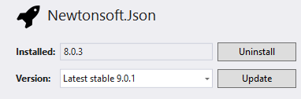
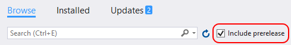

# Building pre-release packages

Whenever you release an updated package with a new version number, NuGet considers that one as the "latest stable release" as shown, for example in the Package Manager UI within Visual Studio:



A stable release is one that's considered reliable enough to be used in production. The latest stable release is also the one that will be installed as a package update or during package restore (subject to constraints as described in [Reinstalling and updating packages](../consume-packages/reinstalling-and-updating-packages.md)).

To support the software release lifecycle, NuGet 1.6 and later allows for the distribution of pre-release packages, where the version number includes a semantic versioning suffix such as `-alpha`, `-beta`, or `-rc`. For more information, see [Package versioning](../concepts/package-versioning.md#pre-release-versions).

You can specify such versions using one of the following ways:

- **If your project uses [`PackageReference`](../consume-packages/package-references-in-project-files.md)**: include the semantic version suffix in the `.csproj` file's [`PackageVersion`](/dotnet/core/tools/csproj#packageversion) element:

    ```xml
    <PropertyGroup>
        <PackageVersion>1.0.1-alpha</PackageVersion>
    </PropertyGroup>
    ```

- **If your project has a [`packages.config`](../reference/packages-config.md) file**: include the semantic version suffix in the [`.nuspec`](../reference/nuspec.md) file's [`version`](../reference/nuspec.md#version) element:

    ```xml
    <version>1.0.1-alpha</version>
    ```

When you're ready to release a stable version, just remove the suffix and the package takes precedence over any pre-release versions. Again, see [Package versioning](../concepts/package-versioning.md#pre-release-versions).

## Installing and updating pre-release packages

By default, NuGet does not include pre-release versions when working with packages, but you can change this behavior as follows:

- **Package Manager UI in Visual Studio**: In the **Manage NuGet Packages** UI, check the **Include prerelease** box:

    

    Setting or clearing this box will refresh the Package Manager UI and the list of available versions you can install.

- **Package Manager Console**: Use the `-IncludePrerelease` switch with the `Find-Package`, `Get-Package`, `Install-Package`, `Sync-Package`, and `Update-Package` commands. Refer to the [PowerShell Reference](../reference/powershell-reference.md).

- **NuGet CLI**: Use the `-prerelease` switch with the `install`, `update`, `delete`, and `mirror` commands. Refer to the [NuGet CLI reference](../reference/nuget-exe-cli-reference.md)

## Semantic versioning

The [Semantic Versioning or SemVer convention](https://semver.org/spec/v1.0.0.html) describes how to utilize strings in version numbers to convey the meaning of the underlying code.
[Learn more](../concepts/Package-Versioning.md) about the package versioning basics.
