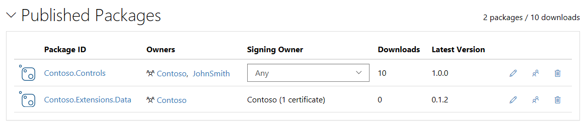

# Signing NuGet Packages

Signed packages allows for content integrity verification checks which provides protection against content tampering. The package signature also serves as the single source of truth about the actual origin of the package and bolsters package authenticity for the consumer. This guide assumes you have already [created a package](creating-a-package.md).

> [!Important]
> Package signing is currently supported only when using nuget.exe on Windows. Verification of signed packages is currently supported only when using nuget.exe or Visual Studio on Windows.

## Get a code signing certificate

Valid certificates may be obtained from a public certificate authority like such as [Symantec](https://trustcenter.websecurity.symantec.com/process/trust/productOptions?productType=SoftwareValidationClass3), [DigiCert](https://www.digicert.com/code-signing/), [Go Daddy](https://www.godaddy.com/web-security/code-signing-certificate), [Global Sign](https://www.globalsign.com/en/code-signing-certificate/), [Comodo](https://www.comodo.com/e-commerce/code-signing/code-signing-certificate.php), [Certum](https://www.certum.eu/certum/cert,offer_en_open_source_cs.xml), etc. The complete list of certification authorities trusted by Windows can be obtained from [http://aka.ms/trustcertpartners](http://aka.ms/trustcertpartners).

You can use self-issued certificates for testing purposes. However, packages signed using self-issued certificates are not accepted by NuGet.org. Learn more about [creating a test certificate](#create-a-test-certificate)

## Export the certificate file

* You can export an existing certificate to a binary DER format by using the Certificate Export Wizard.

  

* You can also export the certificate using the [Export-Certificate PowerShell command](/powershell/module/pkiclient/export-certificate.md).

## Sign the package

> [!note]
> Requires nuget.exe 4.6.0 or later

Sign the package using [nuget sign](../tools/cli-ref-sign.md):

```cli
nuget sign MyPackage.nupkg -CertificateFilePath <PathToTheCertificate> -Timestamper <TimestampServiceURL>
```

* You can use a certificate available in the certificate store or use a certificate from a file. See CLI reference for [nuget sign](../tools/cli-ref-sign.md).
* Signed packages should include a timestamp to make sure the signature remains valid when the signing certificate has expired. Else the sign operation will produce a [warning](../reference/errors-and-warnings/NU3002.md).
* You can see the signature details of a given package using [nuget verify](../tools/cli-ref-verify.md).

## Register the certificate on NuGet.org

To publish a signed package, you must first register the certificate with NuGet.org. You need the certificate as a `.cer` file in a binary DER format.

1. [Sign in](https://www.nuget.org/users/account/LogOn?returnUrl=%2F) to NuGet.org.
1. Go to `Account settings` (or `Manage Organization` **>** `Edit Organziation` if you would like to register the certificate with an Organization account).
1. Expand the `Certificates` section and select `Register new`.
1. Browse and select the certficate file that was exported earlier.
  

**Note**
* One user can submit multiple certificates and the same certificate can be registered by multiple users.
* Once a user has a certificate registered, all future package submissions **must** be signed with one of the certificates. See [Manage signing requirements for your package on NuGet.org](#manage-signing-requirements-for-your-package-on-nugetorg)
* Users can also remove a registered certificate from the account. Once a certificate is removed, new packages signed with that certificate will fail at submission. Existing packages aren't affected.

## Publish the package

You are now ready to publish the package to NuGet.org. See [Publishing packages](Publish-a-package.md).

## Create a test certificate

You can use self-issued certificates for testing purposes. To create a self-issued certificate, use the [New-SelfSignedCertificate PowerShell command](/powershell/module/pkiclient/new-selfsignedcertificate.md).

```ps
New-SelfSignedCertificate -Subject "CN=NuGet Test Developer, OU=Use for testing purposes ONLY" `
                          -FriendlyName "NuGetTestDeveloper" `
                          -Type CodeSigning `
                          -KeyUsage DigitalSignature `
                          -KeyLength 2048 `
                          -KeyAlgorithm RSA `
                          -HashAlgorithm SHA256 `
                          -Provider "Microsoft Enhanced RSA and AES Cryptographic Provider" `
                          -CertStoreLocation "Cert:\CurrentUser\My" 
```

This command creates a testing certificate available in the current user's personal certificate store. You can open the certificate store by running `certmgr.msc` to see the newly created certificate.

> [!Warning]
> NuGet.org does not accept packages signed with self-issued certificates.

## Manage signing requirements for your package on NuGet.org
1. [Sign in](https://www.nuget.org/users/account/LogOn?returnUrl=%2F) to NuGet.org.

1. Go to `Manage Packages` 
   

* If you are the sole owner of a package, you are the required signer i.e. you can use any of the registered certificates to sign and publish your packages to NuGet.org.

* If a package has multiple owners, by default, "Any" owner's certificates can be used to sign the package. As a co-owner of the package, you can override "Any" with yourself or any other co-owner to be the required signer. If you make an owner  who does not have any certificate registered, then unsigned packages will be allowed. 

* Similarly, if the default "Any" option is selected for a package where one owner has a certificate registered and another owner does not have any certificate registered, then NuGet.org accepts either a signed package with a signature registered by one of its owners or an unsigned package (because one of the owners does not have any certificate registered).

## Install a signed package

Signed packages don't require any specific action to be installed; however, if the content has been modified since it was signed, the installation is blocked and produces an [error NU3008](../reference/errors-and-warnings/NU3008.md).

> [!Warning]
> Packages signed with untrusted certificates are considered as unsigned and are installed without any warnings or errors like any other unsigned package.

## Related Topics

[Signed Packages Reference](../reference/Signed-Packages-Reference.md)
