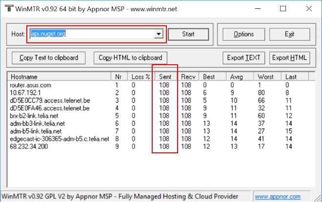
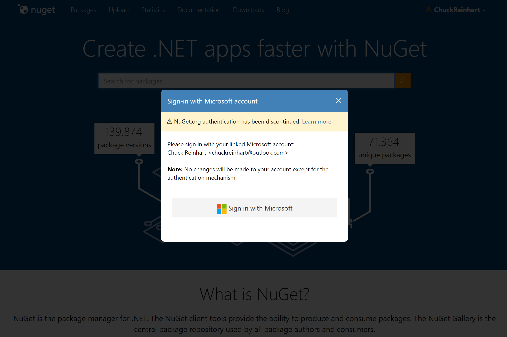
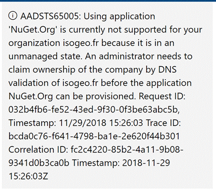

# NuGet frequently-asked questions

**What is required to run NuGet?**

All the information around both UI and command-line tools is available in the [Install guide](../install-nuget-client-tools.md).

**Does NuGet support Mono?**

The command-line tool, `nuget.exe`, builds and runs under Mono 3.2+ and can create packages in Mono.

Although `nuget.exe` works fully on Windows, there are known issues on Linux and OS X. Refer to [Mono issues](https://github.com/NuGet/Home/issues?utf8=%E2%9C%93&q=is%3Aissue+is%3Aopen+mono) on GitHub.

A [graphical client](https://github.com/mrward/monodevelop-nuget-addin) is available as an add-in for MonoDevelop.

**How can I determine what a package contains and whether it's stable and useful for my application?**

The primary source for learning about a package is its listing page on nuget.org (or another private feed). Each package page on nuget.org includes a description of the package, its version history, and usage statistics. The **Info** section on the package page also contains a link to the project's web site where you typically find many examples and other documentation to help you learn how the package is used.

For more information, see [Finding and choosing packages](../consume-packages/finding-and-choosing-packages.md).

## NuGet in Visual Studio

**How is NuGet supported in different Visual Studio products?**

- Visual Studio on Windows supports the [Package Manager UI](../tools/package-manager-ui.md) and the [Package Manager Console](../tools/package-manager-console.md).
- Visual Studio for Mac has built-in NuGet capabilities as described on [Including a NuGet package in your project](/visualstudio/mac/nuget-walkthrough).
- Visual Studio Code (all platforms) does not have any direct NuGet integration. Use the [NuGet CLI](../tools/nuget-exe-cli-reference.md) or the [dotnet CLI](../tools/dotnet-commands.md).
- Azure DevOps provides [a build step to restore NuGet packages](/vsts/build-release/tasks/package/nuget). You can also [host private NuGet package feeds on Azure DevOps](https://docs.microsoft.com/azure/devops/artifacts/nuget/publish).

**How do I check the exact version of the NuGet tools that are installed?**

In Visual Studio, use the **Help > About Microsoft Visual Studio** command and look at the version displayed next to **NuGet Package Manager**.

Alternatively, launch the Package Manager Console (**Tools > NuGet Package Manager > Package Manager Console**) and enter `$host` to see information about NuGet including the version.

**What programming languages are supported by NuGet?**

NuGet generally works for .NET languages and is designed to bring .NET libraries into a project. Because it also supports MSBuild and Visual Studio automation in some project types, it also supports other projects and languages to various degrees.

The most recent version of NuGet supports C#, Visual Basic, F#, WiX, and C++.

**What project templates are supported by NuGet?**

NuGet has full support for a variety of project templates like Windows, Web, Cloud, SharePoint, Wix, and so on.

**How do I update packages that are part of Visual Studio templates?**

Go to the **Updates** tab in the Package Manager UI and select **Update All**, or use the [`Update-Package` command](../tools/ps-ref-update-package.md) from the Package Manager Console.

To update the template itself, you need to manually update the template repository. See [Xavier Decoster's blog](http://www.xavierdecoster.com/update-project-template-to-latest-nuget-packages) on this subject. Note that this is done at your own risk, because manual updates might corrupt the template if the latest version of all dependencies are not compatible with each other.

**Can I use NuGet outside of Visual Studio?**

Yes, NuGet works directly from the command line. See the [Install guide](../install-nuget-client-tools.md) and the [CLI reference](../tools/nuget-exe-cli-reference.md).

## NuGet command line

**How do I get the latest version of NuGet command line tool?**

See the [Install guide](../install-nuget-client-tools.md).

**What is the license for nuget.exe?**

You are allowed to redistribute nuget.exe under the terms of the MIT license. You are responsible for updating and servicing any copies of nuget.exe that you choose to redistribute.

**Is it possible to extend the NuGet command line tool?**

Yes, it's possible to add custom commands to `nuget.exe`, as described in [Rob Reynold's post](http://geekswithblogs.net/robz/archive/2011/07/15/extend-nuget-command-line.aspx).

## NuGet Package Manager Console (Visual Studio on Windows)

**How do I get access to the DTE object in the Package Manager console?**

The top-level object in the Visual Studio automation object model is called the DTE (Development Tools Environment) object. The console provides this through a variable named `$DTE`. For more information, see [Automation Model Overview](/visualstudio/extensibility/internals/automation-model-overview) in the Visual Studio Extensibility documentation.

**I try to cast the $DTE variable to the type DTE2, but I get an error: Cannot convert the "EnvDTE.DTEClass" value of type "EnvDTE.DTEClass" to type "EnvDTE80.DTE2". What's wrong?**

This is a known issue with how PowerShell interacts with a COM object. Try the following:

```ps
`$dte2 = Get-Interface $dte ([EnvDTE80.DTE2])`
```

`Get-Interface` is a helper function added by the NuGet PowerShell host.

## Creating and publishing packages

**How do I list my package in a feed?**

See [Creating and publishing a package](../quickstart/create-and-publish-a-package.md).

**I have multiple versions of my library that target different versions of the .NET Framework. How do I build a single package that supports this?**

See [Supporting Multiple .NET Framework Versions and Profiles](../create-packages/supporting-multiple-target-frameworks.md).

**How do I set up my own repository or feed?**

See the [Hosting packages overview](../hosting-packages/overview.md).

**How can I upload packages to my NuGet feed in bulk?**

See [Bulk publishing NuGet packages](http://jeffhandley.com/archive/2012/12/13/Bulk-Publishing-NuGet-Packages.aspx) (jeffhandly.com).

## Working with packages

**What is the difference between a project-level package and a solution-level package?**

A solution-level package (NuGet 3.x+) is installed only once in a solution and is then available for all projects in the solution. A project-level package is installed in each project that uses it. A solution-level package might also install new commands that can be called from within the Package Manager Console.

**Is it possible to install NuGet packages without Internet connectivity?**

Yes, see Scott Hanselman's Blog post [How to access NuGet when nuget.org is down (or you're on a plane)](http://www.hanselman.com/blog/HowToAccessNuGetWhenNuGetorgIsDownOrYoureOnAPlane.aspx) (hanselman.com).

**How do I install packages in a different location from the default packages folder?**

Set the [`repositoryPath`](../reference/nuget-config-file.md#config-section) setting in `Nuget.Config` using `nuget config -set repositoryPath=<path>`.

**How do I avoid adding the NuGet packages folder into to source control?**

Set the [`disableSourceControlIntegration`](../reference/nuget-config-file.md#solution-section) in `Nuget.Config` to `true`. This key works at the solution level and hence need to be added to the `$(Solutiondir)\.nuget\Nuget.Config` file. Enabling package restore from Visual Studio creates this file automatically.

**How do I turn off package restore?**

See [Enable and disable package restore](../consume-packages/package-restore.md#enable-and-disable-package-restore).

**Why do I get an "Unable to resolve dependency error" when installing a local package with remote dependencies?**

You need to select the **All** source when installing a local package into the project. This aggregates all the feeds instead of using just one. The reason this error appears is that users of a local repository often want to avoid accidentally installing a remote package due to corporate polices.

**I have multiple projects in the same folder, how can I use separate packages.config files for each project?**

In most projects where separate projects live in separate folders, this is not a problem as NuGet identifies the `packages.config` files in each project. With NuGet 3.3+ and multiple projects in the same folder, you can insert the name of the project into the `packages.config` filenames use the pattern `packages.{project-name}.config`, and NuGet uses that file.

This is not an issue when using PackageReference, as each project file contains its own list of dependencies.

**I don't see nuget.org in my list of repositories, how do I get it back?**

- Add `https://api.nuget.org/v3/index.json` to your list of sources, or
- Delete `%appdata%\.nuget\NuGet.Config` (Windows) or `~/.nuget/NuGet/NuGet.Config` (Mac/Linux) and let NuGet re-create it.

**What are the default license terms if a package doesn't provide specific license information?**

Each package is governed by the terms that are included with the package. You should review the applicable terms before accessing, downloading, or acquiring any packages. On nuget.org, use the **License Info** link on the package page.

If a package does not specify the licensing terms, contact the package owner directly using the **Contact owners** link on the nuget.org package page. Microsoft does not license any intellectual property to you from third party package providers and is not responsible for information provided by third parties.

## Managing packages on NuGet.org

**Can I edit package metadata after it's been uploaded?**

NuGet recommends all packages to be signed. A design principle of package signing is that signed package content must be immutable, which includes the nuspec. Editing the package metadata results in changes to the nuspec, invalidating existing signatures. We recommend modifying existing workflows to not require editing the package metadata after the package has been created.

Note that dependencies listed for your package are generated automatically from the package itself and cannot be edited.

In addition, uploading packages to [int.nugettest.org](https://int.nugettest.org) is a great way to test and validate your package without making a package available in the public gallery. API Endpoint: https://apiint.nugettest.org/v3/index.json

**Can I delete a package published to NuGet.org?**

In general, we do not support deleting a package published to NuGet.org. Read more about our [policy on deleting packages](../policies/deleting-packages.md).

**Is it possible to reserve names for packages that will be published in future?**

Yes. You can reserve IDs for packages on [nuget.org](https://www.nuget.org/) by requesting a package ID prefix for your account. In order to request a package ID prefix, follow the instructions in the [documentation](https://docs.microsoft.com/nuget/reference/id-prefix-reservation).

**How do I claim ownership for packages ?**

See [Managing package owners on nuget.org](../create-packages/publish-a-package.md#managing-package-owners-on-nugetorg).

**How do I deal with a package owner who is violating my software license?**

We encourage the NuGet community to work together to resolve any disputes that may arise between package owners and the owners of other software. We have crafted a [dispute resolution process](../policies/dispute-resolution.md) to follow before asking nuget.org administrators to intercede.

**Is it recommended to upload my test packages to nuget.org?**

For test purposes, you can use [int.nugettest.org](https://int.nugettest.org), or alternative public NuGet servers like [myget.org](https://myget.org) or [Azure DevOps](https://blogs.msdn.microsoft.com/visualstudioalm/2015/08/27/announcing-package-management-support-for-vsotfs/).

Note that packages uploaded to int.nugettest.org may not be preserved.

**What is the maximum size of packages I can upload to nuget.org?**

nuget.org allows packages up to 250MB, but we recommend keeping packages under 1MB if possible and using dependencies to link packages together. As a rule of thumb, packages contain only one assembly to avoid collisions.

NuGet uses HTTP to download packages, so larger packages have a higher likelihood of failed installs than smaller ones.

It is possible to share dependencies between multiple packages, making the total download size for consumers of your NuGet packages smaller.

Dependencies are mostly static and never change. When fixing a bug in code, the dependencies may not need to be updated. If you bundle dependencies, you end up reshipping larger packages every time. By splitting NuGet packages into related dependencies, upgrades are much more fine-grained for consumers of your package.

## nuget.org not accessible

**Why can't I download packages from or upload packages to nuget.org?**

First, make sure you're using the latest versions of NuGet. If that version continues to fail, [contact support](https://www.nuget.org/policies/Contact) and provide additional connection troubleshooting information including:

- The version of NuGet you're using
- The package sources you're using
- A restore log with detailed verbosity
- MTR or a Fiddler traces (see below)
- Your geographical area
- Whether your machine is behind a proxy or firewall?
- Is your machine located on a cloud providers' data center (Azure, AWS etc)? If yes, please provide the name of the provider and the region.

*To capture MTR:*

- Download WinMTR from [http://winmtr.net/download/](http://winmtr.net/)
- Enter `api.nuget.org` as the hostname and click **Start**.
- Wait until the **Sent** column is >= 100.

    

- Copy text to clipboard.

*To capture Fiddler:*

- Install the latest version of [Fiddler](http://www.telerik.com/download/fiddler).
- Start Fiddler and disable capturing traffic using the **File > Capture Traffic** menu.
- Remove all sessions (select all items in the list, press the **Delete** key).
- Configure Fiddler to capture HTTPS traffic by checking **Decrypt HTTPS traffic** in the **HTTPS** tab of the **Tools > Fiddler Options...** menu.
- Close Visual Studio.
- Enable the **File > Capture Traffic** menu.
- Start Visual Studio or nuget.exe .exe and perform the actions that are not working. The traffic generated by these actions should show up in Fiddler.
- Once the actions have run, use **File > Save > All Sessions** to store the captured sessions.

Note: it may be required to set the `HTTP_PROXY` environment variable to `http://127.0.0.1:8888` for routing NuGet traffic through Fiddler.

If that fails, try the [tips mentioned in this StackOverflow post](http://stackoverflow.com/questions/21049908/using-fiddler-to-sniff-visual-studio-2013-requests-proxy-firewall).

## What is the API endpoint for nuget.org?

To use nuget.org as a package repository with NuGet clients, you should use the following V3 API endpoint: 

**`https://api.nuget.org/v3/index.json`**

Older clients can still use the V2 protocol to reach nuget.org. However, please note, NuGet clients 3.0 or later will have slower and less-reliable service using the V2 protocol:

`https://www.nuget.org/api/v2` (DEPRECATED!!!) **Note:** use "www." for the best reliability.

## nuget.org account management

### How to create a new nuget.org account?

To create a nuget.org account, you need to have a personal Microsoft account (MSA) or an Azure Active Directory (AAD) account. If you do not have one, you can [create](https://signup.live.com) one. Follow the following steps if you have a MSA or AAD account.
1. Go to the [nuget.org login page](https://www.nuget.org/users/account/LogOn).
1. Click on **Sign in with Microsoft** button.
1. Enter your MSA/AAD account details.
1. Please accept the permissions to be given to the *NuGet.org* application.
1. You will be redirected to nuget.org, and asked to register a username.
1. Specify the username in the input box. Please note that the username **is** case sensitive and cannot be changed/renamed later.
1. Click on **Register** button.

You now have a nuget.org account. You can perfrom account management on the [account settings](https://www.nuget.org/account) page.

### How to recover nuget.org password login?

Please note that the [nuget.org Password login has been discontinued](https://blog.nuget.org/20180515/NuGet.org-will-only-support-MSA-AAD-starting-June.html) and the only way to log in to nuget.org is with a personal Microsoft account (MSA) or Azure Active Directory (AAD) account. However, in case you are unable to access your associated MSA/AAD accounts you might need to use password login for recovering your nuget.org account. In this situation follow the steps below.
- **Requirement:** You will need to have access to the email that is associated with the account for which you need to recover the password.
- Go to the [Forgot password page](https://www.nuget.org/account/ForgotPassword)
- Enter the **email** address that is associated with the nuget.org account you wish to recover.
- Click the **Send** button.
- You will get an email to the specified email address account with a link to reset your password. Click on this link and set the new password. If you can't find the mail check your "junk" folder.
- Once done, you can now login with username/password on NuGet.
- To login with username/password, use the **Sign in using Nuget.org account** link on the  [nuget.org login page](https://www.nuget.org/users/account/LogOn).

### Which Microsoft account is linked to my nuget.org account?

If you have forgotten which Microsoft account is associated with your nuget.org account, please follow the steps below to get assistance.
1. Go to [nuget.org login page](https://www.nuget.org/users/account/LogOn) and click on **Need assistance signing in?** link.
1. This will show you the pop-up dialog box for assistance. Follow the steps in this dialog box to understand the associated Microsoft account(s) for your nuget.org account.

### How to change the Microsoft account I use for nuget.org login?
If you wish to change the Microsoft account for nuget.org user, follow the steps below. Lets say your Microsoft account with email `account1@outlook.com` is associated with your nuget.org account with username `MyNuGetAccount`. You wish to change the login to another Microsoft account with email `account2@outlook.com`
1. Please sign in using **currently associated Microsoft account** i.e. `account1@outlook.com` on the [login page](https://www.nuget.org/users/account/LogOn) after clicking **Sign in with Microsoft**.
1. Once logged in, go to your [account settings](https://www.nuget.org/account) page.
1. Expand the section for **Login Account**. Click on the **Change Account** button.
1. You will now be redirected to the microsoft login page. Please sign in with the account that you wish to change the association to i.e. `account2@outlook.com`. **Note**: you might need to click on **Sign out and sign in with different account** during the sign in flow to be able to login with a different Microsoft account.
1. If you see an error like below, see [Microsoft account is linked with another nuget.org account](#microsoft-account-is-linked-with-another-nugetorg-account) for more details.
    >_Failed to update the Microsoft account with 'account2 <account2@outlook.com>'. This could happen if it is already linked to another NuGet account. Contact support for more information._

1. Once you have successfully signed in with your second account, you will be redirected back to your nuget.org account settings page and you should now see the new Microsoft account associated as the login account. Going forward you should use this account when signing into nuget.org.

### Microsoft account is linked with another nuget.org account.

If you tried changing your Microsoft login and saw the error below:
> _Failed to update the Microsoft account with 'account2 <account2@outlook.com>'. This could happen if it is already linked to another NuGet account. Contact support for more information._

Lets say you were trying to change Microsoft account login from `account1@outlook.com` for nuget.org user with username `MyNuGetAccount1` to another Microsoft account with email `account2@outlook.com`. And you see the error above.

**What does the error above mean?**

It means that there is another nuget.org account which is associated with the Microsoft account that you are trying to change it to i.e. in above example the Microsoft account with email `<account2@outlook.com>` is associated with another nuget.org account with, say, username `MyNuGetAccount2`.

You cannot change the associated login with a Microsoft account that is linked to a different nuget.org account.

**I forgot I had another nuget.org account, how do I find out which nuget.org account it is?**

Login with the second Microsoft account on the [login page](https://www.nuget.org/users/account/LogOn?returnUrl=%2F# "login page"). This will log you into the nuget.org account that is currently associated with the second Microsoft account. You can then view the uploaded packages and perform account management on this account.

**I do not care about this second nuget.org account, I want to change my login for first nuget.org account with the second Microsoft account. What do I do?**

If you wish to not care about the second nuget.org account and still want to re-use the associated Microsoft account with email `account2@outlook.com`. 

You can release the association between the Microsoft account and nuget.org account by deleting the nuget.org account.
1. Follow the steps to [delete user](#how-to-delete-my-nugetorg-account) for the second nuget.org account `MyNuGetAccount2`. 
1. Once this account is deleted, you can retry the steps to [change Microsoft account login](#how-to-change-the-microsoft-account-i-use-for-nugetorg-login).

**Wait, I care about this second account too. I do not want to lose this account but change my associated account logins for first account.**

You will need to create/use a third Microsoft account, say, with email `account3@outlook.com`. 
1. First you should login with your second Microsoft account, `account2@outlook.com` on nuget.org. Follow the steps above to change associated logins and associate the third Microsoft account with this nuget.org account.
1. Once done, your second Microsoft account with email `account2@outlook.com` is free to be associated to your first nuget.org account, `MyNuGetAccount1`. Follow the same steps above to change microsoft logins to the second Microsoft account.

### Signing in with Microsoft account shows me my email is linked to another Microsoft account
If you tried to sign in with your Microsoft account, say, with email `account1@outlook.com` and you see an error like below:
> _The account with email 'account1@outlook.com' is linked with another microsoft account._
>
> _If you would like to update the linked Microsoft account you can do so from the account settings page._

**What does the error above mean?**

When an account is created on nuget.org, there is a communication email address associated with that account. This is usually same as the email address that is used for associated Microsoft account. However, you could choose to specify a different email address for communication. So, technically, you could have a different Microsoft account, say with `account2@outlook.com` that is linked to nuget.org account with communication email address as `account1@outlook.com`.

So the error above means that there already exists nuget.org account with communication email address `account1@outlook.com` but is associated with another Microsoft account with email **that is not** `account1@outlook.com`.

**How do I find which Microsoft account is linked to this nuget.org account?**

You should use the [sign in assistance](#which-microsoft-account-is-linked-to-my-nugetorg-account) flow to figure out which Microsoft account is linked to the nuget.org account with the email address `account1@outlook.com`.

**I want to override that account with my Microsoft account**

Follow the steps in [Unable to use microsoft login, how do I recover my nuget.org account](#unable-to-use-microsoft-login-how-do-i-recover-my-nugetorg-account) section to associate your Microsoft account with the existing nuget.org account.

### Unable to use microsoft login, how do I recover my nuget.org account?

If you tried using the [sign in assistance](#which-microsoft-account-is-linked-to-my-nugetorg-account) and you do not have access to the Microsoft account that is associated with your nuget.org account, please follow the steps below to link a new Microsoft account to your nuget.org account.
1. **Requirement**: You will need access to a Microsoft account which is not associated with any existing nuget.org accounts. If you do not have one, you can [create](https://signup.live.com) one.
2. If you've forgotten your username and password for your nuget.org account, follow the [steps to recover your password login](#how-to-recover-nugetorg-password-login).
3. [Login to nuget.org](https://www.nuget.org/users/account/LogOnNuGetAccount) using the username/password login.
4. Once logged in, you will see the popup dialog show up like below. This is the password discontinuation dialog box.
5. **NOTE**: Please ignore the instruction to login with the specified Microsoft account. You can now link your nuget.org account to any other Microsoft login.
6. Click on the button **Sign in with Microsoft** and login with the Microsoft account that you have an access to, as mentioned in step 1.
7. Your account will now be linked to the new Microsoft account, which you can use to log into nuget.org going forward.

    

### How to transform my nuget.org account to an organization?

If you want to transform your account to an organization, and this account is already associated with a Microsoft account login, please follow the steps given in the documentation for [organizations on nuget org](https://docs.microsoft.com/en-us/nuget/reference/organizations-on-nuget-org).

If however, your nuget.org account is not associated/linked with a Microsoft account, you can follow the steps below to transform this account to an organization.
1. **Requirement**: You need to have an individual account first created on nuget.org to be used as an admin on the org account. If you do not have one, please [create a new nuget.org account](#how-to-create-a-new-nugetorg-account).
2. Follow the [steps to recover your password login](#how-to-recover-nugetorg-password-login) for your nuget.org account if you do not have password login for it, if you do, skip this step.
3. [Login to nuget.org](https://www.nuget.org/users/account/LogOnNuGetAccount) using the username/password login.
4. Once logged in, you will see the popup dialog show up like below. This is the password discontinuation dialog box. 
    > [!Important]
    > Ignore this dialog box, **do not** click on the **Sign in with microsoft** button.

5. Go to [https://www.nuget.org/account/transform](https://www.nuget.org/account/transform). This will allow you to convert the nuget.org account to an org without linking to a Microsoft account.
6. Specify the admin username for your personal nuget.org account/the account you created in Step 1.
7. Follow the instructions to complete transformation of this account to an organization.

    

### nuget.org login issues for AAD accounts with unmanaged tenant?

If you see an error like below during your login flow with your email account domain(@yourdomain.com), see the steps below to recover your nuget.org account.

<p align="center">
    
</p>

**What is this unmanaged state thing during login? And why is this happening now?** 

Your account seems to be previously registered as a personal Microsoft account and it worked fine, however, now it seems like your account has been registered as an "Unmanaged" tenant in the Azure Active Directory (the identity service which we use to authenticate Microsoft accounts). 

This could have happened if you or someone from your organization(with @yourdomain.com email address) registered with one of the AAD integrated services or did a [self-service signup for Azure Active Directory](https://docs.microsoft.com/en-us/azure/active-directory/users-groups-roles/directory-self-service-signup), which creates such an "Unmanaged" tenant for the used Microsoft account domain(@yourdomain.com in your case). 

**What can I do to recover my account?**

At this moment there is not a way for us (nuget.org) to authenticate accounts with such "Unmanaged" tenant accounts in Azure Active directory. We are looking in to a better way to authenticate such accounts.

If you want to login to nuget.org with your Microsoft account(@yourdomain.com), you(or an administrator at your company) will need to claim the ownership of the AAD by doing a DNS validation to authenticate users with email address "@yourdomain.com". Please follow the steps for [domains admin takeover](https://docs.microsoft.com/en-us/azure/active-directory/users-groups-roles/domains-admin-takeover) documented by the Azure Active directory. Once this is done, your normal login should start working.

**I don’t want to do all that, what is the other way to recover my account?**

You can [create](https://www.microsoft.com/en-us/account) a new Microsoft account (with an email **not** associated with @yourdomain.com). Follow steps given in [recover your nuget.org account](#unable-to-use-microsoft-login-how-do-i-recover-my-nugetorg-account) section.

### How do I change my nuget.org account username?

You cannot. As a matter of policy we do not allow the change of usernames as of yet. The only way to change your username is to create a new account with the desired username. We recommend you delete your existing account before you create a new one, otherwise you will not be able to reuse your registered Microsoft account.
> [!Important]
> Deleting the user will still **reserve** the `username`. You will not be able to reuse the same username again and **this includes the change of casings**. As an example if you created a user with username `mycoolname` and you want to change this to `MyCoolName`(casing changes), it will not be possible after deleting the user.

Follow the steps given in [delete your nuget.org account](#how-to-delete-my-nugetorg-account) section and to [register a new account](#how-to-create-a-new-nugetorg-account) with correct username.

### How to delete my nuget.org account?

To delete your account, please note that we recommend that you transfer the ownership of any packages where you are the sole owner. You can read more about [managing package owners](https://docs.microsoft.com/en-us/nuget/create-packages/publish-a-package#managing-package-owners-on-nugetorg) on how to do it. This will also help us expedite your request.

> [!Important]
> Deleting the user will result in following:
>  1. Revoke associated API key(s). 
>  2. Remove the account as an owner for any child packages.
>  3. Dissociate all previously existent ID prefix reservations with this account.
>  4. Remove the account as a member of any organizations.
>  5. Your username will be reserved and no one will be able to re-use it again without our permissions.

Follow the following steps to proceed with account deletion.
1. [Login to nuget.org](https://www.nuget.org/users/account/LogOn) with the account you wish to delete.
2. Click on this url: [https://www.nuget.org/account/delete](https://www.nuget.org/account/delete) and follow the steps to submit the request for deleting the account.

Our customer support will process this request and perform the account deletion.
