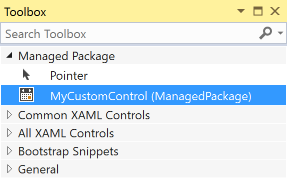
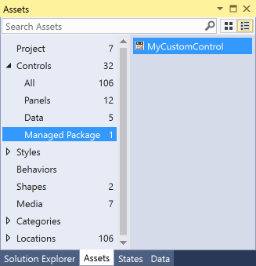
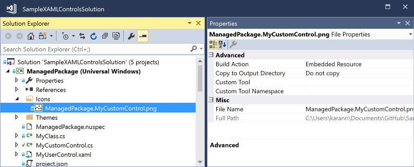

# Creating UI controls as NuGet packages

Starting with Visual Studio 2017, you can take advantage of added capabilities for UWP and WPF controls that you deliver in NuGet packages. This guide walks you through these capabilities in context of UWP controls using the [ExtensionSDKasNuGetPackage sample](https://github.com/NuGet/Samples/tree/main/ExtensionSDKasNuGetPackage). The same applies to WPF controls unless mentioned otherwise.

## Prerequisites

1. Visual Studio 2017
1. Understanding of how to [Create UWP Packages](create-uwp-packages.md)

## Generate Library Layout

> [!Note]
> This is applicable only to UWP controls.

Setting the `GenerateLibraryLayout` property ensures that the project build output is generated in a layout that is ready to be packaged without the need for individual file entries in the nuspec.

From the project properties, go to the build tab and check the "Generate Library Layout" check box. This will modify the project file and set the `GenerateLibraryLayout` flag to true for your currently selected build configuration and platform.

Alternately, edit the the project file to add `<GenerateLibraryLayout>true</GenerateLibraryLayout>` to the first unconditional property group. This would apply the property irrespective of the build configuration and platform.

## Add toolbox/assets pane support for XAML controls

To have a XAML control appear in the XAML designer’s toolbox in Visual Studio and the Assets pane of Blend, create a `VisualStudioToolsManifest.xml` file in the root of the `tools` folder of your package project. This file is not required if you don’t need the control to appear in the toolbox or Assets pane.

```
\build
\lib
\tools
    VisualStudioToolsManifest.xml
```

The structure of the file is as follows:

```xml
<FileList>
  <File Reference = "your_package_file">
    <ToolboxItems UIFramework="WPF" VSCategory="vs_category" BlendCategory="blend_category">
      <Item Type="type_full_name_1" />

      <!-- Any number of additional Items -->
      <Item Type="type_full_name_2" />
      <Item Type="type_full_name_3" />
    </ToolboxItems>
  </File>
</FileList>
```

where:

- *your_package_file*: the name of your control file, such as `ManagedPackage.winmd` ("ManagedPackage" is an arbitrary named used for this example and has no other meaning).
- *vs_category*: The label for the group in which the control should appear in the Visual Studio designer’s toolbox. A `VSCategory` is necessary for the control to appear in the toolbox.
*ui_framework*: The name of the Framework, such as 'WPF', note that `UIFramework` attribute is required on ToolboxItems nodes on Visual Studio 16.7 Preview 3 or above for the control to appear in toolbox.
- *blend_category*: The label for the group in which the control should appear in the Blend designer’s Assets pane. A `BlendCategory` is necessary for the control to appear in Assets.
- *type_full_name_n*: The fully-qualified name for each control, including the namespace, such as `ManagedPackage.MyCustomControl`. Note that the dot format is used for both managed and native types.

In more advanced scenarios, you can also include multiple `<File>` elements within `<FileList>` when a single package contains multiple control assemblies. You can also have multiple `<ToolboxItems>` nodes within a single `<File>` if you want to organize your controls into separate categories.

In the following example, the control implemented in `ManagedPackage.winmd` will appear in Visual Studio and Blend in a group named “Managed Package”, and “MyCustomControl” will appear in that group. All these names are arbitrary.

```xml
<FileList>
  <File Reference = "ManagedPackage.winmd">
    <ToolboxItems UIFramework="WPF" VSCategory="Managed Package" BlendCategory="Managed Package">
      <Item Type="ManagedPackage.MyCustomControl" />
    </ToolboxItems>
  </File>
</FileList>
```





> [!Note]
> You must explicitly specify every control that you would like to see in the toolbox/assets pane. Ensure you specify them in the format `Namespace.ControlName`.

## Add custom icons to your controls

To display a custom icon in the toolbox/assets pane, add an image to your project or the corresponding `design.dll` project with the name “Namespace.ControlName.extension” and set the build action to “Embedded Resource”. You must also ensure that the associated `AssemblyInfo.cs` specifies the ProvideMetadata attribute - `[assembly: ProvideMetadata(typeof(RegisterMetadata))]`. See this [sample](https://github.com/NuGet/Samples/blob/main/ExtensionSDKasNuGetPackage/NativePackage.Design/Properties/AssemblyInfo.cs#L20).

Supported formats are `.png`, `.jpg`, `.jpeg`, `.gif`, and `.bmp`. The recommended format is BMP24 in 16 pixels by 16 pixels.


The pink background is replaced at runtime. The icons are recolored when the Visual Studio theme is changed and that background color is expected. For more information, please reference [Images and Icons for Visual Studio](/visualstudio/extensibility/ux-guidelines/images-and-icons-for-visual-studio).

In the example below, the project contains an image file named “ManagedPackage.MyCustomControl.png”.



> [!Note]
> For native controls, you must put the icon as a resource in the `design.dll` project.

## Support specific Windows platform versions

UWP packages have a TargetPlatformVersion (TPV) and TargetPlatformMinVersion (TPMinV) that define the upper and lower bounds of the OS version where the app can be installed. TPV further specifies the version of the SDK against which the app is built. Be mindful of these properties when authoring a UWP package: using APIs outside the bounds of the platform versions defined in the app will cause either the build to fail or the app to fail at runtime.

For example, let’s say you’ve set the TPMinV for your controls package to Windows 10 Anniversary Edition (10.0; Build 14393), so you want to ensure that the package is consumed only by UWP projects that match that lower bound. To allow your package to be consumed by UWP projects, you must package your controls with the following folder names:

```
\lib\uap10.0.14393\*
\ref\uap10.0.14393\*
```

NuGet will automatically check the TPMinV of the consuming project, and fail installation if it is lower than Windows 10 Anniversary Edition (10.0; Build 14393)

In case of WPF, let's say you would like your WPF controls package to be consumed by projects targeting .NET Framework v4.6.1 or higher. To enforce that, you must package your controls with the following folder names:

```
\lib\net461\*
\ref\net461\*
```

## Add design-time support

To configure where the control properties show up in the property inspector, add custom adorners, etc., place your `design.dll` file inside the `lib\uap10.0.14393\Design` folder as appropriate to the target platform. Also, to ensure that the **[Edit Template > Edit a Copy](/windows/uwp/controls-and-patterns/xaml-styles#modify-the-default-system-styles)** feature works, you must include the `Generic.xaml` and any resource dictionaries that it merges in the `<your_assembly_name>\Themes` folder (again, using your actual assembly name). (This file has no impact on the runtime behavior of a control.) The folder structure would thus appear as follows:

```
\lib
  \uap10.0.14393
    \Design
      \MyControl.design.dll
    \your_assembly_name
      \Themes
        Generic.xaml
```

For WPF, continuing with the example where you would like your WPF controls package to be consumed by projects targeting .NET Framework v4.6.1 or higher:

```
\lib
  \net461
    \Design
      \MyControl.design.dll
    \your_assembly_name
      \Themes
        Generic.xaml
```

> [!Note]
> By default, control properties will show up under the Miscellaneous category in the property inspector.

## Use strings and resources

You can embed string resources (`.resw`) in your package that can be used by your control or the consuming UWP project, set the **Build Action** property of the `.resw` file to **PRIResource**.

For an example, refer to [MyCustomControl.cs](https://github.com/NuGet/Samples/blob/main/ExtensionSDKasNuGetPackage/ManagedPackage/MyCustomControl.cs) in the ExtensionSDKasNuGetPackage sample.

> [!Note]
> This is applicable only to UWP controls.

## See also

- [Create UWP Packages](create-uwp-packages.md)
- [ExtensionSDKasNuGetPackage sample](https://github.com/NuGet/Samples/tree/main/ExtensionSDKasNuGetPackage)
