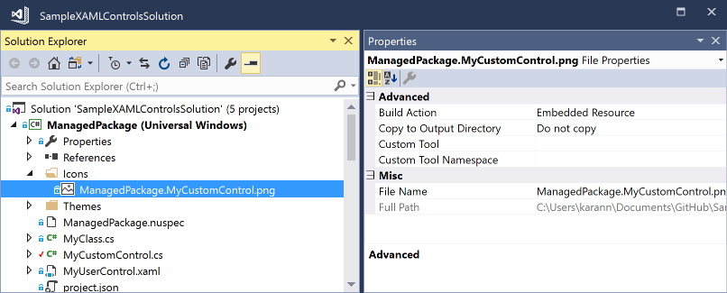

# Creating UWP controls as NuGet packages

With Visual Studio 2017, you can take advantage of added capabilities for UWP controls that you deliver in NuGet packages. This guide walks you through these capabilities using the [ExtensionSDKasNuGetPackage sample](https://github.com/NuGet/Samples/tree/master/ExtensionSDKasNuGetPackage). 

## Prerequisites

1. Visual Studio 2017
1. Understanding of how to [Create UWP Packages](create-uwp-packages.md)

## Add toolbox/assets pane support for XAML controls

To have a XAML control appear in the XAML designer’s toolbox in Visual Studio and the Assets pane of Blend, create a `VisualStudioToolsManifest.xml` file in the root of the `tools` folder of your package project. This file is not required if you don’t need the control to appear in the toolbox or Assets pane.

    \build
    \lib
    \tools
        VisualStudioToolsManifest.xml

The structure of the file is as follows:

```xml
<FileList>
  <File Reference = "your_package_file">
    <ToolboxItems VSCategory="vs_category" BlendCategory="blend_category">
      <Item Type="type_full_name_1" />

      <!-- Any number of additional Items -->
      <Item Type="type_full_name_2" />
      <Item Type="type_full_name_3" />
    </ToolboxItems>
  </File>
</FileList>
```

where:

- *your_package_file*: the name of your control file, such as `ManagedPackage.winmd` ("ManagedPackage" is an arbitrary named used for this example and has no other meaning).
- *vs_category*: The label for the group in which the control should appear in the Visual Studio designer’s toolbox. A `VSCategory` is necessary for the control to appear in the toolbox.
- *blend_category*: The label for the group in which the control should appear in the Blend designer’s Assets pane. A `BlendCategory` is necessary for the control to appear in Assets.
- *type_full_name_n*: The fully-qualified name for each control, including the namespace, such as `ManagedPackage.MyCustomControl`. Note that the dot format is used for both managed and native types.

In more advanced scenarios, you can also include multiple `<File>` elements within `<FileList>` when a single package contains multiple control assemblies. You can also have multiple `<ToolboxItems>` nodes within a single `<File>` if you want to organize your controls into separate categories.

In the following example, the control implemented in `ManagedPackage.winmd` will appear in Visual Studio and Blend in a group named “Managed Package”, and “MyCustomControl” will appear in that group. All these names are arbitrary.

```xml
<FileList>
  <File Reference = "ManagedPackage.winmd">
    <ToolboxItems VSCategory="Managed Package" BlendCategory="Managed Package">
      <Item Type="ManagedPackage.MyCustomControl" />
    </ToolboxItems>
  </File>
</FileList>
```


> [!Note]
> You must explicitly specify every control that you would like to see in the toolbox/assets pane. Ensure you specify them in the format `Namespace.ControlName`.

## Add custom icons to your controls

To display a custom icon in the toolbox/assets pane, add an image to your project or the corresponding `design.dll` project with the name “Namespace.ControlName.extension” and set the build action to “Embedded Resource”. Supported formats are `.png`, `.jpg`, `.jpeg`, `.gif`, and `.bmp`. The recommended image size is 64 pixels by 64 pixels.

In the example below, the project contains an image file named “ManagedPackage.MyCustomControl.png”.



> [!Note]
> For native controls, you must put the icon as a resource in the `design.dll` project.

## Support specific Windows platform versions

UWP packages have a TargetPlatformVersion (TPV) and TargetPlatformMinVersion (TPMinV) that define the upper and lower bounds of the OS version where the app can be installed. TPV further specifies the version of the SDK against which the app is built. Be mindful of these properties when authoring a UWP package: using APIs outside the bounds of the platform versions defined in the app will cause either the build to fail or the app to fail at runtime.

For example, let’s say you’ve set the TPMinV for you controls package to Windows 10 Anniversary Edition (10.0; Build 14393), so you want to ensure that the package is consumed only by UWP projects that match that lower bound. To allow your package to be consumed by UWP projects, you must package your controls with the following folder names:

    \lib\uap10.0\*
    \ref\uap10.0\*

To enforce the appropriate TPMinV check, create an [MSBuild targets file](/visualstudio/msbuild/msbuild-targets) and package it under the build folder (replacing "your_assembly_name" with the name of your specific assembly):

    \build
      \uap10.0
        your_assembly_name.targets
    \lib
    \tools

Here is an example of what the targets file should look like:

```xml
<?xml version="1.0" encoding="utf-8"?>
<Project xmlns="http://schemas.microsoft.com/developer/msbuild/2003">

  <Target Name="TPMinVCheck" BeforeTargets="Build;ReBuild" Condition="'$(TargetPlatformMinVersion)' != ''">
    <PropertyGroup>
      <RequiredTPMinV>10.0.14393</RequiredTPMinV>
      <ActualTPMinV>$(TargetPlatformMinVersion)</ActualTPMinV>
    </PropertyGroup>
    <Error Condition=" '$([System.Version]::Parse($(ActualTPMinV)).CompareTo($([System.Version]::Parse($(RequiredTPMinV)))))' == '-1' " 	   Text = "The INSERT_PACKAGE_ID_HERE nuget package cannot be used in the $(MSBuildProjectName) project since the project's TargetPlatformMinVersion - $(ActualTPMinV) does not match the Minimum Version - $(RequiredTPMinV) supported by the package" />
  </Target>
</Project>
```

## Add design-time support

To configure where the control properties show up in the property inspector, add custom adorners, etc., place your `design.dll` file inside the `lib\<platform>\Design` folder as appropriate to the target platform. Also, to ensure that the **[Edit Template > Edit a Copy](/windows/uwp/controls-and-patterns/xaml-styles#modify-the-default-system-styles)** feature works, you must include the `Generic.xaml` and any resource dictionaries that it merges in the `<AssemblyName>\Themes` folder. (This file has no impact on the runtime behavior of a control.)

    \build
    \lib
      \uap10.0.14393.0
        \Design
          \MyControl.design.dll
        \your_assembly_name
          \Themes
            Generic.xaml
    \tools

> [!Note]
> By default, control properties will show up under the Miscellaneous category in the property inspector.

## Use strings and resources

You can embed string resources (`.resw`) in your package that can be used by your control or the consuming UWP project, set the **Build Action** property of the `.resw` file to **PRIResource**.

For an example, refer to [MyCustomControl.cs](https://github.com/NuGet/Samples/blob/master/ExtensionSDKasNuGetPackage/ManagedPackage/MyCustomControl.cs) in the ExtensionSDKasNuGetPackage sample.

## Package content such as images

To package content such as images that can be used by your control or the consuming UWP project. add those files `lib\uap10.0.14393.0` folder as follows ("your_assembly_name" should again match your particular control):

    \build
    \lib
      \uap10.0.14393.0
        \Design
          \your_assembly_name
    \contosoSampleImage.jpg
    \tools

You may also author an[MSBuild targets file](/visualstudio/msbuild/msbuild-targets) to ensure the asset is copied to the consuming project’s output folder:

```xml
<?xml version="1.0" encoding="utf-8"?>
<Project xmlns="http://schemas.microsoft.com/developer/msbuild/2003">
    <ItemGroup Condition="'$(TargetPlatformIdentifier)' == 'UAP'">
        <Content Include="$(MSBuildThisFileDirectory)..\..\lib\uap10.0.14393.0\contosoSampleImage.jpg">
            <CopyToOutputDirectory>Always</CopyToOutputDirectory>
        </Content>
    </ItemGroup>
</Project>
```

## See also

- [Create UWP Packages](create-uwp-packages.md)
- [ExtensionSDKasNuGetPackage sample](https://github.com/NuGet/Samples/tree/master/ExtensionSDKasNuGetPackage)
