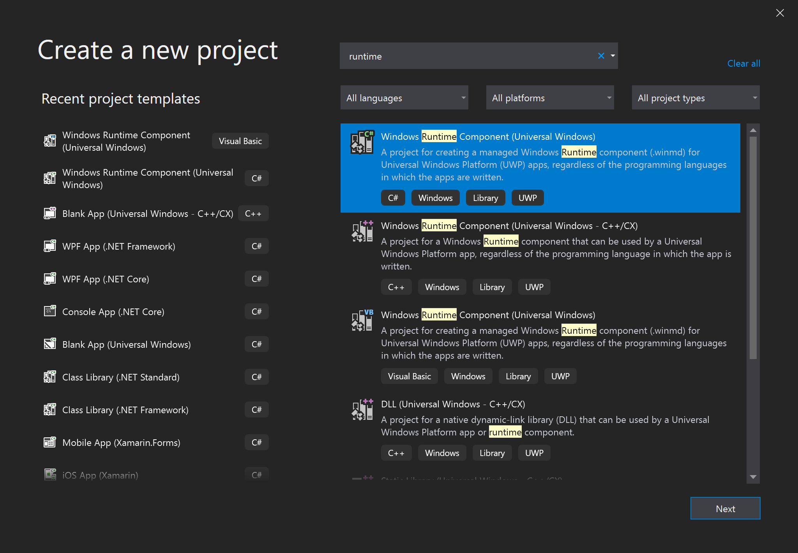
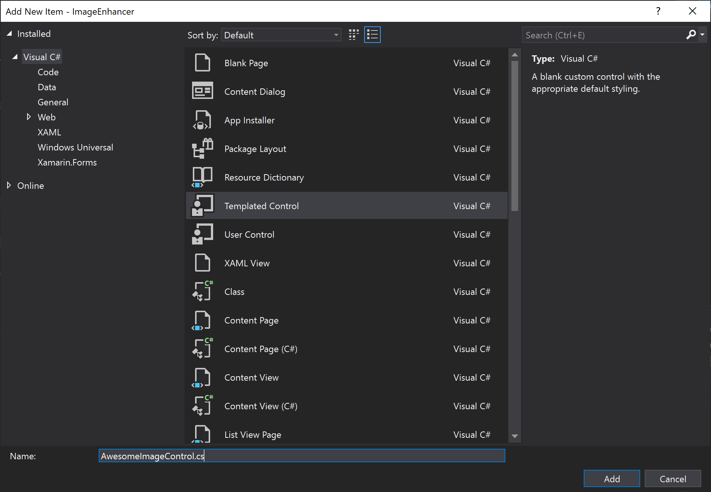
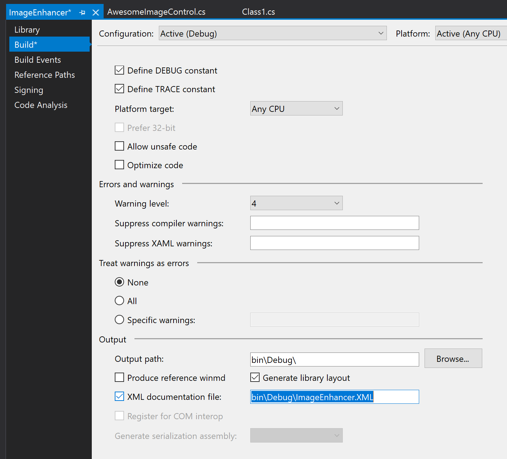
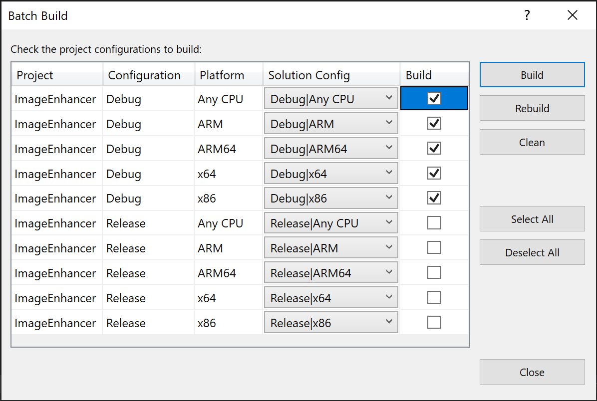
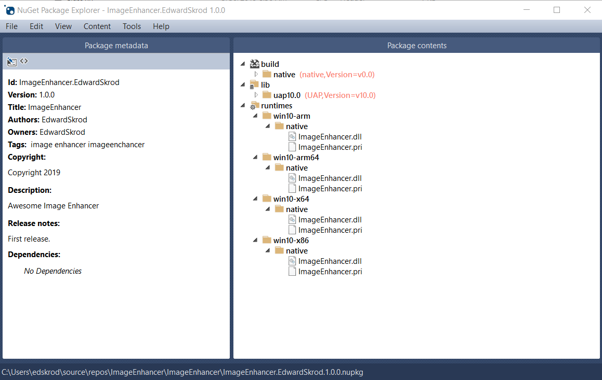

# Create UWP packages (C#)

The [Universal Windows Platform (UWP)](/windows/uwp) provides a common app platform for every device that runs Windows 10. Within this model, UWP apps can call both the WinRT APIs that are common to all devices, and also APIs (including Win32 and .NET) that are specific to the device family on which the app is running.

In this walkthrough you create a NuGet package with a C# UWP component (including a XAML control) that can be used in both Managed and Native projects.

## Prerequisites

1. Visual Studio 2019. Install the 2019 Community edition for free from [visualstudio.com](https://www.visualstudio.com/). You can also use the Professional and Enterprise editions.

1. NuGet CLI. Download the latest version of `nuget.exe` from [nuget.org/downloads](https://nuget.org/downloads) and save the tool to a location of your choice. (The download is the `.exe` file directly.) Add the tool file location to your PATH environment variable, if it isn't already. For more information, see [Installing nuget.exe](../reference/nuget-exe-cli-reference.md#installing-nugetexe).

## Create a UWP Windows Runtime component

1. In Visual Studio, select **File > New > Project**, and search for "uwp c#". Select the **Windows Runtime Component (Universal Windows)** template and select **Next**. Change the name to ImageEnhancer, and select **Create**. Accept the default values for Target Version and Minimum Version when prompted.

    

1. Right-click the project in Solution Explorer, select **Add > New Item**, select **Templated Control**, change the name to AwesomeImageControl.cs, and select **Add**:

    

1. Right-click the project in Solution Explorer and select **Properties.** In the Properties page, choose **Build** tab and enable **XML Documentation File**:

    

1. Right-click the *solution* and select **Batch Build**. Select the five build boxes, as shown in the following image. This makes sure that when you do a build, you generate a full set of artifacts for each of the target systems that Windows supports.

    

1. In the Batch Build dialog, and select **Build** to verify the project and create the output files that you need for the NuGet package.

> [!Note]
> In this walkthrough you use the Debug artifacts for the package. For non-debug package, check the Release options in the Batch Build dialog instead, and refer to the resulting Release folders in the steps that follow.

## Create and update the .nuspec file

To create the initial `.nuspec` file, complete the following steps. The subsequent sections guide you through other necessary updates.

1. Open a command prompt and browse to the folder that contains the `ImageEnhancer.csproj` file, which should be a subfolder of the folder that contains the solution file.

1. Run the [`NuGet spec`](../reference/cli-reference/cli-ref-spec.md) command to generate the `ImageEnhancer.nuspec` file. The name of the file is taken from the name of the `.csroj` file.

    ```cli
    nuget spec
    ```

1. Open `ImageEnhancer.nuspec` in an editor and update it to match the following, replacing YOUR_NAME with an appropriate value. Don't leave any of the $propertyName$ values. The `<id>` value, specifically, must be unique across nuget.org (see the naming conventions described in [Creating a package](../create-packages/creating-a-package.md#choose-a-unique-package-identifier-and-setting-the-version-number)). Also note that you must also update the author and description tags or you get an error during the packing step.

    ```xml
    <?xml version="1.0"?>
    <package >
        <metadata>
        <id>ImageEnhancer.YOUR_NAME</id>
        <version>1.0.0</version>
        <title>ImageEnhancer</title>
        <authors>YOUR_NAME</authors>
        <owners>YOUR_NAME</owners>
        <requireLicenseAcceptance>false</requireLicenseAcceptance>
        <description>Awesome Image Enhancer</description>
        <releaseNotes>First release</releaseNotes>
        <copyright>Copyright 2020</copyright>
        <tags>image enhancer imageenhancer</tags>
        </metadata>
    </package>
    ```

> [!Note]
> For packages built for public consumption, pay special attention to the `<tags>` element, as these tags help others find your package and understand what it does.

### Adding Windows metadata to the package

A Windows Runtime Component requires metadata that describes all of its publicly available types, which makes it possible for other apps and libraries to consume the component. This metadata is contained in a .winmd file, which is created when you compile the project and must be included in your NuGet package. An XML file with IntelliSense data is also built at the same time, and should be included as well.

Add the following `<files>` node to the `.nuspec` file:

```xml
<package>
    <metadata>
        ...
    </metadata>

    <files>
        <!-- WinMd and IntelliSense files -->
      <file src="bin\Debug\ImageEnhancer.winmd" target="lib\uap10.0"/>
      <file src="bin\Debug\ImageEnhancer.xml" target="lib\uap10.0"/>
    </files>
</package>
```

### Adding XAML content

To include a XAML control with your component, you need to add the XAML file that has the default template for the control (as generated by the project template). This also goes in the `<files>` section:

```xml
<?xml version="1.0"?>
<package >
    <metadata>
        ...
    </metadata>
    <files>
        ...

        <!-- XAML controls -->
        <file src="Themes\Generic.xaml" target="lib\uap10.0\Themes"/>

    </files>
</package>
```

### Adding the native implementation libraries

Within your component, the core logic of the ImageEnhancer type is in native code, which is contained in the various `ImageEnhancer.winmd` assemblies that are generated for each target runtime (ARM, ARM64, x86, and x64). To include these in the package, reference them in the `<files>` section along with their associated .pri resource files:

```xml
<?xml version="1.0"?>
<package >
    <metadata>
        ...
    </metadata>
    <files>
        ...

        <!-- WINMDs and resources -->
      <file src="bin\ARM\Debug\ImageEnhancer.winmd" target="runtimes\win10-arm"/>
      <file src="bin\ARM\Debug\ImageEnhancer.pri" target="runtimes\win10-arm"/>

      <file src="bin\ARM64\Debug\ImageEnhancer.winmd" target="runtimes\win10-arm64"/>
      <file src="bin\ARM64\Debug\ImageEnhancer.pri" target="runtimes\win10-arm64"/>

      <file src="bin\x64\Debug\ImageEnhancer.winmd" target="runtimes\win10-x64"/>
      <file src="bin\x64\Debug\ImageEnhancer.pri" target="runtimes\win10-x64"/>

      <file src="bin\x86\Debug\ImageEnhancer.winmd" target="runtimes\win10-x86"/>
      <file src="bin\x86\Debug\ImageEnhancer.pri" target="runtimes\win10-x86"/>

    </files>
</package>
```

### Final .nuspec

Your final `.nuspec` file should now look like the following, where again YOUR_NAME should be replaced with an appropriate value:

```xml
<?xml version="1.0"?>
<package >
    <metadata>
    <id>ImageEnhancer.YOUR_NAME</id>
    <version>1.0.0</version>
    <title>ImageEnhancer</title>
    <authors>YOUR_NAME</authors>
    <owners>YOUR_NAME</owners>
    <requireLicenseAcceptance>false</requireLicenseAcceptance>
    <description>Awesome Image Enhancer</description>
    <releaseNotes>First Release</releaseNotes>
    <copyright>Copyright 2020</copyright>
    <tags>image enhancer imageenhancer</tags>
    </metadata>
    <files>
    <!-- WinMd and IntelliSense -->
      <file src="bin\Debug\ImageEnhancer.winmd" target="lib\uap10.0"/>
      <file src="bin\Debug\ImageEnhancer.xml" target="lib\uap10.0"/>

    <!-- XAML controls -->
    <file src="Themes\Generic.xaml" target="lib\uap10.0\Themes"/>

    <!-- WINMDs and resources -->
      <file src="bin\ARM\Debug\ImageEnhancer.winmd" target="runtimes\win10-arm"/>
      <file src="bin\ARM\Debug\ImageEnhancer.pri" target="runtimes\win10-arm"/>

      <file src="bin\ARM64\Debug\ImageEnhancer.winmd" target="runtimes\win10-arm64"/>
      <file src="bin\ARM64\Debug\ImageEnhancer.pri" target="runtimes\win10-arm64"/>

      <file src="bin\x64\Debug\ImageEnhancer.winmd" target="runtimes\win10-x64"/>
      <file src="bin\x64\Debug\ImageEnhancer.pri" target="runtimes\win10-x64"/>

      <file src="bin\x86\Debug\ImageEnhancer.winmd" target="runtimes\win10-x86"/>
      <file src="bin\x86\Debug\ImageEnhancer.pri" target="runtimes\win10-x86"/>

    </files>
</package>
```

## Package the component

With the completed `.nuspec` referencing all the files you need to include in the package, you're ready to run the [`nuget pack`](../reference/cli-reference/cli-ref-pack.md) command:

```cli
nuget pack ImageEnhancer.nuspec
```

This generates `ImageEnhancer.YOUR_NAME.1.0.0.nupkg`. Opening this file in a tool like the [NuGet Package Explorer](https://github.com/NuGetPackageExplorer/NuGetPackageExplorer) and expanding all the nodes, you see the following contents:



> [!Tip]
> A `.nupkg` file is just a ZIP file with a different extension. You can also examine package contents, then, by changing `.nupkg` to `.zip`, but remember to restore the extension before uploading a package to nuget.org.

To make your package available to other developers,  follow the instructions on [Publish a package](../nuget-org/publish-a-package.md).

## Related topics

- [.nuspec Reference](../reference/nuspec.md)
- [Symbol packages](../create-packages/symbol-packages-snupkg.md)
- [Package versioning](../concepts/package-versioning.md)
- [Supporting Multiple .NET Framework Versions](../create-packages/supporting-multiple-target-frameworks.md)
- [Include MSBuild props and targets in a package](../create-packages/creating-a-package.md#include-msbuild-props-and-targets-in-a-package)
- [Creating Localized Packages](../create-packages/creating-localized-packages.md)