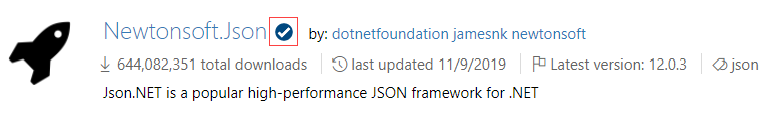

# Package authoring best practices

This guidance is intended to give NuGet.org package authors a lightweight end to end reference for creating and publishing high quality packages. It will primarily focus on package-specific best practices such as metadata and packing. For more in-depth suggestions for building high quality libraries, see the .NET [Open-source library guidance](https://docs.microsoft.com/en-us/dotnet/standard/library-guidance/).

## Types of recommendations

Each article presents four types of recommendations: **Do**, **Consider**, **Avoid**, and **Do not**. The type of recommendation indicates how closely it should be followed.

You should almost always follow a **Do** recommendation. For example:

✔️ DO include a short description for your package that describes what it's for.

On the other hand, **Consider** recommendations should generally be followed, but there are legitimate exceptions to the rule:

✔️ CONSIDER choosing a NuGet package name with a prefix that meets NuGet's prefix reservation [criteria](https://docs.microsoft.com/en-us/nuget/reference/id-prefix-reservation).

**Avoid** recommendations mention things that are generally not a good idea, but breaking the rule sometimes makes sense:

❌ AVOID NuGet package references that demand an exact version.

And finally, **Do not** recommendations indicate something you should almost never do:

❌ DO NOT use the `LicenseUrl` metadata property.

## Where do I define my package?

TODO: Talk about how and where to make the suggested changes through out the guide (Visual Studio properties, project file, packages.config)

## Framework targeting

Authors should consider making their packages as inclusive as possible if they would like to maximize the number of potential consumers and overall impact in the .NET ecosystem.

Highly inclusive packages are cross-platform and compatible with as many frameworks as possible. Today, that means using .NET Standard. .NET Standard is a specification of .NET APIs that are available on all .NET implementations.

✔️ DO start with including a `netstandard2.0` target.
> Most general-purpose libraries should not need APIs outside of .NET Standard 2.0. .NET Standard 2.0 is supported by all modern platforms and is the recommended way to support multiple platforms with one target.

See the .NET [Cross-platform targeting guidance](https://docs.microsoft.com/en-us/dotnet/standard/library-guidance/cross-platform-targeting) for more advanced suggestions regarding cross-platform and multitargeting scenarios.

## Package metadata

Metadata is a foundational component of any NuGet package. The quality of your metadata can vastly influence the discoverability and usability of your package.

In Visual Studio, the recommended way to specify package metadata is to go Project > [Project Name] Properties > Package.

Package metadata elements can also be specified directly in the project file (.csproj).

Below is a table mapping and describing available packages metadata elements:

| Visual Studio property name | csproj/MSBuild property name | Nuspec property name        | Description                                                                                                       |
|-----------------------------|------------------------------|-----------------------------|-------------------------------------------------------------------------------------------------------------------|
| `Package id`                | `PackageId`                  | `id`                        | The package identifier. A prefix from the identifier can be reserved if it meets the criteria.                   |
| `Package Version`           | `Version`                    | `version`                   | NuGet package version. For more information, see NuGet package version.                                           |
| `Authors`                   | `Authors`                    | `authors`                   | A comma-separated list of package authors, matching the profile names on NuGet.org.                               |
| `Description`               | `Description`                | `description`               | A long description of the package displayed in UI.                                                                |
| `Copyright`                 | `Copyright`                  | `copyright`                 | Copyright details for the package. language.                                                                      |
| `Licensing - Expression`    | `PackageLicenseExpression`   | `license type="expression"` | An SPDX license expression or path to a license file within the package, often shown in UIs like NuGet.org.       |
| `Licensing - File`          | `PackageLicenseFile`         | `license type="file"`       | File for custom license that isn't supported by license expressions                                               |
| `Project URL`               | `PackageProjectUrl`          | `projectUrl`                | A URL for the project homepage.                                                                                   |
| `Icon File`                 | `PackageIcon`                | `icon`                      | An image to use as the icon for the package.                                                                      |
| `Repository URL`            | `RepositoryUrl`              | `repository url=""`         | URL to the repository from which the package was built.                                                           |
| `Repository type`           | `RespositoryType`            | `repository type=""`        | Type of repository the repository URL is pointing to (i.e. git)                                                   |
| `Tags`                      | `PackageTags`                | `tags`                      | A space-delimited list of tags and keywords that describe the package. Tags are used when searching for packages. |
| `Release notes`             | `PackageReleaseNotes`        | `releaseNotes`              | A description of the changes made in this release of the package.                                                 |

### Package ID

If you're publishing a completely new package:

✔️ DO choose a package ID that is unique and clearly differentiated from existing packages on NuGet.org.
> You can check if a package ID is unique and differentiable by searching for the ID on NuGet.org or checking if the following link exists: https://www.nuget.org/packages/<package name\>.

✔️ CONSIDER choosing a NuGet package name with a prefix that meets NuGet's [prefix reservation criteria](https://docs.microsoft.com/en-us/nuget/nuget-org/id-prefix-reservation#id-prefix-reservation-criteria).
> Reserving the prefix ID for your package will let you get the verified check mark:
> 
> Check out the [Package ID prefix reservation docs](https://docs.microsoft.com/en-us/nuget/nuget-org/id-prefix-reservation) to learn more.

### Package Version

✔️ CONSIDER using [SemVer](https://semver.org/) to version your NuGet package.
> Essentially, this means using the Major.Minor.Patch[-prerelease] format.

✔️ DO include a pre-release suffix when releasing a non-stable package.
TODO: Include and example and link to https://docs.microsoft.com/en-us/dotnet/standard/library-guidance/nuget#pre-release-packages somewhere

See the [.NET library versioning guide](https://docs.microsoft.com/en-us/dotnet/standard/library-guidance/versioning) for more advanced guidance including assembly versioning.

### Authors

✔️ CONSIDER including the current NuGet.org owners for consistency across NuGet clients.
> Visual Studio currently displayed `Authors` on the Browse tab. It is also in the criteria for ID prefix reservation.

### Description

✔️ DO include a short description for your package that describes what it's for.
> Package descriptions are one of the most prominent fields surfaced in NuGet search and will likely be the first thing a potential consumers looks at to determine if a package is right for them.

### Copyright

✔️ CONSIDER copyrighting your package with "Copyright (c) <name/company\> <year\>."
>A copyright notice essentially indicates that your work cannot be copied without your permission. Including a copyright notice in your package is easy and won't do any harm!

Example: Copyright (c) Contoso 2020

### Licensing

✔️ DO [include a valid license expression or license file in your package](https://docs.microsoft.com/en-us/nuget/reference/msbuild-targets#packing-a-license-expression-or-a-license-file).
> [!IMPORTANT]
> A project without a license defaults to [exclusive copyright](https://choosealicense.com/no-permission/), making it legally impossible for other people to use.

❌ DO NOT use the deprecated `LicenseUrl` metadata property.
> This presents legal ambiguity as license changes at the URL will retroactively change the displayed license for previous package versions.

#### If your package is [open source](https://opensource.org/osd)

✔️ DO [choose an open source license](https://choosealicense.com/) to make your package open source.
> *"Open source licenses are licenses that comply with the Open Source Definition — in brief, they allow software to be freely used, modified, and shared."* - Open Source Initiative. To learn more about open source software and the Open Source Initiative, check out https://opensource.org/.

✔️ CONSIDER [including a license expression in your package](https://docs.microsoft.com/en-us/nuget/reference/msbuild-targets#packing-a-license-expression-or-a-license-file).
> License expressions are surfaced the most clearly and make it more obvious to consumers if they can use your package or if the license has changed. 
> [!Note]
> NuGet.org only accepts license expressions that are approved by the Open Source Initiative or the Free Software Foundation.

#### If your package is not open source

✔️ DO [include a license file in your package](https://docs.microsoft.com/en-us/nuget/reference/msbuild-targets#packing-a-license-expression-or-a-license-file).
> Any valid license file can be added to your package, including non-standard licenses. 

### Project URL

✔️ CONSIDER including a link to an associated project or company website.
> Company website links, even if not specific to the package/project, still improve consumer trust.

❌ DO NOT put a repository URL (GitHub, BitBucket, etc.) in the `Project URL` field, as consumers will expect to find it in the `Repository URL` field.

### Icon

✔️ CONSIDER including an icon with your package to help visually differentiate it. It's a relatively small addition that can improve perception of package quality.
> Icons can be specific to individual packages or be a brand logo.

✔️ DO use an image that is 128x128 and has a transparent background (PNG) for best viewing results.
> NuGet will automatically scale your image to the client it is being displayed on.

❌ DO NOT use the deprecated `IconUrl` metadata property.

### Repository Type and URL

✔️ CONSIDER including a repository type and URL to make it easy for package consumers to view source code, report issues, and view repository documentation (only if public).

✔️ CONSIDER setting up [Source Link](https://docs.microsoft.com/en-us/dotnet/standard/library-guidance/sourcelink) to add source control metadata to your assemblies and NuGet package.
> Source Link will automatically adds `Repository URL` and `Repository Type` to the package metadata. It also adds the specific commit associated with your package version.

### Tags

✔️ DO include several tags with key terms related to your package to enhance discoverability.
> Tags are taken into account in NuGet's search algorithm and are especially helpful for terms that are not in the Package ID.

### Release notes

✔️ CONSIDER including release notes with each update describing what changes were made.
> While there is no specific format required for release notes, we recommend including:
>
> 1. Breaking changes
> 2. New features
> 3. Bug fixes
> 
> If you already track release notes in your repo, you can also include a link to your release notes file.

## Dependencies

### Lean packages

✔️ DO review your package for unnecessary dependencies.
> Unnecessary dependencies needlessly increase the size of your package as well as increase likelihood of version conflicts for both yourself and your consumers!

### Dependency version ranges

❌ DO NOT have NuGet package references with no minimum version.

❌ AVOID NuGet package references that demand an exact version.

❌ AVOID NuGet package references with a version upper limit.
