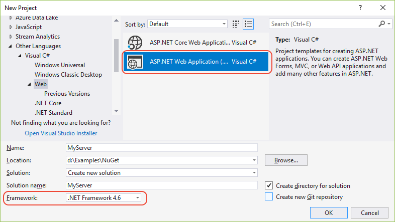
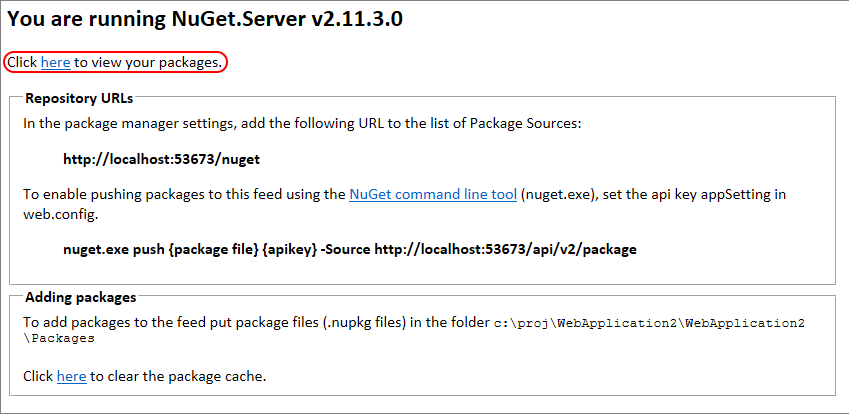

# NuGet.Server

NuGet.Server is a package provided by the .NET Foundation that creates an ASP.NET application that can host a package feed on any server that runs IIS. Simply said, NuGet.Server makes a folder on the server available through HTTP(S) (specifically OData). It's easy to set up and is best for simple scenarios.

1. Create an empty ASP.NET Web application in Visual Studio and add the NuGet.Server package to it.
   - If you are using Visual Studio 2022, you must add the .NET Framework development tools. You need this so that you can create a new **ASP.NET Web Application (.NET Framework)** project.
1. Configure the `Packages` folder in the application and add packages.
1. Deploy the application to a suitable server.

The following sections walk through this process in detail, using C#.

If you have further questions about NuGet.Server, create an issue on [https://github.com/nuget/NuGetGallery/issues](https://github.com/nuget/NuGetGallery/issues).

## Create and deploy an ASP.NET Web application with NuGet.Server

1. In Visual Studio, select **File > New > Project**, search for "ASP.NET Web Application (.NET Framework)", select the matching template for **C#**.

    

1. Set **Framework** to ".NET Framework 4.6".

    

1. Give the application a suitable name *other* than NuGet.Server, select OK, and in the next dialog select the **Empty** template, then select **OK**.

    

1. Right-click the project, select **Manage NuGet Packages**.

1. In the Package Manager UI, select the **Browse** tab, then search and install the latest version of the NuGet.Server package if you're targeting .NET Framework 4.6. (You can also install it from the Package Manager Console with `Install-Package NuGet.Server`.) Accept the license terms if prompted.

    

1. Installing NuGet.Server converts the empty Web application into a package source. It installs a variety of other packages, creates a `Packages` folder in the application, and modifies `web.config` to include additional settings (see the comments in that file for details).

    > [!Important]
    > Carefully inspect `web.config` after the NuGet.Server package has completed its modifications to that file. NuGet.Server may not overwrite existing elements but instead create duplicate elements. Those duplicates will cause an "Internal Server Error" when you later try to run the project. For example, if your `web.config` contains `<compilation debug="true" targetFramework="4.5.2" />` before installing NuGet.Server, the package doesn't overwrite it but inserts a second `<compilation debug="true" targetFramework="4.6" />`. In that case, delete the element with the older framework version.

1. Run the site locally in Visual Studio (using **Debug > Start Without Debugging** or Ctrl+F5). The home page provides the package feed URLs as shown below. If you see errors, carefully inspect your `web.config` for duplicate elements as noted earlier.

    

1.  The first time you run the application, NuGet.Server restructures the `Packages` folder to contain a folder for each package. This matches the [local storage layout](https://blog.nuget.org/20151118/nuget-3.3.html#folder-based-repository-commands) introduced with NuGet 3.3 to improve performance. When adding more packages, continue to follow this structure.

1. Once you've tested your local deployment, deploy the application to any other internal or external site as needed.

1. Once deployed to `http://<domain>`, the URL that you use for the package source will be `http://<domain>/nuget`.

## Adding packages to the feed externally

Once a NuGet.Server site is running, you can add packages using [nuget push](../reference/cli-reference/cli-ref-push.md) provided that you set an API key value in `web.config`.

After installing the NuGet.Server package, `web.config` contains an empty `appSetting/apiKey` value:

```xml
<appSettings>
    <add key="apiKey" value="" />
</appSettings>
```

When `apiKey` is omitted or blank, pushing packages to the feed is disabled.

To enable this capability, set the `apiKey` to a value (ideally a strong password) and add a key called `appSettings/requireApiKey` with the value of `true`:

```xml
<appSettings>
    <!-- Sets whether an API Key is required to push/delete packages -->
    <add key="requireApiKey" value="true" />

    <!-- Set a shared password (for all users) to push/delete packages -->
    <add key="apiKey" value="" />
</appSettings>
```

If your server is already secured or you do not otherwise require an API key (for example, when using a private server on a local team network), you can set `requireApiKey` to `false`. All users with access to the server can then push packages.

Starting with NuGet.Server 3.0.0, the URL for pushing packages was change to `http://<domain>/nuget`. Prior to the
3.0.0 release, the push URL was `http://<domain>/api/v2/package`.

With NuGet 3.2.1 and newer, this legacy URL `/api/v2/package` is enabled in addition to `/nuget` by default via
`enableLegacyPushRoute: true` option in your startup config (`NuGetODataConfig.cs` by default). Note that this feature
does not work when multiple feeds are hosted in the same project.

## Removing packages from the feed

With NuGet.Server, the [nuget delete](../reference/cli-reference/cli-ref-delete.md) command removes a package from the repository provided that you include the API key with the comment.

If you want to change the behavior to delist the package instead (leaving it available for package restore), change the `enableDelisting` key in `web.config` to true.

## Configuring the Packages folder

With `NuGet.Server` 1.5 and later, you can customize the package folder using the `appSettings/packagesPath` value in `web.config`:

```xml
<appSettings>
    <!-- Set the value here to specify your custom packages folder. -->
    <add key="packagesPath" value="C:\MyPackages" />
</appSettings>
```

`packagesPath` can be an absolute or virtual path.

When `packagesPath` is omitted or left blank, the packages folder is the default `~/Packages`.

## Making packages available when you publish the web app

To make packages available in the feed when you publish the application to a server, add each `.nupkg` files to the `Packages` folder in Visual Studio, then set each one's **Build Action** to **Content** and **Copy to Output Directory** to **Copy always**:


## Release Notes

Release notes for NuGet.Server are available on the [GitHub release page](https://github.com/NuGet/NuGet.Server/releases).
This includes details about bug fixes and new features that are added.

## NuGet.Server support

For additional help using NuGet.Server, create an issue on [https://github.com/nuget/NuGetGallery/issues](https://github.com/nuget/NuGetGallery/issues).
