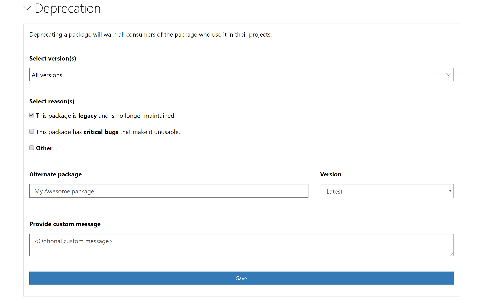

# Deprecating packages

As a package publisher, if you no longer want to maintain a package or would like to move your package consumers to move to another package due to various reasons, deprecate your package. Package deprecation is different than `unlisting` your package as explained below:
* `Unlisting` a package prevents its discovery as its hidden in search results. Hence it prevents new installs of the package.
* `Deprecating` a package lets your package's existing consumers find out if they have it installed or used in their projects. It also lets them know the reason and alternate recommended package as specified by you (the package publisher). 

## Deprecation workflow
1. To deprecate a package, go to `Manage packages` and select `Deprecation`:

    

2. Select the version you would like to deprecate. If you want to deprecate all version, choose `Select all versions` option.

    

3. Choose a reason for deprecation. If the package is no longer maintained, choose `Legacy` option. If a specific version has a critical bug, choose the second option. For any other reason, select `Other`. You can always specify an alternate recommended package (and version) and a custom message to the owners. 

> [!Note]
> Custom message is only shown on nuget.org but not from the clients. Selecting a reason constructs a good messaging for that reason and is shown to the package consumers.

    

## Client experience for deprecated packages
Once a package has been deprecated, it's package consumers would get to know about it in following ways (depending upon the client used).

### Visual Studio 
*Available on Visual Studio 2019 version 16.3+*

If you use any of the deprecated packages in your project, Visual Studio will warn you about its usage on the `Installed` tab. It will lead you to the package and the deprecation information (reason and an alternate package recommendation, if present)

### dotnet.exe
*Available with .NET SDK 3.0+*

If you use dotnet.exe, you can run the command `dotnet list package --deprecated` on the solution or project folder to get a list of deprecated packages along with the deprecation information:

```
> dotnet list package --deprecated

The following sources were used:
   https://api.nuget.org/v3/index.json

Project `My.Test.Project` has the following deprecated packages
   [netcoreapp3.0]:
   Top-level Package      Resolved   Reason(s)   Alternative
   > My.Sample.Lib        6.0.0      Legacy      My.Awesome.Package

```
