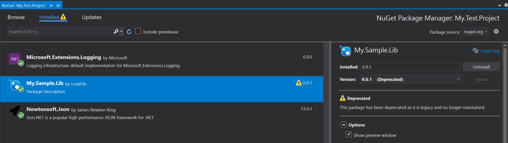

# Deprecating packages

You can deprecate a package if you no longer maintain a package or if would like to encourage your package's consumers to move to another package. 

Package deprecation is different than **unlisting** your package as explained below:
* **Unlisting** a package prevents its discovery because it is hidden in search results. 
* **Deprecating** a package lets your package's existing consumers find out if they have it installed or used in their projects. It also lets them know the reason for deprecation and an alternate recommended package as specified by you (the package publisher). Deprecating a package does not unlist the package. 

As a publisher, you may choose to both unlist as well as deprecate packages.

## Deprecation workflow
1. To deprecate a package, go to **Manage packages** and select **Deprecation**:

    

2. Select the version you would like to deprecate. If you want to deprecate all version, choose **Select all versions** option.

    

3. Choose a reason for deprecation. If the package is no longer maintained, choose the **Legacy** option. If the specific version has a critical bug, choose the **has critical bugs** option. For any other reason, select **Other**. You can always specify an alternate recommended package (and version) and a custom message to the owners. 

    

> [!Note]
> Custom message is only shown on nuget.org but not from the clients. Currently, clients such as `dotnet.exe` and the NuGet Package Manager do not show the custom message.

## Client experience for deprecated packages
Once a package has been deprecated, its consumers are notified about it in the following ways (depending upon the client used).

### Visual Studio 
*Available starting in Visual Studio 2019 version 16.3*

Visual Studio warns about a deprecated package's usage on the `Installed` tab. It will show a warning for the package and its deprecation information (including the reason it was deprecated and the alternate package to use instead, if present).

   

### dotnet.exe
*Available starting with .NET SDK 3.0*

If you use dotnet.exe, you can run the command `dotnet list package --deprecated` on the solution or project folder to get a list of deprecated packages along with the deprecation information:

```
> dotnet list package --deprecated

The following sources were used:
   https://api.nuget.org/v3/index.json

Project `My.Test.Project` has the following deprecated packages
   [netcoreapp3.0]:
   Top-level Package      Resolved   Reason(s)   Alternative
   > My.Sample.Lib        6.0.0      Legacy      My.Awesome.Package

```

## Transfer popularity to a newer package

Package authors who have deprecated a legacy package can choose to transfer its "popularity" to a newer package to boost the newer package's search ranking. This helps customers discover the newer package instead of the deprecated package.

For example, let's say I have two packages:

* My deprecated legacy package, `Contoso.Legacy` with 3 million downloads
* My latest package, `Contoso.Latest` with 5 downloads

NuGet.org prefers search results with higher downloads/popularity. Given the search query "Contoso", my deprecated package `Contoso.Legacy` would likely rank above my latest package `Contoso.Latest` in search results.

To solve this problem, I can apply to transfer the popularity of my deprecated legacy package to my latest package. This would cause `Contoso.Latest` to rank higher in search results, while `Contoso.Legacy` would rank lower. Only the internal popularity scores for the packages is impacted, the actual download count for each package will not be affected.

> [!Note]
> Popularity transfers can make it significantly harder for consumers to find the legacy package.

See the table below to get a concrete idea of how a popularity transfer may impact search rankings for the query "Contoso":

| Search ranking 	| Before popularity transfer     	| After popularity transfer      	|
|----------------	|--------------------------------	|--------------------------------	|
| 1              	| *Contoso.Legacy, 3M downloads*  	| *Contoso.Latest, 5 downloads* 	|
| 2              	| Contoso.Scanner, 2M downloads  	| Contoso.Scanner, 2M downloads  	|
| 3              	| Contoso.Core,  1.5M downloads  	| Contoso.Core,  1.5M downloads  	|
| 4              	| Contoso.UI, 1M downloads       	| Contoso.UI, 1M downloads       	|
| ...            	| ...                            	| ...                            	|
| 20             	| *Contoso.Latest, 5 downloads* 	| *Contoso.Legacy, 3M downloads*   	|

### Popularity transfer application process

1. Review the [popularity transfer requirements](#popularity-transfer-requirements).
2. Email [account@nuget.org](mailto:account@nuget.org) with the deprecated package whose popularity should be transferred, and, the list of stable package(s) that should receive the popularity transfer.

After the application is submitted, we will notify you of your application's acceptance or rejection (with the criteria that caused rejection). We may need to ask additional identifying questions to confirm owner identity.

#### Popularity transfer requirements

* The legacy packages and new packages must share all owners.
* The new packages must be clearly related to the legacy packages in naming and function (i.e. an evolution or next generation).
* All versions of the legacy packages must be deprecated and point to the new packages receiving the transfer.
* The popularity transfer must not cause confusion for NuGet users or worsen the NuGet search experience.
* The new packages must have a stable version.
* The legacy package must not receive popularity transfers from another deprecated package.

### Advanced popularity transfer scenarios

#### Package consolidations

I can transfer the popularity of multiple deprecated packages in favor of a single new package. For example, let's say I have 3 packages:

* My first deprecated legacy package, `Contoso.Legacy1`
* My second deprecated legacy package, `Contoso.Legacy2`
* My new consolidated package, `Contoso.Latest`

After I deprecate `Contoso.Legacy1` and `Contoso.Legacy2`, I can apply to transfer their popularity to `Contoso.Latest`.

#### Package splits

A deprecated package's popularity can be transferred to, and divided among, up to 5 newer packages. This is useful if the functionality of a deprecated package has been split among multiple new packages. For example, let's say I have 3 packages:

* My deprecated legacy package, `Contoso.Legacy`
* My first new package, `Contoso.Web`
* My second new package, `Contoso.Cloud`

`Contoso.Legacy` includes both web and cloud functionality, but I decided to separate that functionality into different packages for the next generation. After I deprecate `Contoso.Legacy`, I can apply to transfer its popularity to both `Contoso.Web` and `Contoso.Cloud`.

> [!Warning]
> The transferred popularity will be split evenly between all new packages. As a result, we recommend transferring your deprecated package's popularity to as few packages as possible.

#### Popularity transfer chains

A deprecated package cannot transfer its popularity if it is already receiving popularity from another deprecated package. For example, say I have 3 packages:

* My deprecated legacy package, `Contoso.First`
* My deprecated legacy package, `Contoso.Second`
* My new package, `Contoso.Latest`

If `Contoso.First` transfers its popularity to `Contoso.Second,` then `Contoso.Second` cannot transfer its popularity to `Contoso.Latest`. Instead, we recommend transferring the popularity of both `Contoso.First` and `Contoso.Second` to `Contoso.Latest`, as per the [Package consolidations](#package-consolidations) scenario.
