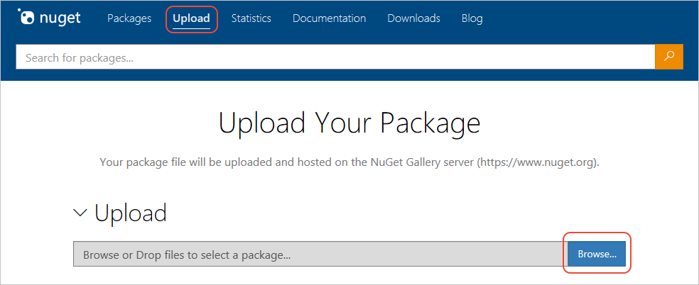
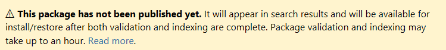

# Publish NuGet packages

Once you create a NuGet package and have a *.nupkg* file, you can make the package available to other developers either publicly or privately. This article describes how to share public packages globally through [nuget.org](https://www.nuget.org/packages/manage/upload).

You can also make private packages available to only a team or organization by hosting them on a file share, a private NuGet server, or a third-party repository such as myget, ProGet, Nexus Repository, or Artifactory. For more information, see [Host your own NuGet feeds](../hosting-packages/overview.md). For publishing with [Azure Artifacts](https://www.visualstudio.com/docs/package/nuget/publish), see [Publish packages to NuGet.org](/azure/devops/artifacts/nuget/publish-to-nuget-org).

## Publish to nuget.org

To publish on nuget.org, sign in to nuget.org with a Microsoft account, and use it to create a free nuget.org account. Follow the instructions at [Add a new individual account](individual-accounts.md#add-a-new-individual-account).


Once you have an account, you can publish a package to nuget.org by using the nuget.org web portal, the dotnet CLI, or the NuGet CLI version 4.1.0 or above. You can also publish packages through Azure Pipelines.

### Upload to the nuget.org web portal

To upload a package to the nuget.org website:

1. Select **Upload** on the top menu at nuget.org, browse to the package on your computer, and select **Open**.

   

   If the package ID already exists on nuget.org, you get an error. Change the package identifier in your project, repack, and try the upload again.

1. If the package name is available, the **Verify** section opens so you can review the metadata from the package manifest. If you included a [readme file](../nuget-org/package-readme-on-nuget-org.md) in your package, select  **Preview** to make sure all content renders properly.

   To change any of the metadata, edit your project file or *.nuspec* file, rebuild, repack, and upload again.

1. When all the information is ready, select **Submit**.

### Push by using a command line

To push packages to nuget.org with a command line, you can use either `dotnet.exe` or `nuget.exe` v4.1.0 or above, which implement the required NuGet protocols. For more information, see [NuGet protocols](../api/nuget-protocols.md).

To use either command line, you first need to get an API key from nuget.org.

#### Create an API key

[!INCLUDE [publish-api-key](../quickstart/includes/publish-api-key.md)]

#### Use the dotnet CLI

[!INCLUDE [publish-dotnet](../quickstart/includes/publish-dotnet.md)]

#### Use the NuGet CLI

1. At a command prompt, run the following command, replacing `<your_API_key>` with the key you got from nuget.org:

    ```cli
    nuget setApiKey <your_API_key>
    ```

    This command stores your API key in your NuGet configuration so you don't need to enter the API key again on the same computer.

    > [!NOTE]
    > This API key isn't used to authenticate with private feeds. To manage credentials for authenticating with these sources, see the [nuget sources command](../reference/cli-reference/cli-ref-sources.md).

1. Push the package by using the following command:

    ```cli
    nuget push YourPackage.nupkg -Source https://api.nuget.org/v3/index.json
    ```

### Publish with Azure Pipelines

You can push packages to nuget.org with Azure Pipelines as part of your continuous integration/continuous deployment (CI/CD) process. For more information, see [Publish NuGet packages with Azure Pipelines](/azure/devops/pipelines/artifacts/nuget).

### Publish a signed package

To submit a signed package, you must first [register the certificate](../create-packages/Sign-a-Package.md#register-the-certificate-on-nugetorg) you used to sign the package. If you don't meet the [signed package requirements](../reference/Signed-Packages-Reference.md#signature-requirements-on-nugetorg), nuget.org rejects the package.

## Package validation and indexing

Packages pushed to nuget.org undergo several validations, such as virus checks, and existing packages are periodically scanned. When the package passes all validation checks, it might take awhile to be indexed and appear in search results. While the package is being indexed, it appears under **Unlisted Packages**, and you see the following message on the package page:



Once validation and indexing are complete, you receive an email that the package was successfully published. If the package fails a validation check, the package page updates to display the associated error, and you receive a notification email.

Package validation and indexing usually take less than 15 minutes. If package publishing is taking longer than expected, check nuget.org status at [status.nuget.org](https://status.nuget.org/). If all systems are operational and the package isn't successfully published within an hour, contact nuget.org by using the **Contact support** link on the package page.

To see package status, select **Manage packages** under your account name at upper right on nuget.org, and select the package from **Published Packages** or **Unlisted Packages**.

<a name="managing-package-owners-on-nugetorg"></a>
## Manage package owners on nuget.org

Package owners have full permissions for the package, including adding and removing other owners and publishing updates.

Although the NuGet package's *.nuspec* file defines the package's authors, nuget.org doesn't use that metadata to define ownership. Instead, nuget.org assigns ownership to the person who publishes the package, either the signed-in user who uploaded the package, or the user whose API key was used with `dotnet push`, `nuget SetApiKey`, or `nuget push`.

To change ownership of a package:

1. Sign in to nuget.org with the account that currently owns the package.
1. Select your account name at upper right, select **Manage packages**, and expand **Published Packages**.
1. Select the package you want to manage, and on the right side of the package page, select **Manage package**.
1. On the package management page, select **Owners**.
1. Take one of the following actions:

   - Select **Remove** to remove the current owner.
   - Add an owner under **Add owner** by entering their user name and a message, and selecting **Add**.

     This action sends an email to the new co-owner with a confirmation link. Once confirmed, that person has full permissions to add and remove owners. Until confirmed, the **Current owners** section shows pending approval for that person.

To transfer ownership, as when ownership changes or a package publishes under the wrong account, add the new owner. Once they confirm ownership, they can remove the old owner from the list.

To assign ownership to a company or group, create a nuget.org account with an email alias that forwards to the appropriate team members. For example, various Microsoft ASP.NET packages are co-owned by the [microsoft](https://nuget.org/profiles/microsoft) and [aspnet](https://nuget.org/profiles/aspnet) accounts.

Occasionally, a package might not have an active owner. For example, the original owner might have left the company that produced the package. If you're the rightful owner of a package and need to regain ownership, use the [contact form](https://www.nuget.org/policies/Contact) on nuget.org to explain your situation to the NuGet team. The team follows a process to verify your ownership, including trying to locate the existing owner, and can send you a new invitation to become the package owner.

## Next steps

- [Package readme on NuGet.org](package-readme-on-nuget-org.md)
- [Package ID prefix reservation](id-prefix-reservation.md)
- [Deprecate packages](deprecate-packages.md)
- [Host your own NuGet feeds](../hosting-packages/overview.md)
