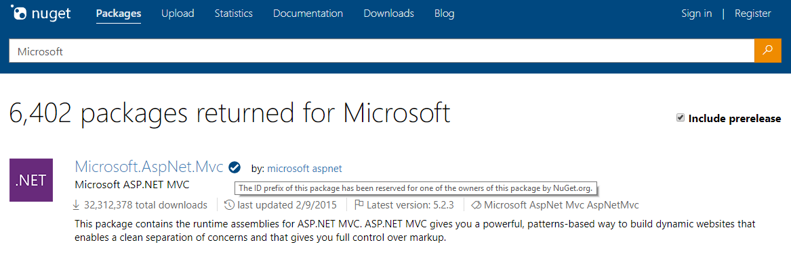

# Package ID prefix reservation

Package owners can reserve and protect their identity by reserving ID prefixes. Package consumers are provided with additional information when the packages that they are consuming are not deceptive in their identifying properties. 

[nuget.org](https://www.nuget.org/) and Visual Studio 2017 version 15.4 or later show a visual indicator for packages that are submitted by owners with a reserved package ID prefix, as long as the package matches the reserved ID prefix naming pattern. The below reference explains what the ID prefix reservation entails, and how an owner can apply for an ID prefix.

## ID prefix reservation details

When a package ID prefix is reserved, several things happen on the [nuget.org](https://www.nuget.org/) gallery, as well as in Visual Studio. In addition, there are advanced scenarios that are supported by ID prefix reservations, such as setting a prefix as 'public', delegating prefix subsets to multiple owners.

### ID prefix reservation on nuget.org

When a prefix is reserved on [nuget.org](https://www.nuget.org/), the following will happen:

1. A prefix reservation is associated with an owner or set of owners on [nuget.org](https://www.nuget.org/).

1. Whenever a package is submitted to [nuget.org](https://www.nuget.org/) with an ID that matches the reserved ID prefix, the package is rejected unless it originates from the owner(s) that reserved the ID prefix.

1. Any package that matches the reserved ID prefix and originates from the owner(s) that reserved the ID prefix will have a visual indicator in Visual Studio 2017 version 15.4 or later, and on [nuget.org](https://www.nuget.org/) indicating that the package is under a reserved ID prefix. This is true for both new package submissions as well as existing packages under the owner(s). **Note:** The indicator in Visual Studio appears only if a single feed is selected as the package source.

1. All previously existing packages that match the reserved ID prefix, but are *not* owned by the owner of the reserved prefix will remain unchanged (they will not be unlisted, but they will also not have the visual indicator). In addition, owners of these packages will still be able to submit new versions to the package.

These changes are based on the following conditions and impose several additional restrictions:

- Only one owner of a package needs to have the reserved prefix for the visual indicator to appear (for packages with multiple-owners).

- If there is more than one owner of a package where one or more owners has the reserved prefix and one or more owners does not have the reserved prefix, then only the owner(s) with the reserved prefix can remove other owner(s) with a reserved prefix. The owners who do not have the prefix reserved cannot remove owners with the prefix reserved. They can still remove other owners that also do not have the prefix reserved.

- Once a package has the visual indicator, it should *always* have the visual indicator (guaranteeing that at least one owner with the reserved prefix will always remain an owner)

### Advanced prefix reservation scenarios

There are several more advanced prefix reservation scenarios described below, including subprefix delegation, and marking prefixes as public. Below are the more advanced prefix reservations that can be made. 

- During prefix reservation, the owner can request delegation of prefix subsets (or the prefix) to other owners. For example, if '[Microsoft](https://www.nuget.org/profiles/microsoft)' owns 'Microsoft.\*', but '[aspnet](https://www.nuget.org/profiles/aspnet)' wants to reserve 'Microsoft.AspNet.\*', '[Microsoft](https://www.nuget.org/profiles/microsoft)' can choose to delegate 'Microsoft.AspNet.\*' to the [aspnet](https://www.nuget.org/profiles/aspnet) account.

- During prefix reservation, the owner can choose to make a prefix public. This will still give them the visual indicator showing that the package originates from a reserved prefix, but it will **not** block future package submissions on the prefix for any owner. This is useful for open source projects with many contributors - the top or core contributors can have the prefix reserved, but it can still be open to all contributors. 

### Prefix reservation visual indicator

When a package comes from a reserved prefix, you see the below visual indicators on the [nuget.org](https://www.nuget.org/) gallery and in Visual Studio 2017 version 15.4 or later:

**nuget.org Gallery**

**Visual Studio**

## ID prefix reservation application process

1. Review the acceptance [criteria for prefix ID reservation](#id-prefix-reservation-criteria).

2. Determine the prefixes you want to reserve, in addition to any [advanced prefix reservation scenarios](#advanced-prefix-reservation-scenarios) you may require.

3. Send a mail to [account@nuget.org](mailto:account@nuget.org) with the owner display name on [nuget.org](https://www.nuget.org/), as well as any reserved prefixes you are requesting. If you are delegating prefix subsets to multiple owners, make sure you mention all owner display names and prefix subsets.

After the application is submitted, you are notified of acceptance or rejection (with the criteria that caused rejection). We may need to ask additional identifying questions to confirm owner identity.

### ID prefix reservation criteria

When reviewing any application for ID prefix reservation, the [NuGet.org](https://www.nuget.org) team will evaluate the application against the below criteria. Please note that not all criteria need to be met for a prefix to be reserved, but the application may be denied if there is not substantial evidence of the criteria being met (with an explanation given):

1. Does the package ID prefix properly and clearly identify the reservation owner?

1. Is the package ID prefix something common that should not belong to any individual owner or organization? Avoid ID prefix reservations that are shorter than four characters and avoid common or generic words.

1. Would *not* reserving the package ID prefix cause ambiguity, confusion, or other harm to the community?

When publishing packages to NuGet.org within your ID prefix reservation, the following best practices must be considered:

1. Are the identifying properties of the packages that match the package ID prefix clear and consistent (especially the package author)?

1. Do the packages have a license (using the [license](../reference/nuspec.md#license) metadata element and NOT licenseUrl which is being deprecated)?

1. If the packages have an icon (using the iconUrl metadata element), are they also using the [icon](../reference/nuspec.md#icon) metadata element? It is not a requirement to remove the iconUrl but embedded icons must be used.
 
Consider reviewing the full [package authoring best practices guide](../create-packages/package-authoring-best-practices.md) in addition to the points above.

## Third party feed provider scenarios

If a third party feed provider is interested in implementing their own service to provide prefix reservations, they can do so by modifying the search service in the NuGet V3 feed providers. The change in the feed search service is to add the `verified` property. The NuGet client will not support the added property in the V2 feed.

For more information, see the [documentation about the API's search service](../api/search-query-service-resource.md).

## Package ID Prefix Reservation Dispute Policy
If you believe an owner on [NuGet.org](https://www.nuget.org) was assigned a package ID prefix reservation that goes against the above listed criteria, or infringes on any trademarks or copyrights, please email [support@nuget.org](mailto:support@nuget.org) with the ID prefix in question, the owner of the ID prefix, and the reason for disputing the assigned prefix reservation.

