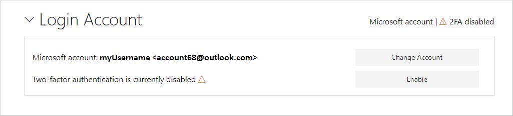
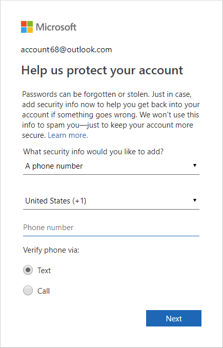
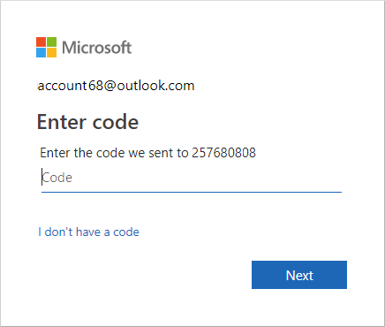

# Individual accounts on NuGet.org

You must create an individual account to publish and manage packages on NuGet.org.

## Individual accounts vs. organization accounts

Your individual (user) account is your identity on NuGet.org and can be a member of any number of organizations. A package can belong to an organization account like it can belong to an individual account. Package consumers don't see any difference between an individual account or the organization account: both appear as package `owners`.

An organization account has one or more individual accounts as its members. These members can manage a set of packages while maintaining a single identity for ownership.

## Add a new individual account

To create a NuGet.org account, you need to have a personal Microsoft account (MSA) or an Azure Active Directory (AAD) account. If you do not have one, you can [create](https://signup.live.com) one. Follow the following steps if you have an MSA or AAD account.

1. Go to the [NuGet.org login page](https://www.nuget.org/users/account/LogOn).

1. Click on **Sign in with Microsoft** button.

1. Enter your Microsoft account or Azure Active Directory account details.

1. Please click **Yes** to accept the permissions to be given to the *NuGet.org* application.

   

1. You will be redirected to *nuget.org*, and asked to register a username.

1. Specify the username in the input box. Please note that the username **is** case sensitive and cannot be changed or renamed later.

    

1. Click the **Register** button.

You now have a NuGet.org account. You can perform account management on the [account settings](https://www.nuget.org/account) page.

## Enable two-factor authentication (2FA)

Two-factor authentication, or 2FA, is an extra layer of security used when logging into websites or apps. With 2FA, you have to log in with your Microsoft Account (MSA) and provide another form of authentication that only you know or have access to. To better protect your account, enable two-factor authentication (recommended).

1. When logged into your account, open your profile and choose **Enable** under **Login Account**.

   

   You will see a message that tells you that the next time you sign in to *nuget.org*, you will be asked for additional credentials.

2. To complete the authentication at this time, sign out and then sign in again.

3. When you sign in, choose either text or e-mail as a second form of authentication.

   Verify the phone number or e-mail that is already associated with your Microsoft account. You may need to enter a new phone number or e-mail for your account. If so, enter the required information as instructed, and click **Next**.

   

4. Check your device or e-mail account, and enter the code that you were just sent.

   

5. Follow any additional instructions to complete Two-factor authentication.

> [!Tip]
> Enabling 2FA for your NuGet.org account does not impact authentication settings for other accounts or services that may be linked to the Microsoft account you use to login to NuGet.org.

## Delete a NuGet.org account

For help with additional account-related tasks, such as deleting a NuGet.org account, see [NuGet.org account management](nuget-org-faq.md#nugetorg-account-management).
