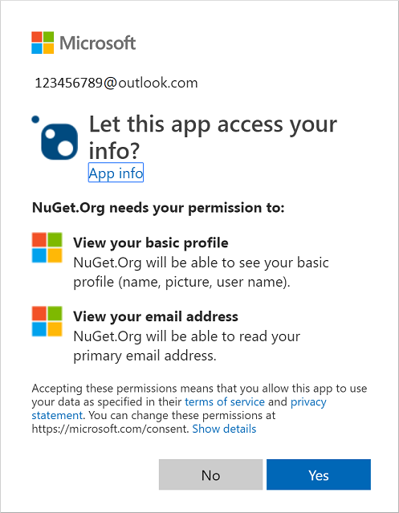

# Individual accounts on NuGet.org

You must create an individual account to publish and manage packages on NuGet.org.

## Individual accounts vs. organization accounts

Your individual (user) account is your identity on NuGet.org and can be a member of any number of organizations. A package can belong to an organization account like it can belong to an individual account. Package consumers don't see any difference between an individual account or the organization account: both appear as package `owners`.

An organization account has one or more individual accounts as its members. These members can manage a set of packages while maintaining a single identity for ownership.

## Add a new individual account

To create a NuGet.org account, you need to have a personal Microsoft account (MSA) or an Azure Active Directory (AAD) account. If you do not have one, you can [create](https://signup.live.com) one. NuGet.org requires all accounts to have two-factor authentication (2FA) enabled on your MSA or AAD account. You can update your settings in advance using the following links:

* Microsoft Account (MSA): [Turning two-step verification on or off for your Microsoft account](https://support.microsoft.com/account-billing/turning-two-step-verification-on-or-off-for-your-microsoft-account-b1a56fc2-caf3-a5a1-f7e3-4309e99987ca).
* Work or school Account (AAD): [Set up Security info from a sign-in page](https://support.microsoft.com/account-billing/set-up-security-info-from-a-sign-in-page-28180870-c256-4ebf-8bd7-5335571bf9a8).

Follow the following steps if you have an MSA or AAD account.

1. Go to the [NuGet.org login page](https://www.nuget.org/users/account/LogOn).

1. Click on **Sign in with Microsoft** button.

1. Enter your Microsoft account or Azure Active Directory account details.

1. Please click **Yes** to accept the permissions to be given to the *NuGet.org* application.

   

1. Follow two-factor authentication (2FA) setup steps if you do not have it already enabled.

1. You will be redirected to *nuget.org*, and asked to register a username.

1. Specify the username in the input box. Please note that the username **is** case sensitive and cannot be changed or renamed later.

    

1. Click the **Register** button.

You now have a NuGet.org account. You can perform account management on the [account settings](https://www.nuget.org/account) page.

> [!Note]
> Two-factor authentication, or 2FA, is an extra layer of security used when logging into websites or apps. With 2FA, you have to log in with your Microsoft Account (MSA) and provide another form of authentication that only you know or have access to.

> [!Note]
> 2FA for your NuGet.org account does not impact authentication settings for other accounts or services that may be linked to the Microsoft account you use to login to NuGet.org.

## Delete a NuGet.org account

For help with additional account-related tasks, such as deleting a NuGet.org account, see [NuGet.org account management](/nuget/nuget-org/nuget-org-faq#nuget.org-account-management).
