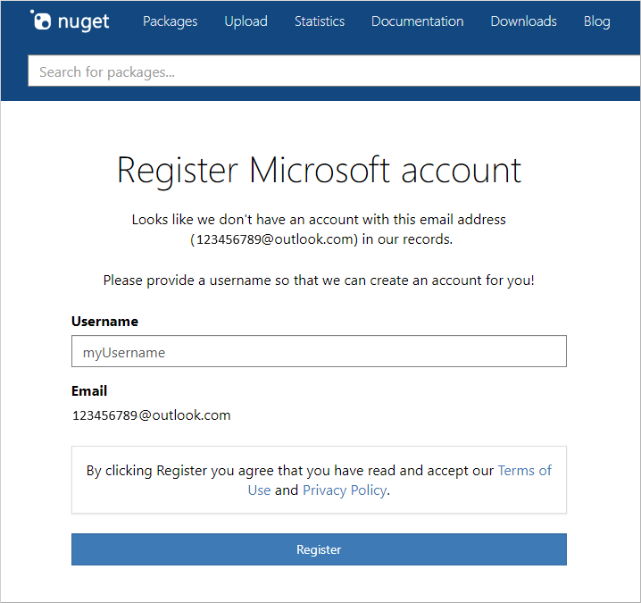

# Individual accounts

You must create an individual account to publish and manage packages on NuGet.org.

## Individual accounts vs. organization accounts

Your individual (user) account is your identity on NuGet.org and can be a member of any number of organizations. A package can belong to an organization account like it can belong to an individual account. Package consumers don't see any difference between an individual account or the organization account: both appear as package `owners`.

An organization account has one or more individual accounts as its members. These members can manage a set of packages while maintaining a single identity for ownership.

## Add a new individual account

To create a NuGet.org account, you need to have a personal Microsoft account (MSA) or an Azure Active Directory (AAD) account. If you do not have one, you can [create](https://signup.live.com) one. Follow the following steps if you have an MSA or AAD account.

1. Go to the [NuGet.org login page](https://www.nuget.org/users/account/LogOn).

1. Click on **Sign in with Microsoft** button.

1. Enter your Microsoft account or Azure ActiveDirectory account details.

1. Please click **Yes** to accept the permissions to be given to the *NuGet.org* application.

   

1. You will be redirected to *nuget.org*, and asked to register a username.

1. Specify the username in the input box. Please note that the username **is** case sensitive and cannot be changed or renamed later.

    

1. Click the **Register** button.

You now have a NuGet.org account. You can perform account management on the [account settings](https://www.nuget.org/account) page.