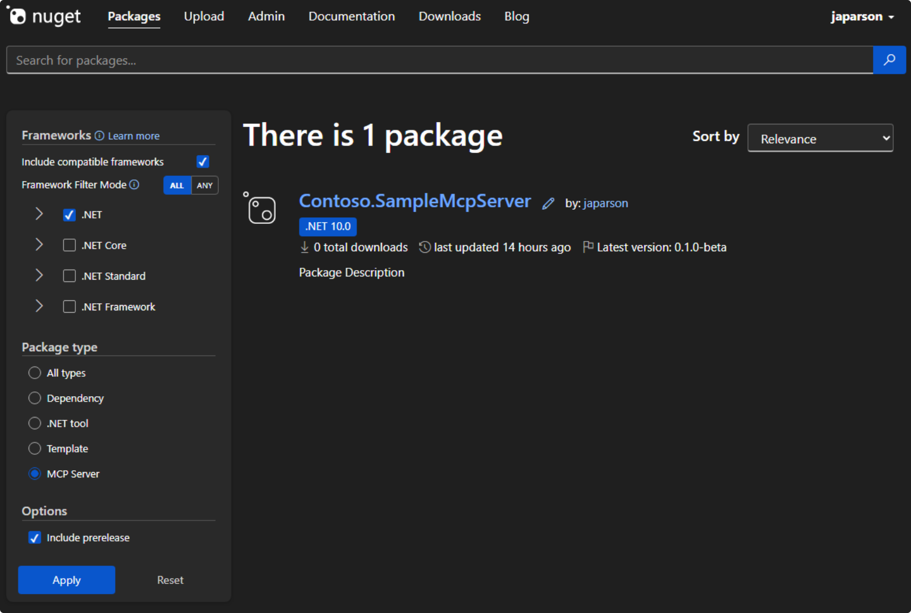
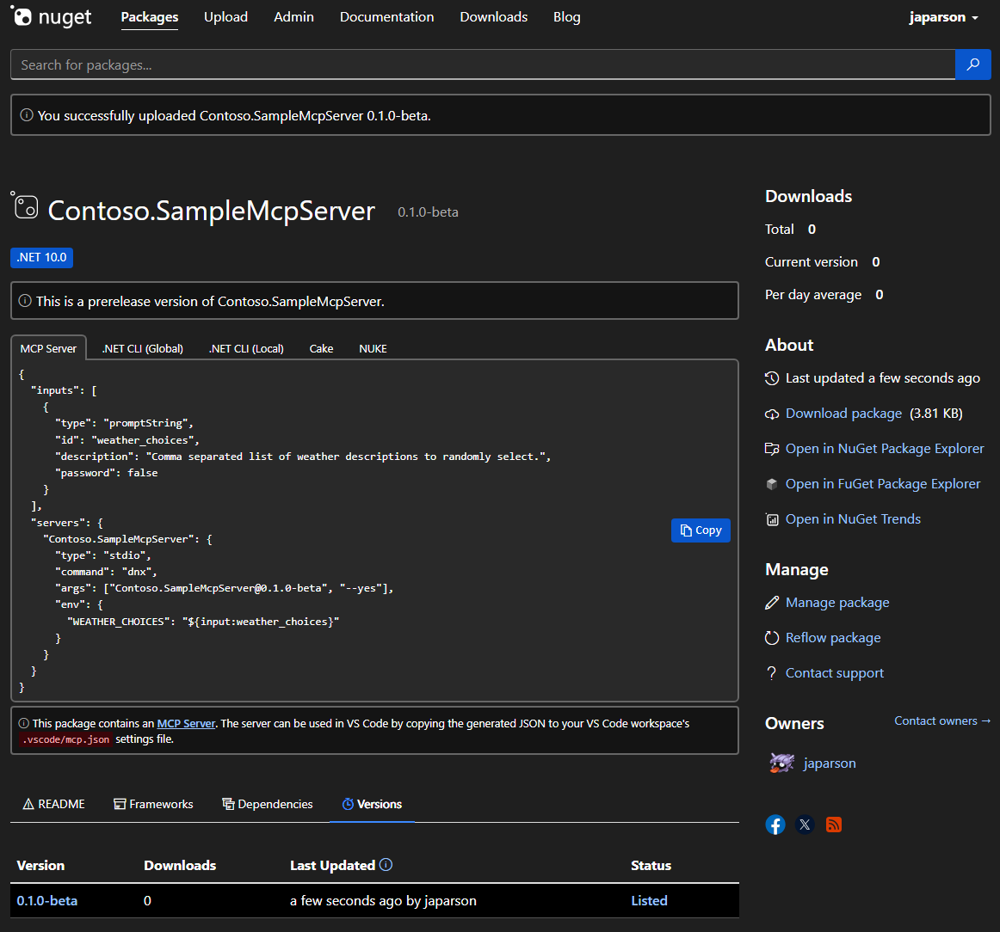

# NOT DONE YET

## Browsing for MCP servers on NuGet.org

You can search and filter existing MCP servers on NuGet.org by using the [MCP Server filter](https://www.nuget.org/packages?packagetype=mcpserver).

One the package details page, an "MCP Server" tab appears in the command palette, with JSON used in Visual Studio Code or Visual Studio to consume the package using `dnx`.

