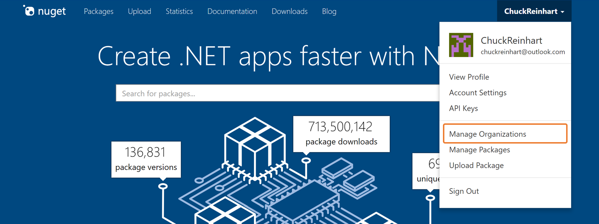
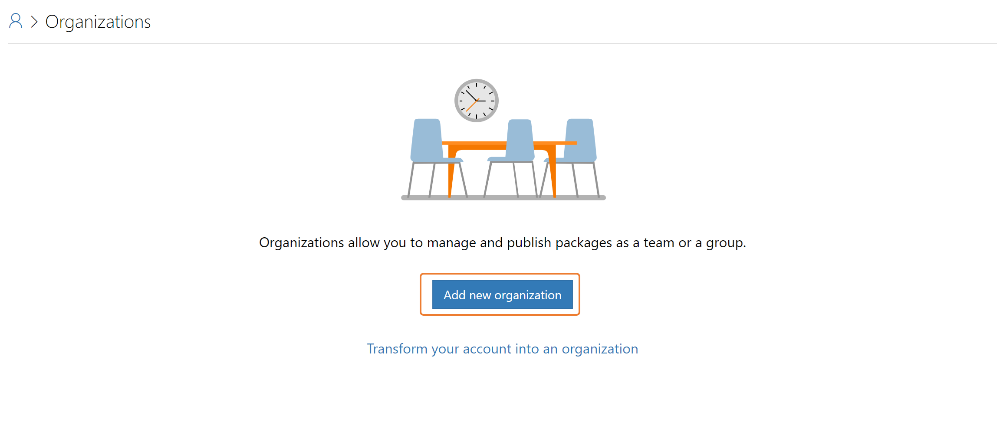
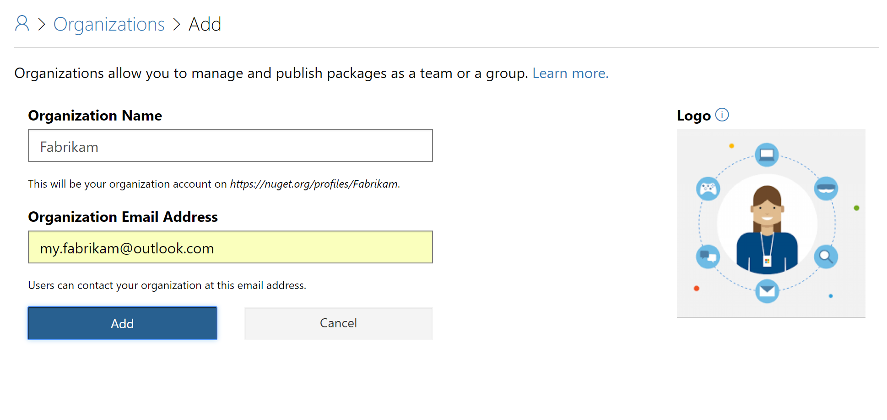
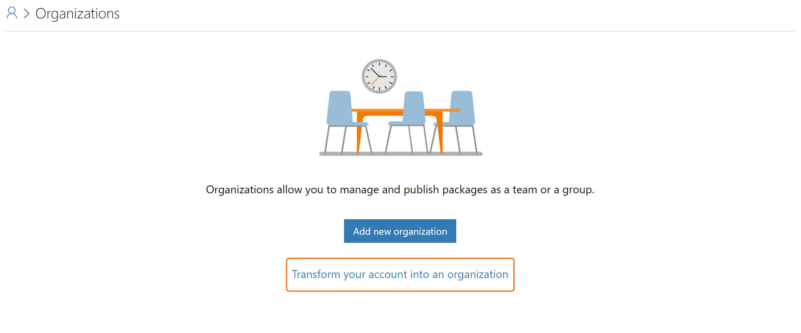
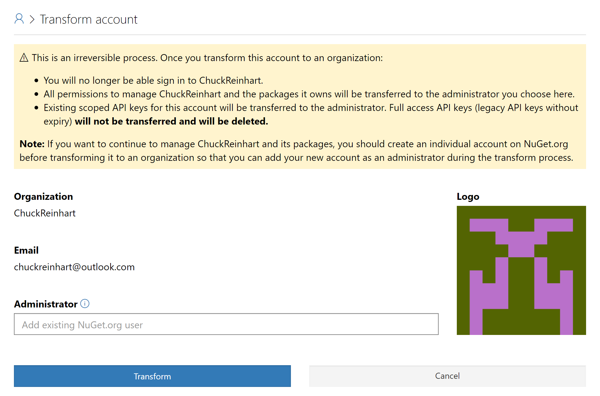
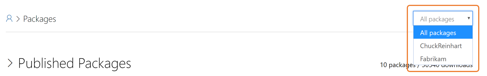
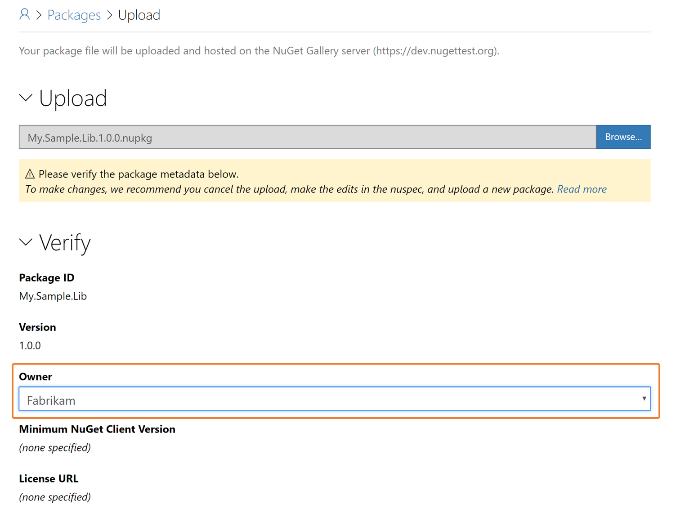
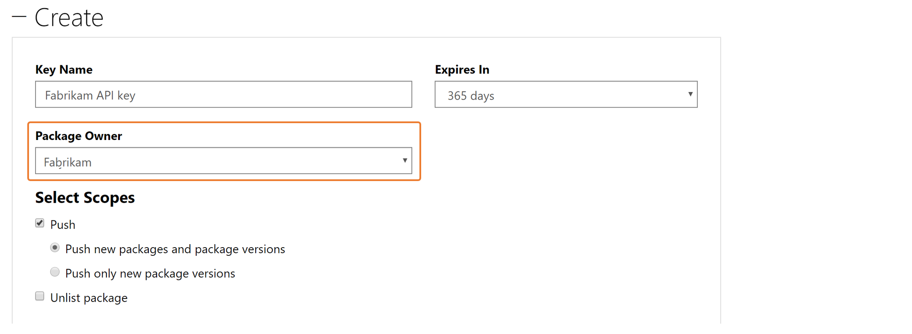
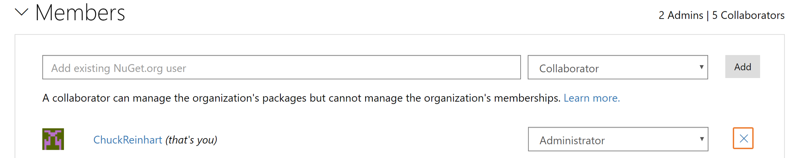
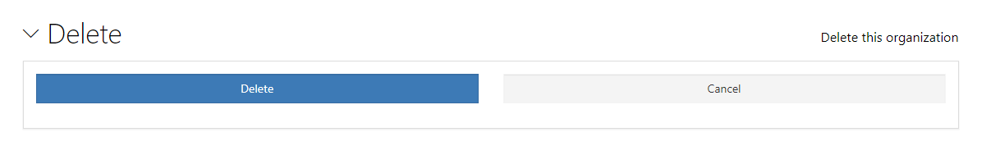

# Your organization on NuGet.org

Organizations enable businesses and open-source projects to collaborate on packages using a single NuGet.org identity. For a package consumer, an organization account appears same as an existing user account on NuGet.org.

## Organization accounts vs. individual accounts

An organization account has one or more individual (user) accounts as its members. These members can manage a set of packages while maintaining a single identity for ownership.

Your individual account is your identity on NuGet.org and can be a member of any number of organizations. A package can belong to an organization account like it can belong to an individual account. Package consumers don't see any difference between an individual account or the organization account: both appear as package `owners`.

## Adding a new organization

To add a new organization, select your account on NuGet.org, then select the **Manage Organizations...** menu command:

On the next page, select the **Add new organization** button:

On the next page, provide the organization name and email address. Since organization accounts share the same namespace as user accounts, the organization name must be different from any other existing organization or user accounts. The email address must also be unique across all accounts.

Once the organization account is created, you are the administrator and can submit packages for the organization and add organization members.

### Transform existing account to an organization

> [!Warning]
> Account conversion is irreversible: you cannot transform an organization back to a user account.

If you're managing packages as a team using a single user account and would like to convert that account into an organization, use the **Transform your account to an organization** option on the **Manage Organizations** page:

On the next page, specify different user account to assign as the administrator of the organization, then select **Transform**.

## Managing organization members

As the organization administrator, you can add members by providing each member's NuGet.org *user account name*; email addresses cannot be used. You then mark each member as a collaborator or administrator with the following permissions:

| Permission | Collaborator | Administrator |
| --- | --- | --- |
| Manage the organization's packages (submit new packages, update or unlist existing packages) | Yes | Yes |
| Change organization metadata (email address, notification settings) | No | Yes |
| Manage organization members | No | Yes |
| Request or act on co-ownership requests for organization packages | No | Yes |

## Managing packages

You can view all the packages across your account and all organizations of which you're a member on the [Manage Packages](https://www.nuget.org/account/Packages) page. To view the packages specific to your account or any specific organization, use the accounts filter on the top right of the page.

### Transferring packages to an organization
If you wish to transfer some of your packages to a newly created organization, you can do so by requesting the organization account to co-own the package and then removing yourself as the owner. If you are an administrator of the organization, there is no confirmation required to accept the ownership. However, if you are a collaborator, adding the organization as an owner requires one of the administrators to accept the ownership.

## Publishing packages

You publish packages to an organization like you publish packages to a user account: by directly uploading the package to NuGet.org or by pushing the package through the `nuget push` or `dotnet nuget push` CLI commands.

### Uploading packages

When you directly upload a new package on the [NuGet.org Upload](https://www.nuget.org/packages/manage/upload) page, you assign the package owner to a user or organization account :

### Using API keys

To push a package through the `nuget push` or `dotnet nuget push` CLI commands, you must obtain an API key needed by those commands. For details, see [Publish a package](../quickstart/create-and-publish-a-package-using-visual-studio.md#publish-the-package).

When creating a new API key, select the appropriate organization in the **Package Owner** drop down. Any API key you create is applicable only to the chosen organization:

## Removing an organization

As a user, you can remove yourself from an organization by selecting the **X** button shown by your organization membership:

Administrators can remove any member from the organization, including other administrators. If you're the sole administrator for an organization, you cannot remove yourself unless you add another member as an administrator.

### Deleting an organization account

You can delete an organization account by clicking the **Delete** button shown in your organization page.

To delete the organization, you must confirm it by clicking the **Delete organization** confirmation button.
