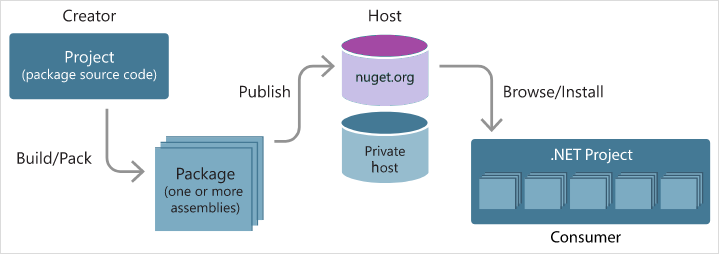

# Overview of NuGet.org

NuGet.org is a public host of NuGet packages that are employed by millions of .NET and .NET Core developers every day.

## Role of NuGet.org in the NuGet ecosystem

In its role as a public host, NuGet.org itself maintains the central repository of over 100,000 unique packages at [nuget.org](https://www.nuget.org). NuGet.org is not the only possible host for packages. The NuGet technology also enables you to host packages privately in the cloud (such as on Azure DevOps), on a private network, or even on just your local file system. If you are interested in a different host or hosting option, see [Hosting your own NuGet feeds](../hosting-packages/overview.md).

NuGet.org, like any host for NuGet packages, serves as the point of connection between package *creators* and package *consumers*. Creators build useful NuGet packages and publish them. Consumers then search for useful and compatible packages on accessible hosts, downloading and including those packages in their projects. Once installed in a project, the packages' APIs are available to the rest of the project code.

## Accounts

To publish packages on NuGet.org, you first create an [individual (user) account](individual-accounts.md). This becomes your identity on NuGet.org.

NuGet.org also allows you to create an [organization account](organizations-on-nuget-org.md). An organization account has one or more individual accounts as its members. Members can manage a set of packages while maintaining a single identity for ownership. Through your individual account, you can be a member of any number of organizations.

A package can belong to an organization account like it can belong to an individual account. Package consumers don't see any difference between an individual account or the organization account: both appear as package `owners`.

## API keys

Once you have a NuGet package (*.nupkg* file) to publish, you publish it to NuGet.org using either the nuget.exe CLI or the dotnet.exe CLI, along with an [API key](scoped-api-keys.md) acquired from NuGet.org.

When you [publish a package](../create-packages/creating-a-package.md), you include the API key value in the CLI command.

## Trusted publishing

NuGet.org supports [Trusted Publishing](trusted-publishing.md), which is a secure and streamlined way to publish NuGet packages.

## ID prefixes

When you publish packages, you can reserve and protect your identity by [reserving ID prefixes](id-prefix-reservation.md). When installing a package, package consumers are provided with additional information indicating that the package they are consuming is not deceptive in its identifying properties.

## API endpoint for NuGet.org

To use NuGet.org as a package repository with NuGet clients, you should use the following V3 API endpoint: 

`https://api.nuget.org/v3/index.json`

Older clients can still use the V2 protocol to reach NuGet.org. However, please note, NuGet clients 3.0 or later will have slower and less reliable service using the V2 protocol:

`https://www.nuget.org/api/v2` (**The V2 protocol is deprecated!**)
