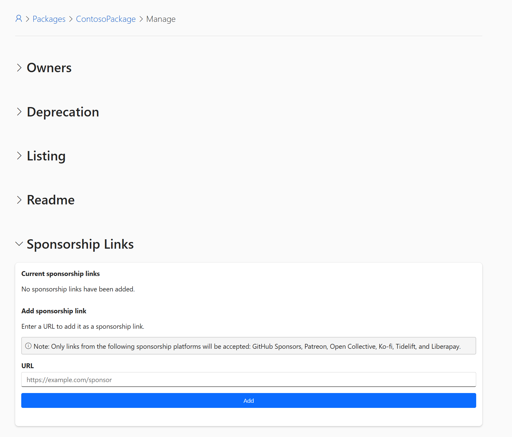
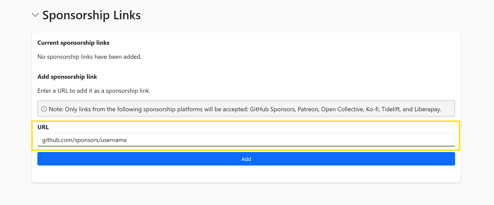
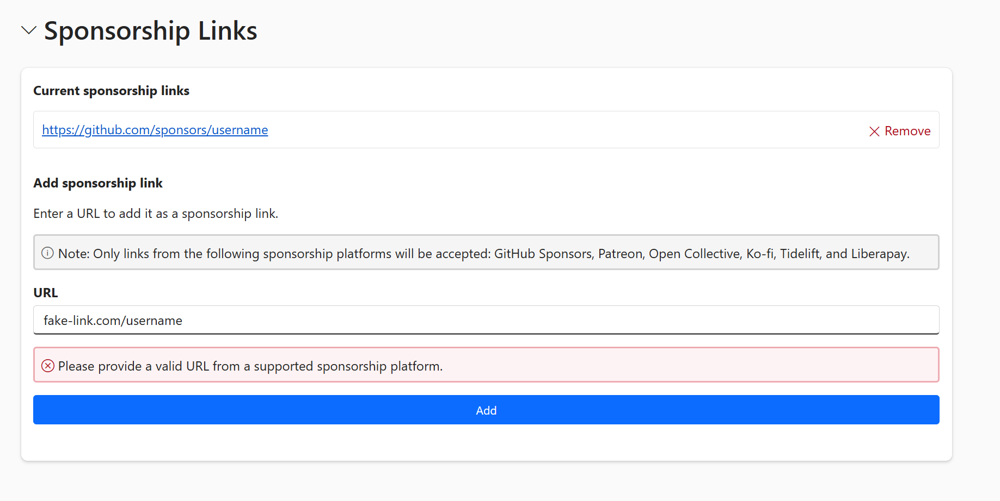

# Package sponsorship on NuGet.org

The NuGet.org sponsorship feature makes it easier for package consumers to recognize and support the authors behind their favorite packages.

NuGet.org enables package authors to add sponsorship URLs to their packages. These links appear when the "Sponsor" button on the package details page is selected.

## Setting up sponsorship for package publishers

### Prerequisites

- You must be the owner or co-owner of a package on NuGet.org
- Your sponsorship link platform must be from the approved list:
  - GitHub Sponsors
  - Patreon
  - Open Collective
  - Ko-fi
  - Tidelift
  - Liberapay

### Navigate to your package management page

1. Go to [NuGet.org](https://nuget.org) and sign in to your account.
2. Select your username in the top right corner.
3. Select **Manage Packages** from the dropdown menu.
4. Find the package you want to add sponsorship information for and select the edit button.

### Access sponsorship settings

1. On your package management page, scroll down to find the **Sponsorship Links** section.
2. Select to expand the collapsible **Sponsorship Links** section.
3. You'll see a form where you can add sponsorship URLs.

   

### Add your sponsorship URLs

1. Enter your sponsorship URL in the text field:
   - Example: `https://github.com/sponsors/yourusername`
   - Example: `https://www.patreon.com/yourusername`

   

2. Select the **Add** button.
3. The system automatically validates that your URL is from an approved platform.
4. If any URLs are invalid or from non-approved platforms, you'll see error messages to correct them. Otherwise, you'll see a confirmation message that your sponsorship link has been saved.

   

5. Each added sponsorship URL will have a **Remove** button next to it if you need to delete it.
6. You can add up to 10 different sponsorship URLs per package ID.

### Verify your sponsorship URLs display correctly

1. Navigate to your package's public page on NuGet.org.
2. Look for the **Sponsor** button in the package details **About** section.
3. Select the **Sponsor** button to test that your URLs appear correctly in the popup.

   

## Finding and supporting packages

### Identify packages that need sponsorship

1. Browse to any package page on NuGet.org.
2. Look for packages displaying a **Sponsor** button in the package details section.
3. The **Sponsor** button indicates that the package maintainer is seeking financial support.

   

### View available sponsorship options

1. Select the **Sponsor** button on the package page.
2. A popup window appears showing all available sponsorship links for that package.

   

### Choose your preferred sponsorship platform

1. Review the available sponsorship options in the popup.
2. Select your preferred platform to be redirected to the external sponsorship page.
3. The link opens in a new tab or window, keeping the NuGet package page open.

> [!IMPORTANT]
> These links take you to third-party platforms. Microsoft isn't affiliated with or responsible for the content or practices of third-party platforms, and we don't endorse them. Microsoft reserves the right to remove any allowed third-party platforms.

## Frequently asked questions

**Can I add sponsorship information to older versions of my package?**

Yes! Sponsorship information is managed at the package ID level, so it automatically applies to all versions of your package, including previously published versions.

**What happens if my sponsorship platform URL changes?**

You can update your sponsorship URLs anytime through the package management page. Changes take effect immediately across all versions.

**Can I see analytics on how many people selected my sponsorship links?**

No, NuGet.org doesn't track sponsorship link selections. You'll need to check analytics on your sponsorship platform directly.

**Can I add custom sponsorship platforms not on the approved list?**

Currently, only the approved list of platforms is supported. This helps ensure security and legitimacy of sponsorship links. If you'd like to request a new platform to be added to the approved list, you can open an issue on the [NuGet Gallery repository](https://github.com/NuGet/NuGetGallery/issues).

**Does NuGet.org store my financial information?**

No personal or financial data is stored by NuGet.org. All transactions occur on secure external platforms that a maintainer chooses for sponsoring their packages.

