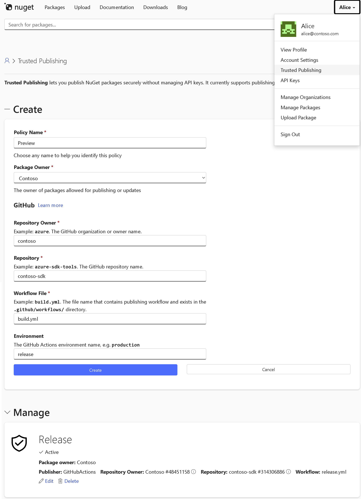

# Trusted Publishing on nuget.org

Trusted Publishing is a better way to publish NuGet packages. You don’t need to manage long-lived API keys anymore. Instead, you use short-lived credentials issued by your CI/CD system, like GitHub Actions.

This makes your publishing process safer by reducing the risk of leaked credentials. It also makes automation easier because you don’t need to rotate or store secrets. This approach is part of a broader industry shift toward secure, keyless publishing. If you're curious, check out the OpenSSF initiative: https://repos.openssf.org/trusted-publishers-for-all-package-repositories.

> ⚠️ **Heads up:** If you don’t see the **Trusted Publishing** option in your nuget.org account, it might not be available to you yet. We’re rolling it out gradually.

## How it works

Here’s the basic flow:

1. Your CI/CD system (like GitHub Actions) runs a workflow.
2. It issues a short-lived token.
3. That token is sent to nuget.org.
4. NuGet verifies it and returns a temporary API key.
5. Your workflow uses that key to push the package.



NuGet’s temporary API keys are valid for **15 minutes**, so your workflow should request the key shortly before publishing.
If you request it too early, it might expire before the push happens. 

Each short-lived token can only be used once to obtain a single temporary API key—one token, one API key.

This setup gives you a secure and automated way to publish packages, without the risks that come with long-lived secrets.


## GitHub Actions Setup

To get started:

1. Log into nuget.org.
2. Click your username and choose **Trusted Publishing**.
3. Add a new trusted publishing policy. You’ll need to provide your GitHub org, repo, workflow file, and few other details.
4. In your GitHub repo, update your workflow to request a short-lived API key and push your package.

Here’s a basic example:

```yaml
jobs:
  build-and-publish:
    permissions:
      id-token: write  # enable GitHub OIDC token issuance for this job
    
    steps:
      # Build your artifacts/my-sdk.nupkg package here
    
      # Get a short-lived NuGet API key
      - name: NuGet login (OIDC → temp API key)
        uses: NuGet/login@v1
        id: login
        with:
          user: ${{secrets.NUGET_USER}}
          source: https://api.nuget.org/v3/index.json
    
      # Push the package
      - name: NuGet push
        run: dotnet nuget push artifacts/my-sdk.nupkg --api-key ${{steps.login.outputs.NUGET_API_KEY}} --source https://api.nuget.org/v3/index.json
```


## Policy Ownership

When you create a Trusted Publishing policy, you need to choose who owns it. The owner can be either:

- **You (an individual user)**
- **An organization you belong to**

The policy will apply to all packages owned by the selected owner. That means it controls who can publish or modify those packages using Trusted Publishing.

If you choose an organization, make sure you're an active member. If you leave the org later, the policy may become inactive until you're added back.

Choosing the right owner helps ensure your publishing setup stays secure and aligned with your team’s structure.


## Policies Pending Full Activation

Sometimes when you create a Trusted Publishing policy, it starts out as temporarily active for 7 days. This usually happens with private GitHub repos. You’ll see this status in the UI. During that time, it behaves like a regular policy. But if no publish happens within those 7 days, the policy automatically becomes inactive. You can restart the 7-day window at any time—even after it expires.

Why is this temporary period necessary? Because NuGet needs GitHub repository and owner IDs to lock the policy to the original repo and owner. That helps prevent resurrection attacks. Without those IDs, someone could delete a repo, recreate it with the same name, and try to publish as if nothing changed. 

Once a successful publish provides the IDs (as part of GitHub’s short-lived token), the policy becomes permanently active.


## Policy Ownership Warnings

Trusted Publishing policies are tied to a specific owner—either an individual user or an organization.
If something changes with that ownership, the policy might become inactive. When that happens, you'll see a warning in the UI.

### Common cases

- **User removed from organization**  
  If a policy is owned by an organization and the user who created it is later removed from that org, the policy becomes inactive.  
  If the user is added back to the organization, the policy will be active again automatically.

- **Organization is no longer active**  
  If the organization that owns the policy is locked or deleted, the policy becomes inactive.

These warnings help make sure that only active, secure policies are used when publishing packages.