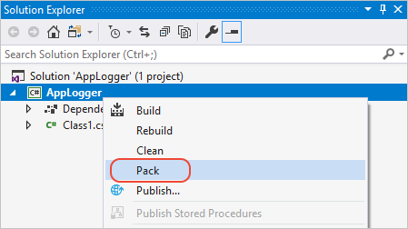

# Quickstart: Create and publish a NuGet package using Visual Studio (Windows only)

In this tutorial, you learn how to create a NuGet package with Visual Studio and publish it to nuget.org.

In this tutorial, you:

> [!div class="checklist"]
> * Create a class library project.
> * Configure the package properties.
> * Publish your package to nuget.org.

> [!Note]
> On platforms other than Windows, you can [create packages using dotnet CLI tools](create-and-publish-a-package-using-the-dotnet-cli.md). On macOS, you can also [create packages with Visual Studio for Mac](/xamarin/cross-platform/app-fundamentals/nuget-multiplatform-libraries/existing-library).

## Prerequisites

1. You must have Visual Studio installed. You can go to [visualstudio.com](https://www.visualstudio.com/) to install it for free!

1. Have or [register for a free account on nuget.org](../nuget-org/individual-accounts.md#add-a-new-individual-account). Creating a new account sends a confirmation email. You must confirm the account before you can upload a package.

## Create a class library project

To start, create a .NET class library. This project type comes with all the template files you need.

1. Open Visual Studio, and choose **Create a new project** in the Start window.

   

1. In the **Create a new project** window, search for *C# Class Library*. Select the C# Class Library template, then selct **Next**.

   

   > [!NOTE]
   > If you don't see the **Class Library** template, select **Install more tools and features**.
   >
   > 
   >
   > In the Visual Studio Installer, choose the **.NET desktop development** workload, and then select **Modify**.
   >
   > 

1. In the **Configure your new project** window, type or enter *AppLogger* in the **Project name** box, and then select **Next**.

   

1. In the **Additional information** window select **Create**. For this tutorial, you can use the default selected framework.

   

1. You can already pack the template code as-is, but let's make it do something interesting! Replace the existing AppLogger code with code below so our AppLogger library has a method to write text to the console.

```cs
namespace AppLogger
{
    public class Logger
    {
        public void Log(string text)
        {
            Console.WriteLine(text);
        }
    }
}
```

## Configure package properties

1. Right-click the **AppLogger** project in Solution Explorer and select the **Properties** menu command. Within the project properties window, select the **Package** tab on the left.

   The **Package** tab appears only for SDK-style projects in Visual Studio, typically .NET Standard or .NET Core class library projects; if you are targeting a non-SDK style project (typically .NET Framework), either [migrate the project](../consume-packages/migrate-packages-config-to-package-reference.md) or see [Create and publish a .NET Framework package](create-and-publish-a-package-using-visual-studio-net-framework.md) instead for step-by-step instructions.

    

1. Visual Studio sets default values for some package properties such as **Package ID** and **Package Version**, however you can input your own values. 

Give your package a **Package ID** that is unique on nuget.org. You can check if a package ID is unique by searching for the ID on NuGet.org or checking if the following link exists: https://www.nuget.org/packages/<package name\>.

Give your package a unique package ID and fill out any other desired properties. For a mapping of MSBuild properties (SDK-style project) to properties in a *.nuspec*, see [pack targets](../reference/msbuild-targets.md#pack-target). For descriptions of properties, see the [.nuspec file reference](../reference/nuspec.md). All of the properties here go into the `.nuspec` manifest that Visual Studio creates for the project.

    > [!Important]
    > You must give the package an identifier that's unique across nuget.org or whatever host you're using. For this walkthrough we recommend including "Sample" or "Test" in the name as the later publishing step does make the package publicly visible (though it's unlikely anyone will actually use it).
    >
    > If you attempt to publish a package with a name that already exists, you see an error.

1. (Optional) To see the properties directly in the project file, right-click the project in Solution Explorer and select **Edit AppLogger.csproj**.

   This option is only available starting in Visual Studio 2017 for projects that use the SDK-style attribute. Otherwise, right-click the project and choose **Unload Project**. Then right-click the unloaded project and choose **Edit AppLogger.csproj**.

## Run the pack command

1. Set the configuration to **Release**.

1. Right click the project in **Solution Explorer** and select the **Pack** command:

    

    If you don't see the **Pack** command, your project is probably not an SDK-style project and you need to use the `nuget.exe` CLI. Either [migrate the project](../consume-packages/migrate-packages-config-to-package-reference.md) and use `dotnet` CLI, or see [Create and publish a .NET Framework package](create-and-publish-a-package-using-visual-studio-net-framework.md) instead for step-by-step instructions.

1. Visual Studio builds the project and creates the `.nupkg` file. Examine the **Output** window for details (similar to the following), which contains the path to the package file. Note also that the built assembly is in `bin\Release\netstandard2.0` as befits the .NET Standard 2.0 target.

    ```output
    1>------ Build started: Project: AppLogger, Configuration: Release Any CPU ------
    1>AppLogger -> d:\proj\AppLogger\AppLogger\bin\Release\netstandard2.0\AppLogger.dll
    1>Successfully created package 'd:\proj\AppLogger\AppLogger\bin\Release\AppLogger.1.0.0.nupkg'.
    ========== Build: 1 succeeded, 0 failed, 0 up-to-date, 0 skipped ==========
    ```

### (Optional) Generate package on build

You can configure Visual Studio to automatically generate the NuGet package when you build the project.

1. In Solution Explorer, right-click the project and choose **Properties**.

2. In the **Package** tab, select **Generate NuGet package on build**.

   

> [!NOTE]
> When you automatically generate the package, the time to pack increases the build time for your project.

### (Optional) pack with MSBuild

As an alternate to using the **Pack** menu command, NuGet 4.x+ and MSBuild 15.1+ supports a `pack` target when the project contains the necessary package data. Open a command prompt, navigate to your project folder and run the following command. (You typically want to start the "Developer Command Prompt for Visual Studio" from the Start menu, as it will be configured with all the necessary paths for MSBuild.)

For more information, see [Create a package using MSBuild](../create-packages/creating-a-package-msbuild.md).

## Publish the package

Once you have a `.nupkg` file, you publish it to nuget.org using either the `nuget.exe` CLI or the `dotnet.exe` CLI along with an API key acquired from nuget.org.

[!INCLUDE [publish-notes](includes/publish-notes.md)]

### Acquire your API key

[!INCLUDE [publish-api-key](includes/publish-api-key.md)]

### Publish with the dotnet CLI or nuget.exe CLI

Select the tab for your CLI tool, either **.NET Core CLI** (dotnet CLI) or **NuGet** (nuget.exe CLI).

# [.NET Core CLI](#tab/netcore-cli)

This step is the recommended alternative to using `nuget.exe`.

Before you can publish the package, you must first open a command line.

[!INCLUDE [publish-dotnet](includes/publish-dotnet.md)]

# [NuGet](#tab/nuget)

This step is an alternative to using `dotnet.exe`.

1. Open a command line and change to the folder containing the `.nupkg` file.

1. Run the following command, specifying your package name (unique package ID) and replacing the key value with your API key:

    ```cli
    nuget push AppLogger.1.0.0.nupkg qz2jga8pl3dvn2akksyquwcs9ygggg4exypy3bhxy6w6x6 -Source https://api.nuget.org/v3/index.json
    ```

1. nuget.exe displays the results of the publishing process:

    ```output
    Pushing AppLogger.1.0.0.nupkg to 'https://www.nuget.org/api/v2/package'...
        PUT https://www.nuget.org/api/v2/package/
        Created https://www.nuget.org/api/v2/package/ 6829ms
    Your package was pushed.
    ```

See [nuget push](../reference/cli-reference/cli-ref-push.md).

---

### Publish errors

[!INCLUDE [publish-errors](includes/publish-errors.md)]

### Manage the published package

[!INCLUDE [publish-manage](includes/publish-manage.md)]

## Adding a readme and other files

To directly specify files to include in the package, edit the project file and use the `content` property:

```xml
<ItemGroup>
  <Content Include="readme.txt">
    <Pack>true</Pack>
    <PackagePath>\</PackagePath>
  </Content>
</ItemGroup>
```

This will include a file named `readme.txt` in the package root. Visual Studio displays the contents of that file as plain text immediately after installing the package directly. (Readme files are not displayed for packages installed as dependencies). For example, here's how the readme for the HtmlAgilityPack package appears:


> [!Note]
> Merely adding the readme.txt at the project root will not result in it being included in the resulting package.

## Related video

> [!Video https://channel9.msdn.com/Series/NuGet-101/Create-and-Publish-a-NuGet-Package-with-Visual-Studio-4-of-5/player]

Find more NuGet videos on [Channel 9](https://channel9.msdn.com/Series/NuGet-101) and [YouTube](https://www.youtube.com/playlist?list=PLdo4fOcmZ0oVLvfkFk8O9h6v2Dcdh2bh_).

## Related topics

- [Create a Package](../create-packages/creating-a-package-dotnet-cli.md)
- [Publish a Package](../nuget-org/publish-a-package.md)
- [Pre-release Packages](../create-packages/Prerelease-Packages.md)
- [Support multiple target frameworks](../create-packages/multiple-target-frameworks-project-file.md)
- [Package versioning](../concepts/package-versioning.md)
- [Creating localized packages](../create-packages/creating-localized-packages.md)
- [.NET Standard Library documentation](/dotnet/articles/standard/library)
- [Porting to .NET Core from .NET Framework](/dotnet/articles/core/porting/index)
