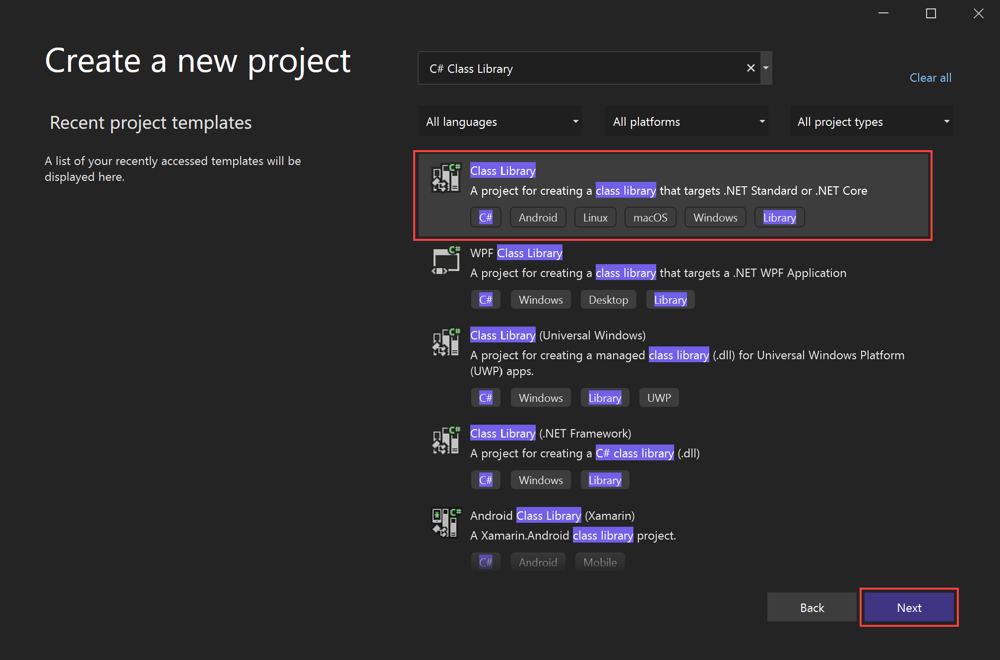
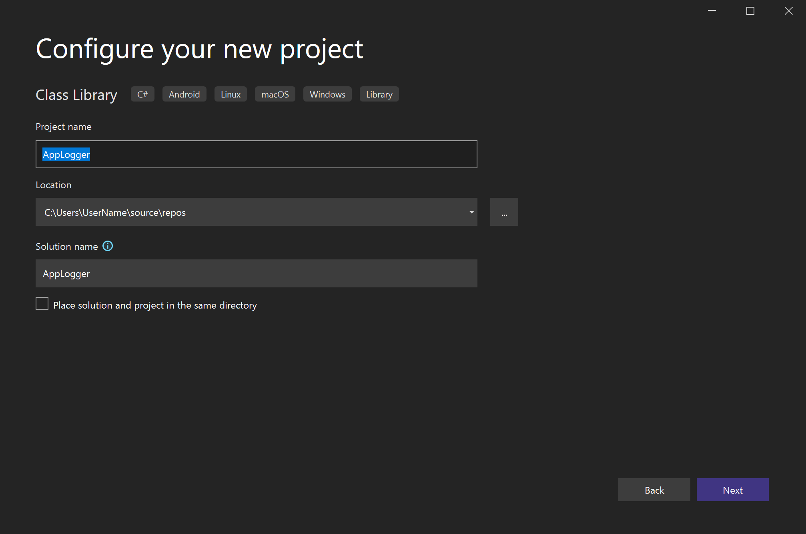
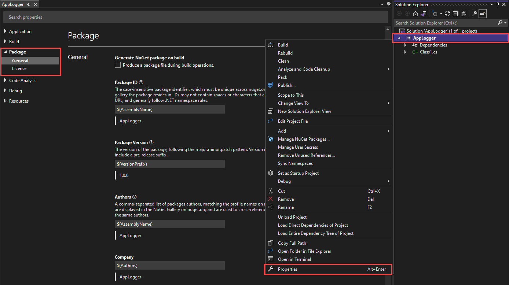
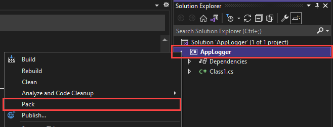
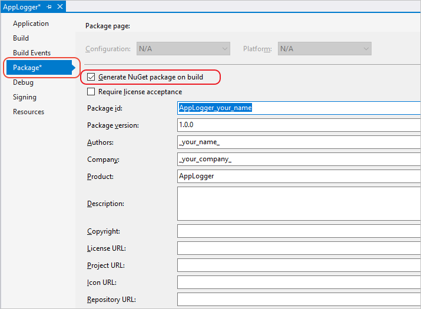

# Quickstart: Create and publish your first NuGet package

In this tutorial, you learn how to create a NuGet package with Visual Studio or Visual Studio Code, and then publish it to nuget.org.

In this tutorial, you:

> [!div class="checklist"]
> * Create a class library project.
> * Configure package properties.
> * Create the package.
> * Publish your package to nuget.org.

> [!Note]
> On platforms other than Windows, you can [create packages using dotnet CLI tools](create-and-publish-a-package-using-the-dotnet-cli.md). On macOS, you can also [create packages with Visual Studio for Mac](/xamarin/cross-platform/app-fundamentals/nuget-multiplatform-libraries/existing-library).

## Prerequisites

# [Visual Studio](#tab/visual-studio)

1. [Visual Sutdio 2022](https://www.visualstudio.com/) - you can install it for free!

1. [A free account on nuget.org](../nuget-org/individual-accounts.md#add-a-new-individual-account). Creating a new account sends a confirmation email. You must confirm the account before you can upload a package.

# [Visual Studio Code](#tab/visual-studio-code)

1. [Visual Studio Code](https://code.visualstudio.com/download)

1. [C# for Visual Studio Code](https://marketplace.visualstudio.com/items?itemName=ms-dotnettools.csharp)

1. [.NET 6.0 SDK](https://dotnet.microsoft.com/download/dotnet/6.0)

## Create a class library project

To start, create a .NET class library. This project type comes with all the template files you need.

1. Open Visual Studio, and choose **Create a new project** in the Start window.

   

1. In the **Create a new project** window, search for *C# Class Library*. Select the C# Class Library template, then selct **Next**.

   

    > [!NOTE]
    > If you don't see the **Class Library** template, select **Install more tools and features**.
    >
    > 
    >
    > In the Visual Studio Installer, choose the **.NET desktop development** workload, and then select **Modify**.
    >
    > 

1. In the **Configure your new project** window, type or enter *AppLogger* in the **Project name** box, and then select **Next**.

   

1. In the **Additional information** window select **Create**. For this tutorial, you can use the default selected framework.

   

1. You can already pack the template code as-is, but let's make it do something interesting! Replace the existing AppLogger code with code below so our AppLogger library has a method to write text to the console.

    ```cs
    namespace AppLogger
    {
        public class Logger
        {
            public void Log(string text)
            {
                Console.WriteLine(text);
            }
        }
    }
    ```

## Configure package properties

1. Right-click the **AppLogger** project in Solution Explorer and select the **Properties** menu command. Within the project properties window, select the **Package** tab on the left.

   The **Package** tab appears only for SDK-style projects in Visual Studio, typically .NET Standard or .NET Core class library projects; if you are targeting a non-SDK style project (typically .NET Framework), either [migrate the project](../consume-packages/migrate-packages-config-to-package-reference.md) or see [Create and publish a .NET Framework package](create-and-publish-a-package-using-visual-studio-net-framework.md) instead for step-by-step instructions.

    

1. Visual Studio sets default values for some package properties such as **Package ID** and **Package Version**, however you can input your own values. 

    Input your **Package ID** as *<AccountName\>.Sample.AppLogger*, and save (CTRL + S). 

    > [!TIP]
    > Check out our [best practices guide](../create-packages/Package-authoring-best-practices.md) for a detailed walkthrough of all the other important package properties.

## Create the package

1. Right click the project in **Solution Explorer** and select the **Pack** command:

    

1. Visual Studio builds the project and creates the `.nupkg` package file. Examine the **Output** window for details, including the path to the package file.

    ```output
    1>------ Build started: Project: AppLogger, Configuration: Debug Any CPU ------
    1>AppLogger -> C:\Users\UserName\source\repos\AppLogger\AppLogger\bin\Debug\net6.0\AppLogger.dll
    1>Successfully created package 'C:\Users\UserName\source\repos\AppLogger\AppLogger\bin\Debug\AccountName.Sample.AppLogger.1.0.0.nupkg'.
    ========== Build: 1 succeeded, 0 failed, 0 up-to-date, 0 skipped ==========
    ```

    From the output, we can see the the path to the genearted package is `C:\Users\UserName\source\repos\AppLogger\AppLogger\bin\Debug\AccountName.Sample.AppLogger.1.0.0.nupkg`.

## Publish your package to nuget.org

In this walthrough, we'll publish the package using the nuget.org **Upload** page. However, you can also publish package from the command line for more advanced scenarios.


## Advanced --------------------------------------

### (Optional) Generate package on build

You can configure Visual Studio to automatically generate the NuGet package when you build the project.

1. In Solution Explorer, right-click the project and choose **Properties**.

2. In the **Package** tab, select **Generate NuGet package on build**.

   

> [!NOTE]
> When you automatically generate the package, the time to pack increases the build time for your project.

### (Optional) pack with MSBuild

As an alternate to using the **Pack** menu command, NuGet 4.x+ and MSBuild 15.1+ supports a `pack` target when the project contains the necessary package data. Open a command prompt, navigate to your project folder and run the following command. (You typically want to start the "Developer Command Prompt for Visual Studio" from the Start menu, as it will be configured with all the necessary paths for MSBuild.)

For more information, see [Create a package using MSBuild](../create-packages/creating-a-package-msbuild.md).

### Publish errors

[!INCLUDE [publish-errors](includes/publish-errors.md)]

### Manage the published package

[!INCLUDE [publish-manage](includes/publish-manage.md)]

## Related video

> [!Video https://channel9.msdn.com/Series/NuGet-101/Create-and-Publish-a-NuGet-Package-with-Visual-Studio-4-of-5/player]

Find more NuGet videos on [Channel 9](https://channel9.msdn.com/Series/NuGet-101) and [YouTube](https://www.youtube.com/playlist?list=PLdo4fOcmZ0oVLvfkFk8O9h6v2Dcdh2bh_).

## Related topics

- [Create a Package](../create-packages/creating-a-package-dotnet-cli.md)
- [Publish a Package](../nuget-org/publish-a-package.md)
- [Pre-release Packages](../create-packages/Prerelease-Packages.md)
- [Support multiple target frameworks](../create-packages/multiple-target-frameworks-project-file.md)
- [Package versioning](../concepts/package-versioning.md)
- [Creating localized packages](../create-packages/creating-localized-packages.md)
- [.NET Standard Library documentation](/dotnet/articles/standard/library)
- [Porting to .NET Core from .NET Framework](/dotnet/articles/core/porting/index)
